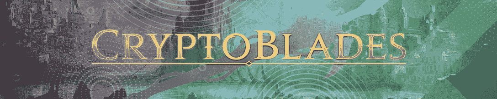
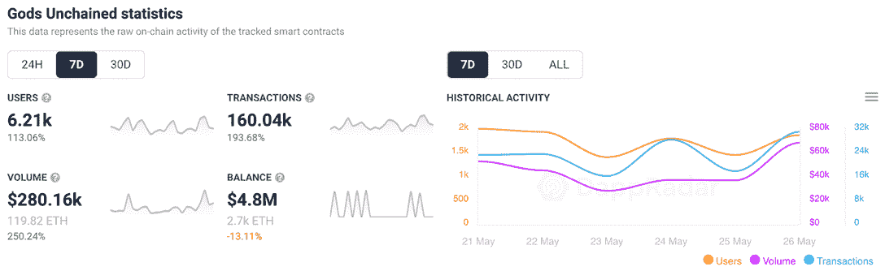

# 《被解放的上帝》穿越熊市

> 原文：<https://web.archive.org/web/https://dappradar.com/blog/gods-unchained-blasts-through-the-bear-market>

## 这款游戏的原生令牌在过去七天里飙升了 64%

《被解放的众神》在本周的区块链十大游戏排行榜中独占鳌头，其本土游戏《众神》的估值增长了 64%。即使在过去的七天里吸引了成千上万的玩家钱包，通常怀疑外星世界和分裂之地仍然落后。

尽管加密世界的气氛相当混乱，但《被解放的上帝》已经设法保持了稳定的用户基础和活跃的社区。更重要的是，考虑到目前的熊市趋势，该游戏的开发者承诺将更加透明，并对反馈持开放态度。

根据[最新的 DappRadar 和 BGA Games 报告](https://web.archive.org/web/20220630045217/https://dappradar.com/blog/dappradar-x-bga-games-report-4-blockchain-games-continue-to-ascend-despite-collapsing-markets)，区块链博彩活动在 4 月份创下历史新高。游戏 dapps 吸引了超过 120 万个独特的活动钱包。这篇文章着眼于本周最热门的游戏。我们综合了链上活动、NFT 交易量、代币估值和围绕项目的新闻来编制排名。

在下面浏览本周十大区块链游戏的完整列表。您还可以点击相应的图片，了解每个平台的更多信息。

## 区块链十大运动会–第 21 周

#### 1.[被解放的神](https://web.archive.org/web/20220630045217/https://dappradar.com/ethereum/games/gods-unchained)

《被解放的众神》(Gods Unchained)本周领涨，其本土代币《众神》(Gods)在过去 7 天的估值上涨了 64%以上。该游戏吸引了超过 6，000 个独特的活动钱包，并拥有全面最佳的令牌性能之一。为了保持这一势头,《被解放的上帝》团队发誓在开发游戏的未来迭代和阶段时，将更加关注社区反馈。

#### 2.[外星世界](https://web.archive.org/web/20220630045217/https://dappradar.com/multichain/games/alien-worlds)

BNB 连锁店的领导者外星人世界本周排名第二，在过去一周吸引了超过 650，000 个独特的活动钱包。外星世界团队最近宣布了守护者奖活动，旨在促进和表彰积极的社区成员和贡献者。

#### 3.[夹板垫](https://web.archive.org/web/20220630045217/https://dappradar.com/hive/games/splinterlands)

基于 Hive 的交易卡游戏 Splinterlands 在过去七天里注册了超过 440，000 个独特的活动钱包，排名前三。该游戏最近推出了节点验证活动，这对平台上的活动和交易产生了积极的影响。

#### 4.[隐刃](https://web.archive.org/web/20220630045217/https://dappradar.com/binance-smart-chain/games/cryptoblades-1)

CryptoBlades 在出色的一周后重返排行榜。该游戏的原生令牌技能估值增长了 10%以上，而超过 35，000 个独特的钱包与 CryptoBlades 的智能合约进行了交互。

#### 5. [Mobox](https://web.archive.org/web/20220630045217/https://dappradar.com/binance-smart-chain/games/mobox-nft-farmer)

NFT 农业游戏 Mobox 在宣布对其臼齿防御游戏进行一系列更新后，本周排名第五。更重要的是，由于口袋妖怪风格的游戏更新，Mobox 将很快让玩家抓住野生陌陌人物。

#### 6. [REVV 赛车](https://web.archive.org/web/20220630045217/https://dappradar.com/polygon/games/revv-racing)

Animoca Brands 的热门赛车 REVV Racing 在缺席数周后重返榜单。这款游戏的原生令牌价值下跌了约 6%，然而，玩家们正蜂拥至该平台尝试新的闪电战游戏。

#### 7.[炸弹密码](https://web.archive.org/web/20220630045217/https://dappradar.com/binance-smart-chain/games/bomb-crypto)

受轰炸机启发的 BNB 连锁奇迹游戏炸弹加密吸引了近 40，000 个独特的活动钱包，其本土的 BCOIN 在过去一周的估值上涨了 2%以上。更重要的是，该团队最终推出了备受期待的亚马逊模式，这进一步推动了游戏的活动。

#### 8.[农民世界](https://web.archive.org/web/20220630045217/https://dappradar.com/wax/games/farmers-world)

尽管 NFT 交易量略有下降，但《农民世界》仍然进入了区块链游戏每周排名。该平台吸引了超过 189，000 个独特的活动钱包，并产生了超过 20，000 美元的 NFT 交易量。

#### 9.[高地](https://web.archive.org/web/20220630045217/https://dappradar.com/eos/games/upland)

EOS 为基础的房地产游戏高地继续带来新的项目和地区，其世界地图。由于创世纪周的活动和奖励，这个游戏越来越受欢迎。

#### 10.[peg xy](https://web.archive.org/web/20220630045217/https://dappradar.com/polygon/games/pegaxy)

最后但并非最不重要的是，基于多边形的赛马游戏 Pegaxy 在过去一周以超过 50，000 个独特的活动钱包成功挤进了排名。重要的是，Pegaxy 团队向所有 NFT 所有者和学者开放了手机游戏的测试版，这对活动产生了积极的影响。

## 《被解放的上帝》挑战熊市趋势

尽管加密领域的环境相对混乱,《被解放的上帝》还是设法获得了象征性的价值并吸引了新用户。在过去的七天里，该游戏的用户群增长了 113%以上。

在最近的社区更新中,《被解放的上帝》团队指出了这样一个事实，即这款游戏在经历了无数个艰难的市场时期后仍然坚持了下来。由于他们多年的经验，他们已经设法创造了一个稳定的游戏体验，继续吸引新用户。

DappRadar 将继续关注区块链游戏领域，为您带来最热门游戏平台的新闻和更新。在推特上关注 DappRadar 以获得最新的独家新闻，在这里浏览完整的区块链奥运会排名[。](https://web.archive.org/web/20220630045217/https://dappradar.com/rankings/category/games)

 NewsletterUnsubscribe at any time. [T&Cs](https://web.archive.org/web/20220630045217/https://dappradar.com/terms) and [Privacy Policy](https://web.archive.org/web/20220630045217/https://dappradar.com/privacy-policy)