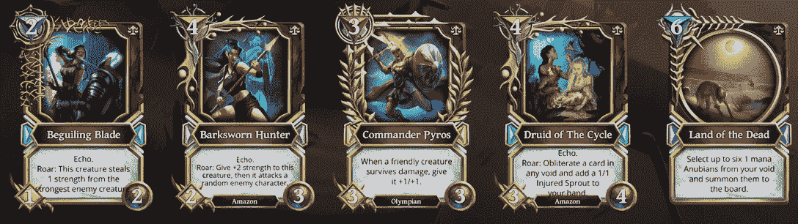
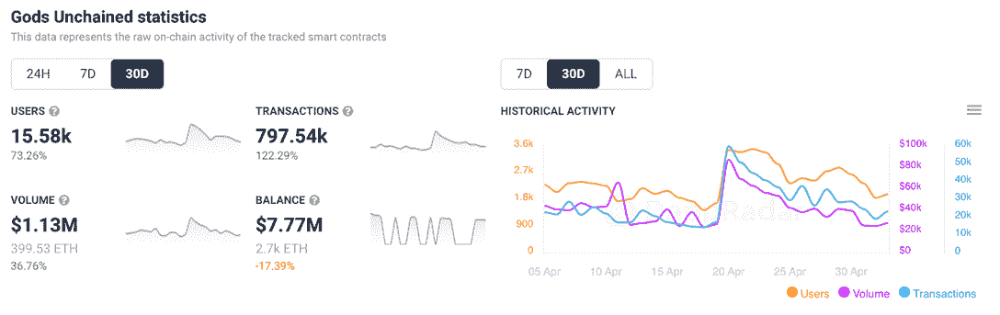
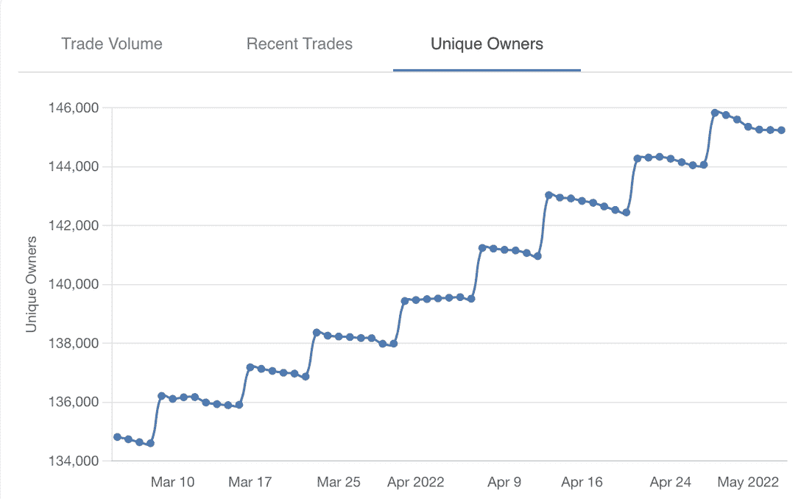

# 上帝释放了凡人的审判推动了交易活动

> 原文：<https://web.archive.org/web/https://dappradar.com/blog/gods-unchained-mortal-judgement-launch-pushed-trading-activity>

## 游戏玩家正在寻找适合他们游戏风格的最佳新卡

《被解放的众神》在 4 月 20 日推出了《凡人审判卡》资料片，这为游戏吸引了一波又一波的活动。仅在过去一周，该游戏就将连接到该平台的独特活动钱包数量增加了 74%，达到 8000 多个。

## 总结:

*   [Gods Unchained 是一款基于 ImmutableX 第二层解决方案的交易卡游戏](https://web.archive.org/web/20221007162210/https://dappradar.com/blog/gods-unchained-mortal-judgement-launch-pushed-trading-activity/#Gods)
*   [死亡审判扩展包的发布在这个高峰中发挥了重要作用，游戏见证了活跃用户钱包的巨大增长](https://web.archive.org/web/20221007162210/https://dappradar.com/blog/gods-unchained-mortal-judgement-launch-pushed-trading-activity/#Unchained)
*   [死亡审判卡是目前游戏中交易量最大的 NFT 之一，也推动了游戏的交易量](https://web.archive.org/web/20221007162210/https://dappradar.com/blog/gods-unchained-mortal-judgement-launch-pushed-trading-activity/#flock)

## 什么是被解放的神？

《被解放的神》是一款最初在以太坊上推出的交易卡牌游戏。后来，它将其操作转移到不可变的 X 第二层解决方案。该团队这样做是为了给玩家提供更容易上手的游戏体验。最重要的是，这规避了以太坊区块链不断上涨的燃气费。同样值得注意的是，Immutable 是 Immutable X 和 Gods Unchained 背后的公司。

区块链上的纸牌游戏越来越受欢迎，而《被解放的上帝》是一颗冉冉升起的新星。该平台拥有玩家对游戏内资产的完全所有权，以及无与伦比的游戏性，在竞争中遥遥领先。随着众多的事件和额外的卡牌包发布，这款游戏已经吸引了稳定的粉丝群的注意。

[https://web.archive.org/web/20221007162210if_/https://www.youtube.com/embed/mLvFIUKYbUc?feature=oembed](https://web.archive.org/web/20221007162210if_/https://www.youtube.com/embed/mLvFIUKYbUc?feature=oembed)

## 玩家们蜂拥到平台上领取死亡审判卡

凡人审判提出了最新的神解禁卡扩展包。资料片引入了许多新的卡片和能力。重要的是，玩家需要研究他们新的凡人审判角色。重要的是找到一种方法将它们融入他们的游戏策略。

目前，凡人审判卡套装以优惠价销售，折扣为原价的 17.5%。最便宜的卡包价格略高于 2 美元，而最贵的不到 125 美元。

随着人类审判资料片的推出，游戏中总共增加了 12 张新的卡片。每张牌都有一套不同的能力，并对玩家牌组的整体实力做出自己的贡献。

## 上帝无拘无束的活动猛增

自 4 月 20 日推出《凡人审判》卡包扩展以来，《被解放的上帝》已经经历了连接到平台的钱包数量的显著增长。根据 DappRadar 的数据，在发布当天，每日独立活跃用户的数量飙升至 3000 多名。这种增长在一定程度上已经消退，但是，游戏仍然享受着连接到游戏的访问者数量的增加。

重要的是，活跃用户的激增也伴随着自 4 月 20 日以来《被解放的上帝》注册量的大幅增长。由于玩家仍在购买卡包，该平台的日交易量已稳定在 2 万美元左右。令人印象深刻的是，Immutascan 的快速检查显示，游戏 NFT 的唯一持有者数量也在稳步上升。

Source: [Immutascan](https://web.archive.org/web/20221007162210/https://immutascan.io/address/0xacb3c6a43d15b907e8433077b6d38ae40936fe2c?tab=0&forSale=true&sortBy=highest&chartTab=UniqueOwners)

随着游戏不断推出并吸引更多玩家，DappRadar 将继续监测《被解放的神》。如果你想了解更多关于《被解放的上帝》的内容，请查看这个游戏的 Dapp 页面。在那里，您可以找到 dapp 最新的链上数据。此外，你可以在 Twitter 上关注 DappRadar，抢先获得最新的区块链博彩新闻。

 NewsletterUnsubscribe at any time. [T&Cs](https://web.archive.org/web/20221007162210/https://dappradar.com/terms) and [Privacy Policy](https://web.archive.org/web/20221007162210/https://dappradar.com/privacy-policy)