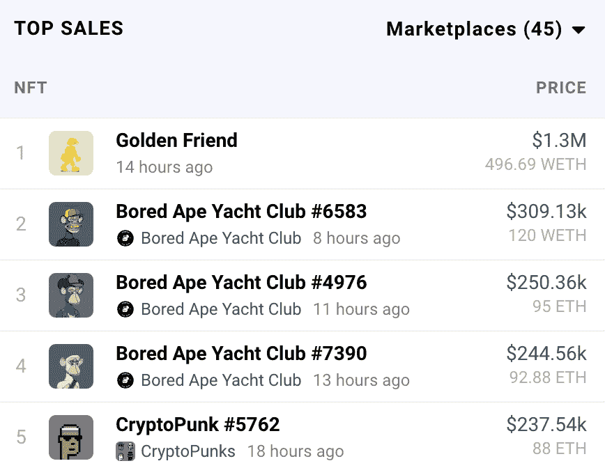
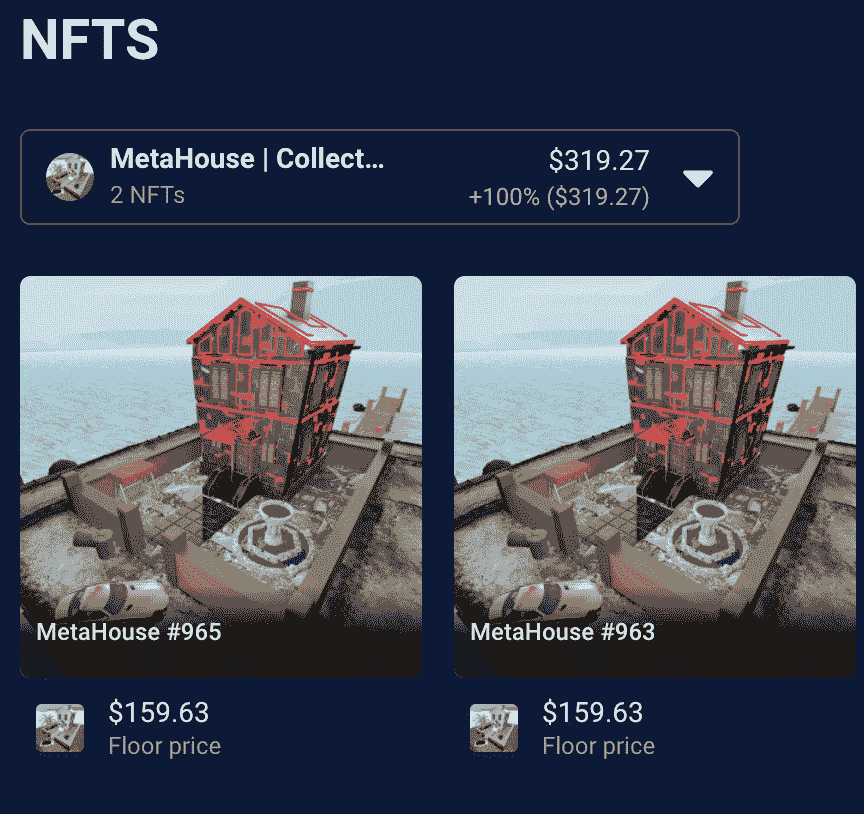

# 金色隐形朋友 NFT 以 130 万美元售出

> 原文：<https://web.archive.org/web/https://dappradar.com/blog/golden-invisible-friend-nft-sold-for-1-3-million>

## 拍卖所得将捐给 RCC 慈善基金

《看不见的朋友》是本周最热门的 NFT 系列之一，在 DappRadar **的** [**每日 NFT 交易排行榜上高居榜首。在过去的 24 小时里，该系列创下了黄金朋友 NFT 的最高销售记录，在一次慈善拍卖中以 130 万美元的价格售出。**](https://web.archive.org/web/20220929043433/https://dappradar.com/nft)

黄金朋友是拍卖的中心，拍卖所得将捐给 RandomCharacterCollective 慈善基金。除了这个 NFT，黄金朋友的[新主人](https://web.archive.org/web/20220929043433/https://dappradar.com/hub/wallet/eth/0xa9d3b2e3a1deaa287f71da685e3cb49ff3874f4a)又收到了五个隐形朋友 NFT，目前还没有透露。

看不见的朋友集合引入了一个仅白名单造币厂，于 2 月 23 日开放。自铸币厂以来，该系列已在 NFT 产生了超过 2200 万美元的交易量。在过去 24 小时内，超过 1，414 名交易者与该系列互动，使其成为同期交易量最高的项目。

## 黄金朋友 NFT 的新家地址里还有什么？

黄金朋友 NFT 的新主人拥有相当多的 NFT 投资组合。根据 [DappRadar 投资组合追踪器](https://web.archive.org/web/20220929043433/https://dappradar.com/hub/wallet/eth/0xa9d3b2e3a1deaa287f71da685e3cb49ff3874f4a)，这个收集器有 271 个 NFT。有趣的是，投资组合中没有任何蓝筹股项目，比如无聊的猿类或密码朋克。从钱包的交易活跃度来看，这 271 个 NFT 除了金友，大部分都是赠品。比如这些[两个 meta house NFT](https://web.archive.org/web/20220929043433/https://dappradar.com/hub/wallet/eth/0xa9d3b2e3a1deaa287f71da685e3cb49ff3874f4a/nfts/1/metahousecollection)。

此外，黄金朋友 NFT 的新老板有麦当劳的工作申请 NFT，这是转让给他们没有销售交易发生。当然，这可能是对加密领域流行的跑步笑话的认可，即在收藏品上花了很多钱的 NFT 收藏家可能会在资金耗尽时在麦当劳工作。

除了 NFTs，这位收藏家还持有大量加密货币代币。这个钱包在 USDT 有将近 100 万美元，在 WETH 有将近 50 万美元。这使得钱包中存储的总价值达到 262 万美元。

如果你想仔细看看这个加密组合，请点击这里。此外，您还可以加入 [DappRadar PRO](https://web.archive.org/web/20220929043433/https://dappradar.com/token/pro) 社区，独家获取最新的连锁 NFT 销售数据。在[推特](https://web.archive.org/web/20220929043433/https://twitter.com/dappradar)上关注 DappRadar，首先获得最新的 NFT 新闻。

 NewsletterUnsubscribe at any time. [T&Cs](https://web.archive.org/web/20220929043433/https://dappradar.com/terms) and [Privacy Policy](https://web.archive.org/web/20220929043433/https://dappradar.com/privacy-policy)