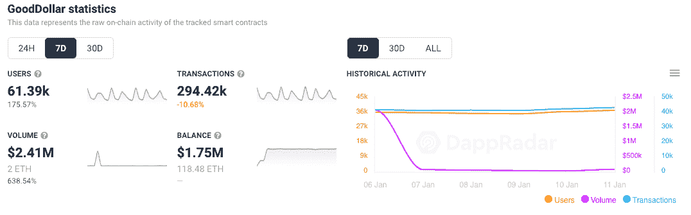
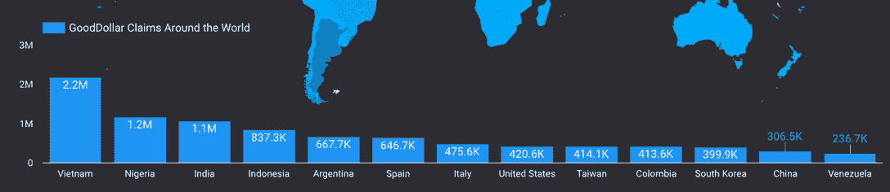
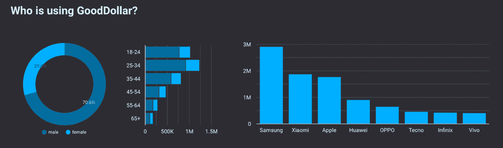
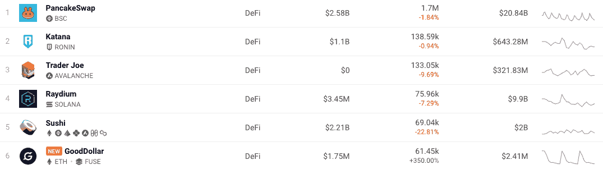
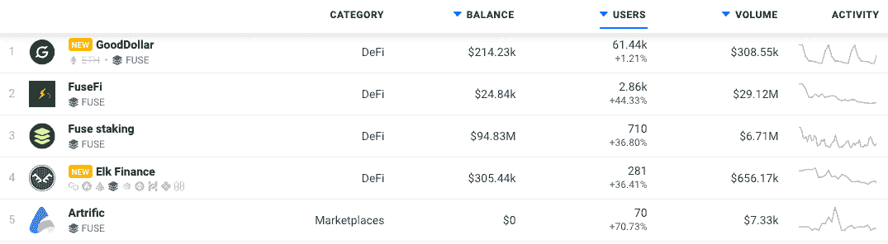

# GoodDollar 活跃用户跃升 175%

> 原文：<https://web.archive.org/web/https://dappradar.com/blog/gooddollar-active-users-jump-175>

## 当付出有回报时，好事就会发生

领先的 Fuse 网络 dapp GoodDollar 本周掀起波澜，因为它的平台吸引了 175%的活跃钱包。随着投资者在不断下跌的加密价格中寻找替代价值存储和被动收入机会，该平台出现了大幅增长。

GoodDollar 是一个由人驱动的框架，由 eToro 的联合创始人兼首席执行官 Yoni Assia 创建。它旨在通过 GoodDollar G$硬币产生、资助和分配全球基本收入。

周复一周，该平台吸引了 175%以上的活跃钱包，连接用户数超过 61，000，通过 GoodDollar 的智能合同创造了超过 240 万美元的收入。随着越来越多的钱包连接到该平台，交易量每周略有下降。钱包连接增加的另一个原因可能是平台上目前活跃的空投。因为为了检查资格，用户必须首先连接他们的钱包。

## 美元一瞥

好美元经济围绕着两种主要的用户类型:索赔者和支持者。申请人是以 G 元硬币形式申请每日基本收入的个人。至关重要的是，他们的独特身份必须得到验证。支持者是相信基本普遍收入和自下而上增长的个人或机构。他们通过在 AAVE 和 MakerDao 这样的平台上投资来支持好美元经济，从而为 G 美元硬币的供应提供资金。

*   第三方协议在受支持的加密货币(如 DAI 或 ETH)中产生价值，该利益被转移到 GoodReserve。
*   铸造的 G$硬币的数量是由相对于固定在 GoodReserve 中的利息价值的 GoodDollar 的杠杆决定的。
*   最初，每枚 G$硬币都以一对一的比例完全抵押在一种受支持的加密货币中。例如，每一个戴进入保护区，就会产生等值的金币。
*   G$硬币以与支持者对第三方协议和机制的兴趣相等的价值分发给支持者。随着时间的推移，准备金率预计会下降，相对于储备的加密资产，铸造更多的 G$硬币。
*   铸造的剩余 G 元硬币作为基本收入平均分配给索赔者，平均分配给某一天提出索赔的索赔者人数。

申领者最初可以通过 GoodDollar 钱包获得并申领 G$硬币，但最终，G$硬币将可以通过各种终端获得。GoodDollar 钱包要求申领者识别并偶尔重新验证自己，以限制欺诈和系统滥用。

## 谁在认领 UBI？

对过去一个月的简单回顾让我们对普遍基本收入(UBI)的流向有了一个很好的了解。越南、尼日利亚和印度是三个主要国家，索赔总额为 450 万美元。看到索赔者的人口统计数据也很有趣，因为那些在区块链空间呆了一段时间的人通常会看到与 crypto 相似的关于年龄和性别的使用人口统计数据。

## 当给予回报时

值得注意的是，虽然 dapp 的设立是为了让那些最需要的人受益，但这并不是利益相关者完全无私的行为，因为他们仍然可以获得一定比例的奖励。通过这种方式，对这个项目有信心的更富有的个人和组织可以参与进来，而不用放弃所有的回报，只是其中的一部分。它应该给利益相关者一种做好事的感觉，让他们安心，他们的资产正在为他们努力工作。此外，该平台为组织提供了一种在世界上做好事的方式，使他们能够围绕自己的品牌传播积极的公关故事。无论哪种方式，UBI 还是分发给最需要的人。

## 保险丝引线

GoodDollar 是目前 Fuse 网络上使用最多的 dapp。此外，激增的活动帮助该平台在 DappRadar 的 DeFi 排名中攀升。反过来，暴露给更多的人。在撰写本文时，它位于更为成熟的多链 DeFi 平台 1inch 和 Sushi 之间，排名第六。

GoodDollar 的交易量远低于其竞争对手，但连接到 dapp 的钱包数量非常具有竞争力。似乎没有人能赶上基于 BSC 的 DEX PancakeSwap，但 GoodDollar 显示出进入前 5 名的坚实跑道的迹象。

## 兴风作浪的导火索

dapp 的 Fuse 生态系统正在以令人印象深刻的速度增长，如下图所示，当生态系统中的一个 dapp 获胜时，它可以带动其余的 dapp，因为更多的人接触到了 Fuse dapps。

如上所述，GoodDollar 目前是 Fuse 的明确领导者，但其他 dapps 都显示出增长信号。随着“玩即赚”游戏[在 2022 年继续占据头条](/web/20221208062824/https://dappradar.com/blog/sunflower-farmers-game-flourishes-on-polygon-blockchain/), NFT 和 GameFi 的入境优惠肯定会给不断增长的网络增加更多影响力。

 NewsletterUnsubscribe at any time. [T&Cs](https://web.archive.org/web/20221208062824/https://dappradar.com/terms) and [Privacy Policy](https://web.archive.org/web/20221208062824/https://dappradar.com/privacy-policy)

***以上不构成投资建议。此处给出的信息仅供参考。请行使尽职调查，做你的研究。作者持有 ETH、BTC、AGIX、HEX、LINK、GRT、CRO、OMI、不变 X、ENS、GALA、AVASTR、GMEE、CUBE、RADAR、FLOW、FTM、BNB、SPS、WRLD、ATOM 和 ADA。***