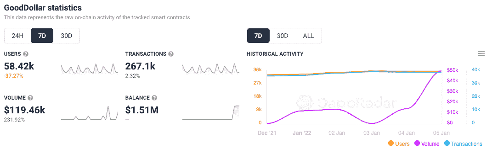
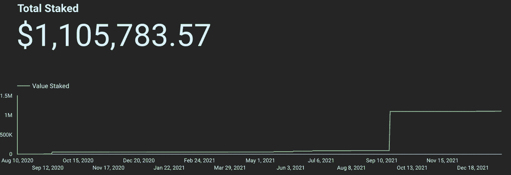
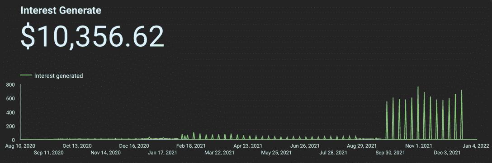

# GoodDollar 产生一个普遍的基本收入经济

> 原文：<https://web.archive.org/web/https://dappradar.com/blog/gooddollar-generates-a-universal-basic-income-economy>

## 向最需要的人提供“涓滴式”价值结构

***更新于 19.01.22:在意识到 GoodDollar 网站上的 TVL 错误后，下面的 TVL 数字已更新为 110 万美元。***

进入 2022 年，新集成的第 1 层[融合网络](https://web.archive.org/web/20221206105722/https://dappradar.com/rankings/protocol/fuse)上的一个 dapp 让人们议论纷纷。 [**GoodDollar 是一个以人为本的框架**](https://web.archive.org/web/20221206105722/https://dappradar.com/multichain/defi/gooddollar-1) **通过 GoodDollar G$ coin 生成、融资和分配全球基本收入。其目标是通过创造普遍基本收入(UBI ),提供基本生活水平，减少财富不平等。**

GoodDollar 由欧洲最大的社交投资网络 eToro 的联合创始人兼首席执行官 Yoni Assia 创建，基于 Assia 在 2008 年首次提出的社会货币理论。eToro 资助了 GoodDollar 项目，作为其企业社会责任计划的一部分。使用 DeFi 和智能合同技术支持非营利组织弥合全球贫富差距的努力。

这个消息是在 2021 年 9 月中旬传来的，[伴随着 eToro 万美元的股份](https://web.archive.org/web/20221206105722/https://www.etoro.com/wp-content/uploads/2021/09/eToro-commits-1-million-stake-to-GoodDollar.pdf)，这使得平台上的 TVL 从大约 93，000 美元涨到了今天的大约 110 万美元。

如下所示，一旦总股份开始大幅上升，产生的兴趣当然也会随之而来，从而更清楚地显示出该平台的潜力。此外，[自 V2 发布以来，UBI 世代的赌注](https://web.archive.org/web/20221206105722/https://goodswap.xyz/#/stakes)对公众开放，并以 G$奖励作为激励。

## 它是如何工作的

好美元经济围绕着两种主要的用户类型:索赔者和支持者。

申请人是以 G 元硬币形式申请每日基本收入的个人。至关重要的是，他们的独特身份必须得到验证。

支持者是个人或机构，他们相信基本收入和自下而上的增长，并通过投入资本来支持良性美元经济，从而为 G$硬币的供应提供资金。他们通过承诺和锁定资金或赌注来做到这一点，正如各种第三方计息协议和机制所知的那样。每天都会铸造一些 G 元硬币，作为基本收入发放给申领者。

GoodDollar reserve 的价值来自于在去中心化第三方协议中押注加密货币的支持者所产生的兴趣。通过积累的储备利息，G 元硬币被铸造。它们被用来支付支持者的市场利率利息，同时每天留出一定数量的 G$硬币作为基本收入进行分配。

随着时间的推移，相对于好美元的储备，更多的 G 美元硬币被铸造。该系统是为适应规模而建立的，随着越来越多的人和商人加入 GoodDollar 网络，G$硬币对持有者的价值和效用也随之增加。

## 简而言之，美元

*   第三方协议在受支持的加密货币(如 DAI 或 ETH)中产生价值，该利益被转移到 GoodReserve。
*   铸造的 G$硬币的数量是由相对于固定在 GoodReserve 中的利息价值的 GoodDollar 的杠杆决定的。
*   最初，每枚 G$硬币都以一对一的比例完全抵押在一种受支持的加密货币中。例如，每一个戴进入保护区，就会产生等值的金币。
*   G$硬币以与支持者对第三方协议和机制的兴趣相等的价值分发给支持者。随着时间的推移，准备金率预计会下降，相对于储备的加密资产，铸造更多的 G$硬币。
*   铸造的剩余 G 元硬币作为基本收入平均分配给索赔者，平均分配给某一天提出索赔的索赔者人数。

申领者最初将能够通过 GoodDollar 钱包访问和申领 G$硬币，但最终，G$硬币将通过各种具有安全和独特身份解决方案的终端获得。GoodDollar 钱包要求申领者识别并偶尔重新验证自己，以限制欺诈和系统滥用。

## 为什么 GoodDollar 现在有意义？

这样一个平台现在正在寻找牵引力，这肯定有许多令人信服的文化、经济和伦理原因。

*   收入低于 10，000 美元的成年人占世界人口的 56.6%，但拥有的全球财富不到 2%。
*   冠状病毒爆发后，超过 71%的欧洲人现在支持某种形式的基本收入。
*   超过 20 个国家正在探索 UBI 作为一个关键的政策建议。
*   分散融资的创新使稳定资产产生利息并有效地重新分配成为可能。

这为 GoodDollar 创造了一个完美的风暴，提供 UBI 的意愿和手段在历史上第一次到位。

## 拿一点给很多

加密货币行业为早期采用者创造了大量财富，许多先行者现在正寻求通过慈善捐款来回馈社会。瑞安·塞尔基斯、丹·马图谢夫斯基、王峤和哈齐布·库雷希[承诺通过一项新的倡议，每年向慈善机构捐赠至少 1%的财富](https://web.archive.org/web/20221206105722/https://cointelegraph.com/news/four-crypto-veterans-pledge-to-give-at-least-1-of-their-wealth-to-charity-each-year)。《财富》杂志最近在以太坊与 NFT 艺术家 Pplpleasr 共同发起了一项新闻业慈善基金。特里皮·邦尼·NFT 项目已经把它的全部收入捐给了一个自杀预防基金会。现在，慈善捐款被要求加入并参与“玩即赚”游戏机会也是司空见惯的事情。

全民基本收入的想法已经讨论了很久。除了以前，似乎没有完整的基础设施来提供这样的创新。现在，随着越来越多的国家更认真地探索这一想法，框架似乎已经到位，可以实现旧的计划。本质上，休假套餐在疫情的英国等国家推出，在一定程度上是在野外测试这个想法。

那些希望了解更多关于 GoodDollar 的信息以及如何作为索赔者或支持者参与进来的人可以查看下面有用的链接。

[信纸](https://web.archive.org/web/20221206105722/https://litepaper.gooddollar.org/)

[Gitbook](https://web.archive.org/web/20221206105722/https://gooddollar.gitbook.io/gooddocs/)

 NewsletterUnsubscribe at any time. [T&Cs](https://web.archive.org/web/20221206105722/https://dappradar.com/terms) and [Privacy Policy](https://web.archive.org/web/20221206105722/https://dappradar.com/privacy-policy)

***以上不构成投资建议。此处给出的信息仅供参考。请行使尽职调查，做你的研究。作者持有 ETH、BTC、AGIX、HEX、LINK、GRT、CRO、OMI、不变 X、ENS、GALA、AVASTR、GMEE、CUBE、RADAR、FLOW、FTM、BNB、SPS、WRLD、ATOM 和 ADA。***