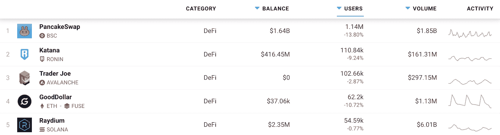
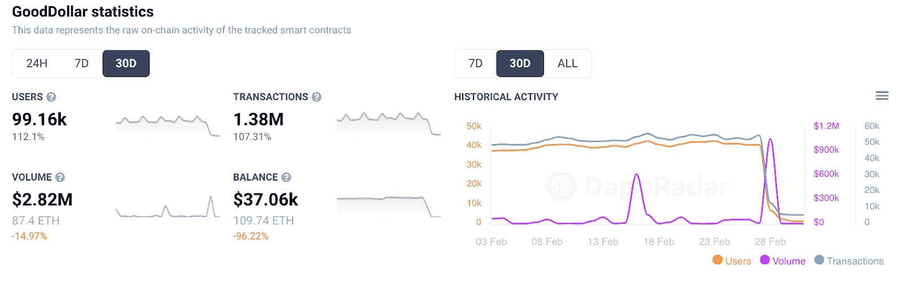

# GoodDollar UBI 平台攀升至 DeFi 前 5 名

> 原文：<https://web.archive.org/web/https://dappradar.com/blog/gooddollar-ubi-platform-climbs-into-top-5-defi>

## 当付出有回报时，好事就会发生

本周，DeFi 前五名中出现了一个新成员，它的形式是通用基本收入平台 GoodDollar。在过去的 7 天里，连接到该平台的钱包数量增加了 78%，超过了 Solana 的 Raydium，排名第四。**也是** **追逐排山倒海的德菲乖乖乔为第三名。**

虽然前五名中的其他进入者非常关注代币交换、流动性供应和赌注，但 [GoodDollar 与众不同](https://web.archive.org/web/20221221181756/https://dappradar.com/blog/gooddollar-generates-a-universal-basic-income-economy/)。由 eToro 的联合创始人兼首席执行官 Yoni Assia 创建的 [GoodDollar 是一个以人为本的框架](https://web.archive.org/web/20221221181756/https://dappradar.com/multichain/defi/gooddollar-1)，通过 GoodDollar G$硬币产生、资助和分配全球基本收入。GoodDollar 的目标是通过创造普遍基本收入(UBI)来提供基本生活水平和减少财富不平等。

Last 7 days

在过去的 30 天里， [GoodDollar 吸引了近 10 万个钱包](https://web.archive.org/web/20221221181756/https://dappradar.com/multichain/defi/gooddollar-1)，完成了 138 万笔交易，产生了 280 万美元的交易量。这些数字代表了 GoodDollar 在过去 30 天内在这两个指标上的增长超过了 100%。显示用户连接他们的钱包，然后进行存款。帮助 GoodDollar 爬上了五大 DeFi 协议之一。

*Last 30-days *

也许更值得注意的是，这是第一次一个 [Fuse Network dapp](https://web.archive.org/web/20221221181756/https://dappradar.com/rankings/protocol/fuse) 在 DappRadar 排名中出现如此高的位置。这表明，像 GoodDollar 这样独特的[平台可以帮助 Fuse 这样的网络成长并吸引更多的眼球。](https://web.archive.org/web/20221221181756/https://dappradar.com/fuse/defi/gooddollar)

## GoodDollar 如何工作

好美元经济围绕着两种主要的用户类型:索赔者和支持者。

申请人是以 G 元硬币形式申请每日基本收入的个人。至关重要的是，他们的独特身份必须得到验证。

支持者是相信基本收入和自下而上增长的个人或机构。他们通过投资资本来支持好美元经济，从而为 G 美元硬币的供应提供资金。他们通过承诺和锁定资金或赌注来做到这一点，正如各种第三方计息协议和机制所知的那样。每天都会铸造一些 G 元硬币，作为基本收入发放给申领者。

GoodDollar reserve 的价值来自于在去中心化第三方协议中押注加密货币的支持者所产生的兴趣。通过积累的储备利息，G 元硬币被铸造。它们被用来支付支持者的市场利率利息，同时每天留出一定数量的 G$硬币作为基本收入进行分配。该系统是为适应规模而构建的，随着越来越多的人和商家加入 GoodDollar 网络，G$硬币对持有者的价值和效用也随之增加。

## 普遍基本收入

普遍基本收入的想法已经讨论了很久。除了以前，似乎没有完整的基础设施来提供这样的创新。随着越来越多的国家认真探索这一想法，框架似乎已经到位，可以兑现旧的计划。本质上，休假套餐在疫情的英国等国家推出，在一定程度上是在野外测试这个想法。

现在，在乌克兰的人道主义危机中，像 GoodDollar 这样的平台可以找到更多的相关性。迄今已有近 100 万人因冲突而流离失所，对个人和家庭的财政支持对生存至关重要。我们已经看到了大量的捐款和慈善捐赠，比如支持乌克兰的 crypto 和区块链太空集会。但是，收钱是一回事。确保它到达最需要它的人手中完全是另一个挑战。像 GoodDollar 这样的平台可能会遇到这种情况。

***以上不构成投资建议。此处给出的信息仅供参考。请行使尽职调查，做你的研究。作者持有 ETH、BTC、AGIX、HEX、LINK、GRT、CRO、OMI、不可变 X、GALA、AVASTR、GMEE、CUBE、RADAR、FLOW、FTM、BNB、SPS、WRLD、ATOM 和 ADA。***

 NewsletterUnsubscribe at any time. [T&Cs](https://web.archive.org/web/20221221181756/https://dappradar.com/terms) and [Privacy Policy](https://web.archive.org/web/20221221181756/https://dappradar.com/privacy-policy)