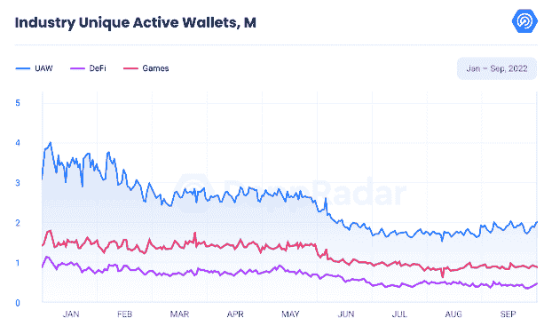
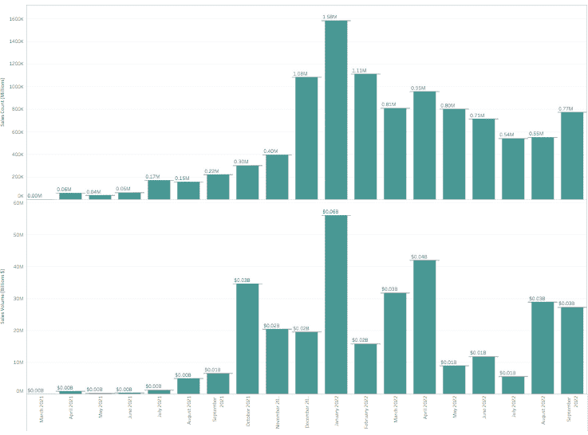

# 守护者协会 NFT 价格下跌后，推出延迟

> 原文：<https://web.archive.org/web/https://dappradar.com/blog/guild-of-guardians-nft-prices-down-after-launch-delay>

## GoG NFT 价格下跌后，阿尔法游戏发布延迟。

守护者协会(GoG)将是一款免费的 NFT 角色扮演游戏。他们的商店已经开始运营，这款游戏被寄予厚望，有超过 30 万人在他们的等待名单上。 **但是为什么本周 NFT 价格下降了呢？让我们揭开数据背后的故事。**

## 内容

*   [什么是守护者协会？](https://web.archive.org/web/20230120063846/https://dappradar.com/blog/guild-of-guardians-nft-prices-down-after-launch-delay/#What-is-Guild-of-Guardians?-)
*   [英雄博彩 NFT 收藏品](https://web.archive.org/web/20230120063846/https://dappradar.com/blog/guild-of-guardians-nft-prices-down-after-launch-delay/#Heroes-Gaming-NFT-Collectibles)
*   为什么本周 GoG 价格下降了？
*   [如何用 DappRadar 玩守护者公会？](https://web.archive.org/web/20230120063846/https://dappradar.com/blog/guild-of-guardians-nft-prices-down-after-launch-delay/#How-to-play-Guild-of-Guardians-using-DappRadar?)
*   [结束语](https://web.archive.org/web/20230120063846/https://dappradar.com/blog/guild-of-guardians-nft-prices-down-after-launch-delay/#Closing-thoughts)

过去一年，NFT 博彩业整体增长，超越熊市，成为最具弹性的类别之一。我们的 [BGA 行业报告 2022 年第三季度](https://web.archive.org/web/20230120063846/https://dappradar.com/blog/dappradar-x-bga-games-report-q3-2022)的指标显示，DappRadar 在 50 个网络中跟踪的所有区块链活动中，游戏活动占了近一半。

9 月，共有 912，000 个每日唯一活跃钱包(UAW)与博彩智能合约互动。守护者协会是这个快速发展的生态系统的一部分。

[Discover Ranking Games](https://web.archive.org/web/20230120063846/https://dappradar.com/rankings/category/games)

## **什么是守护者协会？**

《守护者协会》是一款激动人心的多人、奇幻、动作 RPG 游戏，具有开放的多人游戏功能，允许玩家相互互动和战斗。

在这个幻想世界中，你有一队英雄，你把他们送进地牢去对抗怪物和老板，收集战利品，工艺装备，等等。

[Discover Guild of Guardians](https://web.archive.org/web/20230120063846/https://dappradar.com/multichain/games/guild-of-guardians)

这款奇幻游戏将由 Immutable X 发行，Immutable X 是市场上最成功的游戏区块链之一，凭借其坚实的立场赢得了广泛的观众，颠覆了手机游戏流派，尤其是那些不熟悉 Web3 游戏的人。

下图显示了不可变 x 的 NFT 销售量和销售计数。在过去的 9 月份，销售计数总计为 771，604。与 2021 年 9 月的 219，331 辆相比，我们看到销售数量增长了 71.57%。

Source: Tableau

## **英雄博彩 NFT 收藏品**

在这款奇幻游戏中，有“玩赚”的元素。2021 年 6 月，GoG 成功售出了其首个 NFT 创始人系列，为其开发创造了 460 万美元的收入。

英雄游戏 NFT 收藏品的独特灵感来自许多流行的艺术滴，展示了一个循环的视觉吸引力的 MP4 视频，音频，使每个英雄不朽。

## 为什么 NFT 石油价格本周下跌？

在两次成功的演示之后，该团队决定将大肆宣传的 alpha 版本的发布时间推迟到 2023 年，之前计划在 2022 年底发布。该团队列举了一些原因，比如他们高质量产品的改进。

在 App store 中发布一款 Web3 游戏所需的规则和要求将会受到更多的关注。此外，改进包括将无缝的玩家钱包体验集成到端到端游戏和区块链系统中，使 GoG 能够将数百万人纳入 Web3。

Twitter 上的反应不一，一些用户赞赏该团队的透明度，并对开发一款游戏的复杂性表现出了普遍的理解，更不用说一款具有可持续令牌组学的区块链游戏了。

然而，其他人并不热衷于了解这个消息。

Source: Guild of Guardians Twitter

市场反应显示需求下降，将 GoG Heroes NFTs 排在我们排名的第 6 位。在撰写本文时，Hero NFTs 的平均价格下降了 40.49%，而宠物价格下降了 70.58%，其他价格下降了 38.54%

[<picture></picture>](https://web.archive.org/web/20230120063846/https://dappradar.com/nft/collections/protocol/immutablex)

## 如何用 DappRadar 玩守护者公会？

虽然游戏还没有上线，但是你可以记住以下几点，这样你就为明年某个时候到来的大日子做好了准备。

1.  你必须有一个移动设备来播放它。
2.  获取加密钱包。
3.  加入邮件列表，用你的电子邮件地址预先注册游戏。
4.  在 ImmutableX 上购买 GoG NFTs
5.  下载 DappRadar 的移动应用程序，连接您的加密钱包并访问 GoG dapp。

成功的团队合作是至关重要的，游戏在协同系统中包含了大量的策略和动作元素，每个英雄 NFT 都有影响其角色的独特属性。

你必须为你的公会建立一个强大的守护者团队，并分配不同的角色，如坦克、治疗师、支援和攻击类型。

一个角色的力量等级(职业)会影响战斗的结果，在战斗中，团队共同努力击败一个老板，如果成功就能获得最好的战利品。

根据你的队伍的质量，有些怪物会比其他的更容易被打败。战斗动态增加了乐趣，包括轻型和重型攻击，攻击组合，终极攻击和躲闪。

## 结束语

尽管最近有所下降，但我们对不可变 x 上的守护者协会的未来持乐观态度。该游戏有一个充满活力的社区，并与育碧、沙盒和 Yield Guild 等领先品牌建立了稳固的合作关系，表明了对其长期成功的坚定承诺。

## 随身携带您的 Web3 之旅

使用 DappRadar 移动应用程序，再也不会错过 Web3。查看最受欢迎的 dapps 的性能，并关注您投资组合中的 NFT。您在 DappRadar 上的帐户会与我们的移动应用程序同步，这样您很快就可以选择实时接收提醒。

[Download the DappRadar app now](https://web.archive.org/web/20230120063846/https://dappradar.app.link/blog)[<picture></picture>](https://web.archive.org/web/20230120063846/https://play.google.com/store/apps/details?id=com.portfolio.dappradar)