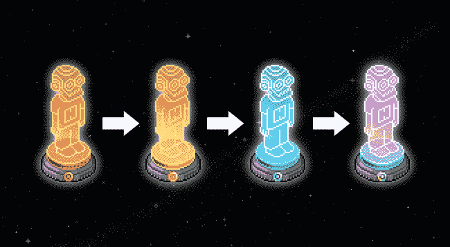
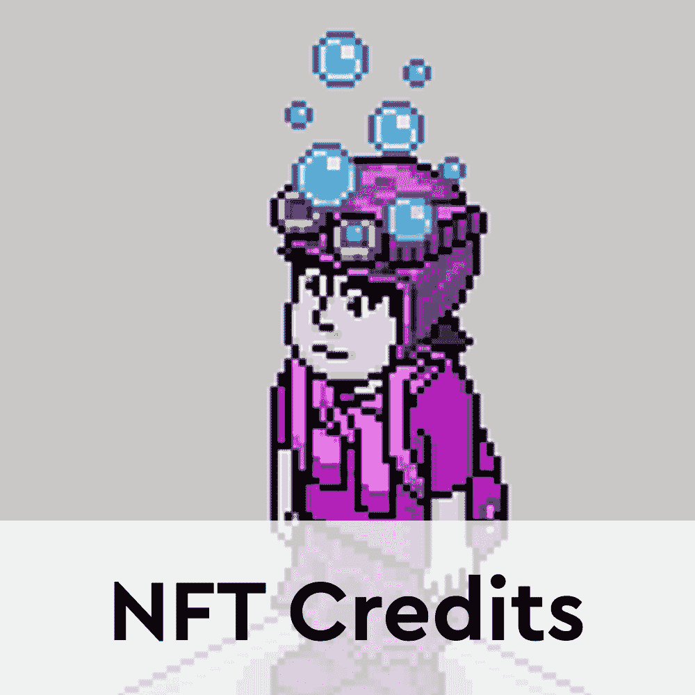

# Habbo 通过免费 NFT 空投提升 NFT 信用公用事业

> 原文：<https://web.archive.org/web/https://dappradar.com/blog/habbo-boosts-nft-credits-utility-with-free-nft-airdrop>

## Habbo 将向 10 万个 IMX 钱包空投一件青铜赫萝蒸汽朋克家具

Habbo 头像和 Habbo 肖像背后的团队宣布向任何拥有 IMX 以太坊地址的人开放免费的 NFT 空投。此次空投旨在为最近推出的****NFT 积分计划带来一层新的效用。****

 **即将到来的空投将为 10 万个 IMX 支持的以太坊地址提供一个青铜赫萝蒸汽朋克家具 NFT。这是赫萝蒸汽朋克系列的第一个稀有级别，这就是为什么哈博放弃了这么多家具。重要的是，为了将他们的 NFT 家具提升到更高的稀有水平，收藏家们需要 NFT 积分。

要把五个青铜蒸汽朋克变成一个黄金的，收藏家们不需要 NFT 积分。然而，

要把五个黄金蒸汽朋克合并成一个钻石蒸汽朋克，收藏家们需要 100 个 NFT 积分。此外，将五个钻石蒸汽朋克变成彩虹一号需要 500 NFT 积分。从这个意义上说，Habbo 团队旨在通过免费提供项目的切入点，向更多的收藏家介绍蒸汽朋克家具。

## 哈伯 NFT 持有者也将获得免费的非功能性食物

除了向任何有 IMX 钱包的人免费空投青铜蒸汽朋克 furni，Habbo 团队还将空投更高稀有等级的 NFTs。他们会对已经是 Habbo 社区成员的收藏者这样做。拥有 NFT 头像或肖像的收藏者可能有资格获得一个免费的金色赫萝蒸汽朋克家具 NFT。

目前，Habbo 团队尚未发布关于 Habbo 持有者空投的更多细节。然而，初步宣布，大约 20，000 名合格的收藏家将获得 NFT 空投黄金 furni。球队仍然需要发布一份官方的资格标准名单，所以 Habbo 球员应该密切关注这些信息。

## 蒸汽朋克 furni NFTs 什么时候掉？

两次空投都计划在 3 月 23 日进行。为了让感兴趣的收藏者参与到青铜蒸汽朋克 furni NFT 空投中来，他们必须填写一份带有以太坊地址的表格。重要的是，以太坊地址应该支持 IMX。

要为您的以太坊钱包启用 IMX 支持，请访问此[链接](https://web.archive.org/web/20221210020313/https://nft.habbo.com/imx/)。它将引导您完成连接过程，您可以轻松地准备好钱包以应对掉线。一旦你为你的钱包启用了 IMX，填写这个[谷歌表单](https://web.archive.org/web/20221210020313/https://docs.google.com/forms/d/e/1FAIpQLServmURPPtSWX3-GNnCc5bE20uVyvSBIjjpaXyESgZKHC9Z-A/viewform)。通过这种方式，你将注册空投名单，你将有机会成为 100，000 名幸运的收藏家之一，他们将获得一个青铜蒸汽朋克家具 NFT。

随着越来越多的收藏家蜂拥而至，接受他们的免费蒸汽朋克家具 NFT，达普拉达尔将继续监测哈博生态系统。要了解更多关于 Habbo NFTs 和新 NFT 信贷计划的信息，请点击以下链接。此外，你可以在 Twitter 上关注 DappRadar，抢先了解最新的 NFT 新闻。

[<picture></picture>](https://web.archive.org/web/20221210020313/https://dappradar.com/ethereum/collectibles/habbo-avatars)[<picture></picture>](https://web.archive.org/web/20221210020313/https://dappradar.com/blog/habbo-nft-credits-only-for-dedicated-nft-holders/)[<picture></picture>](https://web.archive.org/web/20221210020313/https://dappradar.com/blog/early-2000s-revived-as-habbo-avatars-storm-the-charts/) NewsletterUnsubscribe at any time. [T&Cs](https://web.archive.org/web/20221210020313/https://dappradar.com/terms) and [Privacy Policy](https://web.archive.org/web/20221210020313/https://dappradar.com/privacy-policy)**