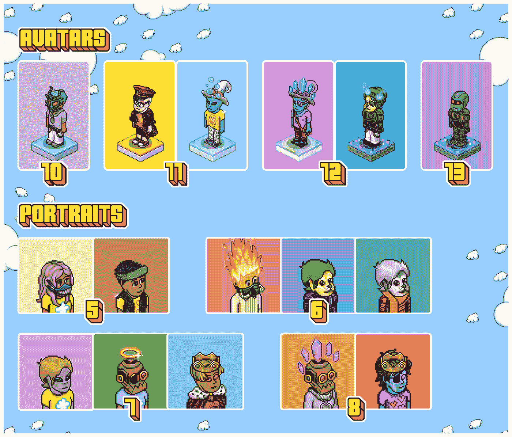

# 哈伯 NFT 积分仅适用于 NFT 专用卡持有者

> 原文：<https://web.archive.org/web/https://dappradar.com/blog/habbo-nft-credits-only-for-dedicated-nft-holders>

## 哈博头像和哈博肖像持有者将获得 NFT 奖励

Habbo 头像和 Habbo 肖像系列背后的团队已经宣布，这些 NFT 现在将向所有者奖励 Habbo NFT 积分。重要的是，为了让持有人获得哈博 NFT 信用，他们必须从二级市场如 OpenSea 退市。

哈伯 NFT 积分背后的目标是为哈伯爱好者和收藏家提供更广泛的功能生态系统。哈博 NFT 信用是一种数字货币，类似于公用代币。这些代币将主要为持有者提供额外的特权，而不仅仅是拥有一个头像或肖像。

从本质上讲，积分既可以促进 Habbo 生态系统的发展，也可以奖励收藏家对项目的忠诚。此外，这些加密令牌将在 Habbo 生态系统的所有未来功能中发挥重要作用。

## 如何获得哈博 NFT 学分？

第一件事，你需要做的是为了索赔哈博 NFT 信用拥有一个哈博 NFT。Habbo 头像和 Habbo 肖像的铸造工作已经完成。然而，这两个系列都可以在二级市场上买到。

一旦你有了你的 Habbo NFT，重要的是你要把它从任何二级市场上除名。未列出的头像和肖像以及在之前 24 小时时间窗口内未列出的头像和肖像每天在世界协调时午夜前后累积一次积分。

当您使用 Metamask 钱包登录 Habbo 网站的新 NFT 积分部分时，您可以查看您的 NFTs 累积的积分金额。重要的是，每个 [Habbo 头像](https://web.archive.org/web/20220929043146/https://dappradar.com/ethereum/collectibles/habbo-avatars)每天将授予 10 个信用点，而每个 Habbo 头像每天将授予 5 个信用点。重要的是，每个 NFT 的特征和特点可能会给持有者带来额外的加分。

## 哈博的下一步是什么？

根据官方声明，哈博 NFT 积分将作为一系列即将推出的功能的基础。其中，Habbo 团队宣布了引入 NFT 合并和手工制作的计划。这将允许收藏者组合常见的 NFT，并获得更罕见的版本。

此外，该团队正在研究允许收藏家改变他们收藏品的特征和属性，以换取 NFT 信用的费用。这项功能将允许收藏家改变他们的 NFT 的外观，例如，通过改变他们的衣服，头发或眼睛的颜色。

最后但同样重要的是，哈博 NFT 积分的引入也可能对[哈博 NFTs](https://web.archive.org/web/20220929043146/https://dappradar.com/ethereum/collectibles/habbo-avatars) 的估值和底价产生积极影响。随着持有人被鼓励摘牌，二级市场[的供应将会减少，而需求将会增加。这反过来又是提价的绝佳环境。当然，只有时间才能证明信用体系是否会对 Habbo NFTs 的价格产生影响。](https://web.archive.org/web/20220929043146/https://dappradar.com/nft/marketplaces)

DappRadar 将继续关注哈博 NFT 系列，你也可以在他们的官方 dapp 页面上这样做。在那里你可以找到关于连锁活动的信息，比如销售额、交易量等等。你也可以在[推特](https://web.archive.org/web/20220929043146/https://twitter.com/dappradar)上关注 DappRadar，并加入我们的 [Discord](https://web.archive.org/web/20220929043146/https://discord.gg/4ybbssrHkm) 社区，抢先获得最新的 NFT 新闻。

 NewsletterUnsubscribe at any time. [T&Cs](https://web.archive.org/web/20220929043146/https://dappradar.com/terms) and [Privacy Policy](https://web.archive.org/web/20220929043146/https://dappradar.com/privacy-policy)