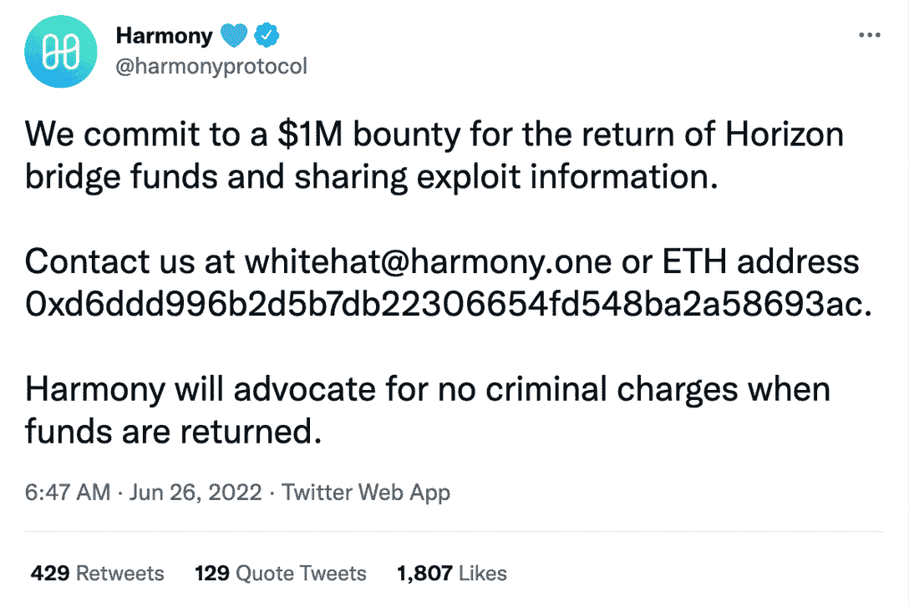
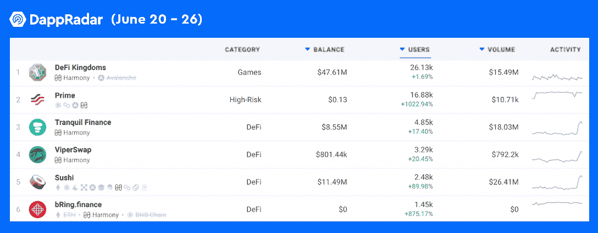

# 在 Harmony 宣布 100 万美元的奖金后，Hacker 已经开始转移资金

> 原文：<https://web.archive.org/web/https://dappradar.com/blog/hacker-has-begun-to-move-funds-after-harmony-announced-1m-bounty>

## 被盗资产包括 BUSD、USDC、瑞士联邦理工学院和 WBTC

上周，Harmony 在一次桥牌黑客攻击中损失了 1 亿美元，并宣布如果黑客归还被盗资金，将获得 100 万美元的奖金。此外，资金归还后，和谐将停止追究刑事指控。

**概要:**

*   和谐(Harmony)([ONE](https://web.archive.org/web/20220812003648/https://dappradar.com/hub/token/eth/ONE/ETH?from=0x68ac1affe00cf64ebc71e7e835a6871a379c5587))已经悬赏 100 万美元，要求返还其在地平线大桥黑客攻击中被盗的资金。
*   然而，黑客已经开始通过龙卷风现金转移资金。
*   被盗的 1 亿美元资金包括 [BUSD](https://web.archive.org/web/20220812003648/https://dappradar.com/hub/token/eth/BUSD?from=0x4fabb145d64652a948d72533023f6e7a623c7c53) 、 [USDC](https://web.archive.org/web/20220812003648/https://dappradar.com/hub/token/eth/USDC?from=0xa0b86991c6218b36c1d19d4a2e9eb0ce3606eb48) 、 [ETH](https://web.archive.org/web/20220812003648/https://dappradar.com/hub/token/eth/ETH) 、 [WBTC](https://web.archive.org/web/20220812003648/https://dappradar.com/hub/token/eth/WBTC?from=0x2260fac5e5542a773aa44fbcfedf7c193bc2c599) 。
*   Harmony 的创始人 Stephen Tse 告诉社区，Harmony 的共识层仍然是安全的。
*   自从[DeFi](https://web.archive.org/web/20220812003648/https://dappradar.com/defi)dapp 如 [Prime](https://web.archive.org/web/20220812003648/https://dappradar.com/harmony/high-risk/prime) 和 [BRING FINANCE](https://web.archive.org/web/20220812003648/https://dappradar.com/harmony/defi/bring-finance) 实现了令人印象深刻的 7 天用户增长以来，Harmony 黑客似乎对用户信心没有影响。

根据其官方推特账户，2022 年 6 月 24 日， [Harmony 因其地平线桥](https://web.archive.org/web/20220812003648/https://dappradar.com/blog/hackers-steal-100-million-from-harmonys-horizon-bridge)遭到黑客攻击而损失了价值 1 亿美元的代币。从那时起，该团队进行了一系列调查，现在它提供 100 万美元作为赏金，如果黑客们归还被盗资金并分享有关利用的信息。

今天早些时候，Harmony 发现黑客已经开始通过 Tornado Cash 转移资金。该小组正与区块链追踪和分析专家合作，并与联邦调查局合作追查这一犯罪行为。

## 更多关于盗窃的信息被披露

Harmony protocol 的创始人兼首席执行官斯蒂芬·谢(Stephen Tse)通过 Twitter 帖子部分披露了盗窃案的调查结果。

他透露，攻击者可以访问和解密几个私钥，签署一些未经授权的交易。经过调查，Harmony 团队发现了私钥被泄露的证据，这导致了地平线桥的破坏。然而，盗窃发生在桥的以太坊一侧。这次抢劫导致了包括 BUSD、USDC、瑞士联邦理工学院和 WBTC 在内的资产损失。

根据 Stephen Tse 的推文，该团队尚未发现 Horizon 平台上任何漏洞的证据。此外，和谐的共识层仍然是安全的。该团队仍在进行中的调查，和谐将保持每个人的最新进展。

## 用户似乎对和谐保持信心

和谐黑客事件发生在不到一周前，但用户似乎仍然对区块链的生态系统有信心。

根据 DappRadar 排名，在过去的七天里，和谐区块链上的许多 dapps 都出现了显著的数量增长。例如，去中心化的跨链跑马圈地平台 BRING FINANCE 在 7 天内就实现了超过 800%的用户增长。此外，最初在 [BNB 智能链](https://web.archive.org/web/20220812003648/https://dappradar.com/rankings/protocol/binance-smart-chain)上的投资工具 Prime，在过去七天里为和谐带来了近 17000 名用户，令人印象深刻的 1000%的增长。

DappRadar 将继续关注 Harmony 黑客事件及其生态系统的最新进展。在 [Twitter](https://web.archive.org/web/20220812003648/https://twitter.com/dappradar) 、 [Discord](https://web.archive.org/web/20220812003648/https://discord.gg/4ybbssrHkm) 和 [Youtube](https://web.archive.org/web/20220812003648/https://www.youtube.com/c/DappRadar) 上关注我们，跟上区块链世界的动态。