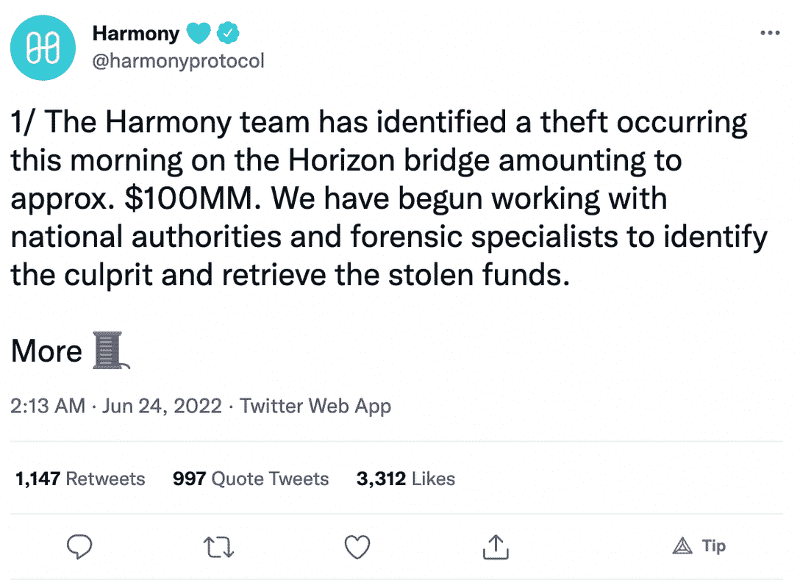

# 黑客从 Harmony 的地平线大桥窃取了 1 亿美元

> 原文：<https://web.archive.org/web/https://dappradar.com/blog/hackers-steal-100-million-from-harmonys-horizon-bridge>

## Harmony 已经成为跨链桥黑客攻击的最新受害者

今天早些时候，黑客攻击了第一层区块链和谐公司的地平线桥，造成大约 1 亿美元的加密货币损失。事件的全部经过仍有待进一步披露。

**概要:**

*   **[**和谐**](https://web.archive.org/web/20220813153716/https://dappradar.com/rankings/protocol/harmony) **团队在推特上透露，在地平线桥上发现了一个密码盗窃，导致大约 1 亿美元的损失。****
*   **该团队已暂停 Horizon bridge，以防止进一步的交易。**
*   ****一旦完成调查，该团队将向社区公开这些信息。****
*   ****和谐的** [**一个**](https://web.archive.org/web/20220813153716/https://dappradar.com/hub/token/eth/ONE/ETH?from=0x68ac1affe00cf64ebc71e7e835a6871a379c5587) **令牌在过去 24 小时内暴跌超过 7.29%。****

 **Harmony 是第 1 层区块链，拥有高吞吐量、高速度和接近零的成本。《区块链杀手 dapp》是区块链游戏界最受欢迎的 GameFi 项目之一。

不幸的是，这个拥有许多成功的 GameFi dapps 的主机如今成了黑客的目标。根据 Harmony 的官方 Twitter 账户，由于其地平线大桥今早遭到黑客攻击，该公司损失了价值 1 亿美元的代币。

## 怎么发生的？

6 月 24 日，Harmony 团队在 Twitter 上透露，在 Horizon bridge 上发现了一个加密盗窃，导致大约 1 亿美元的损失。它继续解释说，该小组已开始与国家当局和专家合作，以确定罪犯并追回被盗资金。

[根据第三方消息来源](https://web.archive.org/web/20220813153716/https://www.bloomberg.com/news/articles/2022-06-24/crypto-bridge-horizon-is-hacked-for-100-million)，盗窃似乎是由于私钥泄露而发生的。然而，和谐并没有正式透露或回应这些信息。

Harmony 已经通知了交易所，并停止了 Horizon bridge 的进一步交易。该团队正在尽最大努力调查发生了什么，并将尽快向社区和用户披露。

根据 DappRadar Token Explorer 的数据，Harmony 的 ONE token 在过去 24 小时内暴跌了 7.29%，目前的交易价格为 0.024 美元。

## 跨链桥再次引发安全问题

今年已经见证了一系列跨链桥黑客攻击，和谐的事件标志着最新的一个。今年 1 月，黑客从 Qubit Finance 的 bridge 窃取了 8000 万美元，3 月，受害者是领先的 play-to-earn dapp[Axie Infinity](https://web.archive.org/web/20220813153716/https://dappradar.com/ronin/games/axie-infinity)。此外，阿谢的[浪人](https://web.archive.org/web/20220813153716/https://dappradar.com/rankings/protocol/ronin)桥在 [ETH](https://web.archive.org/web/20220813153716/https://dappradar.com/hub/token/eth/ETH) 和 [USDC](https://web.archive.org/web/20220813153716/https://dappradar.com/hub/token/eth/USDC?from=0xa0b86991c6218b36c1d19d4a2e9eb0ce3606eb48) 被黑损失了 6.22 亿美元。

DappRadar 将继续关注 Harmony 被黑事件的最新进展。在 [Twitter](https://web.archive.org/web/20220813153716/https://twitter.com/dappradar) 、 [Discord](https://web.archive.org/web/20220813153716/https://discord.gg/4ybbssrHkm) 和 [Youtube](https://web.archive.org/web/20220813153716/https://www.youtube.com/c/DappRadar) 上关注我们，跟上区块链世界的动态。**