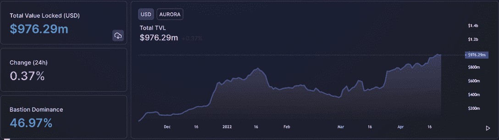
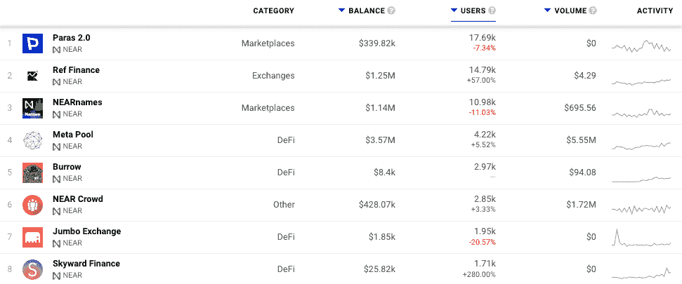
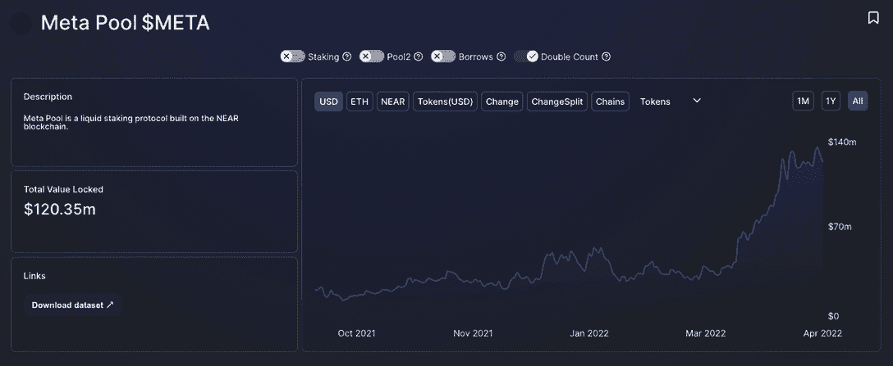
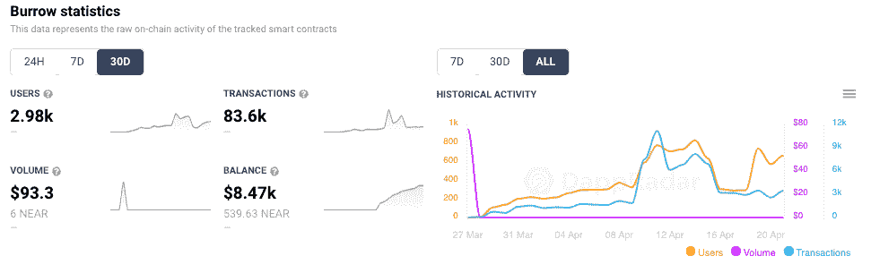
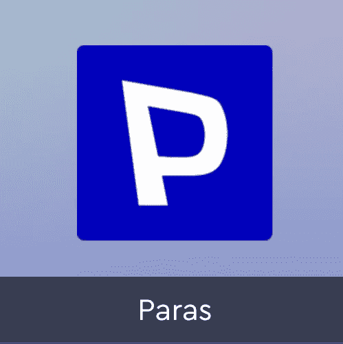

# Mainnet 附近的 2 岁生日快乐

> 原文：<https://web.archive.org/web/https://dappradar.com/blog/happy-2nd-birthday-near-mainnet>

## 仔细观察 mainnet 推出近两年来的情况

今天距离 [Near 协议](https://web.archive.org/web/20221007100020/https://dappradar.com/rankings/protocol/near) mainnet 上线已经两年了。该网络于 2020 年 4 月 22 日启动，并于 2020 年 9 月由社区运营。它还通过了一项投票，允许令牌转移，并于 2020 年 10 月推出了近令牌。NEAR 将水平扩展方法与独特的共识机制相结合，将网络分成并行碎片，并分配计算任务以提高处理能力。

## 摘要

*   [临近 mainnet 上线两年的今天](https://web.archive.org/web/20221007100020/https://dappradar.com/rankings/protocol/near)
*   在过去的 12 个月中，接近象征性价格上涨了 226%
*   从 2022 年 1 月至今，TVL 增长了 550%
*   将近 3 亿美元的 TVL 贷款

在写作时，附近的[总价值锁定超过 7.8 亿美元，自 2022 年 1 月 1 日以来增长了 550%，当时约为 1.2 亿美元。有趣的是，其中近 3 亿美元存在贷款协议中。原生 NEAR token 市值 105 亿美元，目前在前 100 名中排名第 17。在过去的 12 个月里，从 4.60 美元到 15.60 美元，上涨了 226%。更值得注意的是，在 BTC、ETH 和其他主要加密货币停滞不前的情况下，它在过去 30 天里增长了 40%。](https://web.archive.org/web/20221007100020/https://dappradar.com/rankings/protocol/near)

## 极光:以太坊兼容层

值得注意的是，Near 的许多活动都发生在极光网络上，极光网络是区块链附近[的以太坊兼容层。Aurora 在 Near 上运行，并利用了它的许多独特功能，包括分片和开发者燃气费报酬。](https://web.archive.org/web/20221007100020/https://dappradar.com/rankings/protocol/near)

Aurora 提供以太坊第二层体验，并拥有广泛的 DeFi dapps 生态系统，包括 Bastion 和 Trisolaris，它们占 Aurora 9.726 亿美元 TVL 的 7.4 亿美元以上。提到极光是必要的，因为这里的活动反馈给 Near 关于它的价值和效用。

## 开发商为什么选择近

在我们开始之前，有必要理解为什么[项目选择在](https://web.archive.org/web/20221007100020/https://medium.com/mintbase/scaling-mintbase-with-near-503375d92702)附近构建。一个主要的驱动因素是，对于 dapp 建筑商来说，Near 是进入市场的最快方式，他们可以做一些他们从没想到区块链会做的事情。Near 通过不可信的彩虹桥轻松地与以太坊进行互操作。所有这些都提供了一个灵活的帐户模型，可以对用户隐藏区块链，直到他们准备好。他们通过使用一种叫做渐进式入职的方法来确立这一点。它为他们提供了一整套工具，以及一种保留其合同产生的 30%交易费的方法。

这些功能不仅解决了当今行业面临的成本和扩展问题，还允许开发人员创建其他连锁店无法支持的可持续 dapps 和体验。此外，这些当然是正版用户可以使用的 dapps。

mainnet 发布两年后，我们深入到 Near 上的 [dapp 生态系统，发现哪些应用程序正在推动最大份额的活动和价值，帮助 Near 成为市场上最相关的区块链解决方案之一。](https://web.archive.org/web/20221007100020/https://dappradar.com/rankings/protocol/near)

## 近生态系统炒作

DappRadar 在 Near 上跟踪了 27 个 dapps ，涵盖了所有主要类别，包括 DeFi、交易所、收藏品、游戏和市场。许多核心的 DeFi 活动发生在 Aurora 上，DappRadar 目前没有跟踪这个网络。然而，我们可以在 Near 上深入 dapp 生态系统，看看是哪些服务促使用户使用 dapp。

通过对 DappRadar 上 dapp 排名附近的[应用用户过滤器，我们可以立即看到哪些 dapp 在过去 30 天内吸引了 1000 或更多的独特活动钱包，让我们可以放大当前的热点。](https://web.archive.org/web/20221007100020/https://dappradar.com/rankings/protocol/near/1?greaterUser=1000)

NFT 和数字收藏品市场在用户活动方面领先，在过去 30 天里，超过 17，000 个钱包与其智能合同进行了交互。Paras 从数字艺术卡开始，灵感来自于现实世界的交易卡，并有一个压倒一切的信念，即每一种物理艺术形式都需要存储和数字化，以确保其经得起未来的考验。

希望生产和开发可能为漫画、游戏和玩具等媒体量身定制和设计的加密原生知识产权。他们给出了数字资产的效用和使用案例，可以为收藏家和创作者创造更多价值。

另一个与众不同的市场是 [NEARnames](https://web.archive.org/web/20221007100020/https://dappradar.com/near/marketplaces/nearnames) ，它不是传统的 NFT 市场。相反，它就像一个附属系统，让当前的 Near 用户通过给他们一个个性化的帐户名称来吸引新用户，然后向他们发送一个帖子，其中包括帮助他们开始进入 Near 生态系统的说明。

[Ref Finance 提供了 Near](https://web.archive.org/web/20221007100020/https://dappradar.com/near/exchanges/ref-finance-1) 的货币支柱，促进了代币交易，并充分利用了 Near 每笔 0.005 美元的低掉期费用和一到两秒的终结性。通过使用彩虹桥，用户可以在 Near 和以太坊之间转移加密资产，交易者可以利用以太坊以及任何连锁店(包括 BSC、Matic、Cosmos 等)的 ERC 20 资产中的数十亿美元。

在这三个领导人下面，我们看到五个 DeFi 协议，似乎都在争夺同样的眼球。然而，我们看到每一个都有其优点。[元池具有吸引力](https://web.archive.org/web/20221007100020/https://dappradar.com/near/defi/meta-pool),因为它允许附近的令牌持有者通过赚取传统赌注奖励并同时参与 DeFi 协议来利用他们的持有量。这一过程被称为液体打桩。

当用户将他们的 NEAR 令牌存入元池时，他们会收到 stNEAR，然后可以在其他 DeFi 平台上使用，例如作为贷款的抵押品，同时他们的 NEAR 可以获得高达 10%的赌注奖励。这项服务已经帮助 Meta Pool 在 TVL 获得了超过 1 . 2 亿美元的收入，约占 TVL 总收入的 15%。

最近推出，在写作时才活跃了一个月左右。此外，它补充了元池为计息资产释放流动性，特别是 stNEAR 和 stETH 等一级赌注衍生品。Burrow 是一个分散的非托管利率平台，使用户能够提供资产以赚取利息，并以资产为抵押借款以释放流动性。

[Burrow 类似于 Aave](https://web.archive.org/web/20221007100020/https://dappradar.com/near/defi/burrow) 、Compound 和其他基于池的协议。陋居的用户可以将 starnar 作为抵押品，然后借入更多的 NEAR 来建立杠杆化的赌注头寸，或者借入 stablecoin 来建立自我偿还头寸。Meta Pool 和 Burrow 之间的协同作用表明，一旦一个生态系统协同工作，复杂的 DeFi legos 就开始就位。Burrow 的早期结果看起来非常有希望，因为它吸引了近 3，000 个钱包，在不到 30 天的时间里完成了 83，000 多笔交易。

《近距离人群》让我们得以一瞥另一个不属于最受关注类别的另类 dapp。 [NEAR Crowd 是一种服务，允许人们通过完成由中央实体(称为请求者)提供和资助的小任务来赚取 NEAR token](https://web.archive.org/web/20221007100020/https://dappradar.com/near/other/near-crowd)。

NEAR Crowd 极大地限制了请求者的权力，而是将权力转移到社区。特别是，当请求者指定每个任务中需要做什么时，社区决定每个工作是否根据这个规范正确地完成。这是通过创建一组规则、检查和平衡来实现的，这些规则、检查和平衡由部署在 Near 上的智能契约来实施。显而易见，这样一个系统有朝一日可以扩展到处理内部业务问题，如人力资源或工作流程，并取代 Trello 等应用程序。

最后，我们有两个 DeFi 协议，在过去 30 天内实现了超过 1，000 个独特的活动钱包。Jumbo Exchange 为用户提供了一个 AMM 指数，提供了一种廉价、无缝的代币交易方式。与此同时， [Skyward Finance 的](https://web.archive.org/web/20221007100020/https://dappradar.com/near/defi/skyward-finance)使命是为基于 Near Protocol 构建的项目实现公平的代币分配和价格发现，进一步连接生态系统内的点，并鼓励本地 dapp 和代币增长。

## 乐高附近一起点击

很清楚的是，dapp 生态系统附近的[是由免费的乐高玩具组成的，这些玩具现在都开始点击在一起。上个月，Bastion 以未披露的估值完成了一轮 200 万美元的种子融资。与此同时，Near 最近吸引了一波 DeFi 和](https://web.archive.org/web/20221007100020/https://dappradar.com/rankings/protocol/near)[投资活动](https://web.archive.org/web/20221007100020/https://messari.io/asset/near-protocol/profile/investors)，本月早些时候 Tiger Global 牵头为第一层区块链筹集了 3.5 亿美元。

所有这些活动已经推动 native NEAR tokens 的价值在过去 12 个月中上涨了 226%，其 TVL 距离 10 亿美元只有咫尺之遥。相比之下，极光上的活动是一致的，不应该从更大的画面中被忽略。

[<picture></picture>](https://web.archive.org/web/20221007100020/https://dappradar.com/near/other/near-crowd)[<picture></picture>](https://web.archive.org/web/20221007100020/https://dappradar.com/near/exchanges/ref-finance)[<picture></picture>](https://web.archive.org/web/20221007100020/https://dappradar.com/near/marketplaces/paras)

***以上不构成投资建议。此处给出的信息仅供参考。请行使尽职调查，做你的研究。作者持有多种加密货币的头寸，包括 BTC、瑞士法郎和雷达。***