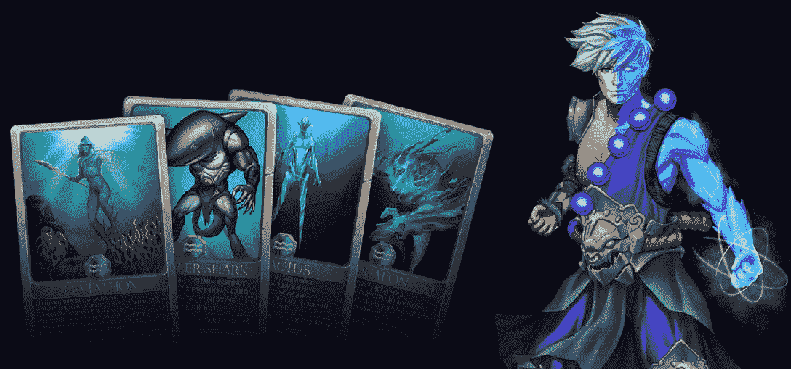

# 随着更多 Dapps 加入其生态系统，Harmony 继续推动 Web3

> 原文：<https://web.archive.org/web/https://dappradar.com/blog/harmony-continues-web3-push-as-more-dapps-join-its-ecosystem>

## 《安德之门》和《开放海洋》是和谐频道值得关注的节目

Harmony 致力于开发高效的 Web3 基础设施，为下一代 dapps 提供支持。区块链使以太网应用能够在其网络中平稳运行。最近，Harmony 的生态系统实现了几个里程碑，各种 dapps 加入并使其生态系统多样化。

**概要:**

*   对于 [DeFi](https://web.archive.org/web/20221208154147/https://dappradar.com/defi) 和 [NFT](https://web.archive.org/web/20221208154147/https://dappradar.com/nft) 项目的蓬勃发展来说，Harmony 是一个最佳的可扩展 Web3 基础设施。
*   Harmony 最近在其生态系统中增加了许多创新的区块链 dapps。
*   值得注意的是，OpenOcean，在[以太坊](https://web.archive.org/web/20221208154147/https://dappradar.com/rankings/protocol/ethereum)、[索拉纳](https://web.archive.org/web/20221208154147/https://dappradar.com/rankings/protocol/solana)、[多边形](https://web.archive.org/web/20221208154147/https://dappradar.com/rankings/protocol/polygon)、Harmony 等网站上提供的多链 dapp 的独立用户数量增长了 3000%。

区块链空间比以往发展得更快，新趋势一夜之间涌现。当前的区块链格局不再是“以太坊包揽一切”，我们已经看到许多分散式网络涌现出来，为用户提供更实惠、可扩展和高效的解决方案。

在所有解决方案中，Harmony 有效地补充了现有的以太坊网络，可以以 2 秒的交易终结性和低 100 倍的费用运行以太坊应用。这使得 Harmony 成为 DeFi 和 NFT 项目的最佳可扩展 Web3 基础设施。因此，生态系统正在迎来许多创新的区块链 dapps，从 GameFi 到 DEX。

## 安德之门:灵感来自炉石，动力来自区块链

[《安德之门》](https://web.archive.org/web/20221208154147/https://evoverses.com/?utm_source=DappRadar&utm_medium=deeplink&utm_campaign=visit-website)是一款在和谐区块链上玩赚 NFT 纸牌游戏(TCG)。游戏灵感来源于一些大牌 tcg，比如游戏王、魔法阵、炉石。

《安德之门》是一款技巧游戏，玩家通过有趣的故事情节、迷人的角色和精心设计的游戏玩法参与其中。在《安德之门》中，付款人可以使用他们的卡牌收集、交易和战斗，并建立独特的策略来最大化收益。

《安德之门》背后的团队一直在努力为用户带来新的功能和更新。本周，达普拉达采访了《安德之门》团队，谈论了游戏的未来计划。看看下面的 AMA 视频，了解更多。

[https://web.archive.org/web/20221208154147if_/https://www.youtube.com/embed/bD375Jizg3o?feature=oembed](https://web.archive.org/web/20221208154147if_/https://www.youtube.com/embed/bD375Jizg3o?feature=oembed)

## 开放海洋:和谐 DeFi 景观的助推器

[OpenOcean](https://web.archive.org/web/20221208154147/https://dappradar.com/harmony/defi/openocean) 是一个强大的 DeFi 和 CeFi 聚合器，为现货和衍生品交易提供一站式交易体验。首先在 14 个不同的链上可用，如以太坊、BNB 智能链、索拉纳、多边形等等，OpenOcean 现在也集成到了 Harmony 中。

OpenOcean 可以为交易者确定最有效的掉期交易。为了确定处理交易的最佳路线，OpenOcean 利用其科学设计的算法来优化关键因素，如价格、汽油费、滑点和路线。

最重要的是，OpenOcean 是免费的。因为 Harmony 的交易手续费和交易佣金非常低。

虽然 OpenOcean 仅在两个月前登陆 Harmony，但它已经在用户数量上取得了显著增长。在过去的 30 天里，dapp 的独立用户增长了 3000%。

## 最后的想法

作为一个 Web3 的远见者和实践者，Harmony 坚持扩大信任和创造一个完全公平的经济的使命。Harmony 致力于为 DeFi 和 NFT 提供可扩展、高效、经济的 Web3 基础设施。随着越来越多的 dapps 加入 Harmony 生态系统，这是他们出色性能和多功能性的有力证明。

了解更多关于和谐的信息:

[网站](https://web.archive.org/web/20221208154147/https://www.harmony.one/)

[白皮书](https://web.archive.org/web/20221208154147/https://harmony.one/whitepaper.pdf)

[推特](https://web.archive.org/web/20221208154147/https://twitter.com/harmonyprotocol)

**免责声明** —这是一篇赞助文章。DappRadar 不认可本页面上的任何内容或产品。DappRadar 旨在提供准确的信息，但读者应该在采取行动之前总是自己做研究。DappRadar 的文章不能被认为是投资建议。