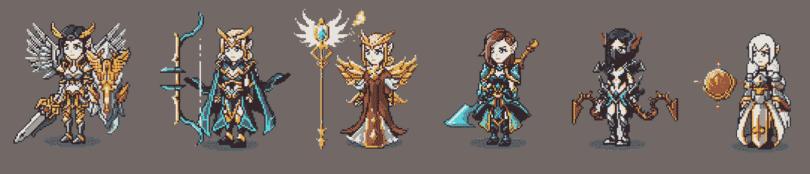
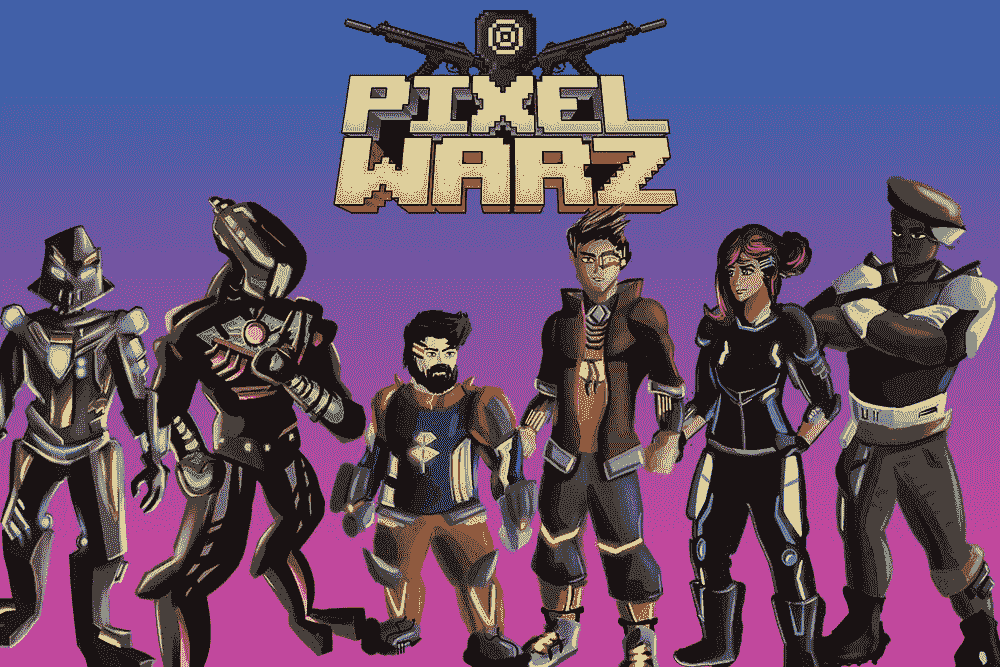

# 随着游戏 Dapps 加入生态系统，Harmony One 取得了成功

> 原文：<https://web.archive.org/web/https://dappradar.com/blog/harmony-one-finds-success-as-gaming-dapps-join-the-ecosystem>

## 宇宙宇宙，迪菲拉，和谐发挥的像素沃兹有一个良好的开端，这个月

和谐区块链继续为其用户带来新颖的 GameFi 和游戏 dapps，并且在该产品领域的活动越来越多。Cosmic Universe、Defira 和 Harmony Play 的 Pixel Warz 是社区最期待的三个项目。

**概要:**

*   [**【和谐】**](https://web.archive.org/web/20230128052555/https://dappradar.com/rankings/protocol/harmony) **目前每天约有 1500 名新用户进入 GameFi 部门。通过引入更多的 GameFi dapps，Harmony 的 DeFi 王国旨在进一步扩张。**
*   宇宙和迪菲拉游戏尚未推出，但已经在未来玩家中引发了热议。
*   此外，新推出的项目 [**和声游戏**](https://web.archive.org/web/20230128052555/https://dappradar.com/harmony/games/harmony-play) **在过去的 30 天里用户增长了近 40%。**
*   这些 dapps 与 [**DeFi 王国**](https://web.archive.org/web/20230128052555/https://dappradar.com/harmony/games/defi-kingdoms) **一起，为 Harmony 的 GameFi 生态系统奠定了坚实的基础，该生态系统在过去 30 天内吸引了 95651 个独特的活跃钱包。**

## 游戏对区块链产业很重要

根据 DappRadar Dapp 行业报告 4 月版，游戏在区块链使用方面继续占据主导地位，占行业唯一活跃钱包的 52%。此外，游戏用户的刚性需求似乎不受 crypto 下行市场趋势的影响，向智能合约发送了 123 万个每日唯一活跃钱包(UAW)。

区块链游戏对区块链的大规模应用至关重要。游戏 dapps 正在建设独特的经验，并创造新的机会，为非加密球员进入空间，纳入机制，如发挥赚取。将这一目标付诸行动的人之间就是和谐。

在 2022 年第二季度的中途，Harmony 生态系统见证了一些最著名的 GameFi dapps 的几个里程碑。其中，我们发现像宇宙宇宙，迪菲拉，和谐发挥的像素沃兹等标题。这些游戏 dapps 已经吸引了 20，000 名用户加入他们的 Discord 社区。然而，其中一些游戏产品还没有完全上市，这为光明的未来设定了预期。

## 宇宙——沉浸式元宇宙 MMO 之旅

宇宙宇宙是一个幻想，世界缔造者区块链·元宇宙和 MMORPG 生活在和谐区块链上。游戏拥有令人兴奋的视觉元素和身临其境的幻想元宇宙冒险，玩家可以探索领域，收获，挖掘，开发越来越先进的情节，并提升独家 NFT 等。

[https://web.archive.org/web/20230128052555if_/https://www.youtube.com/embed/quH3jsUZKEo?feature=oembed](https://web.archive.org/web/20230128052555if_/https://www.youtube.com/embed/quH3jsUZKEo?feature=oembed)

完全可玩的宇宙将于今年晚些时候推出。目前，玩家已经可以[用他们的 NFT 角色](https://web.archive.org/web/20230128052555/https://medium.com/@thecosmicuniverse/weekly-wizard-character-nft-staking-is-live-gameplay-demo-3d-elves-updates-more-de0ec3cf07df)来换取在更大的生态系统中有用的游戏内资源。

## defira——DeFi 和 GameFi 的融合

Defira 是一款区块链元宇宙游戏，在 Harmony 上推出。该游戏融合了 DeFi 和 GameFi，利用这两种模式在一个幻想游戏世界中创建了一个 DeFi“超级应用程序”。

Defira 的 DeFi 愿景描绘了一个未来，所有主要的 DeFi 原语都将出现在 Defira“超级应用程序”中，不同的 DeFi 令牌服务于其虚拟世界中的某些公用事业。和谐区块链上的 DeFi 协议“宁静金融”首先进入 Defiraverse。

此外，Defira 的游戏性具有多种游戏模式，允许玩家获得和开发游戏内资产，以与 Defira 的游戏和 DeFi 机制进行交互。例如，要在迪菲拉获得一个创世纪英雄 NFT，玩家需要用宁静金融的原生令牌 TRANQ 来铸造这些专属的 NFT。

创世纪英雄造币厂的五轮比赛已经在 4 月 5 日开始，第五轮比赛以抽奖活动开始。225 名创世纪英雄的奖金池即将开放！用户可以查看迪菲拉的[推特](https://web.archive.org/web/20230128052555/https://twitter.com/Defiraverse)和[不和](https://web.archive.org/web/20230128052555/https://discord.gg/rg4MjQfnfY)了解更多细节。

## Harmony Play 的 Pixel Warz–可定制角色的射击游戏

[Harmony Play](https://web.archive.org/web/20230128052555/https://harmonyplay.one/) 是一款基于和谐区块链打造的一体化多游戏平台。游戏平台利用电子竞技精神，因为玩家可以相互竞争，爬上排行榜，并参加锦标赛以赢得生态系统令牌 HPLAY。

最近，Harmony Play 通过发布 Pixel Warz NFT 系列迎来了其第一个叙事驱动的故事。这些 NFT 将作为游戏中的角色，每个都有独特的特征和不同的稀有性。

## 最后的想法

将新的 GameFi 项目引入 Harmony 生态系统是社区一直期待的。DeFi 王国是和谐区块链的长期领导者，它证明了在孵化 GameFi dapps 并支持它们茁壮成长方面，和谐脱颖而出。

总而言之，Cosmic Universe、Defira、Harmony Play 的 Pixel Warz 所取得的开发进展，无疑为 Harmony 的生态系统增添了吸引力。这些游戏产品都带来了不同的用户体验，丰富了和谐生态系统。

**了解更多关于和声的信息:**

[网站](https://web.archive.org/web/20230128052555/https://www.harmony.one/)
[白皮书](https://web.archive.org/web/20230128052555/https://harmony.one/whitepaper.pdf)
[推特](https://web.archive.org/web/20230128052555/https://twitter.com/harmonyprotocol)

**免责声明** —这是一篇赞助文章。DappRadar 不认可本页面上的任何内容或产品。DappRadar 旨在提供准确的信息，但读者应该在采取行动之前总是自己做研究。DappRadar 的文章不能被认为是投资建议。