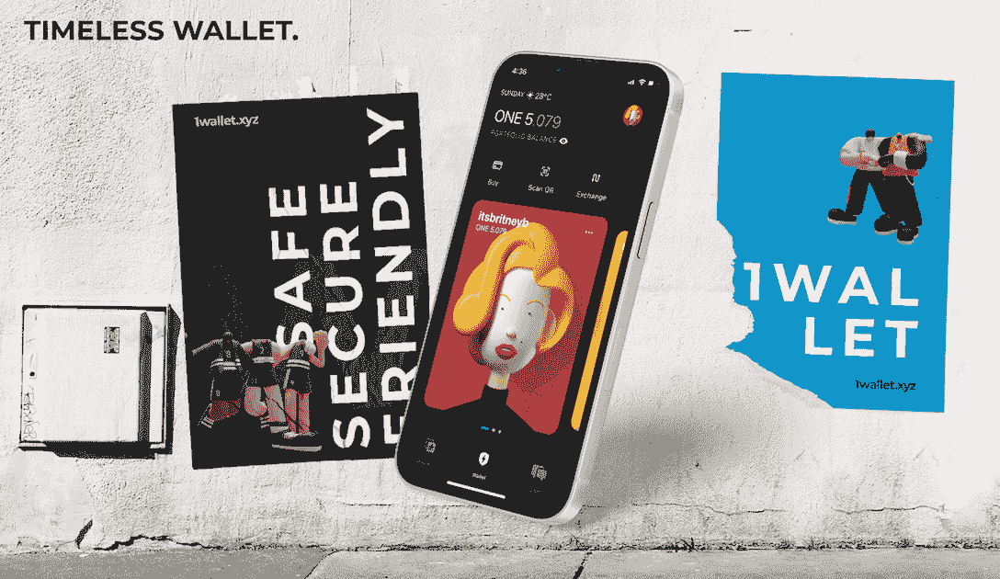
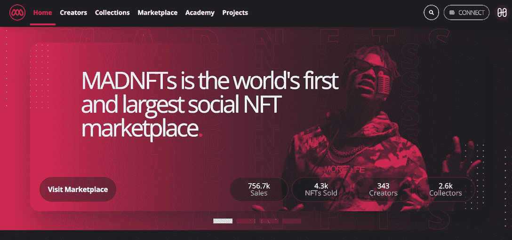

# 和谐一号 2022 年终回顾

> 原文：<https://web.archive.org/web/https://dappradar.com/blog/harmony-one-year-end-review>

## 和谐区块链 2022 年综述及 2023 年展望

2022 年，和谐区块链在科技和生态系统建设方面取得了令人瞩目的进步。通过探索分片技术的可能性，区块链承诺创建一个可扩展的、安全的和负担得起的网络。本文将带您快速了解 Harmony 的技术优势和生态系统亮点。

Harmony 是一个开源的、可伸缩的、以太坊兼容的区块链。自其 mainnet 于 2019 年 6 月上线以来，Harmony 一直处于完善分片技术的前沿，为区块链的可扩展性奠定了基础。

该网络继续探索跨链生态系统的发展。在这方面，Harmony 为开发人员提供了强大的跨链工具来轻松移植资产。这将最终带来无缝的区块链应用使用体验。

**内容:**

*   [*技术亮点:看看 Harmony 的缩放解决方案*](https://web.archive.org/web/20230111181923/https://dappradar.com/blog/harmony-one-year-end-review/#tech)
*   [*生态系统亮点:拔得头筹的项目*](https://web.archive.org/web/20230111181923/https://dappradar.com/blog/harmony-one-year-end-review/#echo)
*   [*《和谐的 2023:释放创造者经济和 Web3 身份*](https://web.archive.org/web/20230111181923/https://dappradar.com/blog/harmony-one-year-end-review/#web3)
*   *[和谐 2023 路线图](https://web.archive.org/web/20230111181923/https://dappradar.com/blog/harmony-one-year-end-review/#roadmap)*

## 技术亮点:了解 Harmony 的扩展解决方案

随着区块链技术在各行各业中的应用越来越广泛，解决缩放问题变得越来越迫切。网络已经进行了各种尝试来提高吞吐量，例如采用模块化、将事务负载转移到链外等等。然而，所有这些解决方案都在一定程度上牺牲了安全性和分散性。

Harmony 决定采用分片技术。分片是一种将数据分成更小块的方法。它通常用于数据库。在区块链技术中，分片实现了同样的目的。它用于在分布式网络中分配计算和存储工作负载。

它的解决方案相当全面，因为它实现了深度分片，包括网络分片、事务分片和状态分片，以实现线性扩展性能。这意味着网络的交易处理能力随着使用的增加而增加。

在高峰时，Harmony 的协议在生产中实现了每秒 500 个事务。在同一时期，该网络累计锁定了 14.1 亿美元的总价值，14.8 亿美元的股份，120 个活跃应用程序，超过 371，000 个月活跃用户，以及约 656，000 个钱包。

在下面的视频中，创始人 Stephen Tse 对 Harmony 的缩放技术进行了更深入的回顾。

[https://web.archive.org/web/20230111181923if_/https://www.youtube.com/embed/i6E5SaigJc8?feature=oembed](https://web.archive.org/web/20230111181923if_/https://www.youtube.com/embed/i6E5SaigJc8?feature=oembed)

## 生态系统亮点:脱颖而出的项目

DappRadar 在 Harmony network 上跟踪各种各样的 dapps，包括游戏、DeFi、社交等等。经过一年的发展，许多基于 Harmony 的项目已经实现了几个里程碑。让我们来看看一些最著名的项目。

### 1 钱包

1Wallet 是一个开源的社交移动钱包，它将私钥存储在用户的移动设备上，而不是托管服务器上。它利用 Apple Keychain 集成和多方计算进行钱包恢复，消除了种子短语管理不善的风险。

值得注意的是，dapp 已经获得了 Z 世代用户的青睐。他们利用 1Wallet 管理社区，谈论 NFT 空投，并创建独家内容访问和生成式 3D 头像。目前，这个 Harmony-native dapp 每天有超过 1000 名用户参与他们的 feed，包括事件、街头时尚、大学体育和其他文化体验。

[Explore more dapps on Harmony](https://web.archive.org/web/20230111181923/https://dappradar.com/rankings/protocol/harmony)

### MADNFTs

MADNFTs 是一个为创作者建立的 NFT 发射台和市场。MADNFTs 的独特之处在于，它通过将 Web3 社交网络整合到平台中，专注于探索 NFT 用例。

艺术家和创作者可以利用 MADNFTs 通过排名、社会参与和各种创意活动来创建真正的社区参与。也大大降低了用户进入 NFT 世界的门槛。为此，MAD 有一个学院，为创作者提供一步一步的指导，以了解 NFT 并顺利登上平台。

[Learn more about MADNFTs](https://web.archive.org/web/20230111181923/https://dappradar.com/harmony/marketplaces/madnft)

### 平静的金融

[https://web.archive.org/web/20230111181923if_/https://www.youtube.com/embed/gRzNVuIL2Q0?feature=oembed](https://web.archive.org/web/20230111181923if_/https://www.youtube.com/embed/gRzNVuIL2Q0?feature=oembed)

宁静金融是一个支持 DEX、贷款和流动性赌注的和谐的多原始 DeFi dapp。它是元宇宙 Defira 的一部分，支持虚拟世界的 GameFi 层。迪菲拉的玩家可以使用宁静来交易代币，通过宁静贷款提供和借入资产，并以此作为奖励。

[Learn more about Tranquil Finance](https://web.archive.org/web/20230111181923/https://dappradar.com/harmony/defi/tranquil-finance)

## 和谐的 2023:释放创造者经济和网络 3 身份

Harmony 推出了一套新的域名系统，将互联网域名和加密名称统一为 Web3 nations，引入了. 1 和. country .像 test.1 这样的链上域名在 Harmony 上存储用户的钱包地址、数字收藏品和社会声誉。然后是 test.country，这是一个可浏览的域名，显示创作者的内容和参与噱头，供粉丝互动。

新域名系统旨在促进分散和可访问的数字经济和身份系统，为形成 Web3 社区提供基础层。此外，该技术与现有的网络基础设施相集成，为任何人访问各种基于区块链的应用程序提供无缝和用户友好的体验。

观看下面的视频，了解更多信息。

[https://web.archive.org/web/20230111181923if_/https://www.youtube.com/embed/PMU4FfcGxM0?feature=oembed](https://web.archive.org/web/20230111181923if_/https://www.youtube.com/embed/PMU4FfcGxM0?feature=oembed)

## 和谐 2023 路线图

**2023 年 Q1**

1.  和谐 2023 白皮书和 10 名分片研究员(4 名导师)
2.  单块可组合跨分片事务
3.  20%的流量匹配到分片 1(而 80%匹配到分片 0)
4.  游戏:桌面-移动同步和批准的钱包集成

**2023 年 Q2**

1.  验证器每 18 小时重新散列一次，状态逐渐同步
2.  游戏:锦标赛奖品链上 escrows(电子竞技、体育博彩)
3.  跨链:与链无关的工具和独立于分片的接口
4.  社群 *:* 社交策展(口碑)，创作者-粉丝经济(事件)

**2023 年第三季度**

1.  具有社会恢复功能的智能钱包的账户抽象
2.  社区 *:* 季节性治理(带有近期偏差的二次利害关系)
3.  游戏:嵌入式市场(创造社论，交易分析)
4.  跨链:零知识证明桥，模块化数据可用性

[Explore Harmony’s ecosystem](https://web.archive.org/web/20230111181923/https://dappradar.com/rankings/protocol/harmony)

### 有用的链接

*   [网站](https://web.archive.org/web/20230111181923/https://www.harmony.one/)
*   [简讯](https://web.archive.org/web/20230111181923/https://open.harmony.one/harmony-2023)
*   [白皮书](https://web.archive.org/web/20230111181923/https://harmony.one/whitepaper.pdf)
*   [推特](https://web.archive.org/web/20230111181923/https://twitter.com/harmonyprotocol)

**免责声明** —这是一篇赞助文章。DappRadar 不认可本页面上的任何内容或产品。DappRadar 旨在提供准确的信息，但读者应该在采取行动之前总是自己做研究。DappRadar 的文章不能被认为是投资建议。