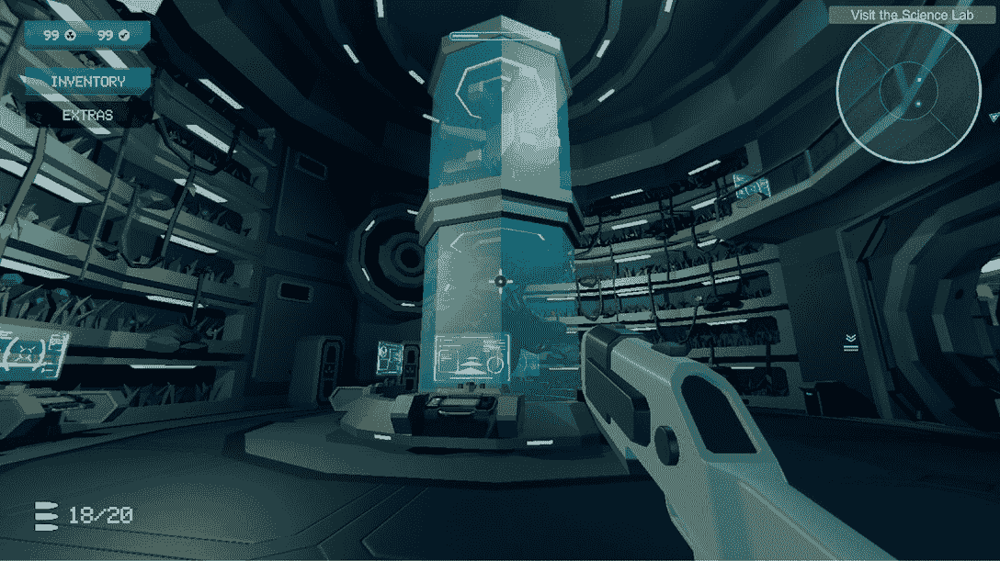
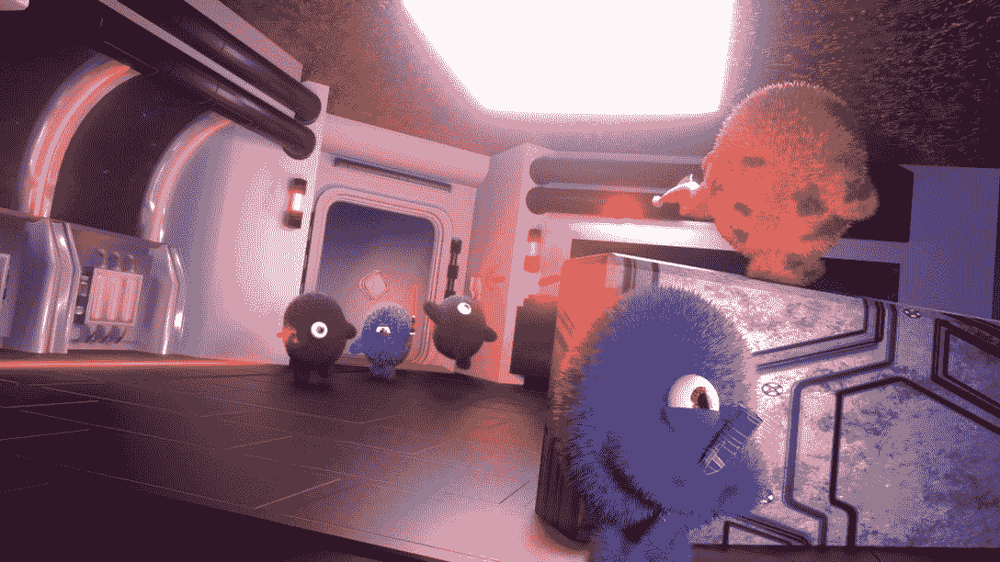
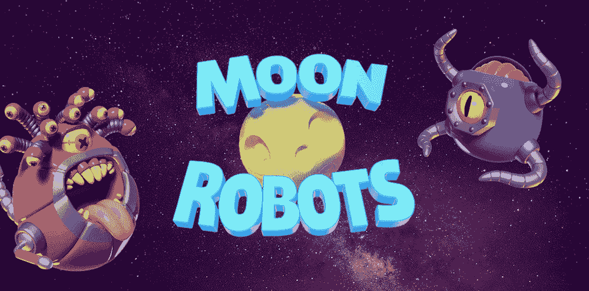
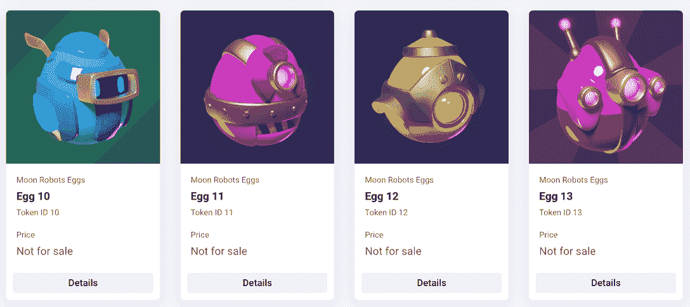
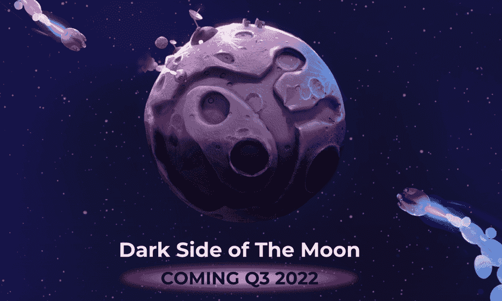

# Harmony 发现趋势游戏用户增加，DeFi Dapps 上升

> 原文：<https://web.archive.org/web/https://dappradar.com/blog/harmony-sees-user-increase-in-trending-games-rising-defi-dapps>

## 月球机器人和宇宙飞船是和谐星球上值得关注的亮点

由于其可访问性和最佳可扩展的 Web3 基础设施，和谐区块链的用户显著增加。特别是，Harmony 上的各种 GameFi 和 DeFi dapps 是该网络用户群的最大贡献者。

**总结；**

*   和声上的 GameFi 和 [DeFi dapps](https://web.archive.org/web/20220929085731/https://dappradar.com/rankings/protocol/harmony/category/defi) 最近呈现出积极的增长趋势。
*   一款名为 ONEverse 的元宇宙游戏，7 天内用户增长了 250%。
*   跨链 NFT 游戏《月球机器人》在 24 小时内用户增长了 10%。
*   在 DeFi 中，OpenSwap 和 T2 的用户在过去的七天里分别增加了 15%和 60%
*   通过 [DappRadar 排名](https://web.archive.org/web/20220929085731/https://dappradar.com/rankings/protocol/harmony)和 [Token Explorer](https://web.archive.org/web/20220929085731/https://dappradar.com/hub/token/eth/ONE/ETH?from=0x68ac1affe00cf64ebc71e7e835a6871a379c5587) 跟上 Harmony 的最新趋势。

博彩业正逐渐成为区块链经济最重要的支柱之一。根据最新的 DappRadar BGA 报告，区块链游戏在 7 月份平均每天产生 967，662 个 UAW，环比增长 8%，同比增长 98%。

放大每一个区块链，我们也注意到他们每个人都有自己独特的定位。

说到和谐，鉴于其持续发展，GameFi 和 T2 DeFi 已经成为区块链生态系统中思想和创新的渠道。诸如月球机器人、ONEverse、OpenSwap、FATExDao 等项目现在极大地影响着 Harmony 的经济和生态系统。

## OneVerse:完全沉浸式的元宇宙和声

[https://web.archive.org/web/20220929085731if_/https://www.youtube.com/embed/Oe3pO2rZrnA?feature=oembed](https://web.archive.org/web/20220929085731if_/https://www.youtube.com/embed/Oe3pO2rZrnA?feature=oembed)

ONEverse 是 Harmony 唯一的 2D、3D 和 VR 元宇宙。它旨在为和谐社区带来一个完全沉浸式的“从游戏到收入”的元宇宙体验。两个令牌和两组 NFT 有助于促进 ONEverse 的生态系统，GRAV 令牌、xGRAV 令牌、Puff NFTs 和 HarMolecule NFTs。

[用户可以使用此链接了解更多关于如何掌握 ONEverse](https://web.archive.org/web/20220929085731/https://oneverse.one/?utm_source=DappRadar&utm_medium=deeplink&utm_campaign=visit-website) 的信息。但首先，我们现在先简单看一下。

ONEverse 的游戏玩法将以一系列任务为特色，包括但不限于银河觅食、探索、反应、资源创造等。前面提到的每一个游戏内资产都是帮助玩家赢得游戏的关键。

接下来，让我们看看 ONEverse 中的 NFTs。下图中这些可爱的毛绒动物是泡芙，是即将到来的第一人称射击游戏中的 NFT 角色。泡芙比射手多得多；用户可以在任务中发送这些 NFT 来挖掘游戏中的令牌，收集稀缺资源来制作珍贵的物品，等等。

ONEverse 的 P2E 机制是精心设计的，允许用户通过各种游戏赢得奖励。例如，用户可以下注极小的 NFT 来赢得 xGRAV 代币，参加锦标赛来赢得 GRAV 代币，等等。点击此链接查看完整版游戏。

值得注意的是，膨化食品和小分子营养食品都已经生产出来了。ONEverse 将很快推出一个市场，供用户交易这些资产。

值得注意的是，在过去的七天里，这款游戏的用户增长了 250%。该团队正在全力以赴地为 ONEverse 带来丰富的游戏性和赚钱机会。[通过 DappRadar 单个 dapp 页面跟踪了解有关 ONEverse](https://web.archive.org/web/20220929085731/https://dappradar.com/harmony/games/oneverse) 的更多信息。

## 月球机器人，一个跨链定义和 NFT 融合

《月球机器人》是一款由 NFT 和德菲合作的跨链战略角色扮演游戏。该游戏于 2022 年在 Q2 和谐区块链推出，并将于第三季度扩展到其他网络。开发团队选择了 Harmony，因为它具有快速、安全和高效的特性，能够提供流畅、可信的用户体验。

你可以在这里了解更多关于如何玩月球机器人的信息。

四个主要部分使月球机器人拥有引人入胜的动态游戏:机器人英雄 NFTs、月球土地 NFTs、物品 NFTs 和石油代币。

机器人 NFT 是月球机器人中重要的游戏内角色，但用户如何获取？首次推出时将提供 10，000 个 Robo Egg NFTs。然后每个蛋都会孵化成一个机器人英雄。由于机器人鸡蛋因其受欢迎程度已经售罄，用户可以从 [NFTKEY Marketplace](https://web.archive.org/web/20220929085731/https://dappradar.com/harmony/marketplaces/nftkey-marketplace) 、 [Metatrone](https://web.archive.org/web/20220929085731/https://dappradar.com/harmony/marketplaces/metatrone-nft-marketplace) 和 [tofuNFT](https://web.archive.org/web/20220929085731/https://dappradar.com/harmony/marketplaces/tofunft) 获得它们。

一旦玩家拥有了他们的机器人和土地，就到了游戏赚钱机制发挥作用的时候了。玩家可以依靠他们的机器人和土地 NFT 来赚取石油代币和物品。此外，他们可以在和谐区块链用石油换任何其他货币。

用户可以通过 [DappRadar 令牌互换](https://web.archive.org/web/20220929085731/https://dappradar.com/hub/token/eth/ONE/ETH?from=0x68ac1affe00cf64ebc71e7e835a6871a379c5587)获得 Harmony 的生态系统令牌 ONE。

值得注意的是，土地销售的另一个阶段即将到来，更多细节，请查看[月球机器人网站](https://web.archive.org/web/20220929085731/https://app.moonrobots.one/lands)。

## Harmony 上的 GameFi 和 DeFi dapps 越来越多，用户越来越多

在撰写本文的最后七天里，OpenSwap 和 [FATExDao](https://web.archive.org/web/20220929085731/https://dappradar.com/harmony/defi/fatexdao) 的独立用户分别增加了 15%和 60%。

这些是用户在评估和谐区块链的状态和前景时应该密切关注的趋势。此外，利用 DappRadar 的以下跟踪工具可以帮助用户实时了解和谐区块链的最新发展。

*   在 Harmony 上流行流行音乐让你发现最流行的流行音乐
*   [使用令牌浏览器跟踪并交换一个令牌](https://web.archive.org/web/20220929085731/https://dappradar.com/hub/token/eth/ONE?from=0x68ac1affe00cf64ebc71e7e835a6871a379c5587)
*   [最新消息](https://web.archive.org/web/20220929085731/https://dappradar.com/blog/tag/harmony)为您带来和谐的最新消息

了解更多关于和谐的信息。

[网站](https://web.archive.org/web/20220929085731/https://www.harmony.one/)

[白皮书](https://web.archive.org/web/20220929085731/https://harmony.one/whitepaper.pdf)

[推特](https://web.archive.org/web/20220929085731/https://twitter.com/harmonyprotocol)

**免责声明** —这是一篇赞助文章。DappRadar 不认可本页面上的任何内容或产品。DappRadar 旨在提供准确的信息，但读者应该在采取行动之前总是自己做研究。DappRadar 的文章不能被认为是投资建议。