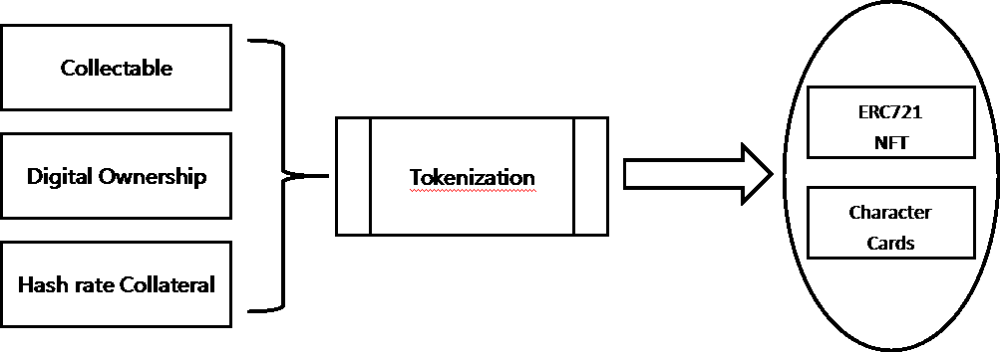
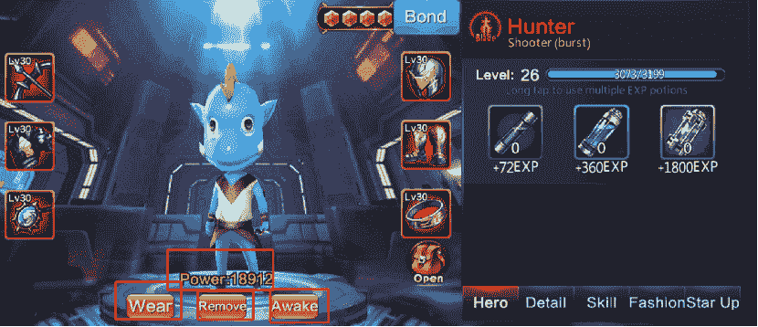
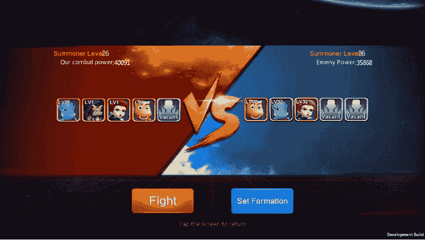
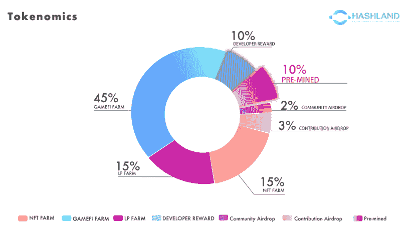

# HashLand NFT 游戏生态系统登陆 BSC

> 原文：<https://web.archive.org/web/https://dappradar.com/blog/hashland-nft-gaming-ecosystem-arrives-on-bsc>

## 第一场哈希战争现在直播！

HashLand 是在币安智能链上运行的一个独特的新平台，玩家可以通过它抵押 NFT。第一个合成资产合成 Hashland 自己的 token mining hash rate，以及一部已经很受欢迎的中国动画片《我是 MT》的知识产权

我是 MT 是一款中国制造的卡通风格的游戏，关于长相独特的牛(牛头人)，这些牛在哈希战争中发挥作用。这个游戏是关于地牢爬行赢得卡，然后使用这些卡来提升英雄。这样他们可以成为更好的战士，进入更深的地牢，杀死更大更强的敌人。

简而言之，玩家被邀请购买合成 NFT，或 S-NFT，它们可能具有更高的现实世界价值，因为它们由一个已经流行的 IP 组成，并与驱动 dapp 的区块链的哈希速率相关联。HC 令牌是 HashLand 生态系统原生的，散列率较高的 NFT 可以赚取更多令牌。

哈什兰 S-NFT 卡有 5 个等级，1 级是最低的，5 级是最高的。只能直接购买 1 级卡。更高级别的卡可以通过升级或者盲盒获得。目前，每张 HashLand S-NFT 卡都将代表《我是 MT》漫画中的一个角色。通常情况下，级别越高的卡牌可以产生更多的 HC 令牌，这些卡牌在 HashLand GameFi 生态系统中也具有更强的角色属性。关于 HashLand 平台如何工作的更详细的描述，你可以[访问他们的官方 gitbook](https://web.archive.org/web/20221206103304/https://land-hash.gitbook.io/hashland/white-paper/hashland-application) 。

[https://web.archive.org/web/20221206103304if_/https://www.youtube.com/embed/_DI7XsTi-NE?feature=oembed](https://web.archive.org/web/20221206103304if_/https://www.youtube.com/embed/_DI7XsTi-NE?feature=oembed)

## 混乱战争

hash war 是 HashLand 生态系统中的第一款游戏，它是一款动作、角色扮演的 3D 游戏，玩家可以拥有自己的游戏资产。玩家可以使用他们可交易的 NFT 卡来体验 PVE 模式、PVP 模式，甚至可以和他们公会中的其他玩家一起打 bosses。

[https://web.archive.org/web/20221206103304if_/https://www.youtube.com/embed/3AObYSFKqZk?feature=oembed](https://web.archive.org/web/20221206103304if_/https://www.youtube.com/embed/3AObYSFKqZk?feature=oembed)

游戏中的英雄都有自己的特殊能力，并以《我是 MT》漫画中的角色为原型。有四类英雄:主坦克、猎人、淑女和黄金。重要的是，不同的游戏模式需要不同的英雄排列。

战斗模式包含九个章节，每个章节有 8 个小级别和 5 个大级别，玩家需要 15 颗星星才能进入下一个章节。对于这种 PVE 游戏模式，HashLand 建议建立一个由黄金，猎人和女士组成的团队，以获得最大的成功。在游戏中需要耐力来获得通过物品和黄金分配的奖励。玩家对玩家模式是玩家可以在赢家通吃的战斗中找到对抗其他用户的快速游戏。

每一次成功的冒险都会提供 HC token 奖励，玩家也会受到激励加入 GameFi 生态系统，有望推动 HashLand 的积极发展。说到令牌分发，10% HC 将作为未来更新的开发者奖励。另外 10%的 HC 将被预先挖掘，以吸引早期投资者和机构投资者。总共 5%的 HC 将作为社区奖励和贡献奖励。

正如您在下图中看到的，共有 55%归社区成员所有。那些提供流动资金、加入 NFT 农场或参与 GameFi 的人可以获得 HC 代币。

可以认为，数字经济的发展已经危及了人们的所有权。人们只是获得了使用他们从互联网上购买的虚拟物品的许可，但他们并没有获得这些物品的任何所有权。

而一些知识产权，如漫威漫画或原创音乐，已经通过 VeVe 等 NFT 平台商业化。哈什兰认为，价格往往会明显偏离其实际价值。通过将 GameFi 元素与来自知识产权的 NFT 相结合，HashLand 的 S-NFT 比单独的收藏品产生了更多的价值。

**免责声明** —这是一篇赞助文章。DappRadar 不认可本页面上的任何内容或产品。DappRadar 旨在提供准确的信息，但读者应该在采取行动之前总是自己做研究。DappRadar 的文章不能被认为是投资建议。

 NewsletterUnsubscribe at any time. [T&Cs](https://web.archive.org/web/20221206103304/https://dappradar.com/terms) and [Privacy Policy](https://web.archive.org/web/20221206103304/https://dappradar.com/privacy-policy)