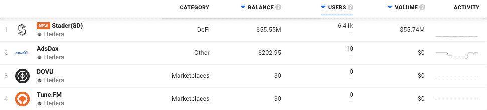
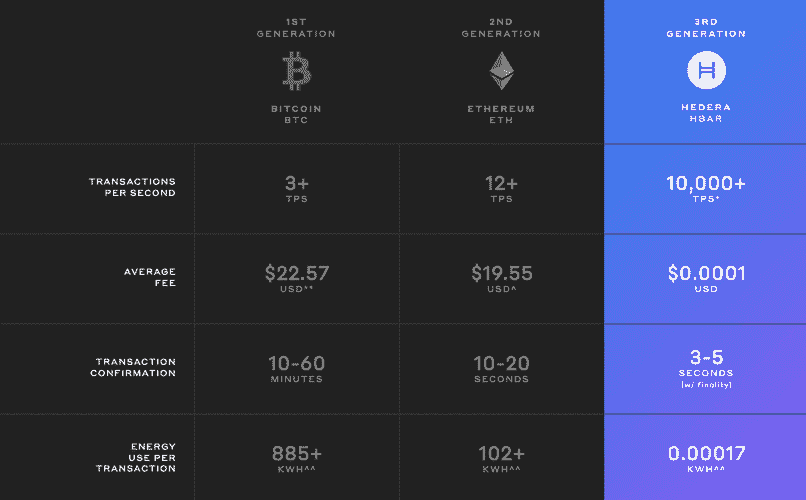

# Hedera Network Dapps 现在位于 DappRadar 上

> 原文：<https://web.archive.org/web/https://dappradar.com/blog/hedera-blockchain-dapps-now-on-dappradar>

## 智能合同，做得更聪明

DappRadar 很高兴宣布 Hedera 网络及其 dapps 生态系统的整合。DappRadar 每月 100 万的网站访问者现在可以通过 Hedera dapp 排名来分析哪些 dapp 吸引了最多的交易量，独特的用户钱包，或者处理了最多的交易。这样，每个人都可以了解哪些 dapps 和令牌在 Hedera 上建立了稳固的社区和价值。

Hedera 不是一个典型的网络，严格来说也不是区块链。最简单的方法是把它想象成一个移动的图形，当更多的交易加入到网络中时，交易的速度就会加快。这项技术帮助 Hedera 网络实现了每秒超过 10 万笔交易，使其成为 Visa 和其他大众市场支付系统的真正竞争对手。Hedera 网络目前每天执行 650 万次交易，平均交易时间为 5 秒。

## Hedera DappRadar 排名

在发布时，DappRadar 将[在 Hedera Network](https://web.archive.org/web/20221128045506/https://dappradar.com/rankings/protocol/hedera)上跟踪几个类别的 4 个 dapp，包括 DeFi 和 Marketplaces，随着生态系统的扩展，未来将会有更多的 dapp。 [Stader 是目前 DeFi 领域的领导者](https://web.archive.org/web/20221128045506/https://dappradar.com/hedera/defi/stader-sd)，它提供一个基于非托管智能合同的标桩平台，帮助用户发现和访问标桩解决方案。 [AdsDax](https://web.archive.org/web/20221128045506/https://dappradar.com/hedera/other/adsdax) 是一个自助式广告平台，让广告主能够创建、交付、验证和优化富媒体移动广告活动。我们鼓励社区在 DappRadar 上查看 Hedera dapp 排名。

## 引擎盖下的海德拉

Hedera 网络由四个主要组件或服务组成，允许价值转移、智能合同的创建和执行、文件传输等。

*   **HBAR** :一种[加密货币](https://web.archive.org/web/20221128045506/https://wp.decrypt.co/?post_type=post&p=5742)，用于在 Hedera 上实现低费用、高度可定制的交易。
*   **智能契约**:用于自动执行逻辑和构建分散应用程序(dapps)
*   **文件服务**:用于冗余、分布式文件存储，具有粒度控制，如添加和删除。
*   **共识服务**:用于在任何需要信任的应用中获得快速、公平和安全的共识。

与以太坊和比特币需要矿工达成共识不同，Hedera 网络上的节点相互对话，并比较网络的交易历史。当节点说话时，他们选择几个关键证人。每个见证都是一个事件或一个事务，它们之所以成为关键，是因为它们在流程的早期就与节点进行了交流。被选择的节点然后比较关于这些著名证人的聊天以达成共识。目标是达到这样一个点，即两个节点可以自信地预测第三个节点的决定或结果，因为它们在多个阶段得出相同的结论。

## 面向开发者的 Hedera

dappRadar 邀请 Dapp 开发者[向 DappRadar](https://web.archive.org/web/20221128045506/https://dappradar.com/submit-dapp) 提交他们的 Dapp，在世界 Dapp 商店上创造更多的可见性。有兴趣了解更多关于 Hedera、其技术栈、[资助](https://web.archive.org/web/20221128045506/https://hedera.com/grants)以及如何开始的开发者可以使用他们的[网站和 Github 资源](https://web.archive.org/web/20221128045506/https://hedera.com/)。

[<picture></picture>](https://web.archive.org/web/20221128045506/https://dappradar.com/rankings/protocol/hedera)[<picture></picture>](https://web.archive.org/web/20221128045506/https://dappradar.com/blog/search/?q=hedera)[<picture></picture>](https://web.archive.org/web/20221128045506/https://dappradar.com/hedera/defi/stader-sd) NewsletterUnsubscribe at any time. [T&Cs](https://web.archive.org/web/20221128045506/https://dappradar.com/terms) and [Privacy Policy](https://web.archive.org/web/20221128045506/https://dappradar.com/privacy-policy)