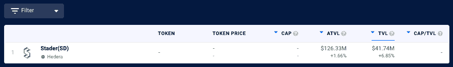
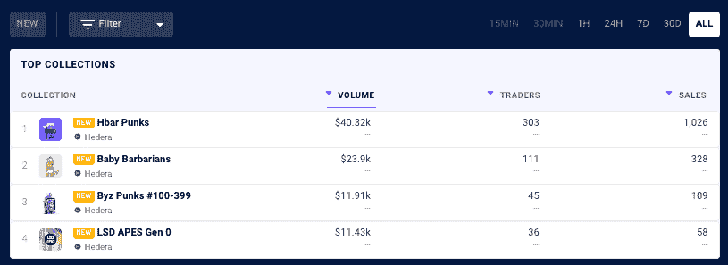
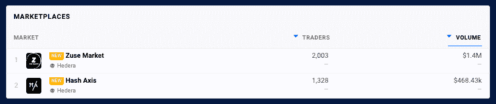
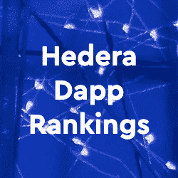
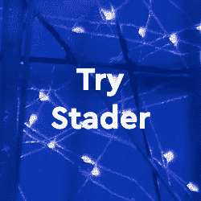

# 海德拉·迪菲·TVL 和 NFT 系列现已登陆达普拉达

> 原文：<https://web.archive.org/web/https://dappradar.com/blog/hedera-defi-tvl-nft-collections-now-on-dappradar>

## 扩展我们的能力，为用户带来更多价值。

**DappRadar 在我们的 NFT 排名页面中增加了对海德拉的 [DeFi dapps 和 NFT 收藏](https://web.archive.org/web/20220813152127/https://dappradar.com/defi/protocol/hedera)的[总价值锁定(TVL)的跟踪功能。这有助于用户更好地了解 Hedera 网络上的 DeFi 景观，并让他们深入了解 Hedera 上最热门的 NFT 系列的表现。](https://web.archive.org/web/20220813152127/https://dappradar.com/nft/protocol/hedera)**

[Hedera 不是一个典型的网络](/web/20220813152127/https://dappradar.com/blog/hedera-blockchain-dapps-now-on-dappradar/)，从技术上来说，它也不是一个区块链。最简单的方法是把它想象成一个移动的图形，当更多的交易加入到网络中时，交易的速度就会加快。

这项技术帮助 Hedera 实现了每秒超过 10 万笔交易，使其成为 Visa 和其他大众市场支付系统的真正竞争对手。Hedera 网络目前每天执行 650 万次交易，平均交易时间为 5 秒。

Hedera dapps 与更广泛的 DappRadar 生态系统的进一步融合将 T2 DeFi dapps 和 T4 NFT 系列置于聚光灯下。现在用户可以通过十三个区块链分析 TVL，包括海德拉、以太坊、多边形和 BNB 链。与此同时，NFT 的崇拜者可以使用达普拉达 NFT 排行榜来追踪海德拉上最受欢迎的 NFT 时装系列的表现。

## 达普拉达河上的黑德拉·迪菲·TVL

锁定总价值或 TVL 指的是锁定在网络上 DeFi dapps 智能合同中的资产的美元价值。这是一个广泛使用的指标，用来表示 DeFi 空间随时间的增长。

DappRadar 目前[在](https://web.archive.org/web/20220813152127/https://dappradar.com/defi/protocol/moonriver) Hedera 上追踪一个 dapp 为客户[提供分散金融](https://web.archive.org/web/20220813152127/https://dappradar.com/blog/what-is-defi-or-decentralized-finance/) (DeFi)服务。TVL 反映了有多少价值被注入 DeFi dapps，也可以表明他们的受欢迎程度和整体吸引力。在 DeFi 排名中，用户现在可以分析 TVL 和本地令牌，并更详细地探索和分析 Hedera DeFi。

*Source:* [*DappRadar*](https://web.archive.org/web/20220813152127/https://dappradar.com/defi/protocol/hedera)

## 达普拉达上的海德拉·NFT 收藏

黑德拉上的 [NFT 生态系统开始成熟，并显示出一个稳固社区的迹象。作为](https://web.archive.org/web/20220813152127/https://dappradar.com/nft/protocol/hedera)[全球 dapp 商店](/web/20220813152127/https://dappradar.com/blog/dappradar-how-two-young-entrepreneurs-created-the-worlds-dapp-store/)，DappRadar 向用户传达最热门资产类别的最新趋势是至关重要的。DappRadar 目前在 Hedera 上追踪[的四个 NFT 集合](https://web.archive.org/web/20220813152127/https://dappradar.com/nft/collections/protocol/hedera)和[两个 NFT 市场。](https://web.archive.org/web/20220813152127/https://dappradar.com/nft/marketplaces/protocol/hedera)

它的主要市场被称为 [Zuse Market](https://web.archive.org/web/20220813152127/https://dappradar.com/nft/marketplaces/protocol/hedera) ，已经积累了超过 140 万美元的历史销售额，而 [Hash Axis](https://web.archive.org/web/20220813152127/https://dappradar.com/nft/marketplaces/protocol/hedera) 正在迅速取得进展。用户现在可以更详细地分析 NFT 收藏，并使用过滤器来查看网络上的顶级 NFT 销售以及他们可以交易的市场。

*Source:* [*DappRadar*](https://web.archive.org/web/20220813152127/https://dappradar.com/defi/protocol/hedera)

*Source:* [*DappRadar*](https://web.archive.org/web/20220813152127/https://dappradar.com/defi/protocol/hedera)

## 扩展能力

在过去的 24 个月里，DappRadar 已经极大地扩展了它的跟踪能力，从一个跟踪少数网络及其 Dapp 的网站到[世界的 Dapp 商店。我们向世界介绍了我们的](https://web.archive.org/web/20220813152127/https://dappradar.com/rankings)[雷达令牌](https://web.archive.org/web/20220813152127/https://dappradar.com/token/overview)，一个具有扩展功能的[投资组合管理器](https://web.archive.org/web/20220813152127/https://dappradar.com/hub/wallet/)， [NFT 探索者和价值评估者](https://web.archive.org/web/20220813152127/https://dappradar.com/hub/nft-explorer)，令牌交换和探索者，以及深入的 NFT、DeFi 和 TVL 跟踪。

此外，DappRadar 还提供行业领先的评估工具和报告，帮助[进一步指导社区](https://web.archive.org/web/20220813152127/https://dappradar.com/token/governance)。随着我们继续建设未来的 dapp 商店，我们邀请社区参与、贡献并与我们一起建设[it](https://web.archive.org/web/20220813152127/https://dappradar.com/token/governance)。

[<picture></picture>](https://web.archive.org/web/20220813152127/https://dappradar.com/rankings/protocol/hedera)[<picture></picture>](https://web.archive.org/web/20220813152127/https://dappradar.com/blog/search/?q=hedera)[<picture></picture>](https://web.archive.org/web/20220813152127/https://dappradar.com/hedera/defi/stader-sd)

## 面向 dapp 开发者的 Hedera

dappRadar 邀请 Dapp 开发者[向 DappRadar](https://web.archive.org/web/20220813152127/https://dappradar.com/submit-dapp) 提交他们的 Dapp，在世界 Dapp 商店上创造更多的可见性。有兴趣了解更多关于 Hedera、其技术栈、[资助](https://web.archive.org/web/20220813152127/https://hedera.com/grants)以及如何开始的开发者可以使用他们的[网站和 Github 资源](https://web.archive.org/web/20220813152127/https://hedera.com/)。

 NewsletterUnsubscribe at any time. [T&Cs](https://web.archive.org/web/20220813152127/https://dappradar.com/terms) and [Privacy Policy](https://web.archive.org/web/20220813152127/https://dappradar.com/privacy-policy)