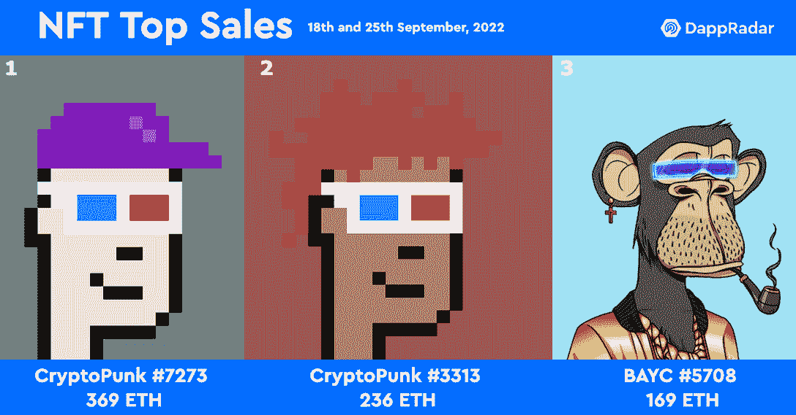
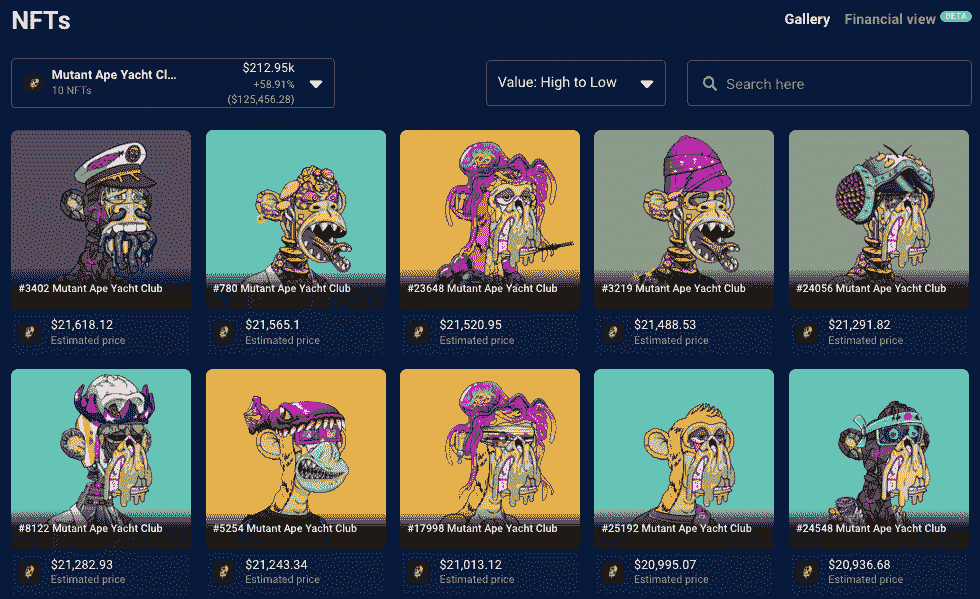
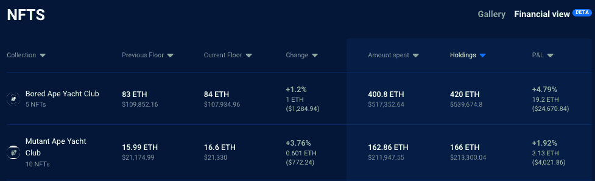
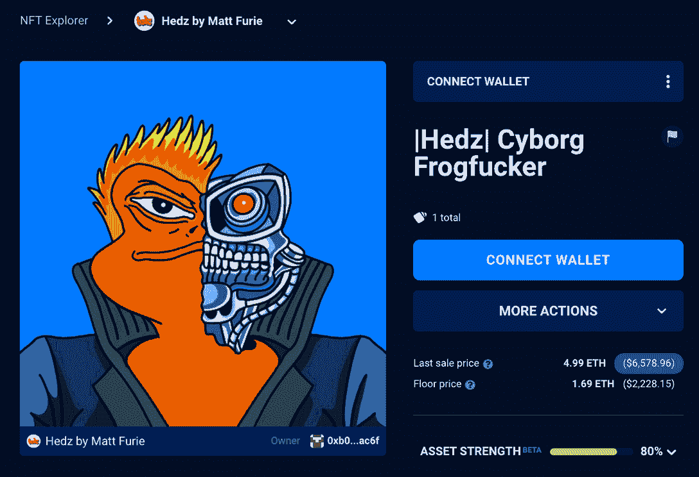
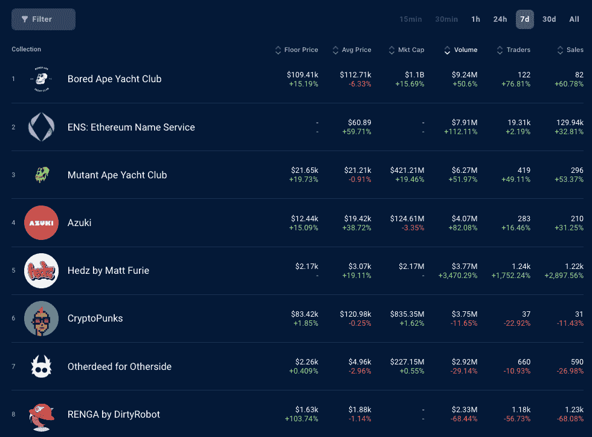
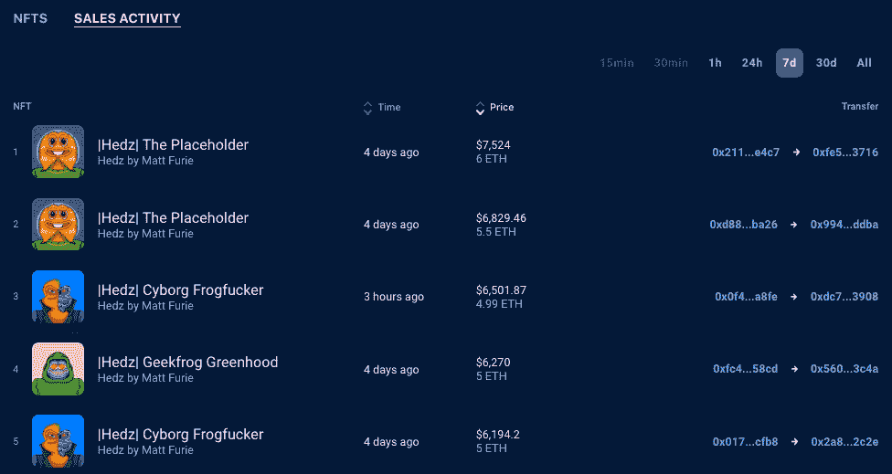
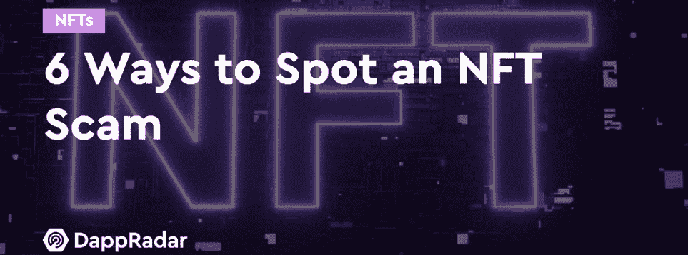

# Hedz NFTs 销量超过 crypto punks——NFT 销售亮点

> 原文：<https://web.archive.org/web/https://dappradar.com/blog/hedz-nfts-outsell-cryptopunks-nft-sales-highlights>

## 查看 2022 年 9 月 18 日至 25 日期间的 NFT 销售亮点排名

青蛙佩佩的原创者名为 Hedz 的新 NFT 集合“感觉好人”的 meme 在过去七天里产生了比 CryptoPunks 更多的交易量。这使得新推出的 Hedz NFT 的平均价格从 1.8 ETH 增加到 2.4 ETH。

每周，DappRadar 不仅会重点报道 NFT 最贵的[商品](https://web.archive.org/web/20221130144836/https://dappradar.com/nft/sales)，还会报道过去七天中最有趣的商品。虽然大数字肯定会成为头条新闻，但让[突出新兴趋势](https://web.archive.org/web/20221130144836/https://dappradar.com/nft/sales)并让 DappRadar 社区保持领先也是至关重要的。

在过去的七天里，最高价值的 NFT 拍卖会是为 369 ETH 的 [CryptoPunk #7273 拍的，将近 50 万美元。第二名也属于另一个朋克，](https://web.archive.org/web/20221130144836/https://dappradar.com/hub/assets/eth/0xb47e3cd837ddf8e4c57f05d70ab865de6e193bbb/7273) [CryptoPunk #3313，为 236 ETH](https://web.archive.org/web/20221130144836/https://dappradar.com/hub/assets/eth/0xb47e3cd837ddf8e4c57f05d70ab865de6e193bbb/3313) ，约合 30.5 万美元。有趣的是，每个朋克都是由不同的买家购买的，但这两个朋克都有 3D 眼镜元数据。

第三高的销售额属于 5708 号 Bored Ape 游艇俱乐部，该俱乐部以 169 ETH 的价格易手，约合 21.8 万美元。我们再次看到这个 NFT 正在展示全息眼睛元数据。这些买家是否知道一些我们不知道的关于这些[蓝筹 NFT](https://web.archive.org/web/20221130144836/https://dappradar.com/blog/what-are-blue-chip-nft-collections)有能力观看 3D 世界的相关信息？

CryptoPunks 和 Bored Ape Yacht Club [NFT 销售额占据](https://web.archive.org/web/20221130144836/https://dappradar.com/nft/sales)周最高销售额排行榜。然而，其他 NFT 离群值不断易手的实质性价值，而其他收集推出立即感兴趣。

## 随身携带您的 Web3 之旅

使用 DappRadar 移动应用程序，再也不会错过 Web3。查看最受欢迎的 dapps 的性能，并关注您投资组合中的 NFT。您在 DappRadar 上的帐户会与我们的移动应用程序同步，这样您很快就可以选择实时接收提醒。

[Download the DappRadar app now](https://web.archive.org/web/20221130144836/https://dappradar.app.link/blog)[<picture></picture>](https://web.archive.org/web/20221130144836/https://play.google.com/store/apps/details?id=com.portfolio.dappradar)

## 查看 NFT 销售亮点列表

*注意:出售时给出的美元价值是正确的*

*   [chrome Squiggle # 8805](https://web.archive.org/web/20221130144836/https://dappradar.com/hub/assets/eth/0x059edd72cd353df5106d2b9cc5ab83a52287ac3a/8805)–124.82 ETH/$ 161，647.81——[买家钱包](https://web.archive.org/web/20221130144836/https://dappradar.com/hub/wallet/eth/0xd4100a2e1aacdeb18bcda92a280124a7111a12b6)
*   [志那都红豆# 4978](https://web.archive.org/web/20221130144836/https://dappradar.com/hub/assets/eth/0xed5af388653567af2f388e6224dc7c4b3241c544/4978)–105 ETH/$ 135，971.85—[买家钱包](https://web.archive.org/web/20221130144836/https://dappradar.com/hub/wallet/eth/0xff3879b8a363aed92a6eaba8f61f1a96a9ec3c1e)
*   [fiden za # 196](https://web.archive.org/web/20221130144836/https://dappradar.com/hub/assets/eth/0xa7d8d9ef8d8ce8992df33d8b8cf4aebabd5bd270/78000196)–104.75 ETH/$ 135，648.1—[买家钱包](https://web.archive.org/web/20221130144836/https://dappradar.com/hub/wallet/eth/0x80845058350b8c3df5c3015d8a717d64b3bf9267)
*   [patriots . ETH](https://web.archive.org/web/20221130144836/https://dappradar.com/hub/assets/eth/0x57f1887a8bf19b14fc0df6fd9b2acc9af147ea85/50498912600741566210312124459976227565225630974152908889692350144986238087394)–75 ETH/$ 97122.75—[买家钱包](https://web.archive.org/web/20221130144836/https://dappradar.com/hub/wallet/eth/0x6942049509693fbb63d7f1395dae5cfe1ccec1ba)
*   [other side # 68305](https://web.archive.org/web/20221130144836/https://dappradar.com/hub/assets/eth/0x34d85c9cdeb23fa97cb08333b511ac86e1c4e258/68305)–68.17 ETH/$ 88280.59—[买家钱包](https://web.archive.org/web/20221130144836/https://dappradar.com/hub/wallet/eth/0x720a4fab08cb746fc90e88d1924a98104c0822cf)
*   [Doodle # 3526](https://web.archive.org/web/20221130144836/https://dappradar.com/hub/assets/eth/0x8a90cab2b38dba80c64b7734e58ee1db38b8992e/3526)–46.5 ETH/$ 60216.1—[买家钱包](https://web.archive.org/web/20221130144836/https://dappradar.com/hub/wallet/eth/0xf9c461556f54be8da0855cb0a0373e9e80d5c0b7)
*   [CloneX # 3114](https://web.archive.org/web/20221130144836/https://dappradar.com/hub/assets/eth/0x49cf6f5d44e70224e2e23fdcdd2c053f30ada28b/6560)–39 ETH/$ 50503.83—[买家钱包](https://web.archive.org/web/20221130144836/https://dappradar.com/hub/wallet/eth/0xae97c913e983215c9f14c5813b8db7c4c7e73801)
*   [变种人猿游艇俱乐部# 3278](https://web.archive.org/web/20221130144836/https://dappradar.com/hub/assets/eth/0x60e4d786628fea6478f785a6d7e704777c86a7c6/3278)–31.59 ETH/$ 40885.04—[买家钱包](https://web.archive.org/web/20221130144836/https://dappradar.com/hub/wallet/eth/0xf6f62bab35907565c5ad3d4c1093b7f90762c021)
*   [Ghxst 079](https://web.archive.org/web/20221130144836/https://dappradar.com/hub/assets/eth/0xcbd38d10511f0274e040085c0bc1f85cc96fff82/79)–28.13 ETH/$ 36418.15—[买家钱包](https://web.archive.org/web/20221130144836/https://dappradar.com/hub/wallet/eth/0x59265c2f1e8cfc6ce4d918da3df3f160d75568ea)
*   [分散铂金商场](https://web.archive.org/web/20221130144836/https://dappradar.com/hub/assets/eth/0x959e104e1a4db6317fa58f8295f586e1a978c297/4857)–21.46 ETH/$ 27，781.01—[买家钱包](https://web.archive.org/web/20221130144836/https://dappradar.com/hub/wallet/eth/0xb7e8d69a8f80052080ff780a25daa2d03318cd49)

## BAYC 购物狂欢

本周末，[BAYC 家族](https://web.archive.org/web/20221130144836/https://dappradar.com/hub/wallet/eth/0x7e9f74ecfa5054b8672db762a2cb977379f33628)的一名成员进行了一次大采购，购买了 [10 只变异猿](https://web.archive.org/web/20221130144836/https://dappradar.com/hub/wallet/eth/0x7e9f74ecfa5054b8672db762a2cb977379f33628/nfts/1/mutant-ape-yacht-club)和[两只无聊猿游艇俱乐部 NFTs](https://web.archive.org/web/20221130144836/https://dappradar.com/hub/assets/eth/0xbc4ca0eda7647a8ab7c2061c2e118a18a936f13d/4352) 。买家花了大约 330 ETH，或大约 430，000 美元。最昂贵的购买是 83.5 ETH 的 BAYC #4352，大约 107000 美元。这些购买，加上已经膨胀的 NFT 收藏，使这个钱包的价值膨胀到大约 108 万美元。

[<picture></picture>](https://web.archive.org/web/20221130144836/https://dappradar.com/hub/nft-explorer)

使用 [DappRadar 投资组合跟踪器 NFT 金融视图](https://web.archive.org/web/20221130144836/https://dappradar.com/hub/wallet/eth/0x7e9f74ecfa5054b8672db762a2cb977379f33628/nfts-financial)，我们可以看到他们已经在最近的购买中产生了利润。过去几天 MAYC NFTs 的[价值变化意味着买家已经有 1.92%的利润，或者如果他们选择出售，大约 4000 美元。](https://web.archive.org/web/20221130144836/https://dappradar.com/hub/nft-explorer/collection/mutant-ape-yacht-club)

而 5 件 BAYC NFT 的[系列的价值增加了 19.2 ETH，将这款钱包的 BAYC NFT 系列的总价值推高了 24，000 多美元。](https://web.archive.org/web/20221130144836/https://dappradar.com/hub/wallet/eth/0x7e9f74ecfa5054b8672db762a2cb977379f33628/nfts-financial)

[<picture></picture>](https://web.archive.org/web/20221130144836/https://dappradar.com/hub/nft-explorer)

虽然这位投资者非常相信亲民党头像 NFT 收藏的未来及其效用，但该行业正开始转向它们。最近的一篇《硬币电讯报》文章称，无聊的猿类是一种贬低，会分散人们对 NFT 服务的各种重要技术目的的注意力。这个买家一定没有[拿到备忘录](https://web.archive.org/web/20221130144836/https://cointelegraph.com/news/enough-of-the-bored-apes-they-re-bad-for-nfts)。

## 赫茨

尽管相对于去年的高点，NFT 的价格和新系列的推出有所降温，一些 T2 的新 NFT 系列还是大受欢迎。[艺术家 Matt Furie](https://web.archive.org/web/20221130144836/https://dappradar.com/hub/nft-explorer/collection/hedz-by-matt-furie) 的 Hedz 是引起社区关注的一个系列，如果仅仅是因为 Matt Furie 作为青蛙佩佩迷因的原始插图画家的激动人心的背景故事。有一点是肯定的，在所有这些行动之后，马特终于可以说“感觉很好，伙计。”

[https://web.archive.org/web/20221130144836if_/https://www.youtube.com/embed/5WHZM-gDONo?feature=oembed](https://web.archive.org/web/20221130144836if_/https://www.youtube.com/embed/5WHZM-gDONo?feature=oembed)

简而言之，马特用他的口号“感觉很好的人”创造了最初的青蛙佩佩形象，在真正的互联网风格中，它有了自己的生命。通过各种政治和其他团体，可以说马特失去了对佩佩的所有控制。更糟糕的是，马特从未因其举世闻名的创作获得任何经济报酬。

Hedz 系列可以被看作是 Matt Furie 的报应，整个社区都支持他。在过去的七天里， [Hedz 成为 DappRadar 上交易量第五大的 NFT 藏品](https://web.archive.org/web/20221130144836/https://dappradar.com/hub/nft-explorer)，产生了超过[370 万美元的交易量](https://web.archive.org/web/20221130144836/https://dappradar.com/hub/nft-explorer)。

[<picture></picture>](https://web.archive.org/web/20221130144836/https://dappradar.com/hub/nft-explorer)

有趣的是，Hedz 的底价约为 2000 美元，但 NFT 的成交价接近 3000 美元。Hedz 在过去七天的交易量超过了艺术家 Dirty Robot 的另一个名为 [Renga 的新系列，也超过了](/web/20221130144836/https://dappradar.com/blog/new-nft-collections-hedz-and-renga-enter-top-charts-this-week/)[crypto 朋克](/web/20221130144836/https://dappradar.com/blog/what-are-blue-chip-nft-collections/)和其他 deeds。

[<picture></picture>](https://web.archive.org/web/20221130144836/https://dappradar.com/hub/nft-explorer)

一些买家已经展示了他们的 Hedz 作品，而其他人则没有展示。插图的基调是熟悉的马特 Furie 的签名风格遍布 NFTs。该系列于上周推出，前七天的最高销售额是未披露的 Hedz 的[，自造币厂以来](https://web.archive.org/web/20221130144836/https://dappradar.com/hub/assets/eth/0xefed2a58cc6a5b81f9158b231847f005cf086c01/704)[已经转手两次](https://web.archive.org/web/20221130144836/https://dappradar.com/hub/assets/eth/0xefed2a58cc6a5b81f9158b231847f005cf086c01/704),[的售价为 6 ETH，或四天前](https://web.archive.org/web/20221130144836/https://dappradar.com/hub/assets/eth/0xefed2a58cc6a5b81f9158b231847f005cf086c01/704)的约 7500 美元。

[<picture></picture>](https://web.archive.org/web/20221130144836/https://dappradar.com/hub/nft-explorer)

## 秘密艺术鉴赏家

今年的一个趋势是生成性加密艺术交易的增加，特别是通过艺术块策划平台。精品艺术品一直被认为是抵御全球通胀和经济动荡的安全赌注；现在，看起来隐密艺术在隐密宇宙中有了相似的目的。

在过去的一周里，通过艺术街区进行了 1052 次秘密艺术销售，最贵的是 104.75 ETH 的 [Fidenza #196，在销售时大约为 13.5 万美元。最有趣的是](https://web.archive.org/web/20221130144836/https://dappradar.com/hub/assets/eth/0xa7d8d9ef8d8ce8992df33d8b8cf4aebabd5bd270/78000196)[这个钱包最近也在疯狂购物](https://web.archive.org/web/20221130144836/https://dappradar.com/hub/wallet/eth/0x80845058350b8c3df5c3015d8a717d64b3bf9267)。本周十大艺术品拍卖中的七件[落在了这个钱包](https://web.archive.org/web/20221130144836/https://dappradar.com/hub/nft-explorer/collection/art-blocks-curated/sales-activity?period=week&order-by=priceInFiat)中[，总价值超过 90 万美元。当我们看到这个钱包在所有非功能性金融交易和代币中的总价值接近 2900 万美元时，就不足为奇了。](https://web.archive.org/web/20221130144836/https://dappradar.com/hub/wallet/eth/0x80845058350b8c3df5c3015d8a717d64b3bf9267/nfts/1/art-blocks-curated)

[<picture></picture>](https://web.archive.org/web/20221130144836/https://dappradar.com/hub/nft-explorer)

## 骗局预警！

每周扫描 NFT 的顶级销售时，我们都会发现一些看起来不合适或者完全错误的结果。本周，几个 ENS 域名已经易手数次，看起来持有人试图抬高他们域名的价值。7055.eth 和 [435453.eth](https://web.archive.org/web/20221130144836/https://dappradar.com/hub/assets/eth/0x57f1887a8bf19b14fc0df6fd9b2acc9af147ea85/42153572551036205851044448800424371228136643388737255737477770644732124423133) 显示出可疑交易活动的迹象。

查看 7055.eth 的[交易历史和元数据可以看出，这个域名最初注册于 2022 年 4 月。ENS 域名开始在几个钱包之间交易，将](https://web.archive.org/web/20221130144836/https://dappradar.com/hub/assets/eth/0x57f1887a8bf19b14fc0df6fd9b2acc9af147ea85/110715061140428961420186765642187791424560268085393978504072574013791734540618)[的价值推至 38 ETH](https://web.archive.org/web/20221130144836/https://dappradar.com/hub/assets/eth/0x57f1887a8bf19b14fc0df6fd9b2acc9af147ea85/110715061140428961420186765642187791424560268085393978504072574013791734540618) 左右。435453.eth 最初注册于 2022 年 9 月 18 日，显示在过去几周发生了更多交易，试图抬高这个 [6 位数域名](https://web.archive.org/web/20221130144836/https://dappradar.com/hub/assets/eth/0x57f1887a8bf19b14fc0df6fd9b2acc9af147ea85/42153572551036205851044448800424371228136643388737255737477770644732124423133)的价值。

我们强调这种交易活动是为了让 DappRadar 社区意识到并警惕购买这种 NFT。点击这里查看我们的完整指南，获得更深入的指导，以避免在购买或交易 NFT 时被骗。

[<picture></picture>](https://web.archive.org/web/20221130144836/https://dappradar.com/blog/how-to-spot-an-nft-scam)

***以上不构成投资建议。此处给出的信息仅供参考。请行使尽职调查，做你的研究。作者持有多种加密货币的头寸，包括 BTC、瑞士法郎和雷达。***

 NewsletterUnsubscribe at any time. [T&Cs](https://web.archive.org/web/20221130144836/https://dappradar.com/terms) and [Privacy Policy](https://web.archive.org/web/20221130144836/https://dappradar.com/privacy-policy)