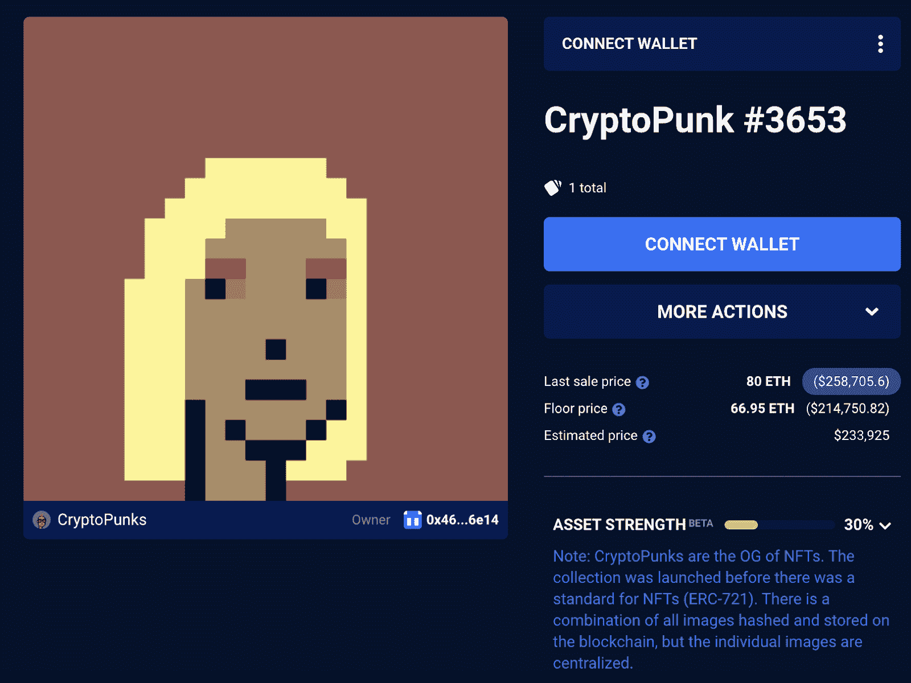

# 海蒂·克鲁姆买下了重身幽灵

> 原文：<https://web.archive.org/web/https://dappradar.com/blog/heidi-klum-buys-cryptopunk-doppelganger>

## 该模型还拥有一个 ENS 域名

海蒂·克鲁姆通过购买她的密码朋克二重身加入了 NFT 空间。这位模特以 80 ETH 的价格购买了朋克#3653，约合 26 万美元。通过这次收购，海蒂·克鲁姆加入了一长串已经进入 NFTs 的名人的行列。

CryptoPunk #3653 有相当长的交易历史，七次易主。然而，这可能是第一次主人和 NFT 有如此惊人的相似之处。海蒂·克鲁姆是全球最受认可的模特之一。她对 CryptoPunks 项目的支持很可能会对该系列的活动产生积极影响。

除了购买二重身，海蒂·克鲁姆还拥有 heidiklumofficial . eth ENS 域名。这是一个很好的迹象，表明该模型将继续参与加密世界。特别是 NFT 空间。

我们不知道任何关于克拉姆进入 NFT 空间的动机的细节。然而，最近她和说唱歌手 Snoop Dogg 一起制作了歌曲 Chai Tea。这位美国说唱歌手是 NFT 空间中最多产的名人之一。他正在[收集昂贵的 NFT](https://web.archive.org/web/20220929104102/https://dappradar.com/hub/wallet/eth/0xce90a7949bb78892f159f428d0dc23a8e3584d75/nfts/1)，推出自己的音乐 NFT，并在元宇宙建设[。](https://web.archive.org/web/20220929104102/https://dappradar.com/blog/snoop-dogg-moves-into-the-sandbox)

## 海蒂·克鲁姆押注于 V2 的密码朋克

海蒂·克鲁姆的名人代言的 V2 系列出现在一个重要的时刻。在过去的几周里，随着 crypto punk V1 收藏的复活，crypto punk 和幼虫实验室一直处于 NFT 新闻的最前沿。

幼虫实验室正在对 V1 的 CryptoPunks 社区和收藏采取法律行动，然而，这个复活的项目已经吸引了很多关注。即便如此，看起来名人更愿意押注于广受好评的加密朋克 V2 收藏。

海蒂·克鲁姆不是唯一购买朋克的贵宾。虽然许多好莱坞最伟大的人选择用无聊的猿类在 NFT 首次亮相，但朋克是名人钱包中购买最多的化身。像[史努比·道格](https://web.archive.org/web/20220929104102/https://dappradar.com/hub/wallet/eth/0xce90a7949bb78892f159f428d0dc23a8e3584d75/nfts/1)、[杰伊·Z](https://web.archive.org/web/20220929104102/https://dappradar.com/hub/wallet/eth/0x3b417faee9d2ff636701100891dc2755b5321cc3)和[瑟琳娜·威廉姆斯](https://web.archive.org/web/20220929104102/https://dappradar.com/blog/static/8fe8bd36f5e274de8e7e8a1a3021c84a/7bf44/dappradar.com-celebrity-wallets-a-dive-into-crypto-hollywood-serena-williams.webp)这样的大牌都把他们的赌注押在了 CryptoPunks 收藏上，作为进入 NFT 空间的切入点。

如果你对探索更多的名人投资组合感到好奇，你可以在 [DappRadar 名人钱包](https://web.archive.org/web/20220929104102/https://dappradar.com/blog/celebrity-wallets-a-dive-into-crypto-hollywood)页面查看验证地址列表。此外，你可以在[的 Twitter](https://web.archive.org/web/20220929104102/https://twitter.com/dappradar) 上关注 DappRadar，了解最新的 NFT 名人报道和新闻。

 NewsletterUnsubscribe at any time. [T&Cs](https://web.archive.org/web/20220929104102/https://dappradar.com/terms) and [Privacy Policy](https://web.archive.org/web/20220929104102/https://dappradar.com/privacy-policy)