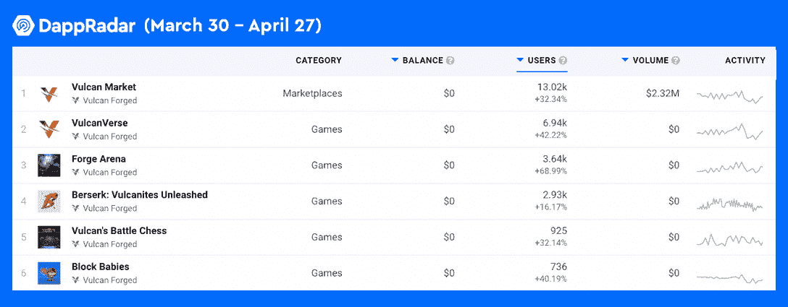
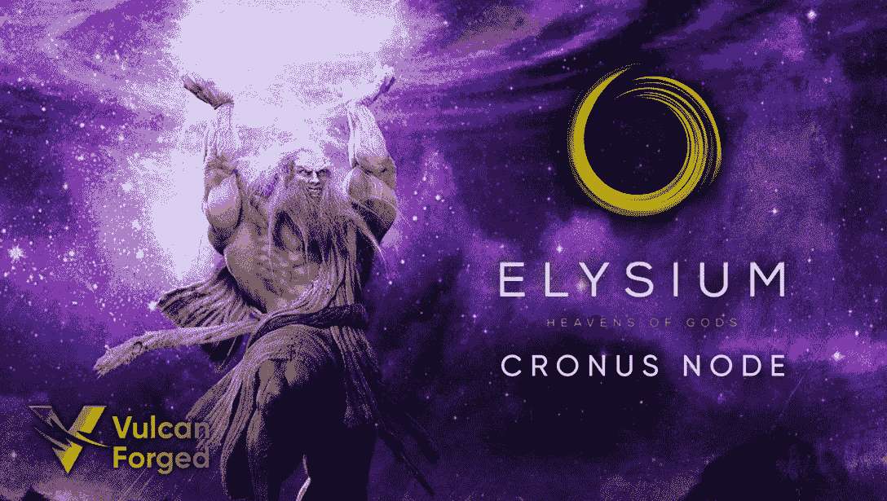
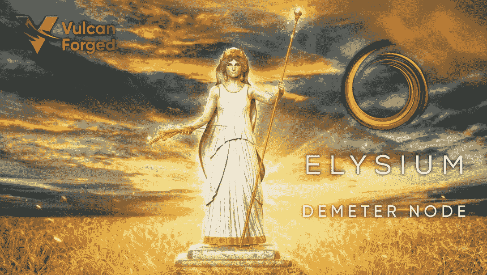
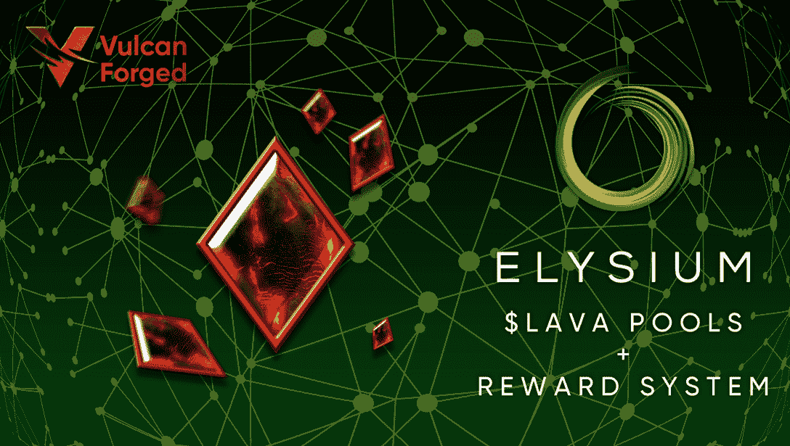

# 持有 PYR 通过极乐世界节点系统领取奖励

> 原文：<https://web.archive.org/web/https://dappradar.com/blog/hold-pyr-to-receive-rewards-through-elysium-node-system>

## 节点将获得一定比例的市场费用(版税)和熔岩令牌(交易费)

**极乐世界是由瓦肯锻造的 100%碳中性区块链。它努力为 NFTs、游戏和元宇宙项目提供一个动态的区块链生态系统。为了实现这个目标，火神锻造公司做出了巨大的努力，包括启动极乐世界节点计划。该计划将允许生态系统中的不同利益相关者和贡献者以各种方式获得奖励。**

**概要:**

*   **顶尖高手** [**火神锻造的**](https://web.archive.org/web/20220813153406/https://dappradar.com/rankings/protocol/vulcanforged) **已经蓄势待发。**
*   极乐世界节点计划包括三种类型的节点，克洛诺斯、得墨忒耳和提丰，提供不同的奖励。
*   奖励来自使用极乐世界区块链产生的交易费，来自 NFT 市场的费用，以及收取的熔岩播种费。
*   神、火神和宝石 NFT 可以提升用户的奖励。

区块链游戏通过让玩家拥有自己的数字资产并获得金钱奖励，正在改变游戏行业。这种革命性的创新导致玩家涌向链上游戏，进一步吸引了资本的关注。值得注意的是，根据 DappRadar 的 Q1 区块链游戏报告，投资者在 2022 年 Q1 区块链游戏中投入了 25 亿美元。

同一份报告还显示，仅在 3 月份，区块链游戏就注册了 122 万个独立活动钱包。此外，与 Q1 2021 相比，区块链奥运会的使用率增长了 2000%。惊人的数字也表明，这个行业的竞争已经白热化，令人兴奋的项目层出不穷。其中，由 Vulcan Forged 设计的 Elysium 区块链以碳中和、以游戏为中心和社区驱动的方式为特色，是 NFT 和游戏项目蓬勃发展的坚如磐石的区块链解决方案。

下图显示，在过去的 30 天里，火神锻造生态系统中的顶级 dapps 的受欢迎程度有所增加，其中[火神宇宙](https://web.archive.org/web/20220813153406/https://dappradar.com/vulcanforged/games/vulcanverse)的用户数量增加了 42%，[锻造竞技场](https://web.archive.org/web/20220813153406/https://dappradar.com/vulcanforged/games/forge-arena)增加了 69%，[狂暴](https://web.archive.org/web/20220813153406/https://dappradar.com/vulcanforged/games/berserk-vulcanites-unleashed)增加了 16%。

最近，瓦肯锻造公司推出了极乐世界节点计划，这是一个全面的奖励系统，将使瓦肯锻造公司生态系统中的不同利益相关者受益。本文将解释不同类型的极乐世界节点及其相应的好处，以及如何参与。

## 克洛诺斯节点

极乐世界是一个权威证明区块链，由 51 个权威节点组成，即克洛诺斯节点。它们充当极乐世界区块链验证器，帮助处理和验证事务块。克洛诺斯节点要求所有者是已知的实体，如合作伙伴、游戏开发者、火神哲学家、受人尊敬的社区贡献者、风险投资家等。

克洛诺斯节点是一个物理节点，极乐世界将为租用虚拟专用服务器的地点提供建议。值得注意的是，极乐世界是一个绿色区块链。因此，它将只使用碳中和数据中心和服务器来托管硬件。

### 运行克洛诺斯节点的要求

克洛诺斯节点对极乐世界网络至关重要。因此，只有经过验证的实体才能运行一个，他们应该积极地为极乐世界的未来做出贡献。值得一提的是，最多将有 51 个克洛诺斯节点。实体需要满足以下要求才能运行克洛诺斯节点:

*   需要完整的 KYC。
*   瓦肯锻造和极乐世界合规团队将在批准前验证该实体。
*   节点硬件托管应使用 100%碳中和解决方案。
*   所有者必须在节点的钱包地址中投入至少 50，000 [PYR](https://web.archive.org/web/20220813153406/https://dappradar.com/hub/token/eth/PYR/ETH?from=0x430ef9263e76dae63c84292c3409d61c598e9682) 。如果所有者移动或花费 PYR，导致总额低于此阈值，所有者将被取消资格，并由等候名单上的另一个候选人取代。

Elysium 将考虑来自以下群体的申请人:

*   使用极乐世界的伙伴。
*   游戏开发商或公司在极乐世界创作游戏。
*   社区贡献者(需要重要)。
*   瓦肯哲学家(名额有限)。
*   长期致力于为极乐世界增值的风险投资公司。

### 克洛诺斯节点奖励

克洛诺斯节点是区块链极乐世界的保障。因此，它们的运营商将获得更大比例的资金池。同样值得注意的是，除了从熔岩奖励池中获得收入，所有克洛诺斯节点都可以参加神池和 NFT 池获得奖金奖励。

### PYR 驻克洛诺斯代表团

克洛诺斯节点具有基于所有委托 PYR 接收奖励的特权。一旦 PYR 代币被分配到这些克洛诺斯节点，他们将能够分享相应的奖励。[本媒体文章](https://web.archive.org/web/20220813153406/https://vulcanforgedco.medium.com/elysium-nodes-3-4-example-scenarios-delegation-and-node-nfts-d2119cec7064)详细介绍了 PYR 代表团及其奖励分配。

## 德米特里节点

[VulcanVerse 土地所有者](https://web.archive.org/web/20220813153406/https://dappradar.com/blog/how-to-participate-in-the-3m-vulcanverse-land-staking)可以作为 Demeter 节点参与极乐世界节点计划。拥有 4 到 7 级土地的土地所有者将获得熔岩令牌作为奖励。有必要指出，这不会影响土地标桩计划。

### Demeter 节点的要求

*   土地所有权变更将引发该地块 3 个月的冷却期。冷却期间，剧情无法从奖励池中获得任何熔岩。
*   土地所有者需要每天赚取至少 101 XP 到 200XP，这取决于拥有的地块数量，才有资格获得 Demeter node 奖励池。用户可以定期玩火神锻造生态系统游戏赚取 XP。此外，你的雪松，有人借用你的 NFT 资产，也可以给你带来经验。

## 德米特里节点奖励

极乐世界区块链产生的所有交易费用的 10%将在 Demeter 节点之间分配。一个得墨忒耳奖励池致力于这一分配。值得注意的是，奖励分配每周进行一次，每个人获得的金额取决于土地的等级。详细分布如下:

*   四级地块:德米特奖励池的 10%
*   5 级地块:德米特奖励池的 18%
*   6 级地块:Demeter 奖励池的 28%
*   7 级地块:德米特奖励池的 44%

此外，所有得墨忒耳节点都可以加入神池和 NFT 池。

## 台风节点

运行提丰节点是最受 PYR 所有者欢迎的方法来下注和赚钱。锁定 Typhon 节点一段时间可以帮助节点所有者增加奖励。

### 对台风节点的要求

根据 PYR 用户选择的赌注，共有六个等级。PYR 赌注越多，获得的奖励就越多。锁定一个人的 PYR 一段时间可以增加奖励。各层及其相应的定位要求如下:

*   独眼巨人 1 级节点:2000 PYR
*   斯芬克斯二级节点:4000 PYR
*   地狱犬三级节点:8000 PYR
*   Gorgon 第 4 层节点:16，000 PYR
*   九头蛇 5 级节点:32，000 PYR
*   北海巨妖第 6 层节点:64，000 PYR

### 提丰节点奖励:

*   极乐世界区块链产生的部分交易费用将在所有提丰节点之间分配。
*   极乐世界市场产生的部分版税将在所有提丰节点之间分配。

此外，所有的提丰节点都可以加入熔岩奖励池、神池和 NFT 池。

## 极乐世界节点计划奖励池

极乐世界节点计划的奖励来自不同的来源。例如，当使用区块链极乐世界时，用户需要在熔岩中付费。这部分进入极乐世界节点计划熔岩奖励池，用于未来的奖励分配。除此之外，极乐世界区块链从生态系统市场上出售的所有 NFT 中收取 2%的版税，这也增加了熔岩池。再者，火神最近开始收取部分播种费用，以熔岩支付，其中 80%会流入极乐世界节点池。

上述三个奖励来源将按以下结构分配:

#### 区块链交易费:

*   50%给了克洛诺斯和提丰节点。
*   10%归德米特里节点。
*   10%归瓦肯人伪造的赌金。
*   10%将捐赠给极乐世界生态环境池。
*   20%被烧掉了。

#### 版税费用:

*   50%作为奖励分配给所有节点
*   40%捐给基金会金库
*   10%将捐赠给极乐世界生态环境池

播种费:

*   20%被烧毁
*   80%流向克洛诺斯和提丰节点

## 神、火神和宝石可以增加你的奖励

火神可以帮助提高用户的赌注收入。宙斯会给持有者额外 15%的赌注奖励，给其他神 5%的奖励。这个神池适用于克洛诺斯，德米特里和提丰节点。

火神和 OG 徽章持有者也可以通过这些 NFT 增加他们的赌注收入。火山石含量越高，它能产生的助推力就越大。例如，1 级火山石可以提供 1%的额外赌注奖励。每升一级，奖励增加 0.25%。因此，一个 6 级火神石可以让你在赌注奖励上多得 2.25%。但是用户最多只能有不超过 5 个火神来提升奖励，最高加成 10%。

此外，OG 徽章可以为总奖励额外增加 2.5%的赌注能力，但它不可堆叠。

NFT 池中的最后一个是宝石倍增器。这些 NFT 还可以提供额外的奖励。他们要么给用户带来一定的额外数量的熔岩令牌，要么按百分比增加总价格。例如，使用基本乘数 NFT，用户每月可以再获得 30 个熔岩，而神话乘数 NFTs 将增加用户的神池奖励 1%。

## 最后的话

Vulcan Forged 的目标是通过其节点计划建立一个更具包容性和社区驱动的区块链经济。该计划允许不同的利益相关者根据他们的需求和偏好获得奖励。

更重要的是，它将 NFT 所有权与传统的打桩解决方案有机结合，丰富了 cryptos 的应用场景。值得注意的是，Vulcan Forged 为寻找加密游戏和 DeFi 解决方案之间的协同作用铺平了道路。

通过以下链接了解更多关于瓦肯锻造、极乐世界和节点计划的信息:

[不和](https://web.archive.org/web/20220813153406/https://discord.gg/vulcanverse)
[推特](https://web.archive.org/web/20220813153406/http://twitter.com/vulcanforged)
[中](https://web.archive.org/web/20220813153406/http://vulcanforgedco.medium.com/)
[电报](https://web.archive.org/web/20220813153406/http://tg.me/veriarti)
[极乐世界节点程序](https://web.archive.org/web/20220813153406/https://vulcanforgedco.medium.com/elysium-nodes-2-4-the-requirements-and-the-rewards-2064919b4fcc)