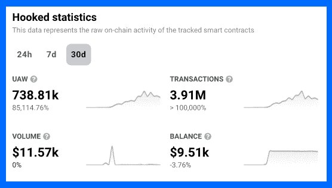
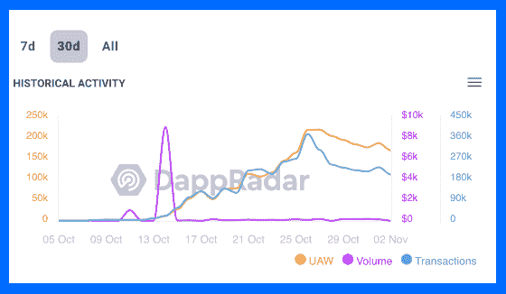
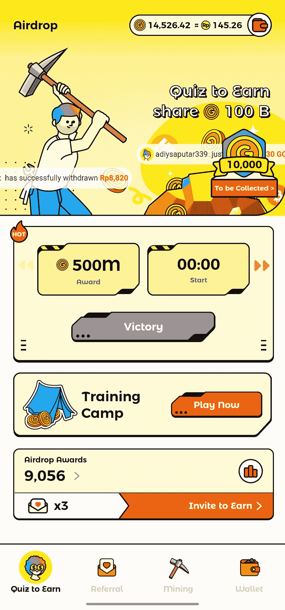

# hooked Protocol 85，000%的用户增长令 Web3 行业感到惊讶

> 原文：<https://web.archive.org/web/https://dappradar.com/blog/hooked-protocols-user-increase-amazes-the-web3-industry>

## Hooked 是一个入口协议，旨在将 Web2 用户转移到 Web3

Hooked Protocol 是一个全新的平台，旨在通过让事情变得简单明了来吸引 Web2 用户使用 Web3。在过去的一个月里，Hooked 的链上指标显示，用户数量和交易量的爆炸式增长让许多人感到惊讶。

**亮点**

*   *独特活跃钱包连接增长 85，000%以上，交易增长 100，000%以上，这些都是令人印象深刻的连锁统计数据。但是对待这样的数字一定要谨慎。他们偶尔会指出一些可疑的东西。*
*   *Wild Cash 是 Hooked 的一款教育游戏，它安全地介绍了 Web3 行业背后的许多概念。*
*   永远记得 DYOR。虽然区块链技术提供了自由、独立和安全，但仍有许多匿名人士使用 Web3 工具来利用那些经验不足的人。

[Explore Hooked Data](https://web.archive.org/web/20221130144108/https://dappradar.com/binance-smart-chain/social/hooked)

## 什么被钩住了，它的使命是什么？

Hooked Protocol 是一个新的 Web3 平台，目的是让 Web2 的人们进入互联网的新时代。Hooked 开发了一些工具，让那些觉得区块链、NFT 和加密货币令人困惑的用户不那么害怕过渡。

该平台的既定目标是“让所有没有加密经验的人都能够访问、获得并拥有一份加密”。为了帮助他们走上这条路，币安的风险投资和加速器部门币安实验室共同领导了 Hooked Protocol 的种子期。这笔交易中的另一个大玩家是红杉种子基金。

Hooked Protocol 向新用户开放 Web3 的策略是多管齐下的:

*   他们将创建简单的结构，将主流网络平台“带入本地加密领域”。
*   计划是在他们创建的 Web3 工具中“建立病毒式增长的基础设施”,大概是为了将来的可扩展性。
*   他们将使用 Web3 原则构建工具，如安全所有权和保证创建者。但它们不会具备人们觉得不舒服的 Web3 部分，比如复杂的令牌交换和笨重的钱包连接。

他们还有一个新的可下载应用程序，名为 Wild Cash，以容易理解的方式向用户介绍 Web3 概念。Wild Cash 是一个游戏化的教育工具，用户可以做测验，赚取代币，“mint NFTs”等等。这款应用可以在 Android 上使用，但还不能在 iOS 上使用。

## DappRadar 数据显示 Hooked 的平流层增长

在过去的 30 天里，Hooked 的连锁活动简直令人兴奋不已。交易笔数已达 391 万笔，同比增长超过 10 万。这个太大了，超出了我们通常的测量范围。

在过去 30 天内，连接到 dapp 的唯一活动钱包数量增加了 85，115%。这些数字通常让我们联想到过去五年 BTC 和 ETH 的价格增长。

Source: [Dapp](https://web.archive.org/web/20221130144108/https://dappradar.com/binance-smart-chain/social/hooked)[R](https://web.archive.org/web/20221130144108/https://dappradar.com/binance-smart-chain/social/hooked)[adar](https://web.archive.org/web/20221130144108/https://dappradar.com/binance-smart-chain/social/hooked)

大约在 10 月 14 日，Hooked 的链上统计数据开始显示独特的活跃钱包连接和交易呈上升趋势。查看该平台的 Twitter feed，我们可以看到该协议于 10 月 16 日左右在 BNB 链上推出。所以实际上，他们在两周多一点的时间里积累了上述数字。

Source: [DappRadar](https://web.archive.org/web/20221130144108/https://dappradar.com/binance-smart-chain/social/hooked)

值得注意的是，Hooked 拥有大约 14400 名 Twitter 粉丝。记住这个数字，这使得他们的链上指标非常令人印象深刻，并提出了他们如何在不到一个月的发布时间内实现如此令人难以置信的数字的问题。

Hooked 可能是玩家填充系统的受害者。或者该平台可能有一种不寻常的方法来计算唯一的活跃钱包连接和交易号码。虽然我们肯定不会说 Hooked 是一个骗局，但我们确实建议我们的社区在 dapp 还处于早期阶段时要格外小心。

## 什么是百搭现金？

Wild Cash 是 Hooked Protocol 将不确定用户纳入 Web3 的首批举措之一。这是一种游戏化的学习体验，人们可以:

*   进入他们“竞猜挣钱”的训练营。用户回答有关加密、区块链、DeFi、NFTs、法律法规等问题，即可赢得本地令牌金。

*   参加每日测验，与其他玩家竞争以赢得更大的奖励。

*   每 24 小时登录一次，定期登录可以获得奖励。

*   推荐朋友并创建自己的队伍来赢取金牌。

*   通过点击一个按钮来移动动画角色和他们的鹤嘴锄来“开采”黄金。这是对挖掘 BTC 的一个比喻，并且(在某种程度上)展示了工作证明是如何工作的。

*   观看广告赢取金牌。

*   下注并赢。这个特征表明区块链技术可以用于赌博。

*   赌注，赚取收益和提取黄金代币。

*   游戏中的“薄荷”NFTs。为此，用户可以花费黄金获得升级的鹤嘴锄或采矿车。这两个项目都有助于玩家赚取更多的黄金。

Wild Cash screenshot

用户甚至有自己的钱包地址，尽管还不清楚这些地址是否在链上。百搭现金还允许人们将游戏中的金币兑换成现实生活中的货币。你能赚到的钱并不多，但是这个功能确实展示了如何通过 Web3 平台赚到真正的钱。

Wild Cash 的全部目的是通过故事、有趣的动画和安全的学习工具向人们展示 Web3 是如何工作的。玩这个游戏没有人会赔钱，这种安全感是进入更具挑战性和潜在风险的 DeFi、NFTs 和加密交易的良好开端。

[See Hooked Data](https://web.archive.org/web/20221130144108/https://dappradar.com/binance-smart-chain/social/hooked)

## 随身携带您的 Web3 之旅

使用 DappRadar 移动应用程序，再也不会错过 Web3。查看最受欢迎的 dapps 的性能，并关注您投资组合中的 NFT。您在 DappRadar 上的帐户会与我们的移动应用程序同步，这样您很快就可以选择实时接收提醒。

[Download the DappRadar app now](https://web.archive.org/web/20221130144108/https://dappradar.app.link/blog)[<picture></picture>](https://web.archive.org/web/20221130144108/https://play.google.com/store/apps/details?id=com.portfolio.dappradar)