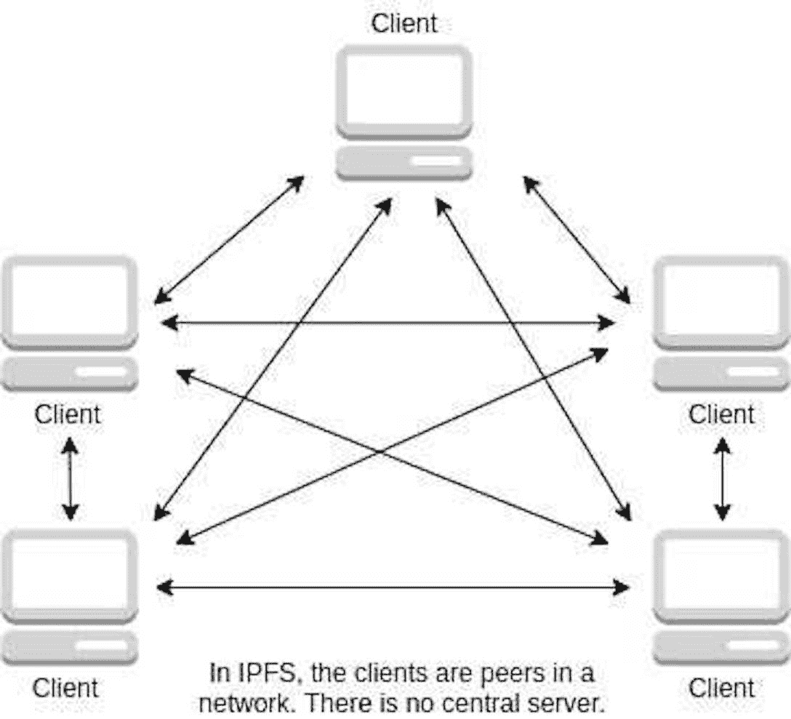

# 通过 Fleek 在 IPFS 和 Filecoin 上托管您的应用程序

> 原文：<https://web.archive.org/web/https://dappradar.com/blog/hosting-your-application-on-ipfs-filecoin-through-fleek>

## Fleek 提供高度自动化的服务，帮助开发人员从分布式数据存储中受益。

Fleek 让开发人员在 IPFS 和 Filecoin 上托管他们的应用变得简单，这是最流行的分散数据存储解决方案。它们允许用户享受更高效的数据存储和传输，同时保证数据安全和反审查。

对于 2022 年，区块链行业内的嗡嗡声继续围绕着游戏、DeFi 和 NFT 项目。但分散式数据存储可能是 2023 年值得关注的区块链趋势。这是因为分散的内容存储是为 Web3 奠定基础的最重要的基础设施支柱之一。

**内容**

*   [*为什么去中心化的网站托管很重要？*](https://web.archive.org/web/20230307095208/https://dappradar.com/blog/hosting-your-application-on-ipfs-filecoin-through-fleek/#why)
*   IFPS 和 Filecoin 的分散存储解决方案如何解决这些问题？
    *   [*这样做有什么好处？*](https://web.archive.org/web/20230307095208/https://dappradar.com/blog/hosting-your-application-on-ipfs-filecoin-through-fleek/#what)
*   如何用 Fleek 在 IPFS 部署你的网站？
    *   [*快速指南*](https://web.archive.org/web/20230307095208/https://dappradar.com/blog/hosting-your-application-on-ipfs-filecoin-through-fleek/#guide)
    *   [*观看视频*](https://web.archive.org/web/20230307095208/https://dappradar.com/blog/hosting-your-application-on-ipfs-filecoin-through-fleek/#video)
    *   *[有用链接](https://web.archive.org/web/20230307095208/https://dappradar.com/blog/hosting-your-application-on-ipfs-filecoin-through-fleek/#link)*

## 为什么托管一个去中心化的网站很重要？

大多数 web 浏览器通过 HTTP 进行通信，HTTP 是一种协议。这种通信方法要求客户端向中央服务器请求数据。因此，当通过浏览器使用 web 应用程序时，服务器将响应所请求的数据，发回帖子和图像。

然而，这种方法也有一些缺点。首先，集中式服务器有单点故障的风险。如果服务器出现物理或系统故障，用户将无法访问。虽然大型企业可以通过部署多台服务器来缓解这一问题，但对于中小型企业来说，这可能非常昂贵。

第二，当用户浏览 http 网页时，有时会遇到 404 错误，这种错误发生在服务器找不到请求的资源时。由于从中央服务器删除内容很容易，一旦存储在那里的内容以任何方式丢失，就会出现 404 错误。

集中式存储系统也有许多安全漏洞。例如，数据很容易被篡改和黑客攻击，更不用说如果服务器发生灾难性事件，用户的数据可能变得无法访问。

最后，Web2 的数据集中存储意味着谁控制了服务器，谁就控制了数据。这引发了对数据滥用、信息审查和许多其他问题的担忧。

## IFPS 和 Filecoin 的分散存储解决方案如何解决这些问题？

IPFS 利用对等网络传输数据，消除了集中式服务器及其相关问题。最重要的是，IPFS 在获取数据时使用内容寻址而不是位置寻址。后者由 HTTP 协议使用。

位置寻址需要在某个位置提取特定的文件。这种方法不能保证文件没有被篡改。此外，物理距离会影响数据传输的速度。

内容寻址是一种完全不同的方法，它通过称为 CID 的唯一标识符来标识文件。CID 使用加密散列法给文件一个唯一的指纹。当用户收到一个文件时，系统会执行一系列计算来验证它是否是所请求的文件。

IPFS 采用的点对点协议允许文件从任何一个节点接收，从而实现最短路径。这意味着用户可以从邻居那里获取文件，而不是从另一个国家的服务器上获取。

Filecoin 为 IPFS 增加了一个激励层。通过 Filecoin 的激励机制，用户可以向他人提供冗余存储，并因此获得奖励。由于分布式存储网络被设计为随着更多用户的参与而变得更快，因此激励的引入促进了网络的增长和可持续性。

[Learn more about IPFS](https://web.archive.org/web/20230307095208/https://docs.ipfs.tech/how-to/websites-on-ipfs/introducing-fleek/#host-a-site)

### 这样做有什么好处？

对等网络和内容寻址的结合解决了上面提到的 Web2 的许多问题。此外，IFPS 让互联网的未来变得高效、安全、不受审查，而 Filecoin 则确保了这样一个网络的可持续性和经济盈利性。

同样值得注意的是，享受这些好处并不困难，因为 Fleek 已经在很大程度上简化了开发人员在 IFPS 上部署分散式应用程序的工作。继续阅读，了解如何做到这一点。

## 如何用 Fleek 在 IPFS 部署你的网站？

Fleek 是一项让开发者在 IPFS 上托管网络应用的服务，他们无需在电脑上安装任何东西，也无需处理命令行。

Fleek 具有由自动化驱动的简单工作流程。一旦你把你的修改推送到 git，Fleek 就会构建、固定和更新你的站点。此外，该服务还与 React、Next.js、Gatsby、Jekyll、Hugo 以及其他多个流行的开发框架进行了很好的集成。您还可以通过 Fleek 管理您的域名，并以类似于传统 web 开发的方式监控您的站点。

[Learn more about Fleek IPFS Hosting](https://web.archive.org/web/20230307095208/https://fleek.co/hosting/)

下面的快速指南介绍了如何使用 Fleek 在 IFPS 上部署 web 应用程序。

### 快速指南

1.  登录 [GitHub。](https://web.archive.org/web/20230307095208/https://github.com/)
2.  创建一个新的存储库并上传您的项目。
3.  去 app.fleek.com 创建一个帐户。
4.  在左边的菜单中找到“站点”并点击它。
5.  点击添加新站点，然后点击用 Github 连接。
6.  找到要部署的存储库并选择它。
7.  Fleek 将帮助您填写它自动检测到的所有信息。然后，如果不需要进一步的更改，您可以通过单击“部署站点”按钮继续。
8.  此时，不需要更多的步骤。如果部署成功，将在下一步通知您。

Fleek 最好的部分是它能自动检测你的应用程序更新。所以如果你的应用已经被修改并推送到 GitHub，Fleek 会知道。然后，您所要做的就是在 Fleek admin 后端触发新的部署，一切都准备好了。

[Learn more about Fleek](https://web.archive.org/web/20230307095208/https://docs.fleek.co/hosting/overview/)

### 观看教程视频

以下视频演示了如何使用 Fleek 在 IPFS 上部署 React 应用程序。你会看到 Fleek 可以自动识别不同的前端框架，这是其强大功能的一个例子。

[https://web.archive.org/web/20230307095208if_/https://www.youtube.com/embed/7JW5Mms6DR4?feature=oembed](https://web.archive.org/web/20230307095208if_/https://www.youtube.com/embed/7JW5Mms6DR4?feature=oembed)

如果你习惯于使用其他框架，并且想了解更多关于 Fleek 和 IPFS 的全部功能，你可以点击文章末尾的链接。

### 有用的链接

*   W [ebsite](https://web.archive.org/web/20230307095208/https://fleek.co/hosting/)
*   [单据](https://web.archive.org/web/20230307095208/https://docs.fleek.co/hosting/overview/)
*   [IPFS 文件——介绍 Fleek](https://web.archive.org/web/20230307095208/https://docs.ipfs.tech/how-to/websites-on-ipfs/introducing-fleek/#host-a-site)

**免责声明** —这是一篇赞助文章。DappRadar 不认可本页面上的任何内容或产品。DappRadar 旨在提供准确的信息，但读者应该在采取行动之前总是自己做研究。DappRadar 的文章不能被认为是投资建议。