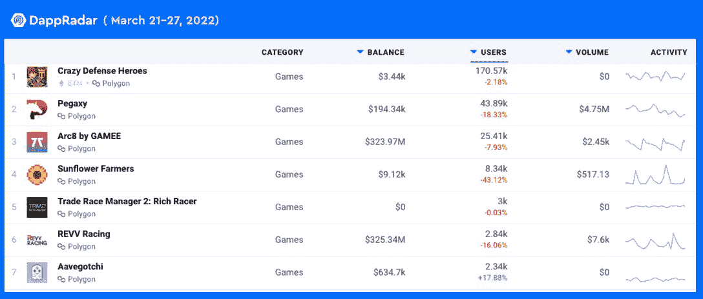
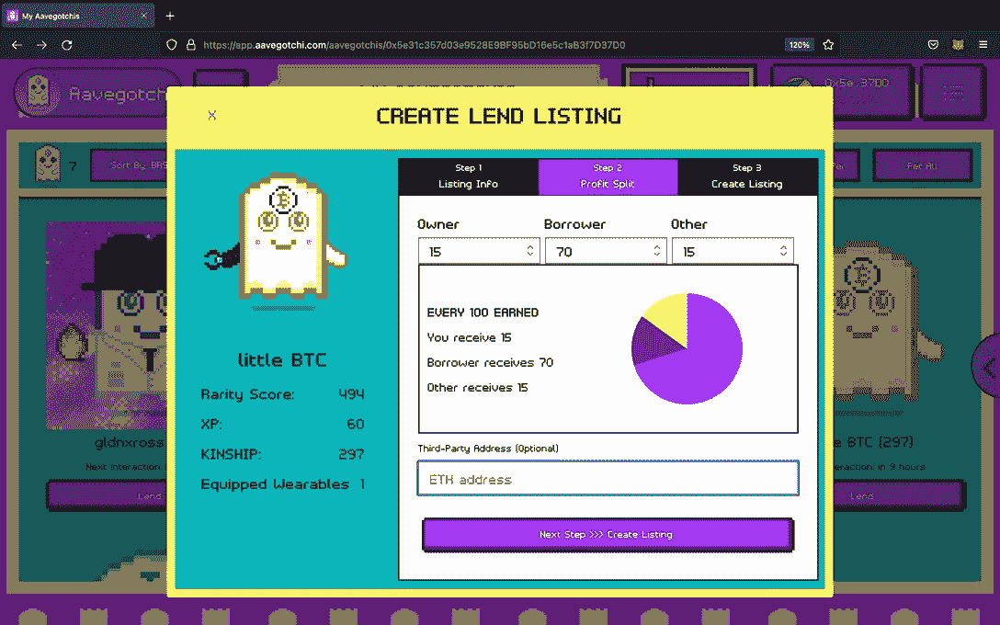

# Aavegotchi 的 Gotchi Lending 如何将奖学金模式推向新的高度

> 原文：<https://web.archive.org/web/https://dappradar.com/blog/how-aavegotchis-gotchi-lending-takes-the-scholarship-model-to-the-next-level>

## Gotchi Lending 是 Aavegotchi 的解决方案，用于扩大游戏生态系统

**Aavegotchi 引入 Gotchi Lending 作为解决方案，以改善市场上现有的奖学金模式。这将有助于通过创建一个更受欢迎的收入共享模式来解决当前区块链游戏可扩展性的问题。值得一提的是，Gotchi Lending 是一个利用智能合同的 100%链上解决方案。**

Aavegotchi 是多边形上最受欢迎的游戏之一。作为 Pixelcraft 工作室的创意，Aavegotchi 是 DeFi 和 NFT 游戏的完美结合。这是一个有趣的游戏，让你想起电子鸡快乐的童年记忆，更重要的是，一个简单而有趣的从玩到赚的旅程。

随着 3 月 31 日 got chiverse 的发布，游戏的预期和参与度越来越高。在撰写本文时，Aavegotchi 记录的用户数量在过去七天内增长了 17.88%。值得注意的是，它是 Polygon 排名榜前 7 名中唯一一个在此期间实现正用户增长的游戏 dapp。

尽管区块链博彩扰乱了传统博彩业，但要成为主流还有很长的路要走。为了加速区块链博彩的大众化，Aavegotchi 提出了 Gotchi Lending。此外，这也是将 Gotchiverse 扩展到核心受众之外的关键一步。

## 奖学金模式及其弊端

Axie Infinity 推出了一项奖学金计划，通过一种更方便的途径为新员工提供奖学金。Axie 持有者，例如像 Yield Guild Games 这样的公会，向新玩家提供所谓的奖学金。具体来说，他们把自己的资产 Axie NFTs 借给自己没有任何资产的新玩家。作为回报，借款人或学者与 Axie 所有者分享他们的收入。这是一种收入共享模式，公会投资 NFT 资产，然后出租或出借给新来者。因此，新玩家可以开始玩游戏并获得游戏内代币，而无需预先投资任何资金。

然而，奖学金模式也有不足以扩大游戏生态系统的缺点。本质上，运营 Axie 贷款业务是靠人的。该模型严重依赖于人工支付和外链协议。滥用职权的经理并不罕见。此外，许多学者将他们的象征性收入作为日工资兑现。因此，他们不会把挣来的代币花在繁殖或其他游戏中的行为上，这导致了阿西的 SLP 通货膨胀。

## Gotchi Lending 升级奖学金模式

Gotchi Lending 通过一种不同的方法来解决游戏生态系统的可扩展性，即保持整个借贷过程 100%在区块链上。Gotchi Lending 使用智能合同，允许 Aavegotchi NFTs 的所有者将这些资产借给拥有有限权利的玩家。

值得注意的是，Gotchi Lending 允许业主完全控制他们的租赁协议。他们可以决定合同期限、预付费用以及他们和借款人之间的收入分配规则。例如，贷款人可以决定他们希望与借款人分享哪种代币，因为即将到来的 Gotchiverse 将推出四种新的 ERC 代币。当然，GHST，Aavegotchi 的生态治理标志，是一个选择。此外，他们还可以自定义分割的百分比，例如 50/50、80/20 等。

更值得注意的是，Gotchi 贷款对大型行会和个人都有好处。公会可以通过将他们的 Aavegotchi 作为可信地址加入白名单，无缝地将他们的 Aavegotchi 交到会员手中。个人 Aavegotchi 所有者可以利用 Gotchi Lending，通过在贷款市场上上市 Aavegotchi 来赚取被动收入。用户也可以把它们借给朋友或家庭成员，让他们免费进入 Gotchiverse 进行试用。

Gotchi Lending 将于 3 月 28 日上线，它将使 Gotchiverse 成为世界上最容易进入的 NFT 游戏之一。要探索可持续的“玩即赚”游戏的无限机会，您需要的只是互联网接入和一个 web3 钱包。照常玩，赚取前所未有的利润！

## 关于 Aavegotchi

Aavegotchi 是一个开源的、社区所有的 NFT 游戏协议，为游戏玩家提供了真正的资产所有权。Aavegotchi NFTs 是链上可收集的幽灵，与 Aave 的利息生成 aTokens 押在一起。通过获得经验值、升级和增加你的朋友的稀有度来争夺玩家奖励。Aavegotchi 由 AavegotchiDAO 和本地生态治理令牌 GHST 管理。今天就去 Aavegotchi.com[参观](https://web.archive.org/web/20221130135338/https://aavegotchi.com/)，加入未来的 NFT 虚拟化身！

**有用链接:**

[官网](https://web.archive.org/web/20221130135338/https://aavegotchi.com/)

[Gotchiverse 网站](https://web.archive.org/web/20221130135338/https://gotchiverse.io/)

[维基](https://web.archive.org/web/20221130135338/https://wiki.aavegotchi.com/)

[推特](https://web.archive.org/web/20221130135338/https://twitter.com/aavegotchi)

[不和](https://web.archive.org/web/20221130135338/http://discord.gg/aavegotchi)