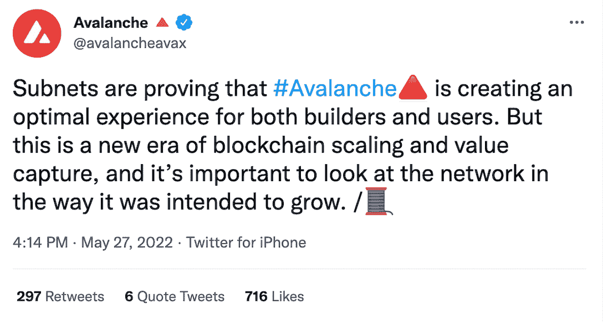
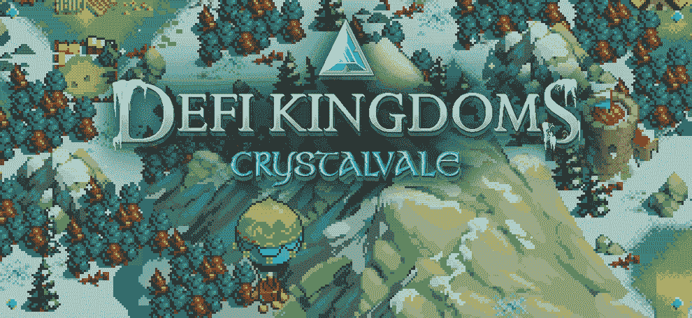
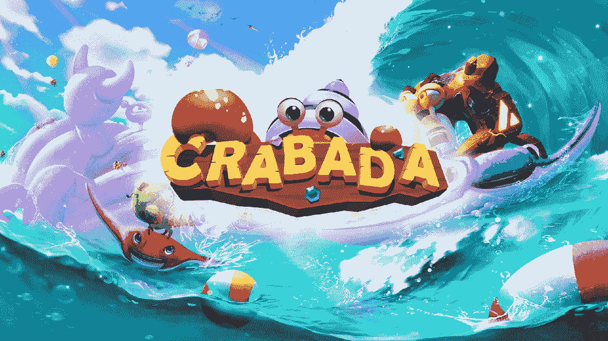

# 雪崩子网如何推动下一代游戏

> 原文：<https://web.archive.org/web/https://dappradar.com/blog/how-avalanche-subnets-fuel-next-generation-gaming>

## Web3 游戏生态系统正在蓬勃发展，雪崩解决方案是其成功的关键因素

**web 3 游戏生态系统正在蓬勃发展，Avalanche 的技术扩展解决方案是其成功的关键因素。他们称这些解决方案为子网，但是雪崩子网与第二层区块链或汇总子网有什么不同呢？有哪些游戏在用这种技术？请继续阅读，了解 Web3 游戏如何获得对其网络的完全控制。**

## 目录

*   [雪崩及其改变游戏规则的子网](https://web.archive.org/web/20221130134308/https://dappradar.com/blog/how-avalanche-subnets-fuel-next-generation-gaming/#avalanche)
*   [助推 Web3 游戏](https://web.archive.org/web/20221130134308/https://dappradar.com/blog/how-avalanche-subnets-fuel-next-generation-gaming/#boosting)
*   [雪崩上的顶级游戏](https://web.archive.org/web/20221130134308/https://dappradar.com/blog/how-avalanche-subnets-fuel-next-generation-gaming/#top)
    *   [DeFi 王国](https://web.archive.org/web/20221130134308/https://dappradar.com/blog/how-avalanche-subnets-fuel-next-generation-gaming/#dk)
    *   [克拉巴达](https://web.archive.org/web/20221130134308/https://dappradar.com/blog/how-avalanche-subnets-fuel-next-generation-gaming/#crabada)
    *   [关于雪崩的有前途的游戏即将推出](https://web.archive.org/web/20221130134308/https://dappradar.com/blog/how-avalanche-subnets-fuel-next-generation-gaming/#promising)
*   [继续了解雪崩子网](https://web.archive.org/web/20221130134308/https://dappradar.com/blog/how-avalanche-subnets-fuel-next-generation-gaming/#learning)

## 雪崩及其改变游戏规则的子网

与第二层或汇总不同，雪崩子网是一种使用不同的验证器集来构建主雪崩区块链网络的新子网的方法。

尽管是更大的 Avalanche 网络的一部分，每个子网都可以定制为拥有自己的货币、安全系统和一组验证器。

雪崩子网是区块链开发者的真正盟友。他们不仅可以减少成本和时间，还可以为他们提供更好的工具和更全面的控制来创建 dapps。

它们使开发人员能够配置诸如哪个令牌付费、谁验证网络活动以及哪个虚拟机促进操作等功能。

[Source](https://web.archive.org/web/20221130134308/https://twitter.com/avalancheavax/status/1530205690198990849)

[Learn unique benefits of Avalanche Subnets](https://web.archive.org/web/20221130134308/https://docs.avax.network/subnets#advantages)

## 推动 Web3 游戏

Web3 游戏采用传统游戏，并添加了增强玩家参与度和提供真实世界价值的元素。例如，这些游戏赋予玩家所有权，并允许他们拥有游戏中的物品。有时，他们可以带着这些物品在不同的游戏间穿梭。至关重要的是，在 Web3 游戏中，游戏内货币可以是加密货币。

作为增长最快的行业之一，区块链游戏公司已经席卷了加密社区。因此，雪崩区块链是各种顶级游戏 dapps 的家园，更多的人正在寻求利用子网提供的独特优势。

值得注意的是，Avalanche 上的下一波游戏将会有更好的画面，并来自更复杂的游戏工作室。因此，这些游戏可以在许多方面与 Web2 竞争，它将超越加密原生产品，成为将加密技术带给大众的催化剂。

Avalanche 的主要关注点之一是促进分散式游戏应用程序的开发。因此，深度可配置的子网是颠覆性的新一代游戏的理想选择，允许一切为游戏玩家量身定制。整个游戏经济可以在一个专为支持特定游戏而设计的子网上运行。这是最好的体验——让下一个 10 亿玩家加入游戏行列成为可能。

事实上，子网除了让游戏开发者的生活更轻松之外，还对用户的游戏体验产生直接影响。

雪崩子网驱动的游戏为玩家提供了更快的游戏速度，让他们专注于真正重要的事情——游戏本身。子网不会受到雪崩中其他地方的活动或更广泛的区块链生态系统的影响，因此可以提供最佳性能。

## Avalanche 上的顶级现场游戏

由于其创新的子网，Avalanche 是一种领先的协议，许多开发人员发现它是构建他们的 NFT 和游戏 dapps 的理想基础。

了解一些使用这项技术的最佳游戏 dapps。

### DeFi 王国

[DeFi 王国](https://web.archive.org/web/20221130134308/https://dappradar.com/avalanche/games/defi-kingdoms)是一款跨链游戏，结合了 DEX、流动性池、稀有公用事业驱动的 NFT 市场和复古幻想像素图像来讲述它的故事。

尽管最初是在和谐区块链上推出的，但这款游戏已经在 2022 年年中部署到自己的雪崩子网，名为 Crystalvale。它很快成为玩家的首选协议之一，注册的每日交易量超过了其他所有区块链，如 Polygon 和 Hedera。

在 Crystalvale 上，DeFi 王国从协议的速度和效率中受益，这反过来使游戏社区感到满意。

### 沙巴达

作为 Avalanche 上最老牌的游戏之一， [Crabada](https://web.archive.org/web/20221130134308/https://dappradar.com/avalanche/games/crabada) 也利用了 Avalanche 子网。

这个游戏设定在一个海底世界，里面有凶猛的寄居蟹 Crabada，玩家可以拥有、交易、繁殖和战斗游戏中的角色，每个角色都是 NFT。通过玩和赢得战斗，玩家可以获得现实世界的奖励。

Crabada 的子网网络名为 Swimmer Network，专门用于分散式游戏项目，基于 Avalanche 提供的基础设施、安全性和速度。

### 其他有前途的游戏即将在 Avalanche 上推出

正如你所料，有几个高投入的游戏，明星团队准备推出自己的子网。以下是一些值得关注的热门名字:

*   上升者:Sci-fantasy，开放世界动作角色扮演游戏；

[https://web.archive.org/web/20221130134308if_/https://www.youtube.com/embed/suPwZ_LQrfM?feature=oembed](https://web.archive.org/web/20221130134308if_/https://www.youtube.com/embed/suPwZ_LQrfM?feature=oembed)

*   Ragnarok:绝杀驱动的元宇宙角色扮演游戏；

[https://web.archive.org/web/20221130134308if_/https://www.youtube.com/embed/lxefG3Ia9lA?feature=oembed](https://web.archive.org/web/20221130134308if_/https://www.youtube.com/embed/lxefG3Ia9lA?feature=oembed)

*   弹片:首款 AAA 级第一人称射击游戏区块链。

[https://web.archive.org/web/20221130134308if_/https://www.youtube.com/embed/KNTVpHT-Xgk?feature=oembed](https://web.archive.org/web/20221130134308if_/https://www.youtube.com/embed/KNTVpHT-Xgk?feature=oembed)

## 加入雪崩多元宇宙

Avalanche 是区块链行业速度最快的智能合约平台之一，也是以交易终结速度衡量最快的平台(不到一秒)。除了以太坊之外，它还拥有最多的完整块生成验证器，比其他任何利害关系证明协议都多。此外，雪崩速度快、成本低、环保，非常适合任何区块链游戏。

您的 dapp 也可以受益于雪崩子网技术。有了 Avalanche Multiverse，一个由 Avalanche Foundation 创建的 2.9 亿美元的激励计划，来自世界各地的 Web3 开发者可以在采用子网方面取得进展。

通过参与，您可以深入了解区块链游戏、DeFi 和 NFT dapps 如何充分利用 Avalanche。有兴趣加入吗？通过此链接完成[表格。](https://web.archive.org/web/20221130134308/https://avalancheavax.typeform.com/to/AHipnhBh)

### 有用的链接

*   [雪崩](https://web.archive.org/web/20221130134308/https://www.avax.network/)
*   [雪崩子网](https://web.archive.org/web/20221130134308/https://docs.avax.network/subnets)
*   [推特](https://web.archive.org/web/20221130134308/https://twitter.com/avalancheavax)
*   [电报](https://web.archive.org/web/20221130134308/https://t.me/avalancheavax)
*   [中等](https://web.archive.org/web/20221130134308/https://medium.com/avalancheavax)
*   [不和](https://web.archive.org/web/20221130134308/https://chat.avax.network/)

**免责声明** —这是一篇赞助文章。DappRadar 不认可本页面上的任何内容或产品。DappRadar 旨在提供准确的信息，但读者应该在采取行动之前总是自己做研究。DappRadar 的文章不能被认为是投资建议。