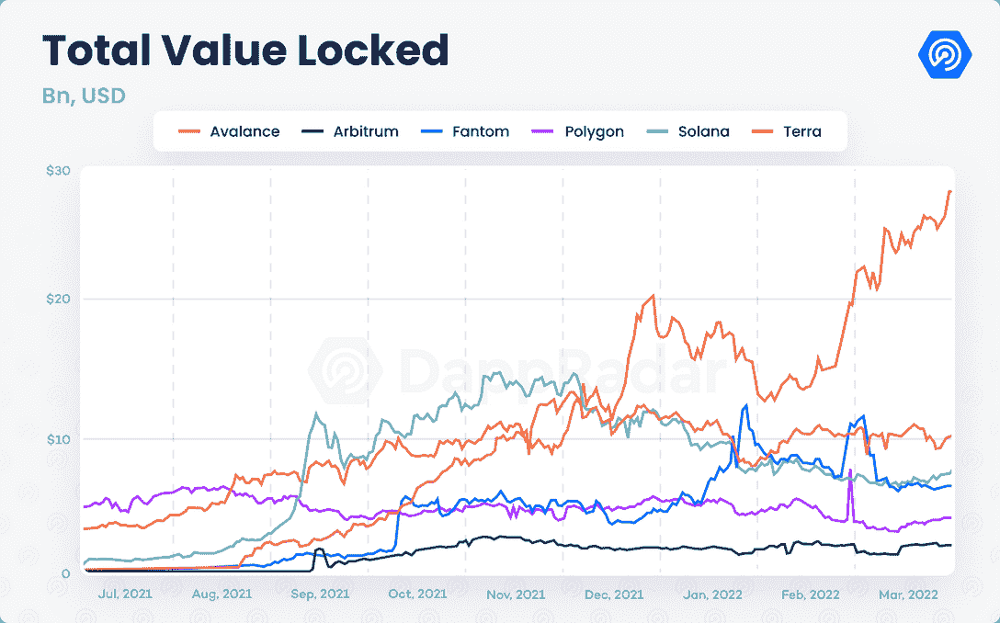
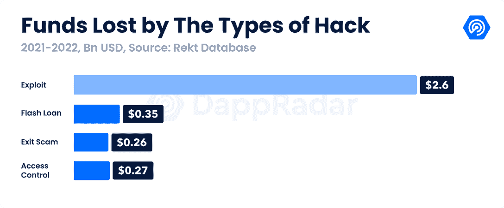
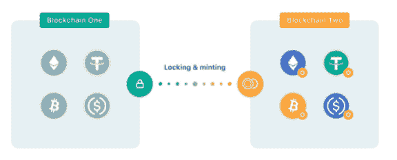
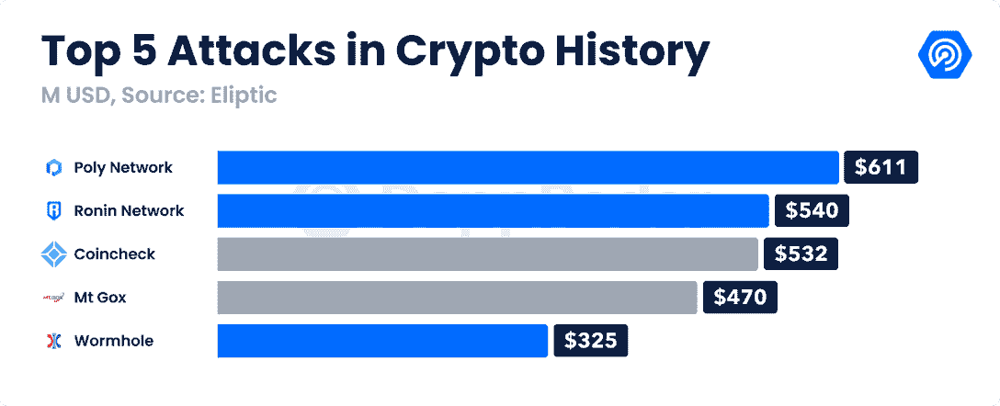
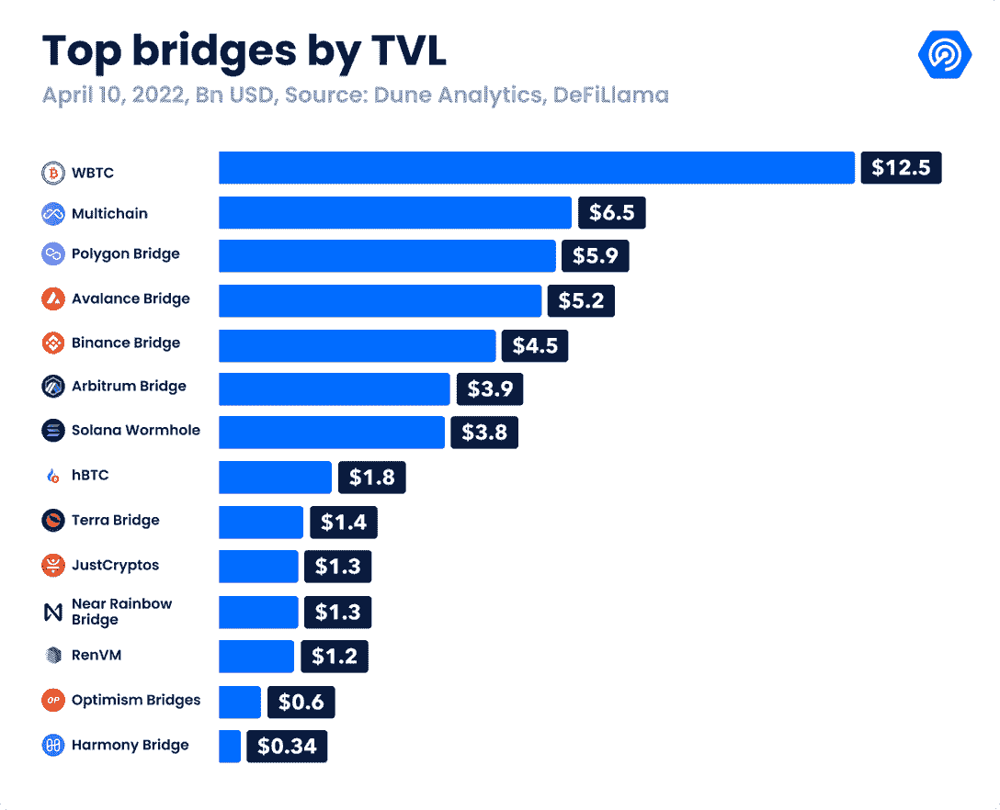
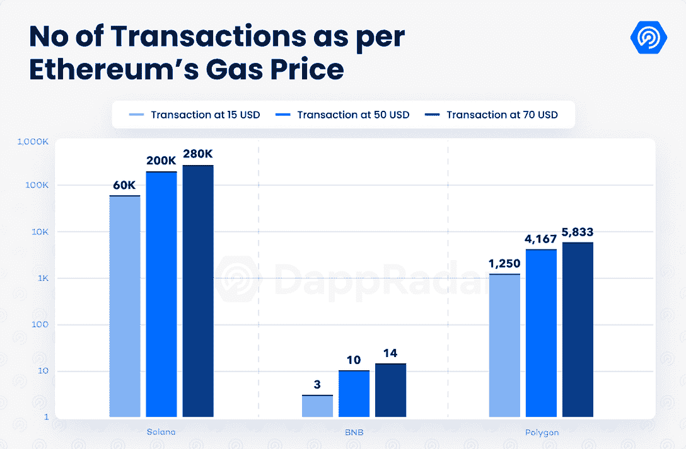

# 区块链桥如何成为黑客的首要目标

> 原文：<https://web.archive.org/web/https://dappradar.com/blog/how-blockchain-bridges-became-hackers-prime-targets>

## 了解更多关于桥梁的弱点和最近的成就

**加密行业已经发展成为一个生态系统，它将几个第 1 层(L1)区块链和第 2 层(L2)扩展解决方案相互连接起来，这些解决方案具有独特的功能和优势，区块链网桥在其中扮演着重要角色。**

像 Fantom、Terra 或 Avalanche 这样的网络在 DeFi 活动中变得丰富，而像 Axie Infinity 和 DeFi Kingdoms 这样的游戏赚取 dapps 维持着像 Ronin 和 Harmony 这样的整个生态系统。这些区块链已经成为以太坊的天然气费和相对缓慢的交易时间的重要替代品。对于在不同的区块链上的协议之间移动资产的简单方法的需求变得比以往任何时候都更加迫切。

这就是区块链桥的用武之地。

多链方案的结果是，所有 DeFi dapps 的锁定总价值(TVL)飙升。截至 2022 年 3 月底，该行业的 TVL 估计为 2150 亿美元，比 2021 年 3 月高出 156%。这些 DeFi dapps 中锁定和桥接的价值吸引了恶意黑客的注意，最新趋势表明，攻击者可能已经发现了区块链桥中的薄弱环节。

根据 Rekt 数据库，在 Q1 2022 年，1 2 亿美元的加密资产被盗，占有史以来被盗资金的 35.8%。有趣的是，2022 年至少有 80%的丢失资产是从桥梁上被盗走的。

最严重的一次攻击发生在两周前, [Ronin bridge 被黑](https://web.archive.org/web/20221002004242/https://thedefiant.io/axie-infinity-hack-600m/)了 5 . 4 亿美元。在此之前，[索拉纳虫洞](https://web.archive.org/web/20221002004242/https://thedefiant.io/wormhole-exploit-320m/)和 BNB 链的量子位金融桥在 2022 年被开发了超过 4 亿美元。crypto 历史上最大的黑客攻击发生在 2021 年 8 月，当时[多网络桥被利用了 6.1 亿美元](https://web.archive.org/web/20221002004242/https://thedefiant.io/poly-hack/)，尽管被盗资金后来被归还。

桥是行业中最有价值的工具之一，但是它们的互操作性给建造它们的项目带来了重大挑战。

## 了解区块链桥

类似于曼哈顿桥，区块链桥是连接两个不同网络的平台，支持资产和信息从一个区块链到另一个的跨链传输。通过这种方式，加密货币和 NFT 不会被孤立在其本地链中，而是可以跨不同的区块链“桥接”，从而增加了利用这些资产的选择。

多亏了桥梁，比特币被用于基于智能合约的网络中，用于 DeFi 目的，或者 NFL 全天 NFT 可以从流量桥连接到以太坊，以进行细分或用作抵押品。

转移资产有不同的方法。顾名思义，锁定-铸造桥的工作原理是在发送端锁定智能契约中的原始资产，而接收网络在另一端铸造原始令牌的副本。如果以太是从以太坊到索拉纳的桥梁，索拉纳中的以太只是加密的“包装”表示，而不是实际的令牌本身。

*Locking and mint mechanism* | **source:** [MakerDAO](https://web.archive.org/web/20221002004242/https://blog.makerdao.com/what-are-blockchain-bridges-and-why-are-they-important-for-defi/#:~:text=Lock%20and%20Mint%3A%20The%20Lynchpin,through%20a%20two%2Dstage%20process.)

虽然锁定和铸造方法是最受欢迎的桥接方法，但还有其他方法来完成资产转移，如“烧毁和铸造”或通过智能合同自动执行的原子互换，以在两个网络之间交换资产。 [Connext](https://web.archive.org/web/20221002004242/https://www.connext.network/) (之前的 xPollinate)和 [cBridge](https://web.archive.org/web/20221002004242/https://cbridge.celer.network/#/liquidity) 是依靠原子互换的桥梁。

从安全的角度来看，网桥可以分为两大类:可信的和不可信的。**可信桥梁**是依赖第三方来验证交易的平台，但更重要的是，充当桥梁资产的保管人。可信桥的例子可以在几乎所有区块链特有的桥中找到，如币安桥、 [Polygon POS Bridge](https://web.archive.org/web/20221002004242/https://dappradar.com/ethereum/defi/polygon-pos-bridge) 、WBTC 桥、雪崩桥、和谐桥、Terra Shuttle 桥，以及特定的 dapps，如 Multichain(以前的 Anyswap)或 Tron 的 Just Cryptos。

相反，纯粹依靠智能合约和算法来托管资产的平台是**不可信的桥梁**。无信任桥中的安全因素依赖于资产被桥接的基础网络，即资产被锁定的基础网络。在[附近的彩虹桥](https://web.archive.org/web/20221002004242/https://dappradar.com/near/other/rainbow-bridge)、索拉纳的虫洞、波尔卡多特的雪桥、宇宙 IBC 以及像 Hop、Connext 和 Celer 这样的平台中可以找到不可信桥。

乍一看，不可信桥梁似乎为区块链之间转移资产提供了更安全的选择。然而，可信桥和不可信桥面临不同的挑战。

## 可信桥和不可信桥的局限性

Ronin bridge 作为一个集中式可信平台运行。该桥使用 multisig 钱包来保管桥接资产。简而言之，multisig 钱包是一个需要两个或更多加密签名来批准交易的地址。在 Ronin 的案例中，sidechain 有九个验证器，需要五个不同的签名来批准存款和取款。

其他平台使用相同的方法，但更好地分散了风险。例如，Polygon 依赖于八个验证器，需要五个签名。这五个签名由不同的政党控制。在 Ronin 的情况下，仅 Sky Mavis 团队就拥有四个签名，从而产生了单点故障。在黑客成功地一次控制了四个 Sky Mavis 签名之后，只需要再有一个签名就可以批准撤回资产了。

3 月 23 日，攻击者控制了阿协刀的签名，这是完成攻击所需的最后一块。在两次不同的交易中，173，600 瑞士法郎和 2，550 万 USDC 从 Ronin 的托管合同中流失，这是有史以来第二大的加密攻击。同样值得注意的是，Sky Mavis 团队在近一周后发现了这次黑客攻击，这表明 Ronin 的监控机制至少是有缺陷的，暴露了这个可信平台的另一个缺陷。

虽然集中化是一个根本性的缺陷，但由于软件和编码中的缺陷和漏洞，不可信网桥很容易被利用。

索拉纳虫洞是一个支持索拉纳和以太坊之间跨桥交易的平台，它在 2022 年 2 月遭受了一次攻击，由于索拉纳托管合同中的一个漏洞，3 . 25 亿美元被盗。虫洞契约中的一个漏洞使得黑客可以设计跨链验证器。攻击者将 0.1 ETH 从以太坊发送到 Solana，以触发一组“转移消息”，欺骗程序批准一个假定的 120，000 ETH 存款。

虫洞黑客事件发生在 [Poly Network](https://web.archive.org/web/20221002004242/https://dappradar.com/blog/tag/poly-network) 于 2021 年 8 月因合同分类和结构的缺陷被利用 6.1 亿美元之后。该 dapp 中的跨链交易由称为“保管者”的集中节点组批准，并通过网关合同在接收网络上验证。在这次攻击中，黑客能够获得管理员的特权，从而通过设置自己的参数来欺骗网关。攻击者在以太坊、币安、尼欧和其他区块链重复这一过程，以获取更多资产。

## 所有的桥都通向以太坊

以太坊仍然是行业中最主要的 DeFi 生态系统，占行业 TVL 的近 60%。与此同时，作为以太坊 DeFi dapps 替代品的不同网络的兴起引发了区块链桥的跨链活动。

业内最大的大桥是 WBTC 大桥，由 BitGo、Kyber 和 RenVM 背后的 Republic Protocol 团队负责监管。由于比特币代币在技术上与基于智能合约的区块链不兼容，WBTC 大桥“包装”了原生比特币，将其锁定在大桥托管人合约中，并在以太坊上铸造其 ERC-20 版本。这座桥在 DeFi Summer 非常受欢迎，现在拥有价值约 125 亿美元的比特币。WBTC 允许 BTC 在 dapps 如 Aave、Compound 和 Maker 中用作抵押品，或在多个 DeFi 协议中产生农场或赚取利息。

Multichain，以前称为 Anyswap，是一个 dapp，它通过内置的桥向 40 多个区块链提供跨链交易。Multichain 在所有互联网络中持有 65 亿美元。然而，到以太坊的 Fantom 桥是目前最大的池，锁定了 35 亿美元。在 2021 年下半年，Proof-of-Stake network 通过吸引人的产量农场(涉及 FTM、各种 stablecoins 或类似于在 SpookySwap 上发现的那些)将自己确立为一个受欢迎的 DeFi 目的地。

与 Fantom 不同，大多数 L1 区块链使用独立的直接网桥来连接网络。雪崩桥主要由雪崩基金会管理，是 L1 最大的 L1 桥。Avalanche 拥有最稳健的 DeFi 景观之一，拥有 Trader Joe、Aave、Curve 和 Platypus Finance 等 dapps。

币安大桥也脱颖而出，锁定了 45 亿美元的资产，紧随其后的是索拉纳虫洞，锁定了 38 亿美元。Terra 的穿梭桥仅获得 14 亿美元，尽管它是 TVL 第二大区块链。

同样，Polygon、Arbitrum 和 Optimism 等扩展解决方案也是锁定资产方面最重要的桥梁。Polygon POS Bridge 是以太坊与其侧链之间的主要入口，是第三大桥梁，托管近 60 亿美元。与此同时，Arbitrum 和乐观等受欢迎的 L2 平台的流动性也在增加。

另一个值得一提的桥是 Near Rainbow bridge，它旨在解决著名的[互操作性三难问题](https://web.archive.org/web/20221002004242/https://blog.connext.network/the-interoperability-trilemma-657c2cf69f17)。这个连接 Near 和 Aurora 与以太坊的平台可能会提供一个宝贵的机会来实现无信任桥的安全性。

## 提高跨链安全性

托管桥接资产的两种方法——可信桥和不可信桥，都容易出现基础和技术上的弱点。尽管如此，还是有办法防止和减少针对区块链桥梁的恶意攻击者造成的影响。

在可信桥的情况下，显然需要增加所需签名者的比例，同时保持多个签名分布在不同的钱包中。尽管不可信的桥梁消除了与集中化相关的风险，但漏洞和其他技术限制仍会带来风险，正如索拉纳虫洞或量子位金融漏洞所显示的那样。因此，有必要实施链外操作来尽可能地保护跨链平台。

需要协议之间的合作。Web3 空间的特点是它的绑定社区，因此让业内最聪明的人一起努力让这个空间成为一个更安全的地方将是一个完美的场景。Animoca Brands、币安和其他 Web3 品牌筹集了 1.5 亿美元，帮助 Sky Mavis 减少浪人的桥牌黑客攻击造成的财务影响。携手打造多链未来可以将互操作性推向新的高度。

同样，与链分析平台和集中交易所(CEXs)的协调应该有助于跟踪和标记被盗令牌。这种情况可能会在中期内抑制犯罪分子，因为在已建立的 CEXs 中，兑现菲亚特加密的网关应由 KYC 程序控制。上个月，[一对 20 岁的年轻人](https://web.archive.org/web/20221002004242/https://blockworks.co/two-20-year-olds-charged-in-alleged-1-1m-nft-scam-defrauding-investors/)在 NFT 空间诈骗他人后受到法律制裁。要求对已确认的黑客给予同样的待遇是公平的。

审计和 bug 奖励是改善任何 Web3 平台健康的另一种方式，包括桥。Certik、Chainsafe、Blocksec 等认证组织有助于使 Web3 交互更加安全。所有活动桥梁应由至少一个认证机构进行审核。

与此同时，bug bounty 项目在项目和社区之间创造了一种协同效应。白人黑客在恶意攻击者之前识别漏洞方面起着至关重要的作用。例如，Sky Mavis 最近启动了一项 100 万美元的 bug 奖励计划来加强其生态系统。

## 结论

随着整体区块链生态系统挑战以太坊 dapps，L1 和 L2 解决方案的激增产生了跨链平台在网络之间移动资产的需求。这是互操作性的本质，是 Web3 的支柱之一。

尽管如此，目前的互操作场景依赖于跨链协议，而不是多链方法，Vitalik 在年初对这种场景放松了警告。该领域对互操作性的需求是显而易见的。然而，在这种类型的平台中需要更健壮的安全措施。

不幸的是，这一挑战不会轻易被克服。可信平台和不可信平台都存在设计缺陷。这些内在的跨链缺陷变得显而易见。2022 年黑客攻击造成的 12 亿美元损失中，超过 80%来自被利用的桥梁。

此外，随着行业价值的不断增加，黑客也变得越来越老练。社交工程和网络钓鱼攻击等传统网络攻击已经适应了 Web3 的叙事。

所有令牌版本都是每个区块链本地的多链方法仍然很遥远。因此，跨链平台必须从以前的事件中吸取教训，并加强其流程，以尽可能减少成功攻击的次数。

 NewsletterUnsubscribe at any time. [T&Cs](https://web.archive.org/web/20221002004242/https://dappradar.com/terms) and [Privacy Policy](https://web.archive.org/web/20221002004242/https://dappradar.com/privacy-policy)