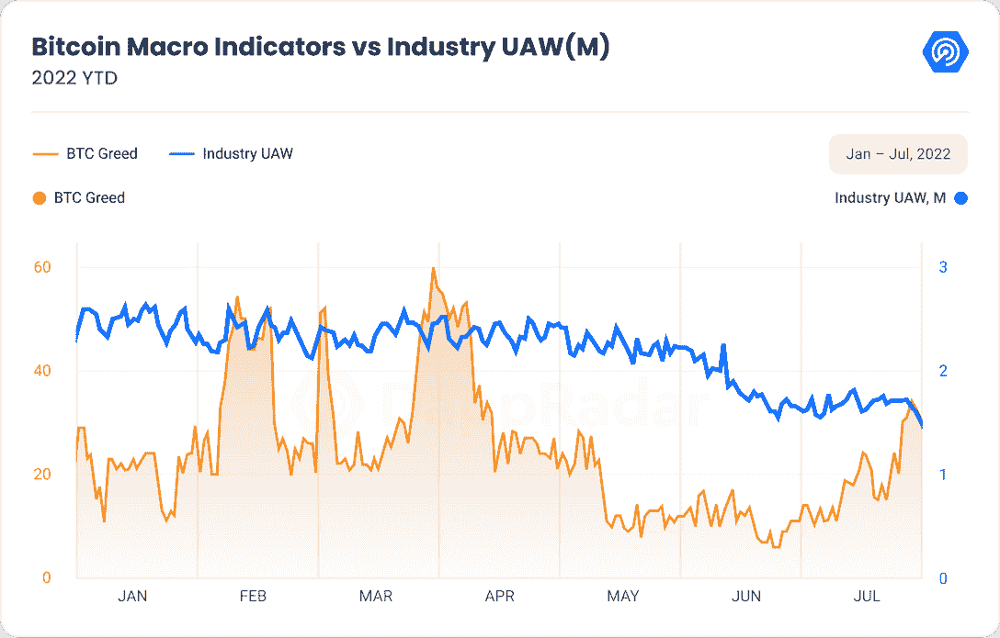
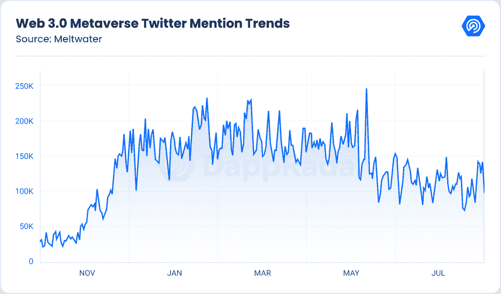
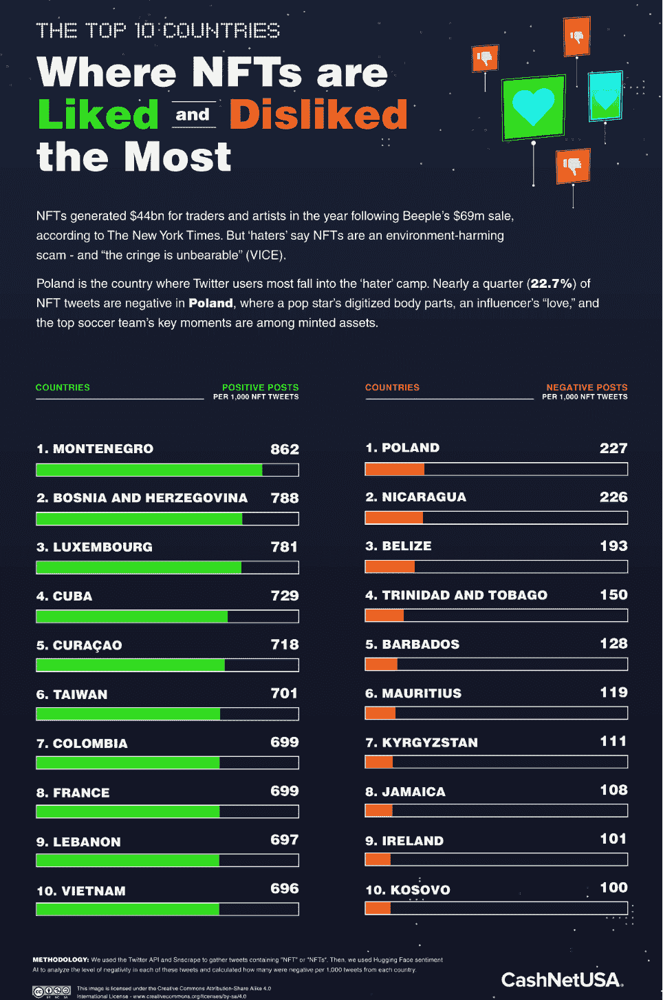
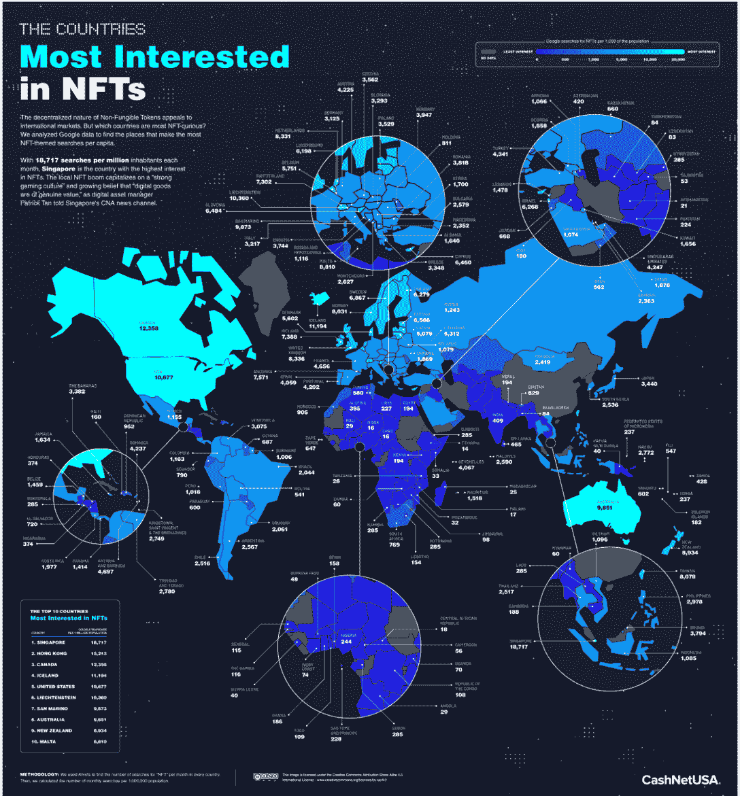
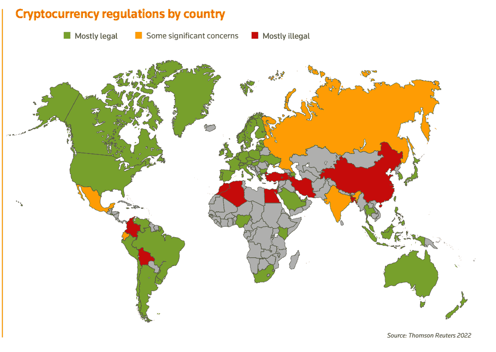
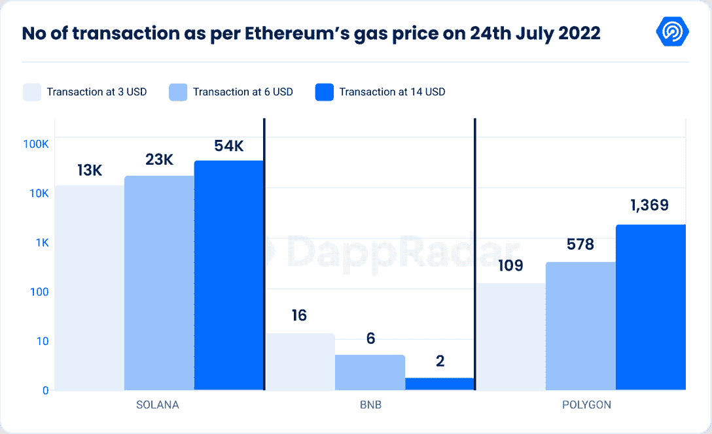
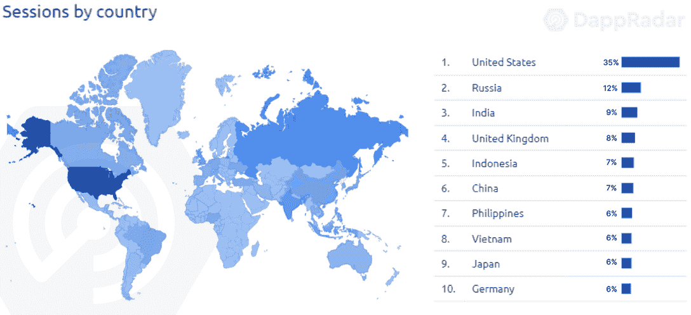
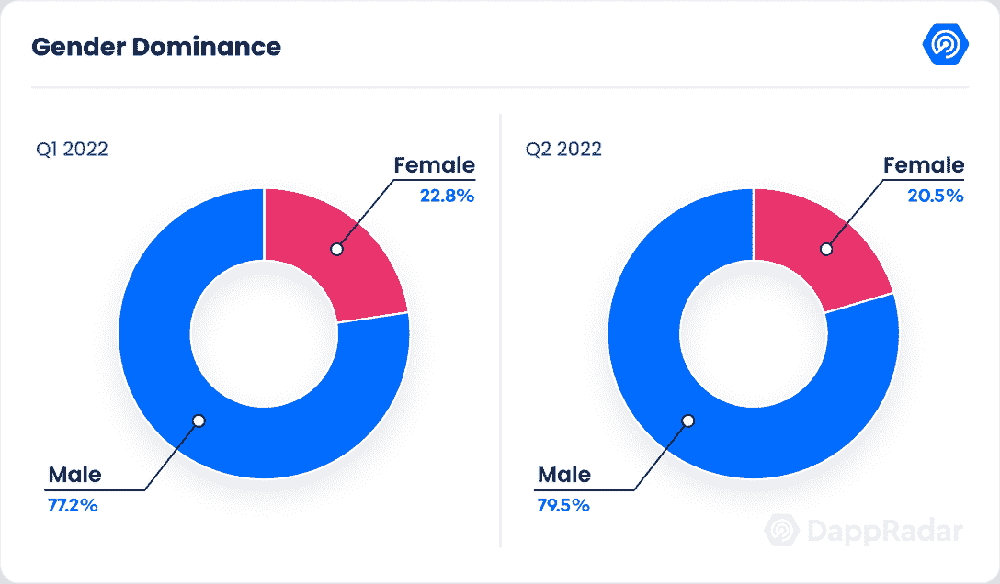
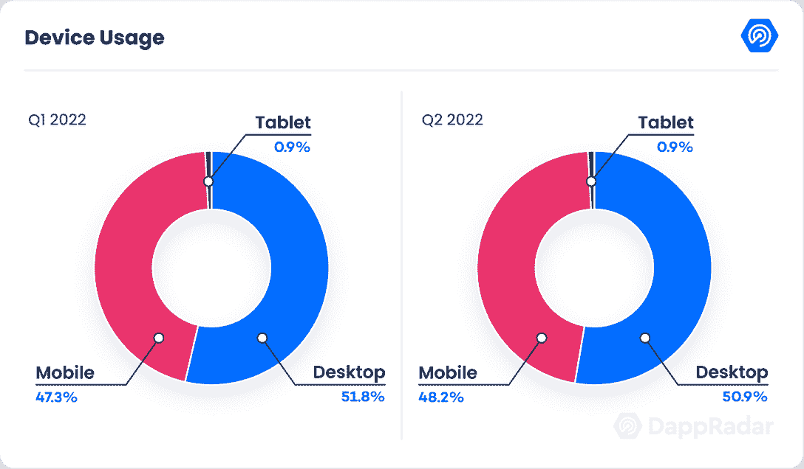
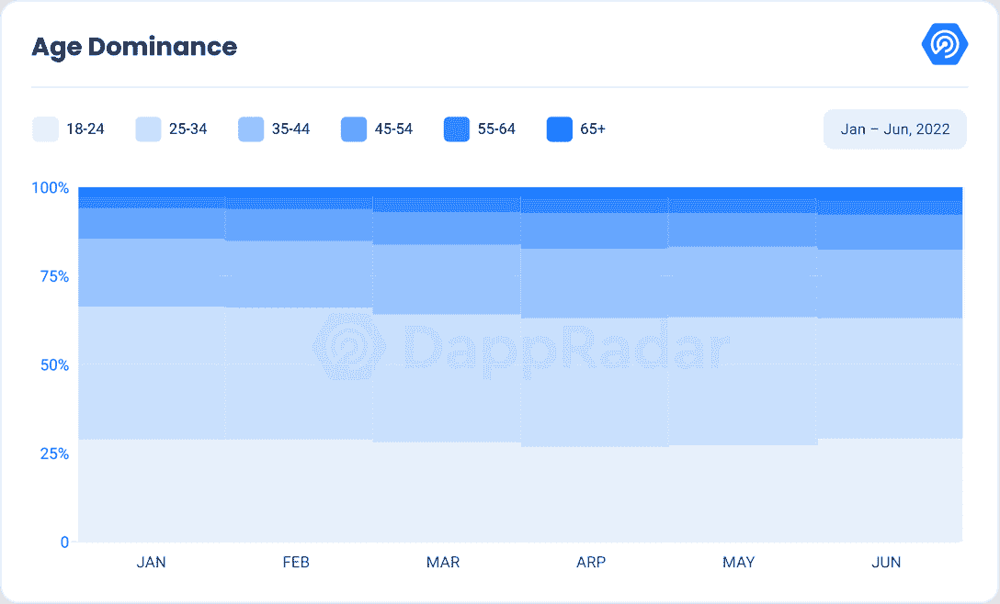

# 区块链用户对加密蔓延和最新宏观事件的反应

> 原文：<https://web.archive.org/web/https://dappradar.com/blog/how-blockchain-users-reacted-to-the-crypto-contagion-and-the-latest-macro-events>

## Terra 的崩溃变成了类似雷曼兄弟的事件，给整个加密行业带来了冲击波。

随着当时第二大 DeFi 生态系统 Terra 在 5 月份崩溃，它抹去了约 400 亿美元的风险投资和零售资金。这一打击给整个加密市场带来了沉重的压力，首先是比特币和以太坊，这对该行业的其他部分产生了溢出效应，也被称为加密传染病。结果不同的当事人受到影响，3AC、BlockFi、Celsius 都在范围之内。

DeFi 景观无疑是受影响最大的区块链垂直景观；因此，从这个角度观察用户行为是否发生了变化是很有趣的。与此同时，自 5 月份以来，NFT 市场的交易量和交易数量分别下降了 67%和 21%。

最后，多米诺骨牌效应蔓延到传统市场，世界各地的政策制定者注意到了这一点，并开始起草法规以防止未来发生此类事件。在欧洲，金融稳定委员会(FSB)将于今年 10 月向世界最大经济体的 G20 代表提交其全面监管提案。

在美国，证券交易委员会(SEC)已经将监管加密相关市场的工作人员增加了一倍，并有多项法案正在审议中，以监管 stablecoins。该报告描述了上一季度影响区块链用户的最相关行为趋势。

市场已经深深陷入恐惧之中。根据贪婪和恐惧指数，我们在 4 月底跌入恐惧区域的比例低于 50%,并一直保持至今。只有在 7 月底，随着市场情绪的变化，我们才会看到一线希望。

Source: DappRadar

## 目录

*   [地球崩溃和传染后的加密采用](https://web.archive.org/web/20221024202619/https://dappradar.com/blog/how-blockchain-users-reacted-to-the-crypto-contagion-and-the-latest-macro-events/#Crypto-adoption-after-Terra-collapse-and-contagion)
*   [世界各地对非关税壁垒的两极分化态度](https://web.archive.org/web/20221024202619/https://dappradar.com/blog/how-blockchain-users-reacted-to-the-crypto-contagion-and-the-latest-macro-events/#Polarizing-)
*   [逆势而上的区块链游戏](https://web.archive.org/web/20221024202619/https://dappradar.com/blog/how-blockchain-users-reacted-to-the-crypto-contagion-and-the-latest-macro-events/#Blockchain-Games-defying-the-market-trend)
*   [隐现调节](https://web.archive.org/web/20221024202619/https://dappradar.com/blog/how-blockchain-users-reacted-to-the-crypto-contagion-and-the-latest-macro-events/#Looming-Regulation)
*   [DeFi 正在适应后地球时代](https://web.archive.org/web/20221024202619/https://dappradar.com/blog/how-blockchain-users-reacted-to-the-crypto-contagion-and-the-latest-macro-events/#DeFi-is-adapting-to-a-post-Terra-world)
*   [人口统计学视角](https://web.archive.org/web/20221024202619/https://dappradar.com/blog/how-blockchain-users-reacted-to-the-crypto-contagion-and-the-latest-macro-events/#Demographics-perspective)
*   [关闭](https://web.archive.org/web/20221024202619/https://dappradar.com/blog/how-blockchain-users-reacted-to-the-crypto-contagion-and-the-latest-macro-events/#-Closing-)

## 关键要点

*   自 Terra 倒闭以来，区块链的整体交易活动仍相对持平，自 Q1 以来，交易总数下降了 1%，而与 DeFi 相关的交易自 5 月以来萎缩了 15%。
*   自 Q1 事件以来，每日无人机的总体平均数量减少了 12%。
*   虽然 NFT 的交易量和交易数量较 Q1 减少了三分之一，但北美、大洋洲和欧洲部分地区的兴趣仍然很高。
*   Axie Infinity 是在 112 个国家搜索最多的 NFT 系列
*   区块链游戏交易无视熊市，自 Q1 以来增长了 9.51%。
*   在 Q1 和 Q2，对游戏和元宇宙项目的投资保持在 25 亿美元。

## Terra 崩溃和传染后的加密采用

Terra 的崩溃深刻影响了加密市场。毫不夸张地说，这一事件将在未来被铭记，并将在未来数月甚至数年内继续影响市场。

Terra 已经吸引了许多密码行业内外的重要投资者。在 Terra 最有影响力的投资者中，有像比特币基地风险投资公司、币安实验室和 Celsius Network 这样的集中化平台。

让问题变得更加复杂的是，Terra 最著名的投资者之一三箭资本(Three Arrows Capital)通过从包括 Celsius、Blockfi 和 Voyager 在内的贷款机构借款，过度利用了自己的头寸，进一步增加了他们对崩溃的生态系统的敞口。

Terra 的倒闭拖垮了 3AC，该公司此后被迫根据破产法第 15 章进行清算，但这也加剧了几家贷款(CeFi)平台的财务压力。随着许多零售和机构客户的投资开始贬值，许多人匆忙撤回资产，导致贷款平台陷入银行挤兑的局面。

自上个季度以来，DeFi 的交易数量下降了 14.81%，所有 NFT 的交易数量下降了 12.2%。

区块链游戏是唯一成功避开随后熊市的垂直游戏，其在 Q2 的数量增加了 9.51%。

与 DeFi 非常相似，NFT 也受到了崩溃的严重影响。自 Q1 以来，交易量和销售额分别下降了 32.66%和 30.34%。最显著的下降发生在 5 月，交易量下降了 67%，销售数量下降了 21%。自 5 月份以来，与各种 NFT 项目互动的独特活动钱包(UAW)的平均数量也大幅下降了 24%。然而，令人欣慰的是，尽管与 2021 年的 Q2 相比有所挫折，但该活动仍增长了 48%。

尽管遭受了财务打击，削弱了对该行业的信任，但投资者仍然乐观，因为对区块链游戏和元宇宙项目的投资数量与上一季度相比保持不变，在 Q1 和 Q2 的投资额均为 25 亿美元。6 月份的月度投资额最低，仅为 5 亿美元。

除了金钱上的损失，开发商还受到了打击。4 月份 dapp 的最高数量为 750 个新的 dapp，之后逐渐下降。5 月份批准的 dapps 数量下降了 35%，为 490 个。6 月份 8%的降幅强化了这一负面趋势。

Source: [DappRadar](https://web.archive.org/web/20221024202619/http://www.dappradar.com/)

[我们的 Q2 行业报告](https://web.archive.org/web/20221024202619/https://dappradar.com/blog/dapp-industry-report-q2-nfts-and-web3-games-keep-enduring-market-conditions-as-shockwaves-from-the-terra-collapse-reach-cefi-and-vcs)对季度业绩进行了更详细的分析

## 世界各地对非功能性测试的两极分化态度

在 2021 年底，NFT 的高峰期，他们为艺术家和交易商创造了 440 亿美元的收入。在加密社区内外，NFT 一直是一个非常两极分化的话题。双方都有很多观点强烈的爱者和恨者。

分析的一部分解决了 Twitter 上的社会情绪。来自美国 CashNet 的 Joanna Burggraf 从不同的行为角度分析了 NFT 市场，她记录并分类了这些态度。

研究发现，在对 NFT 最友好的国家中，黑山以 86.2%的正面推文排名第一。波斯尼亚、黑塞哥维那和卢森堡以 78%的积极情绪并列第二。古巴以 71%的支持率位居第三。

另一方面，波兰是最害怕 NFT 的国家，有 23%的负面帖子。紧随其后的是尼加拉瓜和伯利兹，分别为 22%和 19.3%。

Source: CashNetUSA

同一项研究的另一部分调查了哪些国家对非功能性测试最感兴趣。记录了每月谷歌搜索非功能性食物的次数，并表示为每百万居民的数量。最让 NFT 好奇的国家是新加坡，有 18717 次搜索。紧随其后的是香港，有 15213 个结果。

Source: CashNetUSA

北美拥有第三和第五个对 NFT 最好奇的国家；加拿大和美国分别有 12358 次和 10677 次搜索。

大洋洲和东南亚是第二个对 NFT 最感兴趣的地区，新加坡(18，717 人)、澳大利亚(9，851 人)、新西兰(8，934 人)和台湾(8，078 人)是全球最感兴趣的国家之一。

西欧普遍对 NFT 感兴趣；冰岛以 11，194 次搜索位列第四。其他亲 NFT 的国家包括列支敦士登(10677 人)、圣马利诺(9873 人)和马尔他(8810 人)。在较大的国家中，英国(8，336)、荷兰(8，331)和挪威(8，031)引领欧洲好奇心。

中欧国家仍然有些冷漠，奥地利(4225)、德国(3125)、捷克(3562)和波兰(3529)是得分较低的国家。东欧仍然是最缺乏兴趣的地区之一，乌克兰(1869 人)、俄罗斯(1243 人)、塞尔维亚(1700 人)和摩尔多瓦(811 人)最不感兴趣。

世界其他地方似乎对此无动于衷，中东、南美和中美以及非洲的许多国家的搜索量都不到 1000 次。

委内瑞拉(3，075 人)、智利(2，516 人)、蒙古(2，419 人)和阿根廷(2，567 人)是世界其他地区最感兴趣的国家。

相对缺乏兴趣的原因可以解释为在世界范围内的一些地方获得高速的机会较少。

此外，还有数以千计的流行的 NFT 收藏；我们想勾勒出在不同地区占据主导地位的特定系列。

[Decetraland](https://web.archive.org/web/20221024202619/https://dappradar.com/blog/what-is-decentraland-an-open-world-economy-in-the-metaverse) 依然是北美最受欢迎的，而中南美洲国家则更青睐 [Axie Infinity](https://web.archive.org/web/20221024202619/https://dappradar.com/multichain/games/axie-infinity) ，除了智利，智利偏向沙盒。

像在法国、意大利和瑞士一样，欧洲的许多足球迷，在那里 Sorare 往往很受欢迎。而奥地利、德国、冰岛、拉脱维亚和列支敦士登倾向于支持分权制。

中东和亚洲也倾向于在 Axie Infinity 和分散土地之间划分，其中 80%的国家喜欢 Axie，除了蒙古、不丹、阿塞拜疆、塔吉克斯坦和乌兹别克斯坦喜欢分散土地。

非洲是一个大杂烩，有 [Axie](https://web.archive.org/web/20221024202619/https://dappradar.com/hub/nft-explorer/collection/axie-infinity) 、[、](https://web.archive.org/web/20221024202619/https://dappradar.com/hub/nft-explorer/collection/decentraland)、 [Sorare](https://web.archive.org/web/20221024202619/https://dappradar.com/hub/nft-explorer/collection/sorare) 和 [Bored Apes](https://web.archive.org/web/20221024202619/https://dappradar.com/hub/nft-explorer/collection/bored-ape-yacht-club) ，它们都在该地区的热门搜索收藏中占有重要地位。只有塞舌尔似乎是局外人，主要对城市明星 NFT 感兴趣。

## 对抗市场趋势的区块链游戏

区块链游戏继续吸引着全球各地人们的好奇心和注意力。事实上，根据之前的报告，Axie Infinity 是 112 个国家中搜索次数最多的 NFT 收藏。

遵循同样的趋势，区块链奥运会受金融危机的影响最小。自 Q1 以来，UAW 的平均活动量仅下降了 7%，这表明人们继续以与 Terra 事件前大致相同的速度与区块链·戴普互动。

与此同时，游戏相关的 NFT 交易额自 Q1 以来大幅下降了 51%，销售额下降了 82%。尽管如此，年同比交易数还是增长了 19%。

这项活动对整个区块链的影响并不一样。区块链活动的平均降幅为 17%。损失最大的是 BSC 和 Ronin，它们自 5 月以来分别损失了 23%和 36%的无人机。

像索拉纳、T2 和瓦克斯这样的连锁店描绘了一幅更加积极的画面。自 5 月以来，Wax 增长了 6%，主要是由于其充满活力的游戏社区，而明显的赢家是 Solana，增长了 311%。

尽管由于奖励系统的调整，平均活跃度下降了 16%,但 Q2 最受欢迎的游戏仍然是夹板游戏，平均有 283，729 个 UAW。

《外星世界》是稳定的灯塔，仍然以 188，116 架平均无人机排名第二，比 Q1 略微下降了 4%。《农民世界》( Farmers World)是一款总部位于区块链的游戏，自《Q1》以来已经取得了 33%的显著收益，以 124，422 架平均无人机排名第三。

你可以在我们的 [Q2 BGA 游戏报道中了解更多关于区块链游戏的信息。](https://web.archive.org/web/20221024202619/https://dappradar.com/blog/dappradar-x-bga-games-report-q2-2022)

## 外观规则

如前所述，Terra 遭受的许多损失导致价值 400 亿美元的投资资产化为乌有。损失如此严重，以至于金融监管者注意到了这一点。

虽然北美和欧洲独立处理这个问题，但他们已经承认加密市场需要更多的透明度和监督。

在密码社区中，规则从来没有得到过热烈的赞赏。许多强硬派批评立法违背了加密的核心方面，即自治和去中心化。许多人担心即将出台的法规会扼杀许多业内人士享有的创造力和自由。

Source: Thomson Reuters 2022

另一方面，安全性已经成为密码领域日益关注的问题。没有一个月一个项目没有被破坏，没有一个东西被黑客攻击，没有一个人被诈骗。

根据 rekt 数据库，最近的一次重大失败发生在和谐桥黑客攻击事件中。随着这些事件继续损害公众和投资者的信任，或许一点点疏忽就能起到很大作用。

在目前阶段，在欧洲和美国出台具体提案之前，估计监管范围还为时过早。

金融稳定委员会将于今年 10 月向 20 国集团(G20)代表提交其全面的监管提案。

在美国，SEC 已经将监管加密相关市场的工作人员增加了一倍，并有多项法案正在审议中，以监管稳定的账户。与此同时，美国证券交易委员会将利用适当的法律框架来管理加密资产。

我们在 DappRadar 密切关注全球的监管形势，了解[您需要了解的有关全球加密法规的所有信息](https://web.archive.org/web/20221024202619/https://dappradar.com/blog/guide-to-all-crypto-regulations-worldwide)。

## DeFi 正在适应后地球时代

结果并不令人惊讶。DeFi 受到了不公平的待遇，是本季度遭受损失最大的垂直行业。如前所述，大多数 DeFi 应用和交易所已经被迫清算或濒临破产。

在所有区块链中，TVL 的平均损失为-68%。相比之下，自今年年初以来，交易数量一直在稳步下降。Q1 和 Q2 之间的降幅为 14%。这一趋势在 Terra 崩溃后持续，自 5 月以来又下跌了 14%。

月环比跌幅平均在 30%左右。一些异常值，如和谐失去了 76%的 TVL 由于和谐桥黑客。

第三个最受欢迎的桥是通过泄露的私钥被黑的。虽然还不清楚攻击者是通过什么途径获得密钥的，但许多人猜测，关键问题是私钥是以明文形式保存的，没有任何加密，这为接管提供了方便。

Harmony 已经是努力吸引用户的较小连锁店之一。当市场情绪已经很糟糕，并且在 [Terra 崩溃](https://web.archive.org/web/20221024202619/https://dappradar.com/blog/terra-usd-loses-its-dollar-peg-as-whale-dumps-285-million/)中有越来越多的不信任时，这可能意味着链条的结束。只有时间能证明一切。

同比结果也没有描绘出一幅令人振奋的画面。虽然平均下降了 30%,但实际结果往往是两极化的。

以太坊非常接近平均水平，自去年以来已失去 33%的 TVL，而 BSC 和 Polygon 分别失去了 70%和 67%的 TVL。

Source: DappRadar

最大的输家当然是 Terra。它损失了 99%的价值，声誉受损，其创始人之一在韩国受到刑事起诉。除非奇迹发生，否则链家最有可能在年底退市。

在光谱的另一端，许多较小的链描绘了一幅更令人振奋的画面。Solana 去年增长了 322%，而 Fantom 增长了 455%。尽管从历史最高值下降了 80%，但 Avalanche 仍比去年增长了 1329%。

Axie Infinity 饱受打击的连锁店 Ronin 从历史高点下跌了 92%。大部分损失发生在 Q1，原因是浪人入侵大桥。尽管为 Axie 打败了开发者，继续支持这个项目来扭转它。6 月，开发者们推出了起源更新，解决了游戏的许多用户问题。开发者们也允许许多用户最终下注他们的土地来获得 AXS 代币。这些变化使 Axie 的平均 UAW 自 5 月以来增加了 247%。

Solana 吸引了许多 NFT 和游戏开发商，主要是因为它更便宜的交易成本和更快的处理速度。积极的一面是，天然气价格以及交易量也有所下降。

以太坊的天然气价格下降无法与较小的连锁店竞争。最近的天然气快照显示，Solana 在 14 美元的价格点发生了超过 54，000 笔交易，而在 3 美元的交易价格点发生了 13，000 笔交易，这不是一个微不足道的数字。这当然解释了索拉纳的收益。

其他连锁店很难与索拉纳设定的价格竞争，因为 Polygon 在 14 美元的交易量仅为索拉纳的 2.5%，只有 1369 笔交易。它的交易量也不到 1%，只有 109 笔交易，价格为 3 美元。与此同时，BSC 低于 14 美元的交易总额仅略高于 20 美元。

Source: DappRadar

## 人口统计视角

使用 Dappradars 流量分析，我们可以得出一些关于市场行为模式的结论。

美国仍然是 crypto 的最大用户。然而，这一数字自上个季度以来下降了 38%。远远落后的第二名是印度，从最后报告的第四名上升，自 5 月份以来增长了 5%。

俄罗斯下滑至第三位，其流量自上个季度以来基本保持不变。自上一季度以来，英国从第三位下滑至第四位，来自不列颠群岛的流量下降了近 23%。

最显著的下降来自中国，其流量减少了 52%，尽管其在图表中的位置没有改变。菲律宾与越南互换了位置，下降了 44%，而越南仅小幅下降了 16%。

尽管流量下降了大约三分之一，新加坡仍然保持着第九的位置。

最后，德国在最后一个季度把位置让给了日本。尽管日本方面的出席率保持不变，但德国方面的兴趣自上个季度以来已经下降了 30%。

自上个季度以来，性别主导地位基本上没有改变，因为男性仍然保持着大约 80/20 的比例。本季度男性观众增长了 2.5 个百分点。

Source: DappRadar

设备使用量也保持不变。略超过一半的用户喜欢通过台式电脑访问网站，而不到一半的用户是移动用户。剩下的都是平板用户。

Source: DappRadar

自上个季度以来，年龄差距似乎变得更加明显。自上一季度以来，年轻一代占据了更大的观众份额。25 岁至 44 岁的千禧一代占 Dappradar 访客的一半以上，占 52%，其次是 24 岁及以下的 GenZ，现在几乎占网站流量的三分之一。

年龄在 45 岁至 64 岁之间的人占总流量的 14%，自上个季度以来也增长了 4 个百分点。最后，婴儿潮一代代表了人口统计学上最显著的变化，因为他们的出勤率已经下降到 3%。

Source: DappRadar

## 关闭

越来越清楚的是，Terra 的崩溃已经成为一个类似雷曼兄弟的事件，给整个加密行业带来了冲击波，并将在未来几个月内影响我们。

这本身就是一个巨大的财务打击，再加上 3AC 的清算；这也大大削弱了投资者对密码行业的信任。

所有这些事件都引起了全球监管机构的关注。尚不清楚监管变化对该行业可能产生的影响。

这可能是另一个多德-弗兰克式的场景，监管机构将对整个行业进行彻底检查，也可能只是轻微的惩罚。只有时间能证明一切。对许多人来说，仅仅是即将出台的监管规定就已经敲响了警钟。

也许一点点毒药就能解决问题，而一些监管将对重塑行业形象大有帮助。就目前的情况来看，很明显，对加密相关产品的流量和兴趣正在下降。

虽然高度膨胀的价格是由美联储慷慨的现金注入造成的，它在不到两年的时间里印刷了超过 16 万亿美元，但责任不仅仅在于他们。

它结合了许多主要硬币和代币的贬值价格以及黑客攻击和利用的日益频繁和严重。这场危机凸显了密码行业成员在所有层面和所有垂直领域采用许多不负责任做法。

应该注意的是，虽然经济活动仍然是可取之处，但如果我们在未来发展和繁荣，该行业必须清醒并放弃不负责任的行为。

尽管经历了这些艰难时期，市场活动仍然保持稳定，UAW 平均活动季度环比仅略有下降，下降了 12%。

同比数字描绘了一个更加乐观的前景，因为我们在 UAW 的活动总体增长了 62%。自 Q1 以来，交易数量仍保持在 1%的水平。

与元宇宙相关的 NFT 项目是希望的灯塔，因为它们报告的贸易额和交易总额分别增长了 97%和 27%。

尽管前面提到非关税壁垒受到挫折，但全球的兴趣仍然很大。像迪斯尼和派拉蒙这样的大公司正在进入这个领域，投资 NFT 的基础设施。Gala 还通过将业务扩展到音乐和电影领域，拓宽了 NFTs 的用途。

有很多积极的事情值得期待，但我们必须谨慎对待未来。

 NewsletterUnsubscribe at any time. [T&Cs](https://web.archive.org/web/20221024202619/https://dappradar.com/terms) and [Privacy Policy](https://web.archive.org/web/20221024202619/https://dappradar.com/privacy-policy)