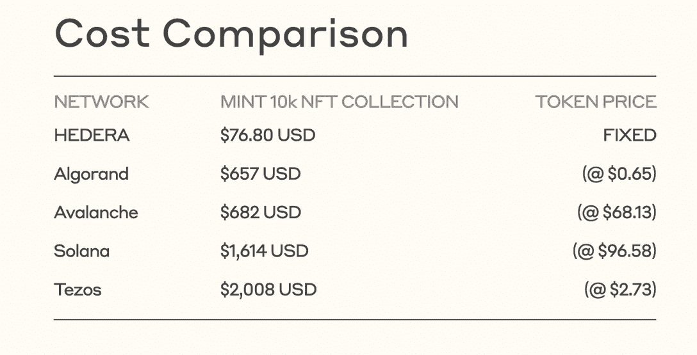
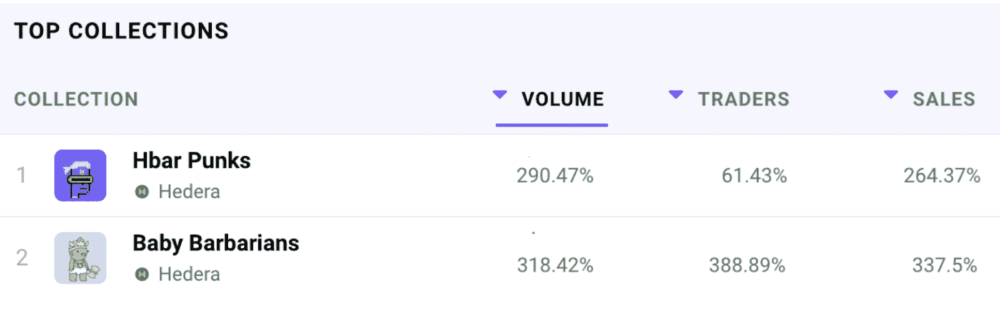

# Hedera 如何通过其充满活力的 NFT 生态系统为项目提供支持

> 原文：<https://web.archive.org/web/https://dappradar.com/blog/how-can-hedera-empower-projects-with-its-vibrant-nft-ecosystem>

## Zuse Market 和 Hash Axis 是 Hedera 上发展最快的 NFT 社区。

Hedera 致力于为 NFT 的收藏家、项目和应用开发者提供一个充满活力的公共网络。值得注意的是，海德拉 NFT 生态系统已经引入了一系列高质量的项目，包括 NFT 支持的钱包，市场，NFT 收藏，等等。

**概要:**

*   [**H** edera](https://web.archive.org/web/20220816092949/https://dappradar.com/nft/protocol/hedera) 已经成为最受青睐的 NFT 生态系统之一。
*   与[索拉纳](https://web.archive.org/web/20220816092949/https://dappradar.com/rankings/protocol/solana)、[雪崩](https://web.archive.org/web/20220816092949/https://dappradar.com/rankings/protocol/avalanche)、[以太坊](https://web.archive.org/web/20220816092949/https://dappradar.com/rankings/protocol/ethereum)相比，海德拉提供了最具竞争力的铸造 NFT 的成本。
*   在过去的 30 天里，Hedera 上最受欢迎的 NFT 市场 Zuse Market 和 [Hash Axis](https://web.archive.org/web/20220816092949/https://dappradar.com/hedera/marketplaces/hash-axis) 的交易量增长惊人，Hash Axis 增长了 40 %, Zuse Market 增长了 16%。
*   HBAR 基金会启动了一个 2.5 亿美元的元宇宙基金，以推动 Hedera 生态系统的扩张。

## NFT 行业 2022 Q2 绩效概述

作为一种新兴技术，企业和个人对 NFTs 的采用正在上升。根据 [DappRadar Q2 行业报告，](/web/20220816092949/https://dappradar.com/blog/dapp-industry-report-q2-nfts-and-web3-games-keep-enduring-market-conditions-as-shockwaves-from-the-terra-collapse-reach-cefi-and-vcs/)与去年相比，NFT 整体交易量增长了 1999%，基于以太坊的收藏品增长了 2093%，而 Polygon 增长了 456%。

2022 年第二季度，以元宇宙为重点的非上市公司表现良好。以太坊上此类收藏品的交易量在整个行业分别增长了 101%和 96%。NFT 空间的另一个重要现象值得注意。越来越多的项目转移到更加节能的区块链。

因此，Solana 和 Avalanche 等区块链公司在第二季度的 NFT 服务中表现出色，销量分别增长了 21%和 15%。

此外，一个由 NFT 收藏家、创作者和生态系统开发者组成的充满活力的社区正在 Hedera 上形成。那么，让我们仔细看看[海德拉·NFT 生态系统最近的里程碑。](https://web.archive.org/web/20220816092949/https://hedera.com/nft?utm_source=dappradar&utm_medium=blog&utm_campaign=nft-lp&utm_content=blog2)

## 海德拉的 NFT 生态系统进化迅速。

由于 Hedera 独特的共识模型和购买季度碳抵消信用的倡议，它已经成为在提供分散技术的同时实现碳中和的杰出实践者。此外，在 Hedera 上铸造 NFT 的费用非常有竞争力，这增加了它的受欢迎程度。

Hedera 生态系统已经发展成为一个包罗万象的生态系统。强大的 [Hashpack](https://web.archive.org/web/20220816092949/https://dappradar.com/hedera/defi/hashpack) wallet 和各种市场让用户可以轻松地在其生态系统中收集、创建和交易 NFT。

### 海德拉的 NFT 市场见证了交易者的增长

Zuse Market 和 [Hash Axis](https://web.archive.org/web/20220816092949/https://dappradar.com/hedera/marketplaces/hash-axis) 是 Hedera 上领先的 NFT 市场。根据 DappRadar Hedera NFT 的跟踪，两个 dapps 在过去 30 天里都取得了令人印象深刻的交易增长，Hash Axis 增长了 40%，Zuse Market 增长了 16%。

让我们放大 NFT 的收藏品。Hash Axis 上的 Hbar Punks 和 Zuse Market 上的 Baby 蛮战在所有指标上都领先。具体来看，Hbar 朋克交易额增长 290%，用户增长 64.29%，销售额增长 266.67%。同样，婴儿蛮战经历了数据的增长，数量增加了 388%，用户增加了 450%，销售额增加了 400%。

## HBAR 基金会推动生态系统扩张。

HBAR 基金会通过提供赠款和其他资源来孵化 DeFi、NFTs、游戏和其他领域有前途的 dapps，努力推动 Hedera 生态系统的发展。

除了通过简化的拨款流程提供资本资源外，HBAR 基金会还提供各种专家支持，涵盖技术、营销、业务开发和其他运营职能，这些都是扩大 dapps 规模所必需的。

HBAR 启动了一个 2.5 亿美元的元宇宙基金，以加速 Hedera 生态系统的扩张，并支持开发者的出色想法成为现实。HBAR 已经成功孵化了多个领域的项目，包括[生态钱包杂牌](https://web.archive.org/web/20220816092949/https://ledgernomic.com/hashpack-wallet-receives-funding-from-hbar-foundation/)、 [NFT 市场 Zuse Market](https://web.archive.org/web/20220816092949/https://www.hbarfoundation.org/blog-post/zuse-market-receives-support-from-the-hbar-foundation) 、 [NFT 评级系统 NFT 等级](https://web.archive.org/web/20220816092949/https://www.hbarfoundation.org/blog-post/nft-grade-launches-on-hedera-with-support-from-the-hbar-foundation)等正在筹备中的项目。

目前，元宇宙基金已向 127 个项目拨款 317，074，641 美元，Hedera 期待更多高质量的项目受益于这笔赠款。雄心勃勃的团队可以点击此链接[申请资助](https://web.archive.org/web/20220816092949/https://www.hbarfoundation.org/apply-form)。

了解更多关于 Hedera 的信息:

[网站](https://web.archive.org/web/20220816092949/https://hedera.com/)

[NFT E](https://web.archive.org/web/20220816092949/https://hedera.com/nft#nft-ecosystem)生态系统

[推特](https://web.archive.org/web/20220816092949/https://twitter.com/hedera)

[不和](https://web.archive.org/web/20220816092949/https://hedera.com/discord)

[资助项目](https://web.archive.org/web/20220816092949/http://hbarfoundation/)

**免责声明** —这是一篇赞助文章。DappRadar 不认可本页面上的任何内容或产品。DappRadar 旨在提供准确的信息，但读者应该在采取行动之前总是自己做研究。DappRadar 的文章不能被认为是投资建议。