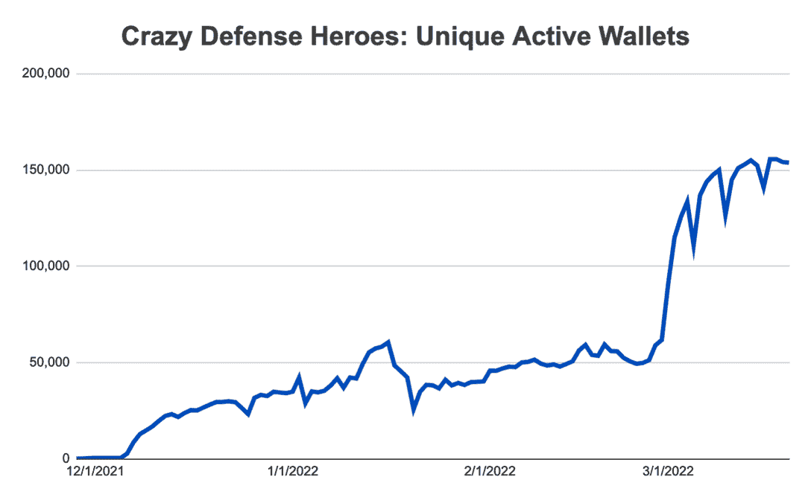
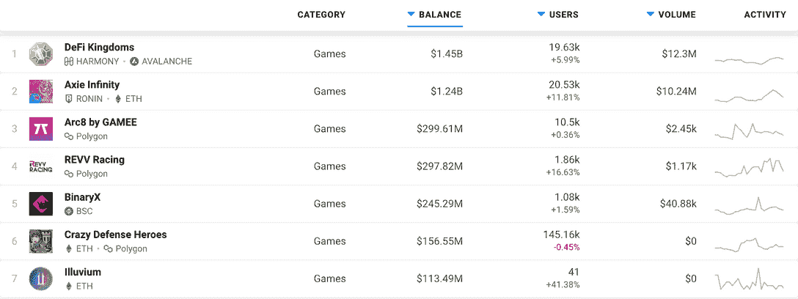
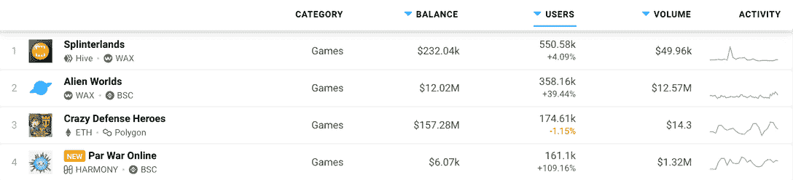

# 疯狂的防御英雄是如何主宰游戏的

> 原文：<https://web.archive.org/web/https://dappradar.com/blog/how-crazy-defense-heroes-came-to-dominate-play-to-earn-gaming>

## 疯狂防御英雄昨天庆祝了它的第四个生日。今天，它在游戏赚钱领域占据着至高无上的地位

[**疯狂防御英雄**](https://web.archive.org/web/20220929110501/https://dappradar.com/ethereum/games/crazy-defense-heroes) **始于四年前一款简单的塔防游戏。现在，它凭借每天与该平台互动的 139，798 个独特的活动钱包，统治着游戏世界。**

塔防(TD)游戏的历史可以追溯到 80 年代初。前提很简单:在敌人试图穿越地图从 A 点到达 B 点时阻止他们。玩家拥有一系列防御性武器，他们可以战略性地部署这些武器来阻止对手前进。

《疯狂防御英雄》是四年前作为《疯狂国王》续集首次推出的众多免费游戏之一。但在 2020 年 5 月，该游戏的开发商 Animoca Brands 开始将区块链技术融入游戏，以产生一种新的体验，这种体验已经稳步占领了游戏赚钱的世界。他们将该项目命名为“高塔实验”,这是一项将现有手机游戏改造成“玩赚区块链”游戏的计划。

Crazy Defense Heroes UAW interactions

上图显示了自 2021 年 12 月初以来，与疯狂防御英雄互动的唯一活跃钱包数量。在此期间，平均每日互动从 2021 年 12 月的 20，655 架无人机增加到 2022 年 3 月的 139，798 架。

## 从免费游戏到赚取游戏的转变

许多人认为从免费游戏到付费游戏的转变是 web2 和 web3 的一个显著区别。免费游戏是装在中央服务器上的软件包，用户可以免费玩。游戏的主机通常会从广告、微交易和内容拓展中赚钱。想想《糖果粉碎》中的糖果和《堡垒之夜》中的人物皮肤。

“玩即赚”游戏或多或少地包含了区块链技术的元素。用户可以获得奖励，并在生态系统内交易资产，从而获得代币、加密货币和现实世界的货币。2020 年 5 月，Animoca Brands 推出了 100 个超值宝箱的销售活动。这些包含在游戏中的内容和资源，以及一个单一的疯狂防御英雄收集 NFT 卡。这是游戏玩家对 NFTs 的第一次介绍。

2021 年 2 月 25 日，Animoca Brands 通过铸造 100 亿美元的[塔](https://web.archive.org/web/20220929110501/https://dappradar.com/hub/token/eth/TOWER?from=0x1c9922314ed1415c95b9fd453c3818fd41867d0b)，即以太坊区块链上的游戏内 ERC-20 令牌，向疯狂的国防英雄们推出了令牌组学。令牌发布计划持续到 2026 年初，令牌分配如下:

*   从玩到赚:30 亿代币
*   营销资金池:15 亿代币
*   流动性池:15 亿代币
*   团队和顾问库:15 亿代币
*   公司储备池:15 亿代币
*   社区发展基金:10 亿代币

玩家可以通过完成游戏内每月任务来赢得经验值。然后，通过将他们的加密货币钱包与疯狂的防御英雄联系起来，他们可以从高塔代币的奖金池中分得一杯羹。今年 3 月和明年 4 月，奖金池将为 180 万塔(35.2 万美元)。塔奖励现在在多边形区块链上支付。

## 疯狂防御英雄和战场相比如何

说疯狂的防御英雄统治着游戏赚钱的版图并不夸张。查看 DappRadar 的区块链游戏的[排名页面，我们可以看到这款游戏在多个分析类别中排名靠前。](https://web.archive.org/web/20220929110501/https://dappradar.com/rankings/category/games)

就 dapp 智能合约中的资产总价值而言，《疯狂防御英雄》在所有区块链游戏中排名第六，余额为 1.5655 亿美元。

[<picture></picture>](https://web.archive.org/web/20220929110501/https://dappradar.com/rankings/category/games)

[DappRadar rankings](https://web.archive.org/web/20220929110501/https://dappradar.com/rankings/category/games)

过去一周，该平台在与 dapp 互动的唯一活跃钱包数量方面排名第三，仅次于《夹板王国》和《T2》【外星世界】。

[<picture></picture>](https://web.archive.org/web/20220929110501/https://dappradar.com/rankings/category/games)

[DappRadar rankings](https://web.archive.org/web/20220929110501/https://dappradar.com/rankings/category/games)

这些令人印象深刻的排名证明了 Animoca Brands 对疯狂防御英雄的持续开发。他们计划发布一个新的区块链动力塔防作为专营权的最新条目。它也将允许玩家使用他们的疯狂国王特许经营 NFT，并通过游戏赚取塔代币。

当疯狂防御英雄发布的时候，DappRadar 会给你更多的更新。关于区块链游戏和分散应用世界的所有其他新闻，请继续关注 [DappRadar](https://web.archive.org/web/20220929110501/https://dappradar.com/blog/) 并在 [Twitter](https://web.archive.org/web/20220929110501/https://twitter.com/DappRadar) 上关注我们。你也可以参加我们每周四下午 4 点的[不和谐](https://web.archive.org/web/20220929110501/https://discord.com/invite/QMnwjGzrkG)节目。