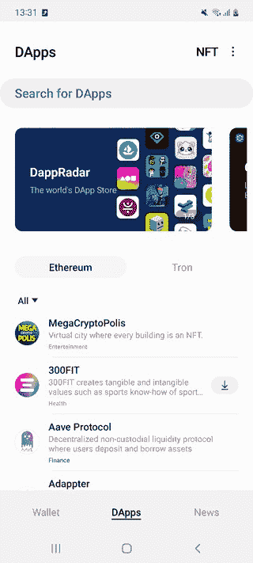

# DappRadar 与三星区块链钱包的合作如何推动下一代 Web3 智能手机用户

> 原文：<https://web.archive.org/web/https://dappradar.com/blog/how-dappradars-partnership-with-samsung-blockchain-wallet-is-powering-the-next-generation-of-web3-smartphone-users>

## DappRadar 正在与三星区块链钱包合作

DappRadar 与三星区块链钱包合作，共同努力创造一个去中心化的世界，在这个世界中，任何人都可以为自己发现最好的 dapps，从最新的 DeFi 产品到他们最喜欢的 NFT。

三星区块链钱包于 2019 年与 Galaxy S10 一起推出，支持最受欢迎的加密货币，包括比特币、以太坊、ERC 代币。作为一个方便和安全的加密钱包，它允许用户直接在手机上自行保管他们的密码。

与 DappRadar 的合作关系的强大之处在于，它为三星区块链钱包用户提供了一个简单而安全的网关，以发现和探索支持 Web3 的去中心化应用(dapp)。

Source: [Samsung Blockchain Wallet](https://web.archive.org/web/20220926152323/https://www.samsung.com/global/galaxy/apps/samsung-blockchain/)

作为全球 dapp 商店，DappRadar 的可靠数据与区块链钱包无缝共享。这允许三星区块链钱包用户从钱包内浏览 DappRadar 的 dapp 排名，以跟踪最受欢迎的 dapp。由于这些信息显示在钱包中，用户可以访问超过 48 个协议的 11，000 个 dapps 的详细信息，包括 NFT，收藏品，游戏和 DeFi。

用户可以通过搜索最新排名来挖掘下一个加密机会，例如按照 dapp 的总资产快速排序，以便决定是否了解特定 dapp 的更多信息。

DappRadar 首席执行官 Skirmantas Januskas 总结了整合对三星区块链钱包用户的价值:

> DappRadar 自豪地帮助数百万区块链爱好者发现分散式应用程序，并在 Web3 的世界中自学。我们非常高兴能够为三星区块链钱包用户提供无缝体验。

 NewsletterUnsubscribe at any time. [T&Cs](https://web.archive.org/web/20220926152323/https://dappradar.com/terms) and [Privacy Policy](https://web.archive.org/web/20220926152323/https://dappradar.com/privacy-policy)