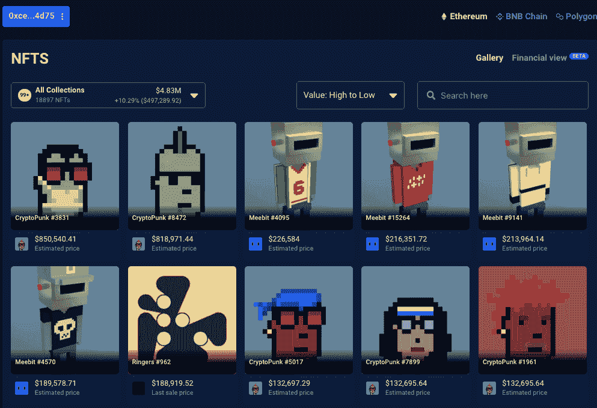
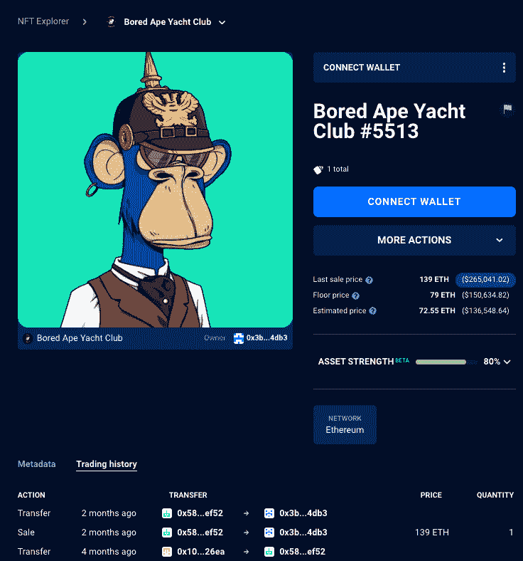
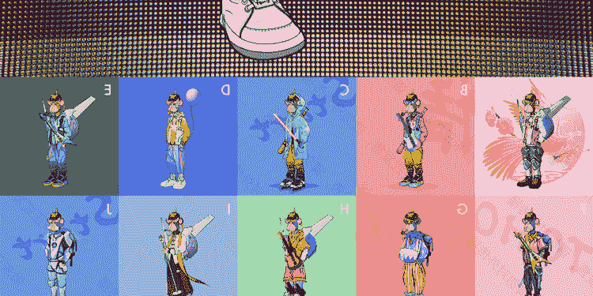
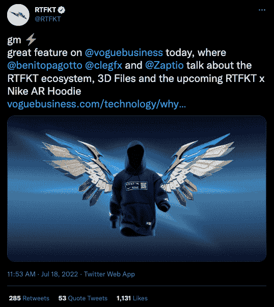
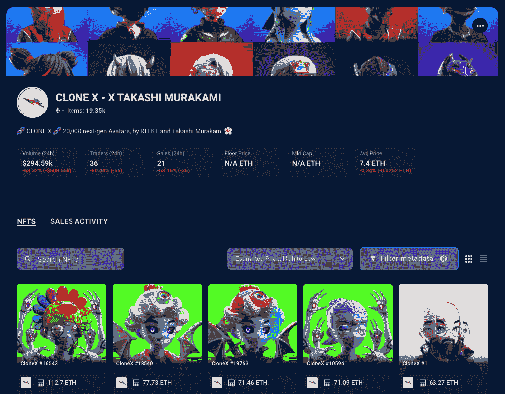

# 所有权和版权如何为 NFTs 工作？

> 原文：<https://web.archive.org/web/https://dappradar.com/blog/how-do-ownership-and-copyright-work-for-nft>

## 关于知识产权、版权和非专利技术所有权的关键问题的答案

虽然 NFT 收藏最近人气飙升，但围绕知识产权、版权和所有权执行问题的紧迫问题的答案直到最近才开始显现。

NFT 只是区块链中对应于特定图像的令牌，而不是实际的图像。此外，在各种数字收藏品市场上观看 NFT 是公开的。使用像 [DappRadar 投资组合追踪器](https://web.archive.org/web/20221208103906/https://dappradar.com/hub/wallet/)这样的工具，任何人都可以看到[著名的 NFT 收藏家](https://web.archive.org/web/20221208103906/https://dappradar.com/blog/celebrity-wallets-a-dive-into-crypto-hollywood)和像 [Snoop Dogg](https://web.archive.org/web/20221208103906/https://dappradar.com/hub/wallet/eth/0xce90a7949bb78892f159f428d0dc23a8e3584d75) 、[beepple](https://web.archive.org/web/20221208103906/https://dappradar.com/hub/wallet/eth/0xc6b0562605d35ee710138402b878ffe6f2e23807)或 [Paris Hilton](https://web.archive.org/web/20221208103906/https://dappradar.com/hub/wallet/eth/0xb6aa5a1aa37a4195725cdf1576dc741d359b56bd) 这样有影响力的人的钱包。

[*Jump into Snoop Dogg’s NFT Collection*](https://web.archive.org/web/20221208103906/https://dappradar.com/hub/wallet/eth/0xce90a7949bb78892f159f428d0dc23a8e3584d75/nfts)

Punks，[crypto punks collection](https://web.archive.org/web/20221208103906/https://twitter.com/cryptopunksnfts/status/1559284220442320897?s=21&t=gMBGQM2RAFn6Ufnec8hoWA)的知识产权协议现已生效。这一刻是 Lava Labs 的团队从第一天就承诺的，看到社区使用[术语作为指导](https://web.archive.org/web/20221208103906/https://licenseterms.cryptopunks.app/)来构建什么将是令人着迷的。

与此同时， [Bored Ape 游艇俱乐部(BAYC) NFT 收藏](https://web.archive.org/web/20221208103906/https://dappradar.com/ethereum/collectibles/bored-ape-yacht-club)网站上的信息称，所有者获得“赋予消费者的对其 NFT 的所有权和商业使用权”然而，很难确切知道他们的意思[，因为这个信息混淆了 NFT](https://web.archive.org/web/20221208103906/https://boredapeyachtclub.com/#/terms) 和实际图像。然而，人们普遍认为，BAYC 持有人对他们的 NFTs 和所描绘的形象拥有完全的权利。

有时，人们只需点击右键，保存 NFT 图片，然后自己使用，这就引发了关于所有权和版权的争论。此外，每个集合似乎有轻微不同的规则和条例；一些收藏给予持有者完全的版权许可，而另一些则给予有限的权利。

在这篇文章中，我们将深入到一些最著名的 NFT 收藏中，来解读 NFT 版权和所有者权利的现状。我们还将关注最近的项目和新兴的知识产权收藏。

[<picture></picture>](https://web.archive.org/web/20221208103906/https://dappradar.com/blog/what-are-non-fungible-tokens-nfts)[<picture></picture>](https://web.archive.org/web/20221208103906/https://dappradar.com/nft/marketplaces)[<picture></picture>](https://web.archive.org/web/20221208103906/https://dappradar.com/nft/sales)

## 密码朋克

无聊猿游艇俱乐部(BAYC)的创始人宇迦实验室宣布，它于 2022 年 3 月从幼虫实验室收购了 CryptoPunks 和 Meebits NFT 系列的知识产权(IP)。通过将这些品牌添加到他们的产品组合中，宇迦实验室现在拥有该艺术的版权，以及 423 个加密朋克和 1711 个密比特。

朋克，[《密码朋克》系列](https://web.archive.org/web/20221208103906/https://twitter.com/cryptopunksnfts/status/1559284220442320897?s=21&t=gMBGQM2RAFn6Ufnec8hoWA)的知识产权协议现已生效，持有人可以在这里阅读它们[。这个时刻是熔岩实验室的团队从第一天开始就承诺的，文件概述了 CryptoPunk 持有者可以获得的机会。](https://web.archive.org/web/20221208103906/https://licenseterms.cryptopunks.app/)

这意味着社区可以利用朋克或他们拥有的朋克来创建不同类型的内容和衍生品，但规定朋克不能用于非法目的或仇恨言论。

同样重要的是要注意宇迦实验室保留更改权利的细则。此外，这是因为密码朋克正在开辟新的领域，未来可能需要灵活性来更好地为持有者服务。

第一个创作是在朋克文件发布之前，以 Tiffany & Co 的 NFT 新[系列的形式出现，名为 NFTiff，专门提供给 crypto 朋克持有者。持有者还会额外收到一个 NFT 版本的吊坠。虽然宇迦没有直接参与](https://web.archive.org/web/20221208103906/https://twitter.com/cryptopunksnfts/status/1553814602118479873) [@dt_chain](https://web.archive.org/web/20221208103906/https://twitter.com/dt_chain) 、 [@TiffanyAndCo](https://web.archive.org/web/20221208103906/https://twitter.com/TiffanyAndCo) 和 [@alexarnault](https://web.archive.org/web/20221208103906/https://twitter.com/alexarnault) 之间的合作，但这是一个很好的例子，说明了[crypto punk](/web/20221208103906/https://dappradar.com/blog/cryptopunks-and-bored-apes-yacht-club-were-the-hottest-nfts-last-week/)持有者能够通过知识产权许可协议做的事情。

CryptoPunks 在 NFTs、crypto 和 Web3 的世界中有着重要的历史意义，被广泛认为是以太坊上最 OG 的 NFT 集合[，尽管不是第一个。自从获得该系列的知识产权后，宇迦的首要目标就是兑现自己的 OG 身份，并给予社区他们从第一天起就承诺的东西。](/web/20221208103906/https://dappradar.com/blog/why-are-people-bullish-on-ethereum/)

[CryptoPunk 的条款和条件](https://web.archive.org/web/20221208103906/https://licenseterms.cryptopunks.app/)与 BAYC 不同，crypto punk 以前限制向 crypto punk 所有者转让知识产权、版权或商标。这就是为什么宇迦实验室给予 NFT 持有者完全的商业权利，使开发者和社区创建者能够将[crypto 朋克](/web/20221208103906/https://dappradar.com/blog/how-to-value-cryptopunks/)和 [Meebits](/web/20221208103906/https://dappradar.com/blog/meebits-nfts-attract-whale-activity-floor-price-jumps-93/) 整合到 Web3 项目中。

## 无聊猿游艇俱乐部

BAYC 系列是宇迦实验室于 2021 年 4 月推出的 10，000 个看起来无聊的 ape PFP avatar NFTs 的版本，受到了相对低调的接待，成为有史以来最受尊敬的系列之一。在许多方面，该系列与 CryptoPunks 非常相似，因为最初的创作者制作了一个模板，并通过混合和匹配特征来产生变化。

[Bored Ape 游艇俱乐部](https://web.archive.org/web/20221208103906/https://dappradar.com/hub/nft-explorer/collection/bored-ape-yacht-club)从一开始就对 NFT 版权采取了独特的方式，给予每艘 Bored Ape NFT 游艇的购买者以各种身份使用数字艺术的许可。包括根据[条款和条件](https://web.archive.org/web/20221208103906/https://boredapeyachtclub.com/#/terms)对物业进行商业开发和利用。
第一个例子发生在 2022 年 5 月，当时已经在中国发行 NFT 的东邦俱乐部宣布[以 139 ETH 的价格收购 BAYC #5513](https://web.archive.org/web/20221208103906/https://dappradar.com/hub/assets/eth/0xbc4ca0eda7647a8ab7c2061c2e118a18a936f13d/5513) ，或在出售时超过 265，000 美元，以创建一个新的以中国为中心的 NFT 系列。

Look Inside Toho Club’s [NFT](https://web.archive.org/web/20221208103906/https://dappradar.com/hub/wallet/eth/0x3b4e396f8630b26c6b172ecdd11e66846bd24db3) Wallet

无聊猿东邦俱乐部(BATC)的形象是基于无聊猿的风格和图纸。然而，BATC 的设计融入了更适合中国人口味的元素。

该集合包括 9999 张 BATC 图像，这些图像是通过对 11 个身体部位和 400 多个元素进行编程而随机生成的。本质上，使用了原始 BAYC 猿的脸，并添加了一个身体，不像原始 BAYC 化身。这使得每个 BATC 都是独一无二的中文原版数字版权产品。

BATC 将作为版权产品发行，购买者可以修改他们的 BATC 或将其用于实物生产和商业许可。这是中国 NFT 产业发展的重要一步。

此外，数十位名人和企业已经宣布了他们购买 BATC 的意向，以获取以中国为中心的新系列的商业价值。这并不令人惊讶，因为东方市场总是倾向于借用西方的理念，并为东方观众重塑它们。当然，另一方面也是如此，而且不是单向交易。

考虑到名人，2022 年出现了另一个案件，有可能开创被盗非功能性器官移植的先例。2022 年 5 月 17 日，演员、制片人、作家兼导演赛斯·格林在推特上宣布[他的 NFTs](https://web.archive.org/web/20221208103906/https://dappradar.com/hub/wallet/eth/0xb1c193920af1e5a74b5b38a4240a4d6bbac6b082) ，包括一只[无聊猿、两只变异猿和一只嘟嘟](https://web.archive.org/web/20221208103906/https://dappradar.com/hub/wallet/eth/0xb1c193920af1e5a74b5b38a4240a4d6bbac6b082/nfts)，都被偷了。此外，他一直在制作电视节目“白马酒馆”，该节目旨在展示被盗的 [BAYC #8398](https://web.archive.org/web/20221208103906/https://dappradar.com/hub/wallet/eth/0xb1c193920af1e5a74b5b38a4240a4d6bbac6b082/nfts) 。

[<picture></picture>](/web/20221208103906/https://dappradar.com/blog/Take%20a%20look%20is%20Seth%20Green%E2%80%99s%20NFT%20Wallet)

[*Take a look is Seth Green’s NFT Wallet*](https://web.archive.org/web/20221208103906/https://dappradar.com/hub/wallet/eth/0xb1c193920af1e5a74b5b38a4240a4d6bbac6b082/nfts)

在这种情况下，一些行业评论员认为这一事件只不过是一个公关噱头，将广泛照亮赛斯·格林的新节目和 BAYC。也有人质疑为什么赛斯·格林会在他火热的钱包里保存如此重要的 NFT 物品。

当赛斯·格林点击一个链接，将他带到一个恶意的 NFT 造币网站时，这个骗局发生了，他的数字资产被盗。后来，一位名叫 DarkWing84 [的收藏家以 106 ETH，](https://web.archive.org/web/20221208103906/https://dappradar.com/hub/assets/eth/0xbc4ca0eda7647a8ab7c2061c2e118a18a936f13d/8398)或大约 20 万美元的价格买下了格林被盗的 NFT。

这位演员威胁要对黑暗之翼 84 采取法律行动，但是是什么说服了黑暗之翼 84 把 NFT 归还给赛斯·格林还不清楚。[交易历史](https://web.archive.org/web/20221208103906/https://dappradar.com/hub/wallet/eth/0xb1c193920af1e5a74b5b38a4240a4d6bbac6b082)显示 [NFT 被转移而不是卖](https://web.archive.org/web/20221208103906/https://dappradar.com/hub/wallet/eth/0xb1c193920af1e5a74b5b38a4240a4d6bbac6b082)回赛斯·格林的 NFT 钱包。我们可以假设达成了附带协议。

然而，将许可权与 NFT 本身联系起来引发了几个关于 NFT 何时被盗的问题，增加了围绕 NFT 和其他加密资产的日益增长的需要解决的法律问题的清单。此外，仅在美国，各州对被盗和后来购买的货物的不同处理方式将使问题进一步复杂化，更不用说地理边界了。

最显而易见的是，法律团队和 NFT 创作者未来几年将会很有趣，越来越多的案例出现，有助于在出现此类问题时树立先例。

[https://web.archive.org/web/20221208103906if_/https://www.youtube.com/embed/uUGdvLnvte0?feature=oembed](https://web.archive.org/web/20221208103906if_/https://www.youtube.com/embed/uUGdvLnvte0?feature=oembed)

另一对高调加入 BAYC 的是传奇嘻哈和说唱明星阿姆和德瑞医生。他们发布了一个音乐视频，使用了他们各自的 BAYC 头像的动画版本。

正如他的推特个人资料图片所示，阿姆是一个无聊的猿类 NFT 持有者，并在去年年底以 123.45 ETH，当时约 452，000 美元的价格购买了这个头像。他似乎还收购了[黑幕控股](https://web.archive.org/web/20221208103906/https://dappradar.com/hub/wallet/eth/0x7a253bd170e3a8c6088acdc912dc34f945f33d4e/nfts)旗下的另外 26 家 NFT。史努比·道格也在大约同一时间投资了[，与 MoonPay 合作](https://web.archive.org/web/20221208103906/https://twitter.com/SnoopDogg/status/1473367017172393987)[购买了一只 BAYC，一只 Bored Ape Kennel Club](/web/20221208103906/https://dappradar.com/blog/snoop-dogg-and-eminem-use-nft-ownership-for-new-music-video/)companion，和两只 mayc。

[https://web.archive.org/web/20221208103906if_/https://www.youtube.com/embed/RjrA-slMoZ4?feature=oembed](https://web.archive.org/web/20221208103906if_/https://www.youtube.com/embed/RjrA-slMoZ4?feature=oembed)

## 克隆 X–X 村上隆

克隆 X 与设计工作室 RTFKT 和日本当代艺术家村上隆合作。工作室和村上一起创造了一系列克隆人。每个都被称为克隆 X，[数字化身 NFTs 在以太坊](https://web.archive.org/web/20221208103906/https://dappradar.com/ethereum/collectibles/clone-x-x-takashi-murakami)上买卖，并于 2021 年 11 月下旬发布。尽管在公开销售期间出现了早期问题，但 RTFKT 在大约两个小时后暂停了销售，并在第二天重新开始，当时不到一个小时就销售一空。

首先，这个系列的底价相当可观，大约在 4 ETH 左右。然而，随着母公司 [RTFKT 工作室被传奇运动品牌耐克](https://web.archive.org/web/20221208103906/https://vrscout.com/news/nike-just-bought-leading-metaverse-fashion-house-rtfkt/)收购，该系列受到更多关注，这一数字在短短几个月内迅速上升至 30 ETH 左右。后来，他们推出了一款以增强现实为重点的连帽衫，以拉近真实世界和元宇宙世界的距离。

除了这些原因，村上是一位著名的艺术家，他的作品经常拍出高价。对于村上和他的艺术风格的粉丝来说，克隆 X 系列是拥有他的一件数码艺术品的一种方式。多样性是克隆 X 系列成功的另一个原因，因为有各种肤色和种族的克隆体可供选择。

此外，拥有 Clone X 是进入 RTFKT 生态系统的一种方式，该生态系统专注于元宇宙产品，如数字可穿戴设备。[Clone X NFTs](/web/20221208103906/https://dappradar.com/blog/clone-x-nft-collection-sale-launch-date/)的所有者可以通过 RTFKT 获得独特的好处，包括参加真实世界的活动和早期购买新系列 NFTs 的机会。

Clone X 项目有两种许可证类型。没有村上滴水性状的克隆体被允许由所有者以高达 100 万美元的价格进行商业化。与此同时，具有村上滴性状的克隆体并不附带商业许可。在撰写本文时，有 [2989 个克隆 X NFT 具有村上滴灌性状](https://web.archive.org/web/20221208103906/https://dappradar.com/hub/nft-explorer/collection/clonex?filters=W3sibGFiZWwiOiJUeXBlIiwiZGlzcGxheVR5cGUiOiJzdHJpbmciLCJ2YWx1ZXMiOlsiTVVSQUtBTUkgRFJJUCJdfV0%3D)，这使得大约 1[6400 个克隆 X NFT](https://web.archive.org/web/20221208103906/https://dappradar.com/hub/nft-explorer/collection/clonex?filters=W3sibGFiZWwiOiJUeXBlIiwiZGlzcGxheVR5cGUiOiJzdHJpbmciLCJ2YWx1ZXMiOlsiTVVSQUtBTUkgRFJJUCJdfV0%3D)没有该性状，所有者可以商业化高达 100 万美元。

[<picture></picture>](https://web.archive.org/web/20221208103906/https://dappradar.com/hub/nft-explorer/collection/clonex?filters=W3sibGFiZWwiOiJUeXBlIiwiZGlzcGxheVR5cGUiOiJzdHJpbmciLCJ2YWx1ZXMiOlsiTVVSQUtBTUkgRFJJUCJdfV0%3D)

[*Explore all Clone X NFTs on DappRadar*](https://web.archive.org/web/20221208103906/https://dappradar.com/hub/nft-explorer/collection/clonex?filters=W3sibGFiZWwiOiJUeXBlIiwiZGlzcGxheVR5cGUiOiJzdHJpbmciLCJ2YWx1ZXMiOlsiTVVSQUtBTUkgRFJJUCJdfV0%3D)

克隆 X 和 RTFKT 工作室的方法展示了一种更加深思熟虑的方式，即在保护原创者知识产权的同时给予持有者所有权。可以说，更稀有、更有价值的村上 Drip Clone X NFTs 的持有者可能会觉得，在从藏品中挖出一件更稀有的 NFT 后，他们受到了不公平的限制。还有就是村上自己要求加入那个条款，在一定程度上保护自己的 IP。

对任何使用该知识产权的企业的收益设置 100 万美元的硬性限制也是一个有趣的举措，这可能会限制更勤奋的持有人。然而，尽管有这样的细微差别，Clone X 给人的最强烈的感觉是他们希望社区与项目合作并进行创新。

## NFT 版权概述

随着 NFTs 和数字版权的世界在我们眼前不断发展，保持对所有发展的了解是至关重要的。无论您是否计划以这种方式利用 NFTs，了解最新的法规和规则可以帮助您驾驭复杂的环境。

上面列出的持有人利用 NFT 获得额外商业利益的案例更清楚地表明了诸如 CryptoPunks、Clone X 和 BAYC 等 NFT 的潜在效用。在短时间内积累了巨大的影响力和交易量。此外，它可以帮助投资者和收藏家利用 NFT 的知识产权来识别最有利的收藏条件。

 NewsletterUnsubscribe at any time. [T&Cs](https://web.archive.org/web/20221208103906/https://dappradar.com/terms) and [Privacy Policy](https://web.archive.org/web/20221208103906/https://dappradar.com/privacy-policy)

***以上不构成投资建议。此处给出的信息仅供参考。请行使尽职调查，做你的研究。作者持有多种加密货币的头寸，包括 BTC、瑞士法郎和雷达。***