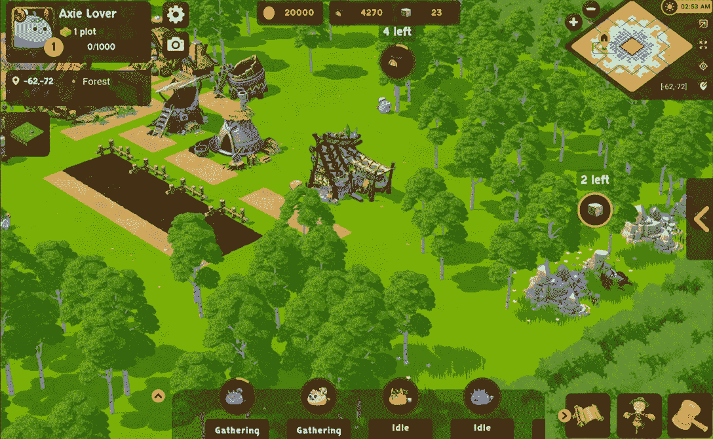
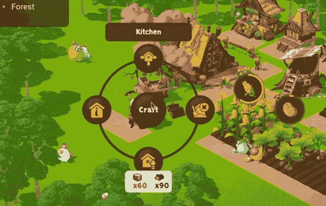
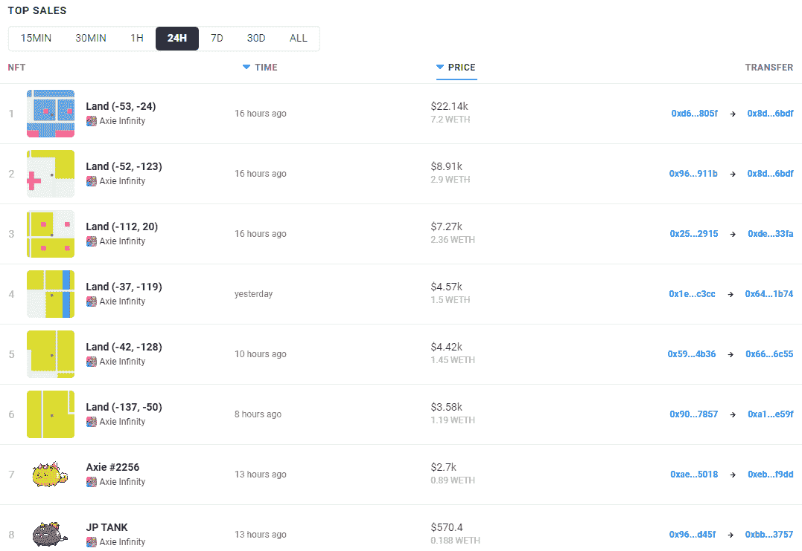

# Axie Infinity Land 游戏是如何工作的

> 原文：<https://web.archive.org/web/https://dappradar.com/blog/how-does-axie-infinity-land-gameplay-work>

## 玩家可以在卢纳西亚的土地上耕种和建设

Sky Mavis 公布了他们即将为 [Axie Infinity](https://web.archive.org/web/20221129080200/https://dappradar.com/multichain/games/axie-infinity) 更新的第一个游戏片段。这也标志着玩家第一次看到 Axie Infinity 的官方 3D 游戏，这当然是从 2D 战术战斗游戏开始的。

## 摘要

*   游戏玩家已经等待了超过 3 年的时间来玩他们的 Axie Infinity 土地
*   Axie Infinity alpha 测试针对 2022 年底到来的先锋时代
*   axes[生产和收集资源](https://web.archive.org/web/20221129080200/https://dappradar.com/blog/how-does-axie-infinity-land-gameplay-work/#produce)来制造物品
*   Axie Infinity 地块仍然是最贵的，但[失去了一些价值](https://web.archive.org/web/20221129080200/https://dappradar.com/blog/how-does-axie-infinity-land-gameplay-work/#hot)
*   陆地游戏将奖励玩家 [AXS](https://web.archive.org/web/20221129080200/https://dappradar.com/hub/token/eth/AXS/ETH?from=0xbb0e17ef65f82ab018d8edd776e8dd940327b28b) ，而不是 [SLP](https://web.archive.org/web/20221129080200/https://dappradar.com/hub/token/eth/SLP/ETH?from=0xcc8fa225d80b9c7d42f96e9570156c65d6caaa25)
*   随着交易量和用户活跃度下降，市场对 Axie Infinity 造成了沉重打击

95 秒的陆地游戏预告已经被 Axie Infinity 社区所接受。Sky Mavis 放弃预告片的事实并不令人惊讶，因为[他们最近的土地 AMA](https://web.archive.org/web/20221129080200/https://dappradar.com/blog/6-things-you-need-to-know-about-axie-infinity-land-alpha) 让许多土地所有者感到受到了虐待。尽管 3 年前承诺了陆地游戏，NFTs 的实际功能仍然不存在。

Axie Infinity 的陆地游戏将随着 alpha 的推出而推出。他们预计在 2022 年底推出 Axie Infinity 的 alpha 版:先锋时代。

[https://web.archive.org/web/20221129080200if_/https://www.youtube.com/embed/y-dKjMxMo4Q?feature=oembed](https://web.archive.org/web/20221129080200if_/https://www.youtube.com/embed/y-dKjMxMo4Q?feature=oembed)

### 土地所有权决定资源

在屏幕的左上角，玩家可以看到他们的账户选项和土地详情。该用户拥有一块坐标为(-62，-72)的林地。据说玩家可以将相邻的土地组合成一个更大的可玩区域，但这仍然是天空专家正在研究的事情。一个人所拥有的土地类型决定了这块土地上的可用资源。例如，林地给你木材和石头。您可以在屏幕中间的顶部栏中找到您的资源持有量。

Screen capture, Axie Infinity Land Gameplay Teaser (April 18, 2022)

### 轴生产、收集或加工

在屏幕的底部，你可以看到你的工人，在这种情况下，4 轴。天空 Mavis 上周说 Axie NFTs 还不能用于陆地游戏。未来这种情况是否会改变，还有待观察。现在这 4 个工人是没有额外技能的标准角色。这些斧头可以收集木材和石头，或者玩家可以分配他们在农场生产食物。想想玉米和土豆。然后，玩家可以使用这些农产品在厨房里制作面条或面包，这是你的阿西农场的一个建筑。最终玩家需要生产和收集资源来制造物品。

### 升级建筑

每个建筑都可能从第一层开始。玩家将需要使用资源，在这种情况下，木材和石头，来升级建筑。在这个例子中，升级厨房花费了 60 块石头和 90 块木头。玩家仍然需要得到更多的石头来升级他们的厨房。

### 升级解锁更多蓝图

玩家可以制造哪些物品，取决于他们解锁的蓝图。目前，界面显示新的可制作的蓝图会随着玩家等级的提升而解锁。玩家可以通过生产、收集和制作物品来升级他们的农场。解锁是基于整个农场的表现，还是基于特定建筑的活动，还有待观察。

## Axie Infinity 的陆地有多热？

我们已经看到 Axie Infinity 的土地交易价值数百万美元。去年，我们报道了一笔 230 万美元的土地销售。与此同时，快速浏览一下 Axie Infinity 在 [NFT 的交易活动，就会发现土地是生态系统中最有价值的资产之一。](https://web.archive.org/web/20221129080200/https://dappradar.com/multichain/games/axie-infinity)

然而，尽管就价值而言，Lunacia 的土地是顶级的 NFT，但也有所下降。萨凡纳地块已经成为最便宜的土地，现在售价略高于 1.2 ETH。然而，几个月前最便宜的地块也超过 5 ETH。

## 阿西出拳了

不仅 Axie 社区受到了加密低迷的打击，这影响了游戏奖励和 Axie Infinity 生态系统的交易量。Axie Infinity 及其社区还不得不应对 Ronin bridge 的黑客攻击，以及其他令人失望的事情。正是这些类型的游戏性预告片需要帮助提高社区士气。尽管朝鲜黑客组织 Lazarus 攻击了浪人[，但团队](https://web.archive.org/web/20221129080200/https://dappradar.com/blog/north-korean-lazarus-hackers-behind-600-million-ronin-hack/)[继续发布 Axie Infinity Origin](https://web.archive.org/web/20221129080200/https://dappradar.com/blog/sky-mavis-to-launch-axie-infinity-origin-amidst-hack-crisis/) 并非没有原因。

然而，尽管是游戏赚钱领域的独角兽，Axie Infinity 还是遭受了相当大的打击。在过去 30 天里，NFT 交易员的数量下降了 16%，至 296，626 人，而销售额下降得更多。Axie Infinity 在过去 30 天内售出了 940，499 台 NFT，月交易量低于 100 万台 NFT。尽管如此，每月有超过 100，000 名游戏玩家连接到游戏的智能合约，Axie Infinity 仍然是一股不可忽视的力量。

这些数字仍然让 Axie Infinity 在 DappRadar 游戏排名中占据了一个体面的位置，仅次于前 10 名。Axie Infinity 现在排名第 11，被[向日葵地](https://web.archive.org/web/20221129080200/https://dappradar.com/polygon/games/sunflower-land)超越。与此同时， [SecondLive](https://web.archive.org/web/20221129080200/https://dappradar.com/binance-smart-chain/games/secondlive) 和 [Aavegotchi](https://web.archive.org/web/20221129080200/https://dappradar.com/polygon/games/aavegotchi) 都取得了可观的增长，这可能会在未来几周和几个月内推动它们超越 Axie Infinity。