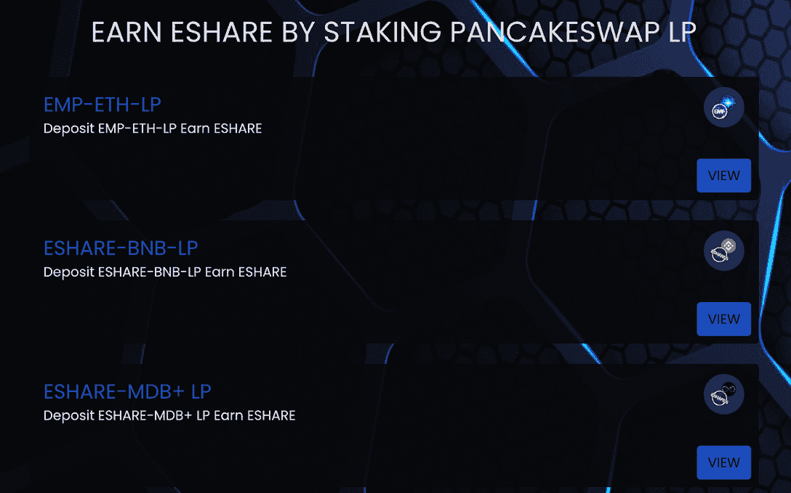

# EMP 货币如何使持续的加密收入成为可能

> 原文：<https://web.archive.org/web/https://dappradar.com/blog/how-emp-money-makes-continuous-earning-on-crypto-possible>

## EMP Money 提供了多种赚取加密硬币的方式

EMP Money 是一个 DeFi 生态系统，通过其技术和精心设计的令牌组学最大化用户的加密收益。EMP Money 致力于通过为加密投资者提供风险可控和用户友好的 DeFi 工具来加速 DeFi 的大规模采用。

**概要:**

*   [EMP Money](https://web.archive.org/web/20220811211652/https://dappradar.com/binance-smart-chain/defi/emp-money) 的原生令牌 EMP 是 [BNB 链](https://web.archive.org/web/20220811211652/https://dappradar.com/rankings/protocol/binance-smart-chain)上的算法令牌，旨在生成 [ETH](https://web.archive.org/web/20220811211652/https://dappradar.com/hub/token/eth/ETH) 相关被动收入。
*   除了 EMP 之外，还有另外两个标志有助于 EMP 货币经济的可持续性。他们是 ESHARE 和 EBOND。
*   EMP Money 为用户提供了多种利用加密资产创收的方式。其中包括[以太坊](https://web.archive.org/web/20220811211652/https://dappradar.com/rankings/protocol/ethereum) 3.0 赌注契约、雷管、自动金库等等。

## EMP 钱是什么？

EMP Money 是 BNB 链上一个革命性的 DeFi 协议，他们的 EMP 令牌在算法上以 4,000 EMP 比 1 ETH 的比率与以太坊(ETH)的价值挂钩。这种 EMP 挂钩机制非常重要，它为 DeFi dapp 的整个经济奠定了基础。

[https://web.archive.org/web/20220811211652if_/https://www.youtube.com/embed/FSFTVPuZ6eU?start=6&feature=oembed](https://web.archive.org/web/20220811211652if_/https://www.youtube.com/embed/FSFTVPuZ6eU?start=6&feature=oembed)

在 EMP 的挂钩机制中，流动性和价格波动不会给 EMP 带来风险，反而会给 EMP 的经济模型带来价值。那么它是如何工作的呢？

当 EMP 的价格高于钉住价格时，该协议会发出新的 EMP 令牌来增加供应量，从而将价格拉低至钉住价格。这些新的 EMP 将通过董事会进入流通，董事会是生态系统的印钞机。稍后，董事会将把新打印的 EMP 分发给 EMP 股份(ESHARE)持有者。

如果发生相反的情况，协议将发行 EMP 债券(EBONDs ),并将 EMP 从总供应中移除。这将把价格推向挂钩。当价格高于挂钩时，用户可以溢价赎回电子书。

## EMP 货币令牌经济学解释

EMP Money 拥有一个多令牌生态系统，其中 EMP、ESHARE 和 EBOND 构成了一个可持续的经济系统。

### 电磁脉冲(electromagnetic pulse)

EMP 算法令牌是 EMP Money 快速增长的生态系统的支柱，并被用作交换媒介。如前所述，协议中的挂钩机制旨在长期维持 4，000 EMP 对 1 ETH 的汇率。

然而，这并不意味着 EMP 相对于 ETH 的价值永远是 4000 比 1，因为 EMP 没有抵押。最重要的是，这种动态平衡是欧洲货币区经济正常运行的先决条件，并允许应用另外两个令牌。

### ESHARE

ESHARE 是 EMP 的 DeFi 生态系统的治理令牌。因此，持有 ESHARE 将授予用户在生态系统内对协议改进和用例扩展等提案的投票权。此外，当 EMP 价格超过挂钩价格时，ESHARE 持有人有权获得未来的 EMP 分配。

### EBOND

EBOND 是系统发行的另一个重要的激励令牌。当 EMP 跌破挂钩时，EMP Money 以 EPM 的当前价格为用户创造电子书。此外，将 EMP 转化为 EBOND 会燃烧 EMP 令牌，使其退出流通。因此，它有助于推动价格上涨。

为了从电子书中获得利润，用户可以在未来电子书价格高于挂钩价格时将其兑换为 EMP。值得一提的是，电子书没有有效期。这意味着只要财政部有正的 EMP 余额，持有者就可以随时将他们的电子书兑换成 EMP 代币。

## 用 EMP 资金实现利润最大化

EMP Money 允许用户直接与 DeFi 协议交互，同时提供了一个了解这个新兴行业的好方法。秉承这一愿景，EMP Money 专注于为用户提供各种机会，在可控的风险下发展他们的加密组合。现在，让我们仔细看看 EMP Money 生态系统中有哪些 DeFi 产品。

### 以太坊 3.0 打桩合同

以太坊 3.0 赌注合同为提取以太网的价值创造了新的途径。它允许用户入股 BEP-20 ETH，每季度(90 天)对投资者的本金产生 19%的固定利息。此外，索赔是以 BEP-20 ETH 支付的，是可以和解的。

但是什么是 BEP-20 令牌呢？BEP-20 是币安智能链上的令牌标准，它扩展了 ERC-20，后者源自以太坊区块链。因此，它继承了 ERC-20 的所有特性。BEP-20 代币与 ERC-20 兼容，但需要更便宜的汽油费。

### 雷管

[雷管](https://web.archive.org/web/20220811211652/https://emp.money/detonator)让用户有机会使用 EMP-ETH [流动性池](/web/20220811211652/https://dappradar.com/blog/what-is-liquidity-pool-and-liquidity-provider/) (LP)代币赚取 365%的 ROI。这是 BNB 智能链上的一个游戏化智能合约，参与者可以获得令人惊讶的奖金、每日乐透和最大的存款人奖金。该系统向彩票中奖者发放一份奖品，向当天合同中存入最大金额的人发放一份奖品。

### 自动保管库

EMP Money 还通过扩大其合作伙伴网络为其社区带来了丰厚的收益。 [Autovaults](https://web.archive.org/web/20220811211652/https://yieldwolf.finance/bsc/lp-emp-money-vaults) 为用户提供了这样一个机会。EMP Money 的合作伙伴托管自动金库，用户也可以利用这些自动复利金库来获取电子共享令牌。

然而，他们在 EMP Money 的平台上从那些本地农场工作。自动售货机将自动出售赚取的电子共享，并购买更多的 LP 代币来自动复利，而不是将电子共享存入用户的钱包。因此，它可以帮助用户收集越来越多的 LP 令牌。

EMP Money 在其 DeFi 生态系统中引入了各种盈利方式。用户可以加入每夜 AMA 或通过以下渠道了解更多关于 EMP 钱。

[网站](https://web.archive.org/web/20220811211652/https://emp.money/)

[电报](https://web.archive.org/web/20220811211652/https://t.me/empmoney)

[不和](https://web.archive.org/web/20220811211652/https://discord.gg/empmoney)

[推特](https://web.archive.org/web/20220811211652/https://twitter.com/empmoneybsc)

[Youtube 频道](https://web.archive.org/web/20220811211652/https://youtube.com/c/EmpMoney)

[Instagram](https://web.archive.org/web/20220811211652/https://www.instagram.com/emp.money/)

[脸书](https://web.archive.org/web/20220811211652/https://www.facebook.com/emp.money)

[中等](https://web.archive.org/web/20220811211652/https://medium.com/@emp-money)

[Reddit](https://web.archive.org/web/20220811211652/https://www.reddit.com/r/EMPMoney/)

**免责声明** —这是一篇赞助文章。DappRadar 不认可本页面上的任何内容或产品。DappRadar 旨在提供准确的信息，但读者应该在采取行动之前总是自己做研究。DappRadar 的文章不能被认为是投资建议。