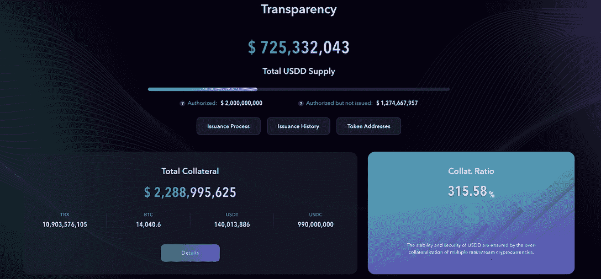

# 创道自然保护区的 USDD 与市场上的其他同类产品有何不同

> 原文：<https://web.archive.org/web/https://dappradar.com/blog/how-is-tron-dao-reserves-usdd-different-from-other-stablecoins-on-the-market>

## USDD 是一个分散的过度抵押的稳定币

**分散美元、**[**【USDD】**](https://web.archive.org/web/20220824021019/https://usdd.io/#/)**是稳定币上的** [**TRON**](https://web.archive.org/web/20220824021019/https://tron.network/) **、BNB 链、区块链以太币。自成立以来，USDD 已成为许多秘密媒体的头条新闻。为了让用户更全面的了解最被过度抵押的稳定币，创道储备(TDR)回答了** [**一些关于 USDD 的常见问题**](https://web.archive.org/web/20220824021019/https://trondao.org/blog/2022/07/19/your-questions-about-usdd-answered/) **。**

摘要

*   [USDD](https://web.archive.org/web/20220824021019/https://usdd.io/#/) 是[创](https://web.archive.org/web/20220824021019/https://tron.network/)、BNB 链和以太坊的稳定玩家。
*   USDD 本质上不同于 USDT、USDC 和 UST。
*   TDR 利用四种货币政策工具来确保 USDD 的稳定。这包括基准利率、公开市场操作(OMO)、窗口指导以及 TRX 和 USDD 的烧钱机制。

作为一种算法稳定币， [USDD](https://web.archive.org/web/20220824021019/https://usdd.io/#/) 最初被比作今年早些时候崩溃的特拉 UST。然而，值得一提的是，USDD 与 UST 有着本质的不同。

## 什么是 USDD？

USDD 是由[创道储备](https://web.archive.org/web/20220824021019/https://tdr.org/#/)推出的分散式超抵押稳定币。USDD 协议运行在 [TRON 网络](https://web.archive.org/web/20220824021019/https://tron.network/)上，利用 BitTorrent Chain ( [BTTC](https://web.archive.org/web/20220824021019/https://bttc.bittorrent.com/) )跨链协议连接以太坊和 BNB 链。在未来，USDD 将更容易穿越区块链。

USDD 通过 TRX 与美元挂钩，并在贸易发展报告的指导下保持物价稳定。它能够实现稳定和分散的数字美元系统，为每个人实现财务自由奠定基础。

## USDD 如何保持权力下放？

USDD 的核心使命是为区块链世界提供一种价值稳定的去中心化加密货币。

其他稳定的货币，如 USDC 或 USDT，都与中央平台的美元储备挂钩。从本质上讲，USDC 和 USDT 被认为是受到全球监管机构严格监管的中央集权城市。然而，USDD 代表了真正的权力下放。

USDD 的价值受到 BTC、USDT、USDC 和 TRX 等高流动性加密资产的过度抵押支持。这使得 USDD 没有集中的中间人，因此用户不必担心他们的资产在事先通知或不通知的情况下被冻结。此外，它使 USDD 的持有者能够完全拥有他们的稳定货币。

## USDC、USDT 和 USDD 有什么不同？

稳定性使得 stablecoins 对许多投资者来说是一种有吸引力的加密资产。然而，中央集权的稳定货币，如 USDC 和 USDT，由于其中央集权的性质，可能会失去其联系汇率或稳定性。

监管机构要求 USDC 和 USDT 维持 1:1 的准备金率。因此，如果这些稳定货币的中央当局不能满足其储备要求，这可能导致中央稳定货币失去 1:1 美元的挂钩。

USDD 没有这些问题，因为它是完全分散的。值得注意的是，USDD 并非严格盯住美元；而是围绕它上下浮动。此外，USDD 的价格稳定是通过贸易发展报告根据市场情况采取的货币政策来维持的。

## UST 和 USDD 有什么不同？

最近围绕 stablecoins 的争议源于卢娜和 UST 的坠机事件。USDD 在钉住美元的汇率下方波动，部分原因是市场对卢纳/UST 事件的误解。值得一提的是，卢娜和 UST 并不遵循 USDD 遵循的 TDR 政策；相反，卢娜和 UST 严格按照燃烧和铸造的算法套利系统运作。

储备体系的缺乏增加了 UST 的风险，未能实现 1:1 美元的挂钩。此外，UST 的价格在很大程度上依赖于 LUNA 的流动性。结果，投资者惊慌失措，开始抛售卢娜和 UST，导致价格暴跌。

与 UST 不同，USDD 完全由 TDR 运营的充满流动性资产的储备体系支持。用户可以在[tdr.org](https://web.archive.org/web/20220824021019/https://tdr.org/#/)上实时监控 TDR 资产的详细情况。

## TDR 的货币政策如何确保 USDD 的稳定？

从设计上来说，USDD 维持浮动汇率与美元挂钩。当市场波动时，如果 USDD 兑美元汇率上下浮动幅度在 3%以内，则不被视为脱离欧元区。这为 TDR 做出必要的货币政策调整提供了进一步的灵活性。

例如，随着最近的市场波动，USDD 已经通过 TDR 的货币政策工具进行了适当的调整。这种方法就是联系汇率制度，并成功地让 USDD 得以有效地扩大规模。

除此之外，TDR 还采用了四种货币政策工具来确保 USDD 的稳定，为 TRON 生态系统创造了可持续性。这四个政策工具是设定基准利率、公开市场操作、窗口指导以及 TRX 和 USDD 的铸币燃烧机制。

TDR 还将探索更多的货币政策工具，以促进 USDD 生态系统的进一步稳定和增长。TDR 货币政策的最终目标是维持 USDD 的稳定价格，同时将其发展成为市场上最可靠和分散的稳定货币。

要了解更多关于 USDD 的信息，请查看 TronDao 最近的[博客帖子](https://web.archive.org/web/20220824021019/https://trondao.org/blog/2022/07/19/your-questions-about-usdd-answered/)，其中详细回答了各种社区问题和关注。

[网站](https://web.archive.org/web/20220824021019/https://usdd.io/) | [推特](https://web.archive.org/web/20220824021019/https://twitter.com/usddio) | [电报](https://web.archive.org/web/20220824021019/https://t.me/usddio) | [不和](https://web.archive.org/web/20220824021019/https://discord.com/invite/usdd) | [媒体](https://web.archive.org/web/20220824021019/https://medium.com/@usddio)

***媒体联系***

Sam Elfarra

[【电子邮件保护】](/web/20220824021019/https://dappradar.com/cdn-cgi/l/email-protection)

**免责声明** —这是一篇赞助文章。DappRadar 不认可本页面上的任何内容或产品。DappRadar 旨在提供准确的信息，但读者应该在采取行动之前总是自己做研究。DappRadar 的文章不能被认为是投资建议。