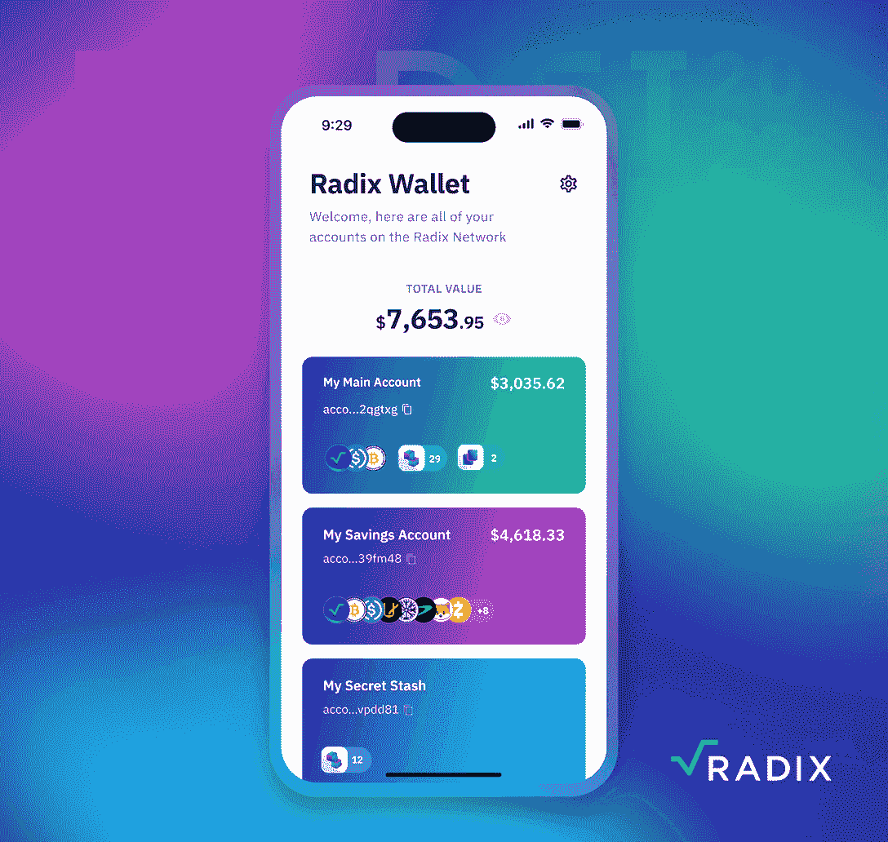
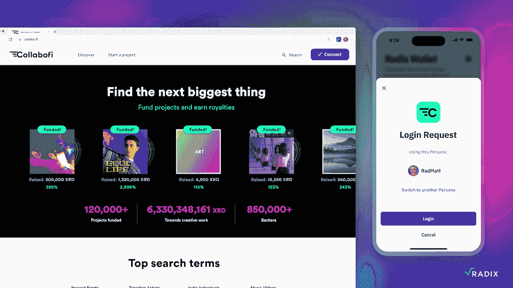
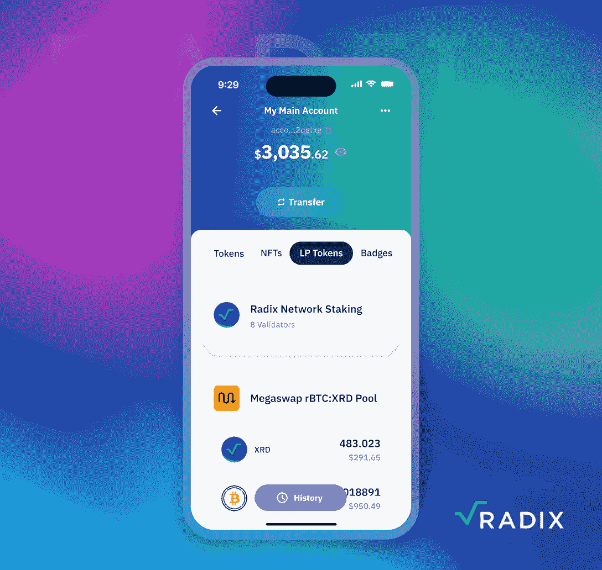
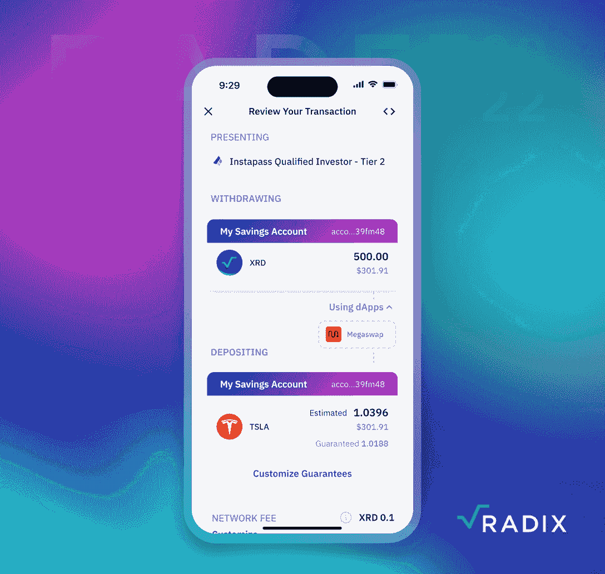

# Radix 的 Web3 堆栈如何让 DeFi 成为主流

> 原文：<https://web.archive.org/web/https://dappradar.com/blog/how-radixs-web3-stack-can-make-defi-mainstream>

## RadFi 2022 上展示了强大的 Web3 技术堆栈，将 DeFi 带给主流观众

**在 RadFi 2022 活动上，Radix 背后的团队详细解释了其高性能 Web3 技术堆栈。通过 Radix，开发者获得了将 Web3 和 DeFi 带入主流的工具。因此，让我们深入了解一下。**

Radix 是第 1 层网络，使开发人员能够构建快速、可扩展和安全的 DeFi dapps、协议和生态系统。它还努力通过提供推动大规模采用的理想用户体验来消除限制 DeFi 扩展的技术障碍。因此，Radix 提出了一个完整的堆栈方法、重新设计共识、DeFi 应用程序构建、可执行的网络代码、用户界面等等。

**内容**

*   [*今日 Web3 的问题*](https://web.archive.org/web/20221222101314/https://dappradar.com/blog/how-radixs-web3-stack-can-make-defi-mainstream/#problem)
*   [*可扩展性和生态多样性的答案:地狱犬共识*](https://web.archive.org/web/20221222101314/https://dappradar.com/blog/how-radixs-web3-stack-can-make-defi-mainstream/#answer)
*   [*基数引擎打造安全高效*](https://web.archive.org/web/20221222101314/https://dappradar.com/blog/how-radixs-web3-stack-can-make-defi-mainstream/#engine)
*   [*Scrypto:面向所有人的 Web3 语言*](https://web.archive.org/web/20221222101314/https://dappradar.com/blog/how-radixs-web3-stack-can-make-defi-mainstream/#scrypto)
*   *[包罗万象的基数钱包](https://web.archive.org/web/20221222101314/https://dappradar.com/blog/how-radixs-web3-stack-can-make-defi-mainstream/#wallet)*
*   *[用巴比伦的](https://web.archive.org/web/20221222101314/https://dappradar.com/blog/how-radixs-web3-stack-can-make-defi-mainstream/#scale)* 建造、扩大和兴旺

## 今天 Web3 的问题是

开发人员花费了无数个小时和不眠之夜来构建今天 Web3 DeFi 体验的基础。尽管去中心化金融重新设想了人们进行金融活动的可能性，但它在简单性、易用性和总体可靠性方面还远远不够理想。

DeFi 在短短两年内从管理的 10 亿美元增长到总价值超过 400 亿美元。太不可思议了。但这仍然只是 400 万亿美元全球金融体系的一小部分。

DeFi 需要进一步释放它的潜力，这不仅仅需要对公众进行教育。但是，更重要的是，开发者需要获得强大的工具来有效地创建像银行应用、Paypal 等现有移动应用服务一样安全和易用的消费产品。

就像 Unity 和 Unreal Engine 彻底改变了游戏产品开发一样，Radix 希望为开发人员提供工具，让他们能够轻松表达自己的 Web3 想法。Radix 技术堆栈旨在提供用户体验和网络基础设施，可以从根本上接受 DeFi 主流。

[Check out the RadFi 2022 event](https://web.archive.org/web/20221222101314/https://www.radixdlt.com/radfi?utm_campaign=dappradar&utm_medium=deveco&utm_source=Dappradar)

## 可扩展性和生态多样性的答案:Cerberus 共识

根据 Radix 的说法，Cerberus 是世界上第一个在扩展时不会破坏原子可组合性的一致算法。例如，目前，以太坊交易使用的 69%的天然气由三个或更多智能合同组成。那么为什么原子的可组合性很重要呢？

原子可组合性允许用户将多个分散的应用程序和许多令牌化的资产组合成一个事务。它是 Web3 生态系统创新的核心，因为原子可组合性让一个 dapp 与任何其他 dapp 无缝交互。

乐高积木经常被用来比喻智能合约的可组合性。不同乐高积木的组合可以产生许多新的和更强大的应用程序，比每个单独的智能合同积木的创造者所能预料的要多。因此，从长远来看，牺牲原子可组合性的可伸缩性解决方案将危及用户体验和生态系统的多样性。

经过近十年的研究和原型制作，Radix 背后的团队设计了地狱犬。这种共识算法可以在不损害互连性(原子可组合性)的情况下扩展。为各种 dapps 的茁壮成长打下了坚实的基础。

[Learn more about Radix](https://web.archive.org/web/20221222101314/https://www.radixdlt.com/?utm_campaign=dappradar&utm_medium=deveco&utm_source=Dappradar)

## 基数引擎被构建为安全和高效的

基数引擎是基数堆栈的下一层，有助于显著提高开发人员的工作效率。借助 Radix 引擎，可以立即部署新的令牌类型，如 soulbound 令牌，并与所有应用程序和钱包兼容。

此外，Radix 引擎使资产安全成为网络的主要功能和先决条件，而不是事后的想法。Radix Engine 面向资产的开发风格可以防止黑客攻击，如重入攻击、支出批准攻击或签名操纵攻击，或者使开发人员更容易避免这些攻击。

## Scrypto:面向所有人的 Web3 语言

Radix 网络有自己的编程语言 Scrypto，适合 Web3 和 DeFi 的需要。这种语言以直观的编码为特色，为开发人员提供了从想法到实现的最短路径。不仅如此，Scrypto 一直将资产安全放在首位。

目前，Scrypto 已经成为该领域发展最快的语言之一。尽管 Scrypto 还不能在 Radix mainnet 上使用，但在过去的一年中，已经有超过 5000 名开发人员尝试过 Scrypto。使用本地开发工具和测试网络，该社区已经创建了大量的工具和资源，包括分散式交易所、借贷平台、产量耕作系统、Dao 等。

运行一个成熟的 DeFi 生态系统所需的一切都已经开源，因此每个人都可以使用它。加入 Radix 开发者社区，当 Radix mainnet 的 Babylon 升级在 2023 年到来时，您将准备好起飞。

[Join the Radix developer community](https://web.archive.org/web/20221222101314/https://developers.radixdlt.com/?utm_campaign=dappradar&utm_medium=deveco&utm_source=Dappradar)

## 包罗万象的 Radix 钱包

Web3 有着不可思议的潜力，但是它的用户体验很差。为了解决这个问题，Radix 团队目前正在开发一款 Radix 钱包，它符合普通用户的习惯，而不仅仅是技术高手的工具。

Radix Wallet 的可用性特征只有在使用 Radix 平台内置的几种技术时才有可能实现。

### 智能帐户

理解、使用和管理加密钱包的种子短语不是一件容易的事情。一个错误，用户可能会损失大量资金。作为回应，Radix 重新思考了分散式分类账账户的工作方式，并引入了智能账户。

与普通的区块链帐户不同，Radix 上的智能帐户不仅仅是一个地址。相反，它是资产的功能容器。此外，它们支持多签名签名和链上多因子恢复，这意味着 Radix Wallet 可以在没有种子短语或不信任集中式服务的情况下恢复您的访问。

### 个人的

人物角色允许 Radix 钱包连接到不仅仅是账户地址的 dapps..它们使 Radix Wallet 能够为用户提供无密码、个性化的登录，并且它是安全、分散和匿名的。用户只需轻按手机上的一个按钮，就可以流畅地登录 Radix 上的任何 Web3 dapp。

### 基数连接

Radix Connect 在用户手机上的 Radix 钱包和桌面上的 dapps 之间建立了直接安全的连接。因此，用户可以在他们的电脑上浏览和探索各种基于网络的 dapps，而他们的帐户和资产的控制总是在手机上。

用户不需要安装不同桌面版本的钱包或浏览器扩展来使用桌面版本的应用程序。

### 本地资产

在 Radix 上，每个令牌都是本地资产，而不仅仅是智能合约中的余额。这意味着钱包可以随时显示你拥有的一切。

在其他 Web3 钱包中，NFTs 或 LP 令牌在用户的钱包中往往显得毫无意义。它们不显示元数据、在哪里可以使用、如何兑换等信息。对于每项资产，用户必须到其网站上搜索相应的信息。这样的用户体验并不自然。

在 Radix 网络上，本地资产使数字所有权成为现实；您需要的一切都在您的钱包中，无需通过钱包或资产进行任何特殊集成。

### 交易清单

做交易的时候，一定要知道自己会付出什么，会得到什么。为了使这成为可能，Radix 上的事务概念与其他 L-1 网络非常不同。

交易清单向用户显示当他们签署交易时会发生什么。它还允许用户为不同的目的添加自己的规则。例如，如果您想确保令牌交换的回报不会低于您的预期，Radix Wallet 将在交易中包括这一“保证”。如果换汇回来的钱少于你投入的保证金，交易就失败了。

没有更多的签名散列和希望最好的。您在交易清单中看到的就是您得到的。

### 以下视频详细演示了这些功能

[https://web.archive.org/web/20221222101314if_/https://www.youtube.com/embed/LBJqvk1FQ4U?feature=oembed](https://web.archive.org/web/20221222101314if_/https://www.youtube.com/embed/LBJqvk1FQ4U?feature=oembed)

## 与巴比伦一起建设、发展和繁荣

Radix mainnet 的下一阶段名为 Babylon，将于 2023 年在 Q2 上线。自今年 9 月以来，Babylon Alphanet 测试网络已经启动并运行，Babylon Betanet 测试网络将于 2022 年第四季度上线。如前所述，开发人员已经开始利用 Scrypto 和 Radix 引擎来创建强大的项目。

如果您对 Radix 的潜力感到好奇，请单击下面的按钮，您将加入所有其他开发人员的行列。

[Start building with Radix now](https://web.archive.org/web/20221222101314/https://developers.radixdlt.com/?utm_campaign=dappradar&utm_medium=deveco&utm_source=Dappradar)

### 了解有关基数的更多信息

*   [网站](https://web.archive.org/web/20221222101314/https://www.radixdlt.com/?utm_campaign=dappradar&utm_medium=deveco&utm_source=Dappradar)
*   [推特](https://web.archive.org/web/20221222101314/https://twitter.com/radixdlt)
*   [不和](https://web.archive.org/web/20221222101314/https://twitter.com/RadixDLT)

**免责声明** —这是一篇赞助文章。DappRadar 不认可本页面上的任何内容或产品。DappRadar 旨在提供准确的信息，但读者应该在采取行动之前总是自己做研究。DappRadar 的文章不能被认为是投资建议。