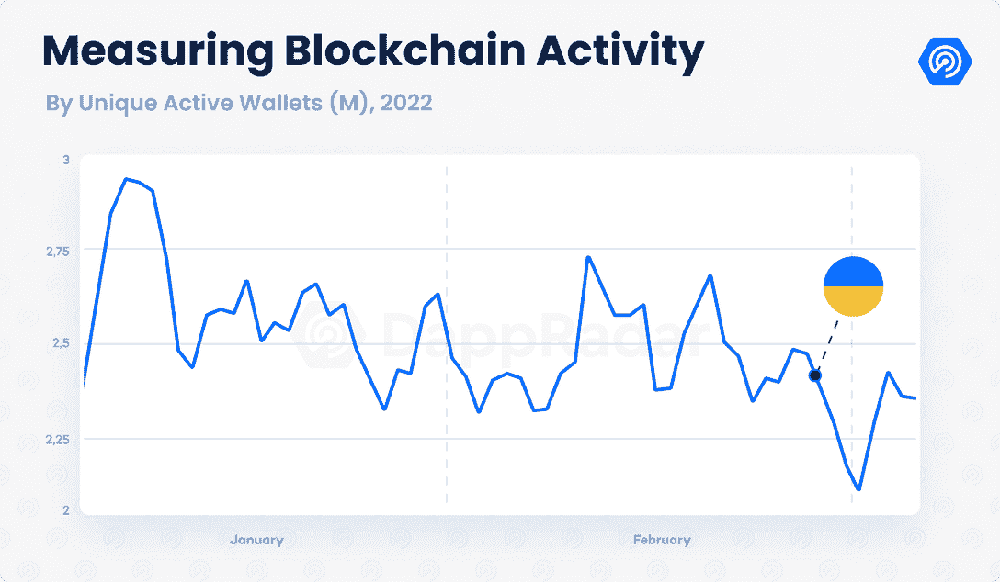
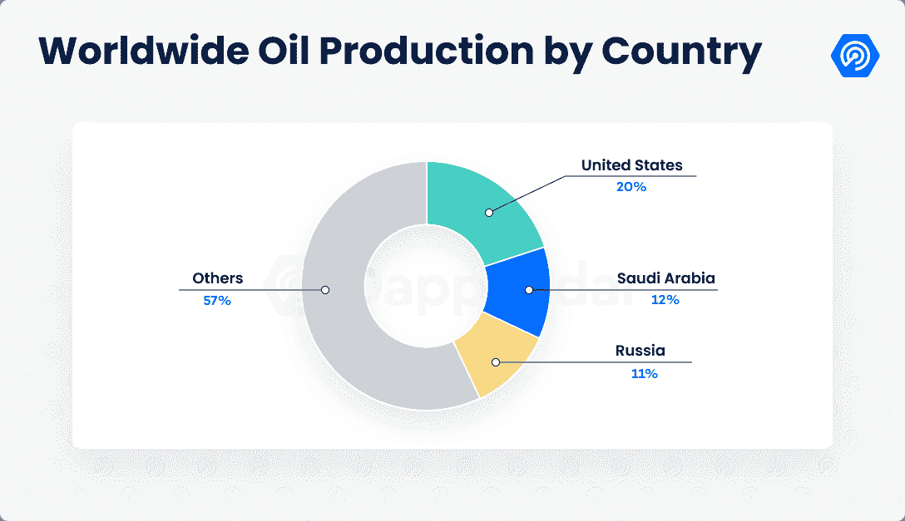
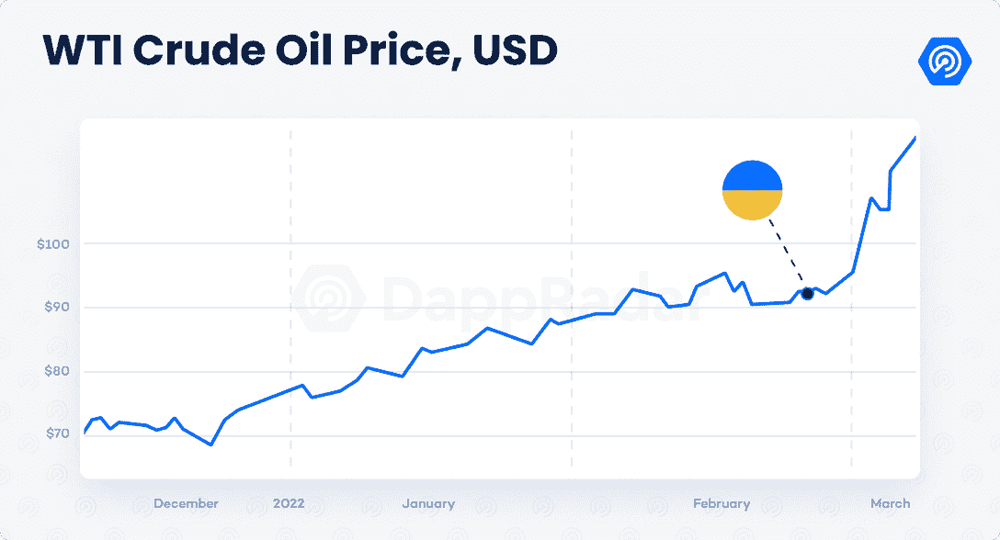
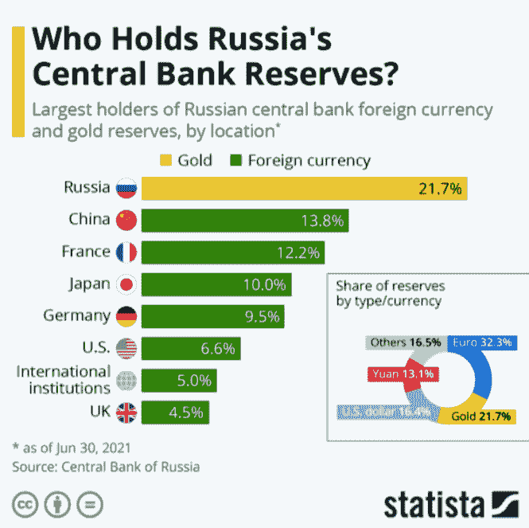
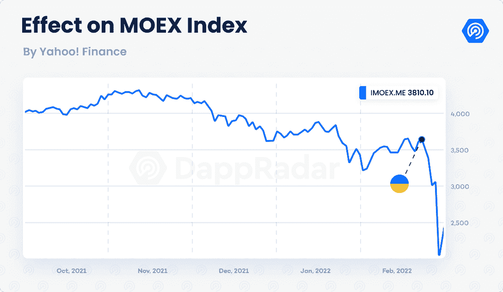
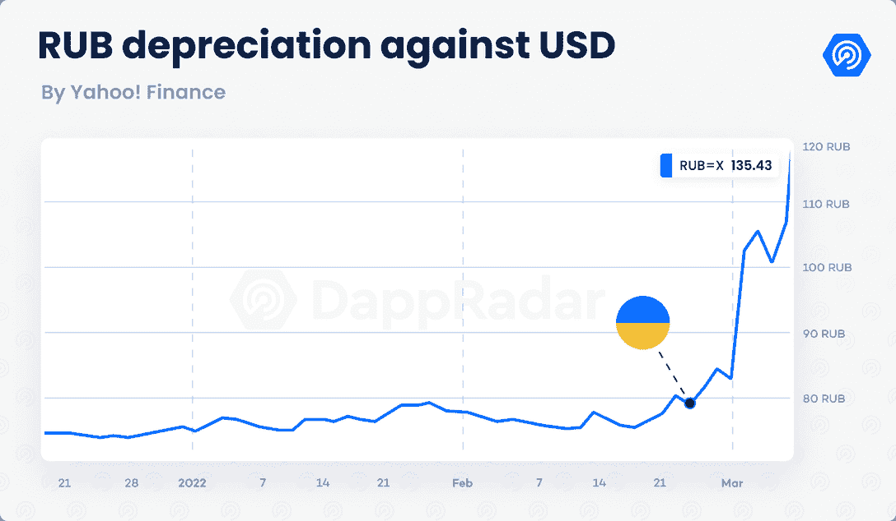
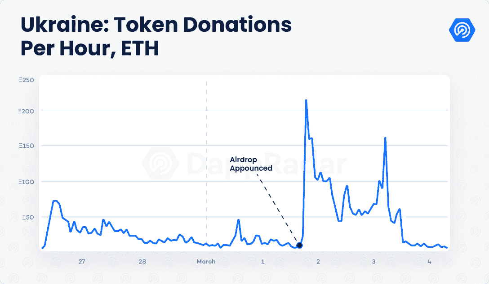
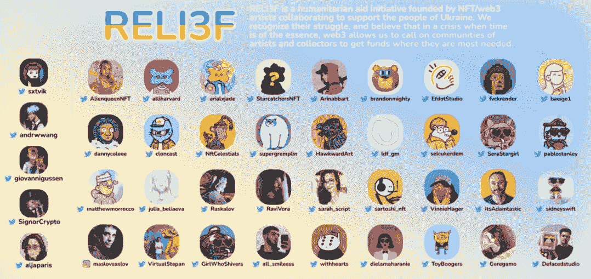
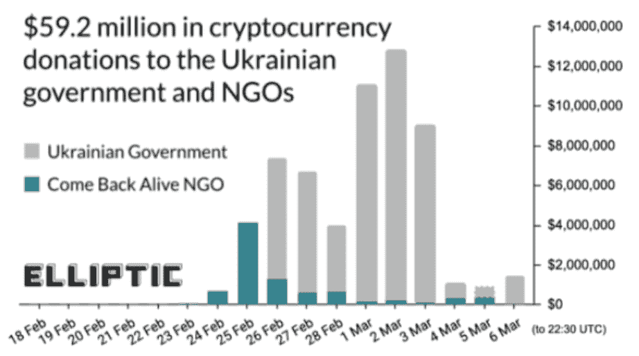
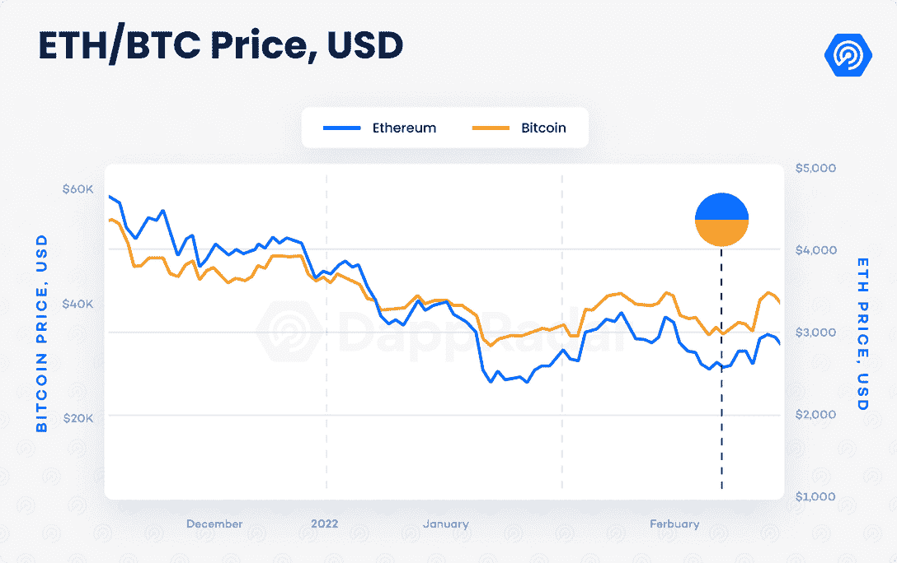

# 俄罗斯对乌克兰的战争和西方的反应如何搅动区块链技术

> 原文：<https://web.archive.org/web/https://dappradar.com/blog/how-russias-war-on-ukraine-and-the-wests-response-is-roiling-blockchain-technology>

## 挑衅 x 达普拉达独家报道

当俄罗斯无缘无故入侵其邻国和贸易伙伴乌克兰时，世界的反应是恐惧和愤怒。以美国和欧盟为首的西方立即对弗拉基米尔·普京总统的政权实施严厉制裁，包括禁止其动用外汇储备。全球经济受到能源和大宗商品价格飙升的影响，资本市场正在努力应对普京侵略的不确定性和长期影响，以及二战以来欧洲大陆最严重的军事悲剧。加密货币社区也受到了这场悲剧的影响。由于区块链技术的点对点性质，比特币和其他数字资产在战区和俄罗斯国内的效用存在许多问题。在俄罗斯，随着卢布贬值，普通公民失去了购买力，也无法使用 Swift 系统等金融基础设施。

在这份报告中，我们揭示了宏观经济力量的作用，并分析了随着战争的继续，基于区块链的解决方案将如何发挥重要作用。

区块链和 web3 以一种前所未有的方式展示了他们在为乌克兰难民提供援助的人道主义努力中的价值，并为乌克兰公民提供支持，以抵御俄罗斯军队的进攻。

在我们探究这些举措的细节之前，让我们先了解一下俄罗斯和乌克兰是如何影响宏观经济的。

## 全球市场的巨大变化

俄罗斯是最大的经济体之一，是主要的能源和大宗商品生产国，而乌克兰在小麦生产方面处于全球领先地位。俄国是世界第三大石油生产国，拥有 T2 大约 5%的世界储量。其出口石油的一半被欧洲国家消费，助长了[欧洲三分之一的石油消费](https://web.archive.org/web/20221006035231/https://ec.europa.eu/eurostat/cache/infographs/energy/bloc-2c.html)。

俄国也是最大的天然气生产国，控制着 T2 25%的天然气储量。随着经济制裁的生效，原油价格猛涨。汽油、天然气、煤和取暖油也是如此。电价的大幅上涨将影响像比特币这样需要高能量输入的区块链。

由于氮产量高，俄罗斯也牢牢控制着化肥行业，但俄罗斯也是铜、、、镍、钯和铂的出口大国，这些都是生产芯片和显卡所需的元素，用于开采矿藏或玩高端游戏。与此同时，乌克兰是钛的第六大生产国，也是氖气的第三大生产国。

### 大到不能倒？

全球领导人还制裁了俄罗斯的银行，而支付服务提供商也停止了在该国的业务。据估计，到 2021 年年中，俄罗斯央行持有约 6500 亿美元的外汇储备；然而，这些限制将把这一数额限制在大约 2300 亿美元，因为这些储备的 65%是以美元、欧元、英镑和黄金等海外货币持有的。

这些制裁还意味着，俄罗斯最重要的金融机构中至少有七家将不再是 SWIFT 的成员，SWIFT 是一个对跨境支付至关重要的全球信息系统。超过 11，000 家机构使用 Swift，每天产生超过 3，500 万笔交易。

同样，支付巨头 [Visa、万事达卡](https://web.archive.org/web/20221006035231/https://www.wsj.com/livecoverage/russia-ukraine-latest-news-2022-03-04/card/visa-and-mastercard-suspend-russian-operations-LAhp94TyXAXrNzaILwz5)、[美国运通](https://web.archive.org/web/20221006035231/https://about.americanexpress.com/all-news/news-details/2022/American-Express-Suspends-Operations-in-Russia-and-Belarus/default.aspx)和 [PayPal](https://web.archive.org/web/20221006035231/https://www.reuters.com/business/paypal-shuts-down-its-services-russia-citing-ukraine-aggression-2022-03-05/) 都停止了在受制裁国家的运营，使得数百万用户失去了一个重要的货币网关。尽管俄罗斯的公民和企业最终可能会找到 Swift 的替代品，但金融约束将严重损害其经济。

## 分散货币体系的理由

区块链的优势之一是能够在没有中介的情况下实现无缝的点对点交易，创造几乎无国界的资产。这种去中心化的金融生态系统可以帮助数百万被剥夺了直接支付途径的乌克兰人和俄罗斯人。

然而，俄罗斯的情况要严重得多，也复杂得多。除了 PayPal、Visa 和 Mastercard，苹果(Apple)、谷歌(Google)、Wise、Remitly 和 TransferGo 等机构的支付和汇款服务也停止了在该国的运营，给俄罗斯工人阶级带来了额外的障碍，他们也可能面临信用违约的风险。

结果，最有声望的评级机构大幅降低了俄罗斯的信用评级。S&P 和穆迪将俄罗斯的主权评级下调至垃圾级，惠誉则下调了乌克兰的信用评级。俄罗斯卢布在过去七天里经历了近 33%的大幅贬值，并且可能进一步下跌。

为了抵消货币贬值的通胀效应，stablecoins 等加密货币甚至 NFT 等其他类型的数字资产都可以用作对冲。我们已经在津巴布韦和委内瑞拉等国家的恶性通货膨胀中看到了这种情况。

然而，区块链在可访问性、分散性、安全性和存储价值方面的优势超越了数字货币的经济背景。我们正在见证一个有组织的秘密社区的社会潜力。

## 乌克兰密码社区联盟

区块链已经在[不同的场合](https://web.archive.org/web/20221006035231/https://www.youtube.com/watch?v=Yo-BrASMHU4)展示了其在社会中创造积极影响的潜力。这一次，世界见证了名人、企业家和来自不同背景的人如何联手创建了名为 DAOs 的 web3 组织，以支持乌克兰人民及其陷入困境的政府。

在一个历史性的时刻，乌克兰开始在不同的网络上接收捐款。乌克兰政府在其[以太坊钱包](https://web.archive.org/web/20221006035231/https://dappradar.com/hub/wallet/eth/0x165cd37b4c644c2921454429e7f9358d18a45e14/assets)中收到了约 1000 万美元的代币和 NFT(包括价值约 21.2 万美元的 [CryptoPunk #5364](https://web.archive.org/web/20221006035231/https://dappradar.com/hub/assets/eth/0xb47e3cd837ddf8e4c57f05d70ab865de6e193bbb/5364) )，其中大部分是在宣布可能向捐助者空投后收集的。中央当局还为比特币、Polkadot 和 Tron 网络提供钱包。

继萨尔瓦多和委内瑞拉之后，由乌克兰创造的区块链钱包是第一次被认可的国家政府使用加密货币。然而，乌克兰的情况标志着政府首次将它们用于人道主义目的。

此外，像 Uniswap 这样的老牌区块链项目和像非政府组织一样的独立 Dao 也加入了乌克兰的事业。[乌克兰岛](https://web.archive.org/web/20221006035231/https://www.ukrainedao.love/)，由俄罗斯朋克摇滚乐队 Pussy Riot 发起的[倡议，因公开抗议普京政权而数次面临牢狱之灾，在写作时已经筹集了超过 700 万美元](https://web.archive.org/web/20221006035231/https://thedefiant.io/pussy-riot-nfts-ukrainedao/)，这些钱将全部用于援助乌克兰人。

另一个例子是由“近区块链”的联合创始人、经验丰富的 web3 个人伊利亚·波罗苏辛(Illia Polusokhin)创造的“解放乌克兰”刀(Unchain Ukraine)。Unchain Ukraine 已经募集了超过 210 万美元(大部分是近东救济工程处的),并收到了来自 9 个网络的捐款。

乌克兰危机中的支持也来自 NFT 世界。例如， [Reli3f](https://web.archive.org/web/20221006035231/https://twitter.com/reli3fxyz?ref_src=twsrc%5Egoogle%7Ctwcamp%5Eserp%7Ctwgr%5Eauthor) ，一个由王晓康和 web3 社区成员发起的人道主义援助计划。该项目由来自 37 位不同 NFT 艺术家的 7400 名非传统艺术家组成，包括 [Fvckrender](https://web.archive.org/web/20221006035231/https://twitter.com/fvckrender) 、 [Pablo Stanley](https://web.archive.org/web/20221006035231/https://twitter.com/pablostanley) 和[defaded](https://web.archive.org/web/20221006035231/https://twitter.com/Defacedstudio)，并在 ETH 筹集和分发了至少 100 万美元以支持乌克兰人民。

来自不同领域的 NFT 艺术家也相当活跃。活动家兼艺术家谢泼德·费尔雷将把他下一次收藏的收入捐给东欧的人道主义危机。与此同时，来自该国最著名的美术馆的 200 名乌克兰艺术家一起创作了一幅 NFT，将在稍后拍卖。

**Source**: [Elliptic](https://web.archive.org/web/20221006035231/https://www.elliptic.co/blog/live-updates-millions-in-crypto-crowdfunded-for-the-ukrainian-military)

据 Elliptic 报道，乌克兰已经从超过 118，000 个钱包中获得了近 6000 万美元的加密资产，其中包括 NFTs、Polkadot 创始人加文·伍德的 500 万美元捐赠以及币安的 1000 万美元捐赠。最终，乌克兰利用加密技术为其军事和人道主义需求筹集资金，展示了区块链技术的大规模潜力。

那么，在考虑了所有的宏观经济影响并意识到来自 web3 类型的组织的支持之后，短期内可以从区块链和 cryptos 那里期待什么呢？

## 这对区块链和 cryptos 意味着什么？

这场危机将在不同行业产生多米诺骨牌效应，并巩固 crypto 作为向乌克兰人和普通俄罗斯家庭提供救济的潜在工具。

自最近的事件以来，对加密货币的需求一直在上升，特别是在受影响的地区。以格里夫尼亚和卢布购买的比特币数量达到九个月来的最高水平。自 2 月 24 日以来，用卢布购买的比特币数量至少增加了两倍，而乌克兰的需求几乎翻了一番。激增的比特币需求[在这两个地区引发了 6%](https://web.archive.org/web/20221006035231/https://thedefiant.io/btc-ukraine-trade-russia/) 的溢价。而币安和库纳在乌克兰以 6%的溢价大幅削减了 BTC-UAH 贸易对。

**Source**: Kaiko

由于对加密货币的需求突然增加，以及[拜登的加密货币订单](https://web.archive.org/web/20221006035231/https://thedefiant.io/biden-order-crypto-relief-lobbying/)的一些帮助，资产价格正在抵抗，挑战自 11 月以来可察觉的熊市趋势。比特币收复 38000 美元上方支撑线，以太坊超过 2500 美元。尽管如此，人们普遍预计，这将是一个高度波动的时期，从交易角度来看，这将带来一个有趣的挑战。

此外，当前商业形势和不稳定的金融环境的破坏性影响可能引发从人们违约到更大规模的银行挤兑和救助的后果。这种情况将对中央银行系统产生更多的不信任，为采用和识别数字资产和加密货币铺平道路。

然而，如果俄罗斯选择这样做，反对国家可能会试图禁止用于规避制裁的密码，这并不牵强，特别是如果与中国达成协议的话。虽然北海巨妖和币安等主要交易所拒绝限制俄罗斯人使用他们的平台，但 OpenSea 和 Consensys 等公司已经开始切断黑名单上的地区。

另外值得一提的是，俄罗斯对 cryptos 并不陌生。俄罗斯人拥有的加密货币的确切数量因来源而异，从 220 亿美元到 2200 亿美元不等，相当于世界加密资产的 12%。因此，它们可能是由于考虑了数字方法。此外，俄罗斯拥有 BTC 开采区块所需的近 14%的哈希功率，俄罗斯是仅次于美国和哈萨克斯坦的世界第三大比特币开采中心。

采用区块链技术似乎迫在眉睫。不久前，准确地说，在 2019 年，[两位重要的摩根大通高管](https://web.archive.org/web/20221006035231/https://www.cnbc.com/2019/01/25/bitcoin-not-an-ideal-hedge-unless-youre-expecting-dystopia-jp-morgan-says.html)称比特币是一种欺诈，是一种只有在对所有主要储备资产失去信心的反乌托邦环境中才会繁荣的资产。三年后，美国一家主要银行的立场发生了 180 度的转变。据信，摩根大通在 Consensys 拥有[的大部分股份，并且还成为第一家正式](https://web.archive.org/web/20221006035231/https://bitcoinist.com/ethereum-consensys-secretly-sold-business-jp-morgan/)[在元宇宙](https://web.archive.org/web/20221006035231/https://markets.businessinsider.com/news/currencies/jpmorgan-decentraland-onyx-lounge-metaverse-virtual-real-estate-crypto-dao-2022-2)开放空间的金融机构，公开了分散地内的 Onyx 休息室。

经过两年与扰乱经济、供应链和数百万人生活的 COVID 疫情的斗争，乌克兰的战争正在寻找一个数字化程度更高的社会，以应对近年来最高的通胀时期之一。俄罗斯的决定所带来的金融影响甚至会在几年后显现，并有可能改变传统的金融生态系统。

现在判断这场冲突的全面影响以及世界将如何反应还为时过早。现在，我们都集中在一件事上；战争很快结束，尽可能少的人丧生。

 NewsletterUnsubscribe at any time. [T&Cs](https://web.archive.org/web/20221006035231/https://dappradar.com/terms) and [Privacy Policy](https://web.archive.org/web/20221006035231/https://dappradar.com/privacy-policy)