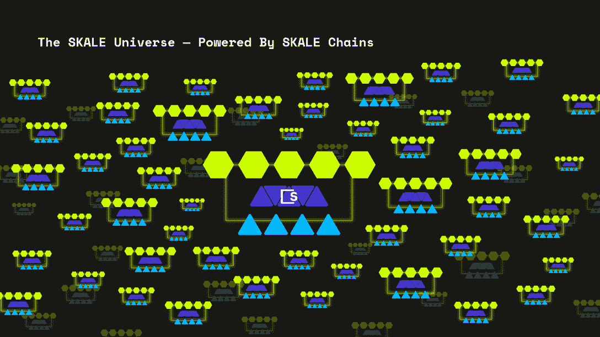

# SKALE 的混合模块化第 1 层如何脱颖而出，成为区块链可扩展性解决方案

> 原文：<https://web.archive.org/web/https://dappradar.com/blog/how-skales-hybrid-modular-layer-1-stands-out-as-a-blockchain-scalability-solution>

## 一个可扩展和互联的网络，而不牺牲其安全性

**SKALE 通过引入区块链模块化混合网络的创新方法解决了区块链的可扩展性问题。因此，SKALE 可以在不牺牲互操作性或安全性的情况下实现可伸缩性。**

**概要:**

*   侧链和第二层网络是区块链最受欢迎的两种扩展解决方案，但它们并不完美。
*   [**SKALE**](https://web.archive.org/web/20220930120705/https://dappradar.com/hub/token/eth/SKL?from=0x00c83aecc790e8a4453e5dd3b0b4b3680501a7a7) **采用一种独特的方法，让项目同时享受第一层和第二层区块链的好处。**
*   SKALE 支持模块化，高度可扩展，专为企业发展而打造。

区块链被设计为一个促进交易和其他点对点在线活动的网络。自成立以来，区块链科技通过消除中间商，实现更高效、更透明、更公平的运营，颠覆了各行各业。

然而，区块链成为主流的举动提高了人们对可伸缩性问题的认识。人太多，带宽太少。结果，交易费用飙升，确认时间增加。因此，扩展区块链变得比以往任何时候都更加紧迫，这是指优化区块链网络以处理不断增加的交易和活动。区块链上的交易越快越顺畅，用户体验就越好。

幸运的是，许多不同的可行方法都致力于解决可扩展性问题，推动行业更健康、更快速地发展。这些解决方案包括第二层，如[乐观](https://web.archive.org/web/20220930120705/https://dappradar.com/rankings/protocol/optimism)、侧链网络、[多边形、](https://web.archive.org/web/20220930120705/https://dappradar.com/rankings/protocol/polygon)和混合模块化第一层 SKALE。本文重点比较不同的区块链扩展解决方案，简要分析它们的优缺点。

## 侧链与第 2 层

### Sidechain

侧链是与主链相连的姐妹区块链。许多侧链实现特定的目标，这意味着它们根据其功能和用途有许多变化。同样值得一提的是，每个侧链都有自己的一套规则。

例如，侧链可以采用与其主链不同的共有机制。这是为了实现更加环保的区块链运营。最重要的是，侧链网络独立验证事务，只定期更新主链，从根本上提高了事务吞吐量。因此，这种交易能力助推器有助于区块链的规模。

然而，侧链依赖于它们自己的安全模型，这通常被认为不太安全。例如，在去年 12 月漏洞修复之前，[黑客窃取了 Polygon](https://web.archive.org/web/20220930120705/https://coinculture.com/au/tech/polygon-hacked-for-over-800000-matic-20220111/) 上的 801，601 个自动令牌。

### 第二层

第 2 层解决方案实现了可扩展性并提高了吞吐量，同时仍然保持了主区块链的完整性。说到缩放，[汇总](https://web.archive.org/web/20220930120705/https://dappradar.com/blog/ethereum-rollups-a-simple-explanation)起着至关重要的作用。更具体地说，它们允许在主区块链之外捆绑和执行事务，但仍然将事务数据发布到第 1 层。这样，它实现了更高的事务处理能力。

然而，第二层并不完美。例如，区块链最重要的问题之一是不同区块链之间缺乏互操作性。不幸的是，对于第二层，这个问题甚至会更糟，因为第二层用户被限制在他们解决方案的协议上。

## SKALE:混合模块化第 1 层区块链

为了解决区块链的可扩展性问题，SKALE 引入了模块化链网络和新的枢纽架构。SKALE 的模块化架构旨在打破单片第一层区块链网络的容量限制。具体来说，SKALE 不是一个单独的区块链，而是一个由许多区块链组成的网络，从一开始就具有可伸缩性和互操作性。

拥有无限数量的区块链会带来无上限的容量，并且由于缺乏适当的链间协调，可能会导致用户体验和集成问题。SKALE 提供的解决方案已经考虑到了这个问题。因此，SKALE 链将被归类为 Hub 链或 Dapp 链。

SKALE Hubs 充当 Dapp 链的服务站，为 Dapp 链提供流动性、交换和市场服务。此外，SKALE 的模块化架构为 oracles、索引器、fiat on/off ramps 等合作伙伴服务提供了一个开放的网络，允许他们实施在 SKALEverse 中运行 Dapps 所需的关键服务。

值得注意的是，这些中心将采用 DAO 结构，人员、业务、组织和项目将是操作它们的人。令人兴奋的是，社区产生的枢纽建议将在斯卡莱 V2 启动。

## 最后的想法

事实上，与其比较不同扩展解决方案的优缺点，不如根据您自己的业务需求选择一个生态系统。对于在运行和扩展业务时寻求终极灵活性而又不牺牲去中心化和安全性的项目来说，SKALE 的模块化特性可能是一个很好的选择。

了解更多关于 SKALE 的信息:

[网站](https://web.archive.org/web/20220930120705/https://skale.network/)

[推特](https://web.archive.org/web/20220930120705/https://twitter.com/SkaleNetwork)

[不和](https://web.archive.org/web/20220930120705/http://skale.chat/)

[白皮书](https://web.archive.org/web/20220930120705/https://skale.network/whitepaper)

**免责声明** —这是一篇赞助文章。DappRadar 不认可本页面上的任何内容或产品。DappRadar 旨在提供准确的信息，但读者应该在采取行动之前总是自己做研究。DappRadar 的文章不能被认为是投资建议。