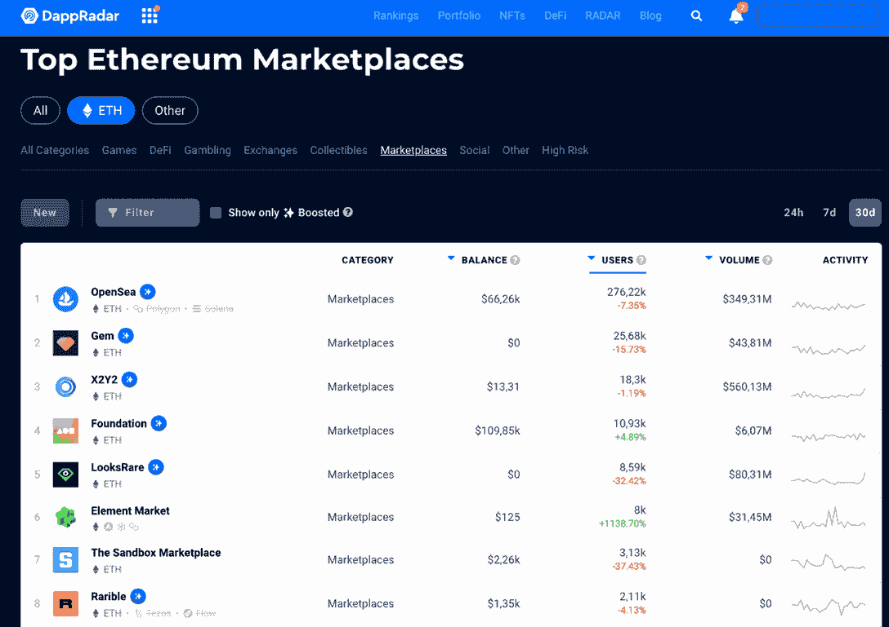

# starking radar 如何让 dapp 开发者受益

> 原文：<https://web.archive.org/web/https://dappradar.com/blog/how-staking-radar-benefits-dapp-developers>

## 了解如何利用雷达为您的项目造福

作为 dapp 开发人员，您知道可见性是成功的关键。了解你的项目的人越多，你可能获得的用户就越多。这就是为什么我们很高兴地告诉你，你可以通过标桩雷达受益于你的项目。继续阅读以了解更多。

## 什么是雷达？

[雷达](https://web.archive.org/web/20220926155135/https://dappradar.com/hub/token/eth/RADAR)是 DappRadar 生态系统的原生令牌。通过拥有 RADAR，您可以成为我们社区的一员，并对我们组织的未来项目拥有发言权。

令牌于 2021 年底推出，它是我们为分散应用(dapp)行业带来更多透明度和数据的战略的核心。

谁拥有雷达，谁也可以用它来赢得奖励。就开发者而言，锁定雷达也能让他们的 dapps 受益。

## 开发者如何从 starking radar 中获益

如果你曾经使用过 DappRadar，你会知道它是业内跟踪数据的最佳场所——每月有超过 50 万用户访问。例如，在 [DappRadar 排名](https://web.archive.org/web/20220926155135/https://dappradar.com/rankings)上，你可以浏览不同类别和网络中排名靠前的区块链 dapps，按照日用户数、流量等指标进行排名。

正如你可以在我们的完整文章中读到的，[任何人都可以通过收获更多的雷达代币并提供流动性来赚取 LP 代币，从而从下注雷达](https://web.archive.org/web/20220926155135/https://dappradar.com/blog/what-are-the-benefits-of-staking-radar)中受益。

然而，另一个 staking 特性引起了整个 web3 的 dapp 开发者的注意。

通过[锁定雷达](https://web.archive.org/web/20220926155135/https://dappradar.com/token/staking)，你可以使用助推力在 DappRadar 的排名上显示对你的项目的支持。任何雷达跟踪者都可以对以太坊上的任何 dapp 这样做。将来，该功能也可用于其他网络中的 dapps。

这样，你的 dapp 将会在 DappRadar 用户的眼中跳跃，这表明了它从社区获得的支持。

蓝色图标代表提升，用户也可以过滤排名，只查看平台上已经支持的 dapps。

这个特性的计划是，它将为每个增强的 dapp 社区释放无数的力量。

## 开始使用 starking radar

如果有兴趣，你可以从今天开始使用雷达令牌。只需按照下面视频中的逐步说明进行操作。

[https://web.archive.org/web/20220926155135if_/https://www.youtube.com/embed/pThbMD_ceXs?feature=oembed](https://web.archive.org/web/20220926155135if_/https://www.youtube.com/embed/pThbMD_ceXs?feature=oembed)

继续[在这个完整的概览](https://web.archive.org/web/20220926155135/https://dappradar.com/token/overview)中了解所有关于雷达令牌的信息，并前往 DappRadar 的[令牌交换](https://web.archive.org/web/20220926155135/https://dappradar.com/hub/swap/eth)为自己获得一些雷达。

要了解 Dapp 行业的主要动态，请在 [DappRadar 博客](https://web.archive.org/web/20220926155135/https://dappradar.com/blog/)上阅读我们的教育文章和新闻。在[推特](https://web.archive.org/web/20220926155135/https://twitter.com/DappRadar)上关注我们，加入我们的[不和](https://web.archive.org/web/20220926155135/https://discord.com/invite/4ybbssrHkm)获取雷达通知。

 NewsletterUnsubscribe at any time. [T&Cs](https://web.archive.org/web/20220926155135/https://dappradar.com/terms) and [Privacy Policy](https://web.archive.org/web/20220926155135/https://dappradar.com/privacy-policy)

***以上不构成投资建议。此处给出的信息仅供参考。请尽职调查并自行研究。***