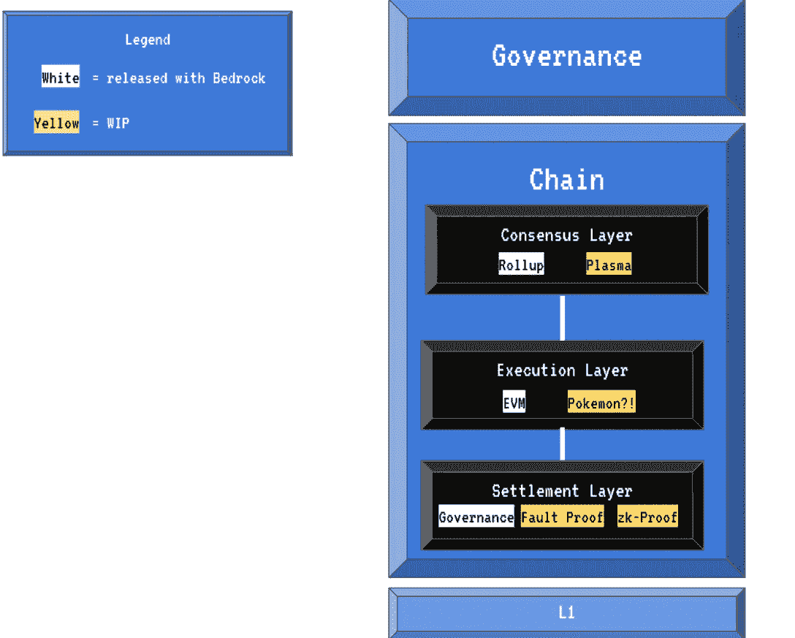
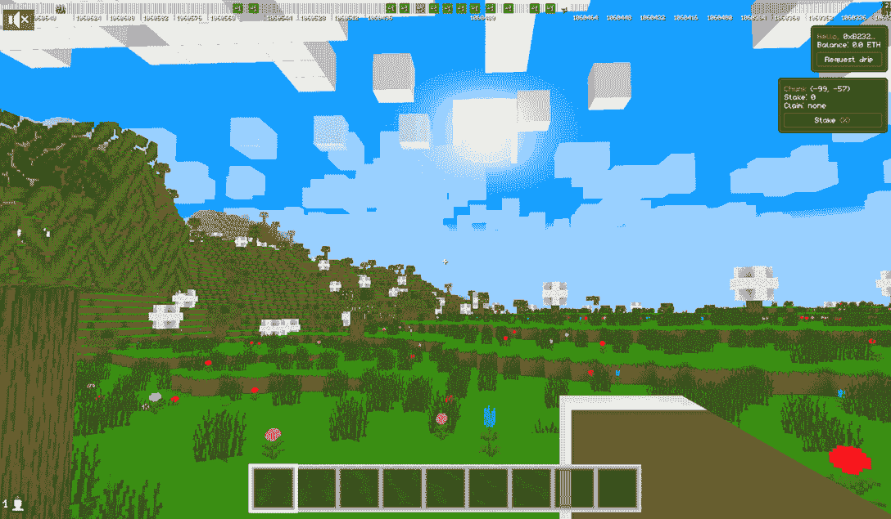

# OP 堆栈如何让以太坊生态系统更具互操作性

> 原文：<https://web.archive.org/web/https://dappradar.com/blog/how-the-op-stack-makes-the-ethereum-ecosystem-more-interoperable>

## OP Stack 是高度可扩展、高度可互操作的区块链的模块化、开源蓝图。

OP 堆栈旨在提高整个以太坊社区的互操作性。同时，它使开发人员能够高效地构建他们的区块链来满足特定的用户需求。最终，这些高度集成的链将形成一个新兴的架构，即超级链，为创新和用户体验增强提供动力。

## 目录

*   [什么是 OP 栈？](https://web.archive.org/web/20221201051713/https://dappradar.com/blog/how-the-op-stack-makes-the-ethereum-ecosystem-more-interoperable/#what)
*   [开发者如何从 OP Stack 中获益？](https://web.archive.org/web/20221201051713/https://dappradar.com/blog/how-the-op-stack-makes-the-ethereum-ecosystem-more-interoperable/#how)
*   谁已经在使用 OP Stack 了？
*   [OP Stack 的未来会怎样？](https://web.archive.org/web/20221201051713/https://dappradar.com/blog/how-the-op-stack-makes-the-ethereum-ecosystem-more-interoperable/#future)

分散技术和分散应用的采用正在稳步增加。根据 DappRadar 最新的区块链行为报告，与今年第一季度相比，智能合同部署量攀升了 40%。此外，在区块链上发布和确认的所有智能合约中，有近 36%是在 2022 年执行的。这意味着越来越多的团队希望利用分散技术为他们的用户服务。

[Read the full report](https://web.archive.org/web/20221201051713/https://dappradar.com/blog/crypto-adoption-on-the-rise-reddit-showing-the-way)

随着用户群的增长，开发团队必须处理更复杂的用户需求。但是市场上有很多去中心化的网络，开发者应该如何做出选择？乐观已经宣布 OP Stack 允许开发者为区块链开发提供一个模块化的、面向未来的模型。

请继续阅读，了解 OP Stack 是如何做到这一点的，以及迄今为止它是如何被使用的。

## 什么是 OP 栈？

OP 堆栈是一系列模块，它们协同工作以形成一致、可靠的区块链。这些组件中的每一个都实现了堆栈的特定层。下图显示了这些核心组件的样子。

OP 栈的每一层都由一个定义良好的 API 描述，并由该层的模块填充。此外，开发人员可以轻松修改现有模块，甚至创建全新的模块来满足特定用户的需求。

OP 堆栈的模块化结构可组合和拆卸，具有出色的通用性。例如，开发人员可以利用 Celestia 作为数据可用性层，而不是以太坊，如果他们愿意，甚至可以运行比特币作为执行层。

Modules of the OP Stack

## 开发人员如何从 OP 堆栈中获益？

乐观是一个第二层扩展解决方案，目前利用乐观向上技术(ORU)来扩展以太坊。oru 通过将大量交易数据移出主区块链，同时保留以太坊基础层的安全保证，解决了以太坊的扩展困境。

[Learn everything about Optimism](/web/20221201051713/https://dappradar.com/blog/optimism-data-points-to-layer-2-season/)

因此，作为乐观主义生态系统的组成部分，OP 栈自然继承了以太坊的安全性。这对用户来说至关重要，对开发者来说也是重中之重。

此外，OP 栈将第 2 层网络分为三层，即共识层、执行层和结算层。然后，它用 API 标准化这三层，以便开发人员可以轻松地将它们分支，并按照他们的意愿组装组件。

基本上，这使得开发人员比以往任何时候都更容易构建他们自己的区块链，因此他们可以专注于服务他们的用户。

开发人员可以基于 OP 栈构建多个高度可扩展、可互操作的区块链。值得注意的是，这一切都发生在更广泛的以太坊生态系统中。这意味着开发更成熟的项目可以利用 OP Stack 将其 dapps 扩展到整个生态系统中。

[Learn everything about the OP Stack](https://web.archive.org/web/20221201051713/https://www.optimism.io/)

## 谁已经在使用 OP Stack 了？

opCraft 是一个完整的链上 3D 体素世界，在 OP 栈之上用 MUD(一个开源的链上游戏引擎)构建。像其他基于手工制作的体素世界一样，它允许用户探索风景、开采矿石、放置材料和制作新物品。

OPCraft 利用其版本的高吞吐量和即时终结性，为用户创建身临其境的虚拟世界体验。但是 OPCraft 的独特之处远不止于此。

OPCraft 世界完全生活在链上，对任何人开放。只要输入和输出符合协议，用户就可以构建一个无需特殊权限就能与之交互的自定义客户端。用户甚至可以创建一个客户端，用动画角色替换所有现有角色，或者重写所有内容，使其看起来更真实。

OPCraft 允许开发者部署智能合约来推动不可信玩家经济，引入新的游戏功能，整合 DeFi 功能，等等。

[Learn more about the OP Stack](https://web.archive.org/web/20221201051713/https://optimism.mirror.xyz/fLk5UGjZDiXFuvQh6R_HscMQuuY9ABYNF7PI76-qJYs)

## 运算堆栈的未来会怎样？

OP 堆栈是高度兼容的第二层和第三层迅速发展的第一步。在乐观主义的生态系统中，这些将被称为运营链。通过共享和贡献一个硬化的、标准化的、模块化的代码库，所有这些系统可以一起工作，为以太坊的未来做出贡献。

在未来，op 链之间的界限将会消失，形成一个单一的逻辑超级链，这将把集体资源开放给许多不同的 op 链插入其中。

如果你也相信以太坊生态系统的协作未来，请查看下面的链接，了解 OP Stack 如何实现这一点。

**关于 OP 堆栈的更多信息**

*   [网站](https://web.archive.org/web/20221201051713/https://www.optimism.io/)
*   [镜子](https://web.archive.org/web/20221201051713/https://optimism.mirror.xyz/fLk5UGjZDiXFuvQh6R_HscMQuuY9ABYNF7PI76-qJYs)
*   [推特](https://web.archive.org/web/20221201051713/https://twitter.com/optimismFND)
*   [不和](https://web.archive.org/web/20221201051713/https://discord-gateway.optimism.io/)

**免责声明** —这是一篇赞助文章。DappRadar 不认可本页面上的任何内容或产品。DappRadar 旨在提供准确的信息，但读者应该在采取行动之前总是自己做研究。DappRadar 的文章不能被认为是投资建议。

 NewsletterUnsubscribe at any time. [T&Cs](https://web.archive.org/web/20221201051713/https://dappradar.com/terms) and [Privacy Policy](https://web.archive.org/web/20221201051713/https://dappradar.com/privacy-policy)