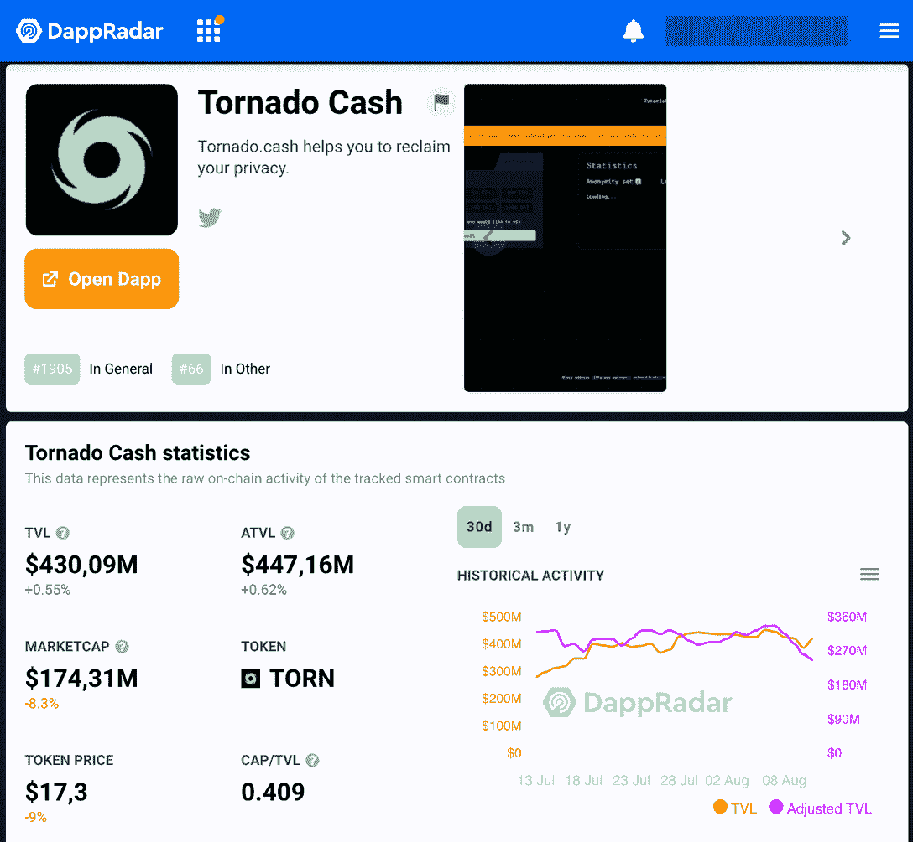

# 龙卷风现金禁令如何煽动言论自由之战

> 原文：<https://web.archive.org/web/https://dappradar.com/blog/how-the-tornado-cash-ban-instigates-a-free-speech-battle>

## 在美国财政部指控该协议洗钱后，搅拌机正慢慢从触手可及的地方消失。对于言论自由意味着什么？

**世界上最著名的加密货币混合器之一，** [**龙卷风现金**](https://web.archive.org/web/20220929070250/https://dappradar.com/multichain/other/tornado-cash) **登上了美国财政部的黑名单。8 月 8 日的这一声明引发了对该协议开源代码的一系列禁令，尽管有制裁的预测，但这并没有阻止它的运行。**

根据美国财政部的数据，自 2019 年以来，已有价值 700 万美元的被盗虚拟货币根据该协议被清洗。[起诉书](https://web.archive.org/web/20220929070250/https://home.treasury.gov/news/press-releases/jy0916)将 Tornado Cash 列为网络犯罪的协助者，并保证其*“将继续积极打击为犯罪分子清洗虚拟货币的中间人以及协助他们的人”。*

一天后， [Dune Analytics 数据](https://web.archive.org/web/20220929070250/https://dune.com/phabc/usdc-banned-addresses)显示，USDC stablecoin 背后的发行者 Circle 冻结了超过 81 个与 Tornado Cash 有关的地址，其中约有 75，000 USDC。

该协议的官方网站已被关闭，以及 Tornado Cash 在 GitHub 上的官方和捐助者账户也被关闭。

尽管如此，Tornado Cash 在多个连锁店的[dapradar DeFi Dapps 排名](https://web.archive.org/web/20220929070250/https://dappradar.com/defi)中仍然处于强势地位。

## 什么是龙卷风现金？

[Tornado Cash](https://web.archive.org/web/20220929070250/https://dappradar.com/multichain/other/tornado-cash) 是一个完全去中心化的非托管协议，提供加密货币混合服务。该社区管理 DAO，在撰写本文时，其锁定的总价值(TVL)为 4.3009 亿美元。

[Track Tornado Cash with DappRadar](https://web.archive.org/web/20220929070250/https://dappradar.com/multichain/other/tornado-cash)

通过使用加密混合器，你可以屏蔽你的交易历史在多个区块链从公众视野。龙卷风现金混淆了你的密码的来源，所以没有人能在区块链追踪他们到你或之前发生的任何事情。

它是由一群开发人员在 2019 年创建的，他们将代码开源，以便任何人都可以受益并为其做出贡献。

然而，该协议与黑客和被盗密码的联系由来已久，这并不是它第一次受到制裁。

### 加密混合器和隐私标志

无论像 Tornado Cash 这样奇怪的加密混合服务听起来如何，它们确实为人们提供了隐私，这是加密领域许多有影响力的人所支持和需要的。

在美国财政部的最新制裁后，以太坊联合创始人维塔利克站出来为该协议辩护。

> 隐私协议的众多有效使用案例之一:捐赠给一项如果公开进行可能会给你带来麻烦的事业[https://t.co/LJM4Gd4dFf](https://web.archive.org/web/20220929070250/https://t.co/LJM4Gd4dFf)
> 
> — 🌪️ Tornado.cash 🌪️ (@TornadoCash) [August 9, 2022](https://web.archive.org/web/20220929070250/https://twitter.com/TornadoCash/status/1556952399507505152?ref_src=twsrc%5Etfw)

虽然对许多人来说，像以太坊这样的区块链的最大优势之一是所有记录交易的透明度，但也有人认为并非所有事情都需要公开。

*   **阅读** : [你需要知道的关于全球密码法规的所有信息](https://web.archive.org/web/20220929070250/https://dappradar.com/blog/guide-to-all-crypto-regulations-worldwide)

## 权力下放不受政府控制

当然，美国财政部可以禁止所有美国人使用龙卷风现金。但是，由于显而易见的原因，它的力量无法达到分散式账簿及其 dapps 的功能。由于 Tornado Cash 的性质，这种制裁在技术上是不可能的。

保证搅拌机正常工作的智能合约不可能受制于任何国家的法律，不管这个国家是不是自由之地。

这就把我们带到了这次讨论的中心。禁止开源代码或程序员的工作有多道德？言论自由怎么了？

所有在交易中有洗钱行为的中央金融机构都会被禁止吗？共同体对制裁的反应很能说明问题。

> 谢天谢地，我从来没有用龙卷风现金来洗钱
> 
> 我像正常人一样使用德意志银行
> 
> — foobar (@0xfoobar) [August 10, 2022](https://web.archive.org/web/20220929070250/https://twitter.com/0xfoobar/status/1557186511312982016?ref_src=twsrc%5Etfw)