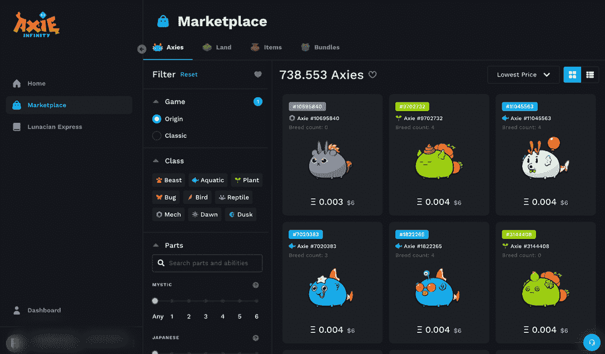
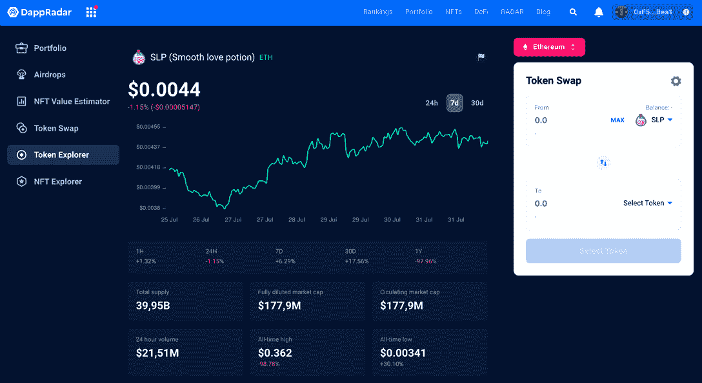
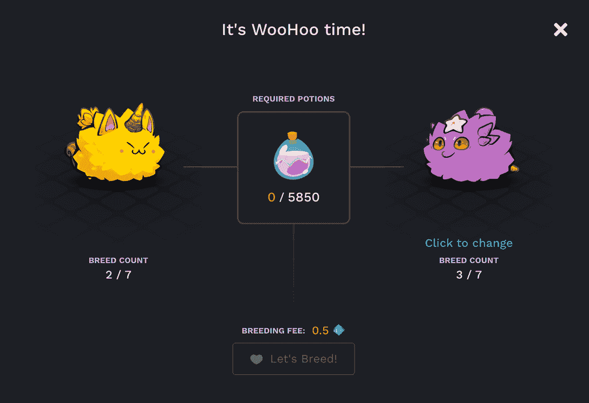

# 如何繁殖 Axies？循序渐进的指南

> 原文：<https://web.archive.org/web/https://dappradar.com/blog/how-to-breed-axies-a-step-by-step-guide>

## 进一步研究扩展你的 Axie Infinity 军队

玩 Axie Infinity Origin 很有趣，但在本指南中，您可以学习如何培育新的 Axie。只需扩大你的 Axie 家族，或在限时繁殖活动中繁殖特别版 Axie。本指南将告诉你如何培育那些轴！

Axie Infinity 是世界上最著名的区块链游戏之一。它不仅是 2021 年采用即玩即赚游戏的重要参与者，也是 web3 领域最强游戏社区之一的所在地。任何人都可以通过与可爱的 NFT 角色 Axies 战斗来获得现实世界的奖励。但是你是如何增加游戏中的 NFT 角色的呢？如何培育 Axies 并提升你的游戏？可能没有看起来那么简单。请继续阅读，了解所有相关信息！

## 如何培育你的腋窝？

让我们来看看繁殖 Axies 并获得全新后代的一步步过程。

[<picture></picture>](https://web.archive.org/web/20230205172552/https://dappradar.com/ethereum/games/axie-infinity)[<picture></picture>](https://web.archive.org/web/20230205172552/https://dappradar.com/blog/axie-infinity-biggest-contributor-to-august-game-nft-trading/)[<picture></picture>](https://web.archive.org/web/20230205172552/https://dappradar.com/hub/swap/eth/ETH/AXS?to=0xbb0e17ef65f82ab018d8edd776e8dd940327b28b)

### 第一步:开始使用 Axie Infinity

首先，你需要开始玩这个游戏。简而言之，你需要创建一个[浪人网络钱包](https://web.archive.org/web/20230205172552/https://welcome.skymavis.com/create-wallet/)并将一些代币转移到这个新地址。这是为了让你有足够的资金来购买你的第一轴。

完成后，将您的钱包连接到您的帐户，并在 [Axie Infinity Marketplace](https://web.archive.org/web/20230205172552/https://dappradar.com/ethereum/games/axie-infinity) 上购买 Axie。

需要指出的是，从你选择轴的那一刻起，你就需要考虑很多因素。

每个角色都是一个 NFT，拥有独特的功能和技能，可以改变你的游戏体验。所以好好选择！

你也要密切注意品种计数，即阿西已经繁殖的次数。他们每个人只能繁殖七次，每次都变得更贵。

当你选择了你的前三个轴，你可以[下载游戏](https://web.archive.org/web/20230205172552/https://welcome.skymavis.com/download/)并开始。将您的游戏钱包与您的电子邮件帐户关联，登录并使用 Axies 进行游戏。

请记住，玩家也可以在没有 NFT 的情况下玩游戏，但是繁殖只有在你有 NFT 轴的时候才有效。

### 第二步:战斗并增强你的臂力

在你可以在[市场](https://web.archive.org/web/20230205172552/https://marketplace.axieinfinity.com/)上繁殖和出售你的 Axies 之前，你会想要做这个游戏真正要做的事情:玩耍和享受乐趣。

此外，你玩得越多，你就越能理解游戏的动态以及 Axie 的强大之处。

举例来说，如果你应该专注于创造一个 Axie 在攻击、防御或支援的战斗中变得强大，你的策略就不同了。

了解你想要哪种类型的 Axie 对确保你不浪费 Axie 的繁殖机会是至关重要的。所以要提前考虑，不要只是为了好玩而繁殖。毕竟这也是一款策略游戏。

*   **阅读更多关于 Axie 的玩法** : [什么是 Axie Infinity，它是如何工作的？](https://web.archive.org/web/20230205172552/https://dappradar.com/blog/what-is-axie-infinity-and-how-does-it-work)

### 第三步:给自己买 SLP 和 AXS 代币

为了繁殖 Axie NFTs，你需要花费 [SLP 代币](https://web.archive.org/web/20230205172552/https://dappradar.com/hub/token/eth/SLP)，也就是俗称的顺滑爱情药剂。这个[游戏中的 ERC-20 代币](https://web.archive.org/web/20230205172552/https://dappradar.com/blog/explained-axie-infinity-slp-and-axs-tokens)可以在几个交易所交易，但是你也可以通过赢得与你的角色的战斗来获得它。

你的 Axies 繁殖的越多，下一个品种的 SLP 就越贵。

除了 SLP，每繁殖一次也要花费你一些 [AXS (Axie Infinity Shards)](https://web.archive.org/web/20230205172552/https://dappradar.com/hub/token/eth/AXS) ，游戏内的统治令牌。

您可以使用 [DappRadar 代币浏览器](https://web.archive.org/web/20230205172552/https://dappradar.com/hub/tokens/ethereum/all/1)跟踪 SLP 和 AXS 代币的当前价值，也可以使用我们的[代币交换](https://web.archive.org/web/20230205172552/https://dappradar.com/hub/swap/)进行快速安全的交易。

然而，请记住，繁殖需要 AXS 和 SLP 在浪人的钱包浪人网络。我们目前不支持此钱包。

如果你想知道繁殖 Axies 需要多少钱，你可以通过查看市场上的库存来模拟繁殖。

### 第四步:选择要繁殖的品种

在你去盘点和繁殖之前，你必须首先研究你的 Axies 的优点和缺点。

Axies 有基因，体型，分为九类。每个 Axie 都是独一无二的，有它的额外津贴，所以你应该在选择你的 NFT 繁殖之前了解它们。

*   在文章中深入探讨这个主题:[如何对 Axie Infinity 的 Axie NFTs 进行估值](https://web.archive.org/web/20230205172552/https://dappradar.com/blog/how-to-value-axie-infinitys-axie-nfts)。

### 第五步:如何繁殖 Axies？

现在你对这个游戏有了强烈的感觉，并设定了你的育种目标，现在是时候了！或者你选择的轴的繁殖时间。

你需要做的就是:

*   ***逛阿协商场***
*   ***确保你的浪人钱包已经连接***
*   ***点击仪表盘上的***
*   ***去你的库存***
*   ***选择一条轴线，然后点击***
*   ***现在给你的 Axie 找一个伴侣，并选择它***
*   ***支付配种费***
*   ***然后确认***

正如你所看到的，玩 Axie Infinity 和繁殖 Axie 比看起来要多得多。

## 我能对我的新 Axies 后代做什么？

繁殖完你的 Axies 后，你会在你的库存里发现一个小彩蛋。这个卵子需要五天才能成熟，然后你就可以把它变成一个成年的 Axie。只有这样你才会发现你的新 Axie 的阶级和基因。

根据你的游戏策略，你可以用你的新 NFT 做很多事情。这是[区块链运动会](https://web.archive.org/web/20230205172552/https://dappradar.com/blog/gaming-dappradars-ultimate-guide)最精彩的部分之一；你拥有你的游戏资产。

这意味着你可以自由繁殖并出售它们，这种做法可能有利可图，也可能没有。你也可以继续参与游戏中的战斗，使用你的新 Axie。

无论哪种方式，选择权在你，你的 Axies NFTs 会留在你的钱包里，等你决定。

## 繁殖 Axies 需要注意什么？

即使你已经有了如何繁殖 Axies 的想法，总结一下这个过程也是值得的。这里有一些饲养 Axie NFTs 时要坚持的小贴士:

*   清楚的了解你的新 Axie 是为了什么；
*   好好选择你的父母，不仅要他们好，还要他们匹配；
*   记住稀有性比审美更重要；
*   不可能与他们的兄弟姐妹或父母繁殖后代；
*   做自己的研究，关于最好的方式发挥和繁殖轴。

正如你在 [DappRadar 顶级区块链游戏排名](https://web.archive.org/web/20230205172552/https://dappradar.com/rankings/category/games)上看到的，Axie Infinity 是一个持续存在的东西。

这是有史以来玩得最多的分散式游戏之一，即使其原生代币的价值比其峰值低得多，它仍设法维持了一个活跃的社区。

## 继续用 DappRadar 跟踪 Axie Infinity

DappRadar 将继续沿着 Axie Infinity 的道路引领 GameFi 社区。

如果你想进一步了解令人兴奋的去中心化应用世界中的最佳项目，那么关注 DappRadar [博客](https://web.archive.org/web/20230205172552/https://dappradar.com/blog/)、 [YouTube](https://web.archive.org/web/20230205172552/https://www.youtube.com/c/DappRadar) 频道和 [Twitter](https://web.archive.org/web/20230205172552/https://twitter.com/dappradar) 。

***以上不构成投资建议。此处给出的信息仅供参考。请行使尽职调查，做你的研究。***

 NewsletterUnsubscribe at any time. [T&Cs](https://web.archive.org/web/20230205172552/https://dappradar.com/terms) and [Privacy Policy](https://web.archive.org/web/20230205172552/https://dappradar.com/privacy-policy)