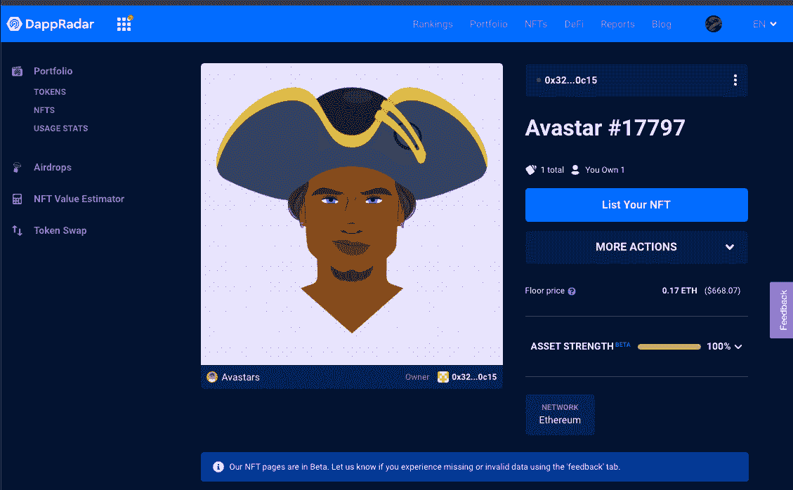
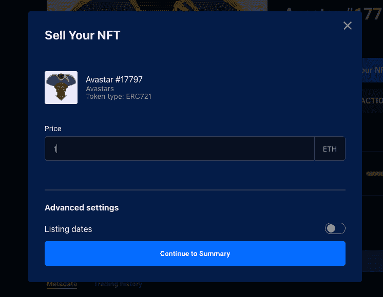
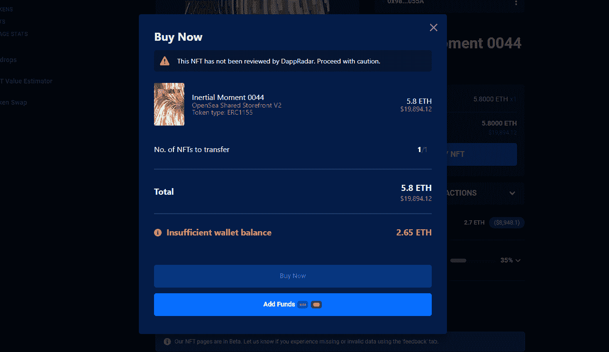

# 如何在 DappRadar 上买卖 NFT

> 原文：<https://web.archive.org/web/https://dappradar.com/blog/how-to-buy-and-sell-nfts-on-dappradar>

## 使用你的 DappRadar 投资组合发现 NFT 的估值，并立即采取行动

**NFT 是独特的数字资产，它赋予令牌持有者所有权，因此能够买卖它们。通过他们的 DappRadar 产品组合，用户可以直接出售自己的 NFT 或者购买其他用户列出的 NFT。**

*   **[用 DappRadar 的收藏浏览器](https://web.archive.org/web/20220906092121/https://dappradar.com/blog/how-to-buy-and-sell-nfts-on-dappradar/#Master-NFTs)** 掌握 NFTs
*   **[如何在 DappRadar](https://web.archive.org/web/20220906092121/https://dappradar.com/blog/how-to-buy-and-sell-nfts-on-dappradar/#buy) 上购买 NFTs**
*   **[如何在 DappRadar](/web/20220906092121/https://dappradar.com/blog/wp-admin/post.php) 上销售 NFTs】**

DappRadar Portfolio 是互联网上的一个位置，在这里您可以管理您的 DeFi holdings 和 NFT 收藏。得益于估值机制，钱包所有者总能实时洞察其非功能性钱包的价值。然后，他们可以立即从他们的投资组合页面采取行动。购买更多，或出售他们拥有的有价值的资产。

NFT 交易通过 OpenSea 的 SDK 工作。因此，你在 DappRadar 上列出的每一个项目，也会出现在 OpenSea 上，反之亦然。最初，DappRadar 只支持以太坊上的固定价格销售。然而，我们计划在不久的将来添加更多的协议和销售选项，以及更多的市场集成。

[https://web.archive.org/web/20220906092121if_/https://www.youtube.com/embed/fkEaXYLOW-s?feature=oembed](https://web.archive.org/web/20220906092121if_/https://www.youtube.com/embed/fkEaXYLOW-s?feature=oembed)

## 使用 DappRadar 的集合资源管理器掌握 NFTs

DappRadar s [NFT 收藏品浏览器](https://web.archive.org/web/20220906092121/https://dappradar.com/hub/nft-explorer)通过机器学习算法来估算价格，该算法通过查看过去销售的元数据来确定你最珍贵资产的价值。

使用 NFT 收藏浏览器可以做的事情:

*   搜索成千上万的收藏，找到 NFT，并采取行动。
*   为下跌做准备，分析早期市场数据，寻找下一个 NFT 独角兽。

*   探索以太坊上的 NFT 系列(更多连锁店即将推出)。
*   寻找和准备即将到来的 NFT 下降和特别版薄荷糖。
*   使用行业标准指标分析 NFT 市场活动。
*   使用准确的市场数据和元数据过滤器，深入了解 NFT 的个人收藏。
*   使用 DappRadar 投资组合跟踪工具跟踪活动并跟踪智能资金。

[<picture></picture>](https://web.archive.org/web/20220906092121/https://dappradar.com/hub/nft-explorer)

## 如何在 DappRadar 上销售 NFT

*   [登录](https://web.archive.org/web/20220906092121/https://auth.dappradar.com/wallet-login)或[通过 Metamask、新钱包或 WalletConnect 连接您的 Web3 钱包，注册](https://web.archive.org/web/20220906092121/https://auth.dappradar.com/wallet-register)
*   进入[您的投资组合](https://web.archive.org/web/20220906092121/https://dappradar.com/hub/wallet/)，点击顶部菜单中的“投资组合”标签
*   点击投资组合中的 NFTs 部分，然后点击您想要出售的 NFT
*   你现在在单 NFT 页面。每个 NFT 都有这个页面。这里有一个按钮“列出你的 NFT”。只有当你是 NFT 的所有者时，才能进行列表。

*   当你点击“列出你的 NFT”按钮时，会出现一个菜单，你可以在这里设置你的 NFT 列表的价格。
*   通过切换列表日期按钮，你可以添加销售的开始和结束日期。请注意:在发布时，DappRadar 不提供拍卖功能，而只是设定价格。
*   完成后，请按“继续总结”。

*   在摘要中，你会看到你的 NFT 上市的所有细节。请注意，OpenSea 收取费用，这是标准的 2.5% OpenSea 费用。DappRadar 目前不收取任何费用。
*   按“列出你的 NFT”按钮，在市场上列出你的 NFT。请记住，这涉及到交易成本。
*   再等一会儿，你就完成了！

## 如何在 DappRadar 上购买 NFT

*   当你检查一个特定的钱包时，你可能会发现一个你喜欢的 NFT…
*   点击一个 NFT，并前往单一 NFT 页面
*   如果 NFT 可供出售，顶部会有一个红色的“出售”标记
*   你还会注意到“购买 NFT”按钮。点击它。
*   在弹出窗口中，您可以按“立即购买”，这将触发您的 Web3 钱包中的交易。和往常一样，这些交易都有成本。
*   如果您的钱包余额不足，您可以按“添加资金”使用您的信用卡购买更多的 ETH。

[了解使用 DappRadar 可以做的 5 件大事](https://web.archive.org/web/20220906092121/https://dappradar.com/blog/things-you-can-do-with-dappradar),以做出快速、数据驱动的投资决策。

[<picture></picture>](https://web.archive.org/web/20220906092121/https://dappradar.com/rankings)[<picture></picture>](https://web.archive.org/web/20220906092121/https://dappradar.com/hub/wallet)[<picture></picture>](https://web.archive.org/web/20220906092121/https://dappradar.com/hub/swap) NewsletterUnsubscribe at any time. [T&Cs](https://web.archive.org/web/20220906092121/https://dappradar.com/terms) and [Privacy Policy](https://web.archive.org/web/20220906092121/https://dappradar.com/privacy-policy)