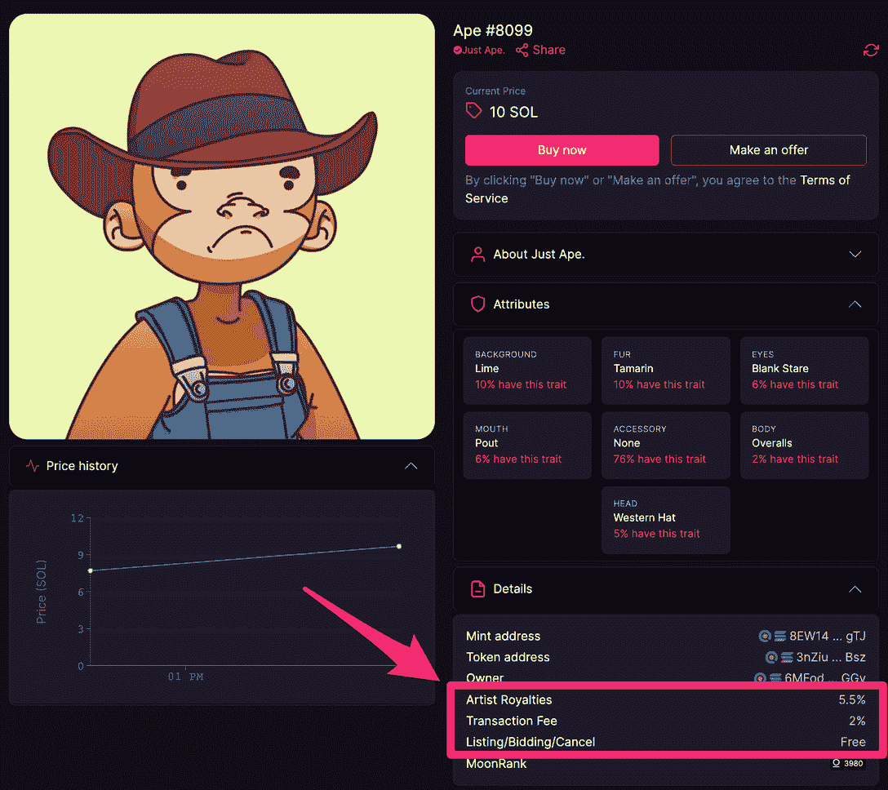

# 如何在魔法伊甸园上买卖 NFT

> 原文：<https://web.archive.org/web/https://dappradar.com/blog/how-to-buy-and-sell-nfts-on-magic-eden>

## Solana NFTs 的主要二级市场

[**魔法伊甸园**](https://web.archive.org/web/20220630215954/https://dappradar.com/solana/marketplaces/magic-eden) **当谈到建立在[索拉纳](https://web.archive.org/web/20220630215954/https://dappradar.com/rankings/protocol/solana)之上的 [NFTs](https://web.archive.org/web/20220630215954/https://dappradar.com/nft) 时，是镇上的头号玩家。对于这个区块链来说，它拥有最多的收藏、最多的用户和最高的交易量。但是开始时，和像魔法伊甸园这样的 dapps 打交道可能会令人生畏。因此，我们整理了一份简单的指南，告诉你如何在这个平台上买卖你的非功能性食物。**

## 什么是魔法伊甸园？

首先，在您开始使用任何工具之前，最好了解它们的功能。魔法伊甸园是一个二级市场，专门面向建在[索拉纳](https://web.archive.org/web/20220630215954/https://dappradar.com/rankings/protocol/solana)区块链上的 NFT。它是在 [DappRadar 排名页面](https://web.archive.org/web/20220630215954/https://dappradar.com/rankings/protocol/solana/category/marketplaces)上交易 Solana NFTs 的头号 dapp，在过去 30 天内销售额超过 4.25 亿美元。

Magic Eden 的平台上列出了超过 7000 个 NFT 系列，每天有超过 100，000 个钱包与该网站连接。dapp 拥有 10，000，000+独立月用户，市场上的总销售额超过 16 亿美元。

这个二手市场显然是为索拉纳爱好者准备的。尽管其他平台正试图挤入魔法伊甸园的领地，但在控制这个领域之前，他们仍有很长的路要走。同时，在你开始交易之前，有几个步骤要做。

你需要一个 Solana 加密钱包来买卖魔法伊甸园的 NFT。 [Phantom](https://web.archive.org/web/20220630215954/https://phantom.app/) 是市场上最受欢迎、使用最广泛的钱包之一。你可以用它来存储你的 SOL 令牌和基于 Solana 的 NFT。除此之外，你可以用它来保存 [USDC](https://web.archive.org/web/20220630215954/https://dappradar.com/hub/token/eth/USDC?from=0xa0b86991c6218b36c1d19d4a2e9eb0ce3606eb48) stablecoins，这个扩展可以在 Chrome、Firefox、Brave 和 Edge 上使用。

其他可以免费下载和使用的 Solana 钱包有:

*   [斜坡钱包](https://web.archive.org/web/20220630215954/https://slope.finance/)
*   [索尔 flare Wallet](https://web.archive.org/web/20220630215954/https://solflare.com/#devices-available)
*   [Coin98 钱包](https://web.archive.org/web/20220630215954/https://coin98.com/wallet)

## 如何在魔法伊甸园上销售 NFT

当你在魔法伊甸园出售 NFT 时，有一些费用你应该知道。但在我们开始之前，这里有一个如何在平台上交易的分步指南:

*   去魔法伊甸园[网站](https://web.archive.org/web/20220630215954/https://magiceden.io/)。在你卖任何东西之前，一定要四处看看。了解布局和平台提供的服务是很有用的。

*   转到页面右上角的选择钱包。按照说明将您的钱包连接到 Magic Eden。

*   再次点击右上角，现在应该会显示您的 Solana 钱包地址。你会看到一个下拉菜单，选择点击出售。

*   您的 NFTs 现在将在我的项目中可见。点击你想要出售的 NFT。你可以决定是将你的 NFT 以固定价格挂牌还是拍卖。

*   设定你的固定价格。记住，在你决定以多少价格出售你的资产之前，要做好调查。检查当前的底价，并决定如何接近这个值，你想设置自己的 NFT 销售价格。

*   拍卖你的 NFT。您可以决定拍卖开始的日期和时间，以及持续的天数和小时数。最重要的是，你可以在 SOL 中选择拍卖起拍价。[同样，你需要在这里做研究](https://web.archive.org/web/20220630215954/https://dappradar.com/hub/nft-explorer)。不要把价格定得太低，以至于你的 NFT 卖到了你不满意的价格。不要把价格定得太高，以免影响潜在买家的出价。最低竞价增量基于 NFT 底价的一部分。

*   当你选择拍卖或固定价格出售后，点击列表，等待出价滚滚而来。

[https://web.archive.org/web/20220630215954if_/https://www.youtube.com/embed/Zdq3n2dA-Ds?start=13&feature=oembed](https://web.archive.org/web/20220630215954if_/https://www.youtube.com/embed/Zdq3n2dA-Ds?start=13&feature=oembed)

How to sell an NFT on Magic Eden

正如我们之前说过的，当你在《魔法伊甸园》上销售 NFT 时，有几个数字你应该记住。项目背后的原创艺术家或开发者可能会得到转卖费。在下面的例子中，艺术家得到销售价格的 5.5%。魔法伊甸园还对所有销售收取交易费，为 2%。

Screenshot showing royalties and transaction fees

根据上面的数字，如果你在《魔法伊甸园》上以 10 索尔的价格卖出了一幅 NFT，你将获得 9.25 索尔的收入。以下是各种扣除的详细分类:

Breakdown of fees on Magic Eden

## 如何在魔法伊甸园购买 NFT

在 Magic Eden 上购买 NFT 的路线甚至比销售更容易遵循。

*   首先，也是最重要的，找到你想买的 NFT。看看底价，平均售价和交易量。决定你是否认为这个系列有持久的生命力，并做你自己的研究。

*   DappRadar 是开始你自己的研究的最好地方，因为它在一个平台上有你需要的一切。我们的 [NFT 集合](https://web.archive.org/web/20220630215954/https://dappradar.com/nft)门户网站拥有区块链 15 个地区数千个项目的信息、指标和分析。我们新的 [NFT 探险家](https://web.archive.org/web/20220630215954/https://dappradar.com/hub/nft-explorer)将更深入地探索现有和即将推出的系列。点击了解更多关于[的信息。](https://web.archive.org/web/20220630215954/https://www.youtube.com/watch?v=gPql9HtNDO8)

*   一旦你找到你想买的 NFT，点击它，你会得到两个选项中的一个。您可以执行快速购买，也可以查看订单。Magic Eden 允许用户在同一次交易中从同一个集合或跨多个集合购买多个 NFT。

*   或者，您也可以通过点击方框右下角的详细信息来获得有关 NFT 的更多信息。从这里，你将获得价格历史，属性，收集细节，并有机会提出报价。这意味着你可以出价不同的价格，希望卖家接受。

[https://web.archive.org/web/20220630215954if_/https://www.youtube.com/embed/HG7dibYKwbc?feature=oembed](https://web.archive.org/web/20220630215954if_/https://www.youtube.com/embed/HG7dibYKwbc?feature=oembed)

How to buy an NFT on Magic Eden

## 非功能性测试存储在哪里？

一旦你购买了 NFT，它将出现在你的加密钱包。您可以通过连接到 Magic Eden 并查看您的个人资料来查看您钱包中的内容。如果你在[以太坊](https://web.archive.org/web/20220630215954/https://dappradar.com/rankings/protocol/ethereum)、 [BNB 链](https://web.archive.org/web/20220630215954/https://dappradar.com/rankings/protocol/binance-smart-chain)或[多边形](https://web.archive.org/web/20220630215954/https://dappradar.com/rankings/protocol/polygon)区块链有 NFT，你可以使用 [DappRadar 的投资组合](https://web.archive.org/web/20220630215954/https://dappradar.com/hub/wallet/)来跟踪你的资产。

您也可以使用我们的投资组合工具来查看您的加密货币。因为所有非金融交易和加密货币的记录都存储在区块链上，我们也可以看到其他人加密钱包的内容。

因此，如果你想知道史努比·道格或 T2·内马尔在当前的熊市中损失了多少，你可以看看他们持有什么，以及最近价值变化了多少。通过[查看史蒂夫·青木的 NFT 战略](https://web.archive.org/web/20220630215954/https://dappradar.com/blog/steve-aoki-has-the-most-valuable-celebrity-portfolio-in-may)，了解其他名人为抗击 NFT 价格下跌做了什么。

 NewsletterUnsubscribe at any time. [T&Cs](https://web.archive.org/web/20220630215954/https://dappradar.com/terms) and [Privacy Policy](https://web.archive.org/web/20220630215954/https://dappradar.com/privacy-policy)