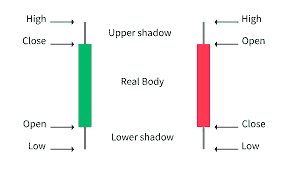
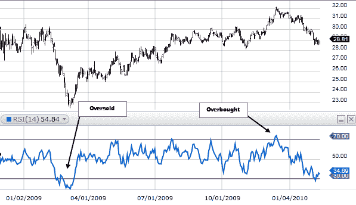
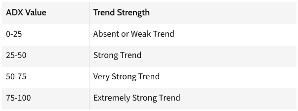
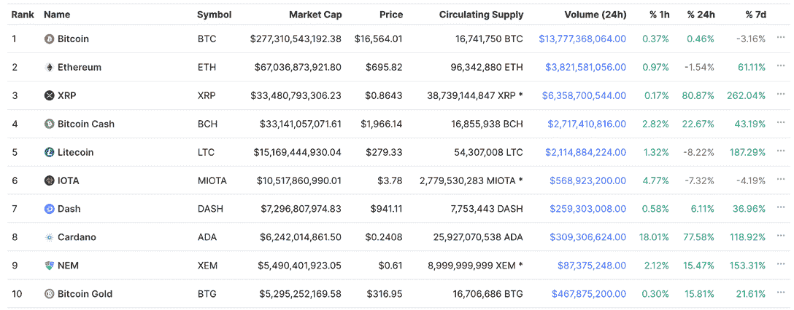
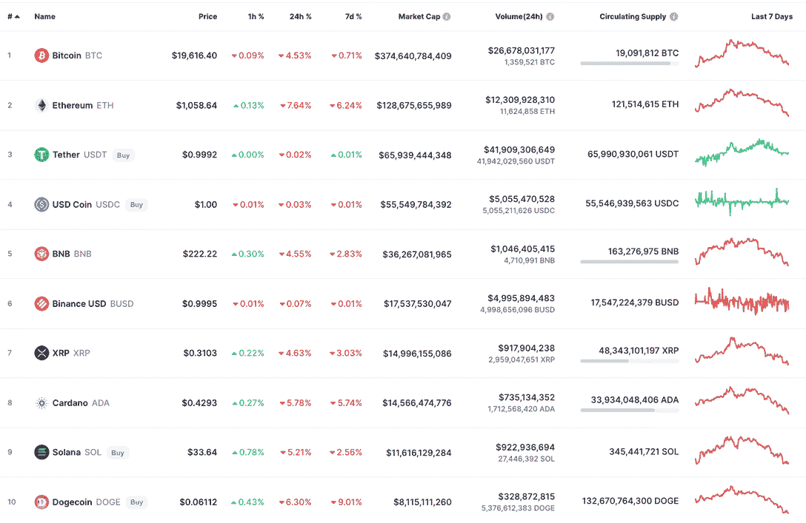

# 如何购买蘸酱

> 原文：<https://web.archive.org/web/https://dappradar.com/blog/how-to-buy-the-dip>

## 了解一下业内人士都知道些什么

大多数人都听说过“购买蘸酱”这个词。但是，发现廉价资产远不止是坐等价格下跌，然后把它们吸起来，看着钱滚滚而来。

购买蘸取需要克制和客观的分析。任何希望通过这种方法增加投资组合的人也应该对市场有很好的了解，并准备长期持有他们的资产。

**内容**

*   ***[通用规则](https://web.archive.org/web/20220921213846/https://dappradar.com/blog/how-to-buy-the-dip/#general-rules)***
*   ***[技术分析基础](https://web.archive.org/web/20220921213846/https://dappradar.com/blog/how-to-buy-the-dip/#the-basics)***
    *   ***[烛台图表](https://web.archive.org/web/20220921213846/https://dappradar.com/blog/how-to-buy-the-dip/#candlesticks-charts)***
    *   ***[相对实力指数](https://web.archive.org/web/20220921213846/https://dappradar.com/blog/how-to-buy-the-dip/#relative-strength)***

    *   ***[平均方向指数](https://web.archive.org/web/20220921213846/https://dappradar.com/blog/how-to-buy-the-dip/#average-directional)*T5**
    *   ***[定性数据](https://web.archive.org/web/20220921213846/https://dappradar.com/blog/how-to-buy-the-dip/#qualitative-data)***
    *   [***更多技术分析***](https://web.archive.org/web/20220921213846/https://dappradar.com/blog/how-to-buy-the-dip/#more-technical)
*   ***[不是一切都会恢复原样](https://web.archive.org/web/20220921213846/https://dappradar.com/blog/how-to-buy-the-dip/#not-everything)***
*   ***[早早为你的成功打下基础](https://web.archive.org/web/20220921213846/https://dappradar.com/blog/how-to-buy-the-dip/#early-foundations)***
    *   ***[寻找基本面强的平台或项目](https://web.archive.org/web/20220921213846/https://dappradar.com/blog/how-to-buy-the-dip/#strong-fundamentals)***
    *   ***[找出资产价格下跌的原因](https://web.archive.org/web/20220921213846/https://dappradar.com/blog/how-to-buy-the-dip/#asset-dipped)***
    *   ***[了解平台或项目](https://web.archive.org/web/20220921213846/https://dappradar.com/blog/how-to-buy-the-dip/#platform-project)***
    *   ***[找出你为什么要买资产](https://web.archive.org/web/20220921213846/https://dappradar.com/blog/how-to-buy-the-dip/#why-buy)***
    *   ***[做好你的技术分析，找到最佳买入时机](https://web.archive.org/web/20220921213846/https://dappradar.com/blog/how-to-buy-the-dip/#do-technical)***
*   ***[知道你为什么要买一项资产](https://web.archive.org/web/20220921213846/https://dappradar.com/blog/how-to-buy-the-dip/#know-why-buying)***

[发现更多 DappRadar DeFi 故事](https://web.archive.org/web/20220921213846/https://dappradar.com/blog/decentralized-finance-defi-dappradars-ultimate-guide)

2022 年的熊市对许多人来说代表着痛苦和损失，但对其他人来说也是机遇。熊市期间的繁荣通常是少数幸运儿的专利。但是今天努力工作可以在未来带来好时光。

下面是购买蘸酱的入门指南。我们汇编了一套规则、提示和工具，帮助你开始思考如何利用当前的条件。

## 一些总的规则要记住

找到真正贴现的资产是困难的。这就是为什么人们这么做能得到这么高的报酬。因此，虽然不是每个人都可以成为下一个秘密百万富翁或华尔街的热门交易员，但没有理由我们都不能学习一些基本规则。

*   在你买蘸酱之前需要做两件事。如果没有这两个先决条件，您应该避免购买:
    *   一项资产的价格需要大幅下跌。
    *   需要有强烈的迹象表明资产价格会再次上涨。

*   管理你的风险。决定你能承受多少损失，在你做的任何交易中设置自动止损单。这意味着一旦你达到预定的价格点，你将自动退出你的头寸。基本上，如果你的资产价值太低，你就卖掉它们，从而减少损失。

*   谦虚谨慎。认识到你不会总是正确解读信号，保持客观，这样你就知道什么时候卖出，继续前进。理论上，买入 dip 意味着你在购买一项强劲的资产，这项资产已经下跌，但随着更广泛的市场复苏，应该会再次上涨。虽然有时候，当你认为你买了蘸，你可能只是抓住了一个继续暴跌的刀。

*   不要把购买蘸酱作为你唯一的策略。寻找创造长期利润的其他方法。美元成本平均法是一种让你在一段较长的时间内轻松获得一项资产的方法。你也可以买入一枚正在上涨的硬币或 NFT，其基本面足够强劲，表明它将沿着这个方向继续上涨。要做到这一点，你需要学习技术分析的基础。

无论何时你交易加密货币和 NFT，这些规则都应该在你的脑海里。最后一个，关于使用各种技术来实现利润，你可以从今天开始着手。它包括学习技术分析，这样你就可以把你的决策建立在比骗子的炒作更确定的基础上。

## 学习技术分析的基础知识

以下构成了对加密货币技术分析的介绍。为了充分利用这些工具，需要进一步的研究和学习:

### **烛台图表** s

烛台代表了一枚硬币在一天、一个月或半年内的表现。烛台有四个部分，分别是:

*   高昂的价格，这是灯芯的顶端。
*   开盘价，也就是酒吧的最高价。
*   收盘价，这是酒吧的底部。
*   价格低，这是灯芯的底部。

当一天结束时价格比开始时低，烛台是红色的。当它结束时更高，烛台是绿色的。有一些重要的烛台模式可以表明一枚硬币的长期价值。

### **相对强度指数**

RSI 帮助分析师衡量最近价格变化的幅度。它在价格图表下面呈现为一个振荡线图。你可以使用[这些计算](https://web.archive.org/web/20220921213846/https://www.investopedia.com/terms/r/rsi.asp#toc-calculation-of-the-rsi)算出 RSI，并开始将它用于你自己。

它的读数从 0 到 100，高于 70 的值通常意味着资产超买或高估。这意味着是时候抛售了。如果你的 RSI 低于 30，那就意味着相反。这表明它超卖或低估，现在可能是买入的好时机。

如果你将该指标与支撑位和阻力位的分析结合使用，你就会很好地了解哪些加密货币可能会在即将到来的价格反弹中出现。

### **支撑位和阻力位**

支撑位和阻力位分别显示了资产触底或见顶的时间点。有几种方法可以确定这些级别。如你所料，有更简单的方法，也有更困难的方法。

判断支撑位和阻力位的一个简单方法是看价格图表，看看在哪个点上一个令牌的价值会反复回调或持续触底。这不是特别准确，也没有考虑到交易者的活动。

一个更有用的计算支持和阻力极限的方法是找出当一项资产达到某一价格点时，哪些人会买入和卖出。

例如，我们有一些硬币，其中一小群专注的鲸鱼控制了整体市值的很大一部分。前 50 名 ETH 持有者控制了整个 ETH 供应的 17.93%。仅这一个钱包就持有价值超过 20 亿美元的 ETH，被认为是最大的个人持有 ETH。

如果我们知道这 50 个人买入他们的 ETH 的平均价格，我们就可以大致知道他们什么时候会止损卖出。如果他们都同时这样做，这可能意味着随着更多的加密货币进入市场，ETH 价格将进一步下跌。

另一种找到支撑位和阻力位的方法是使用均线。在下跌趋势中，移动平均线通常充当阻力。当价格触及时，往往会向上反弹。相反，随着资产价值的上升，它通常会在移动平均线处遇到阻力。

### **移动平均线(MA)**

要计算出你的均线，你需要找到一项资产在一段时间内的收盘价。简单地说，对于一个 4 周的 MA，你将把你的资产在 28 天内的收盘价加在一起。然后你将这个数字除以 28。

这里有一个如何计算七天移动平均线的例子:

*   第一天:4 美元
*   第二天:5 美元
*   第三天:3 美元
*   第四天:3 美元
*   第五天:2 美元
*   第六天:4 美元
*   第七天:5 美元

这些美元价值加起来总共是 26 美元。26 美元除以 7，得 3.71 美元。如果你到了第 8 天，仍然需要一个 7 天的均线，你可以把第 2 天到第 8 天的所有数据加起来，然后除以 7。

正如我们所看到的，MAs 通常用来确定股票的支撑位和阻力位。你也可以用它们来帮助你决定一项资产是上涨还是下跌。向上的 200 日均线表明股票在很长一段时间内都在上涨。

你可以将 MAs 和其他指标结合使用，来帮助你判断一项资产是会反转还是会继续目前的走势。

了解长期均线和它们的意义是避免被死猫反弹吸进去的好方法。下面的视频概述了它们是什么。如果你看不到他们来，他们会很危险。

[https://web.archive.org/web/20220921213846if_/https://www.youtube.com/embed/BS7-s3H3FBg?feature=oembed](https://web.archive.org/web/20220921213846if_/https://www.youtube.com/embed/BS7-s3H3FBg?feature=oembed)

What Is A Dead Cat Bounce?

### **平均方向指数(ADX)**

ADX 是一个动量指标，有助于确定趋势方向的强度。它伴随着另外两个指标:消极和积极的方向指标(DI)。您可以[查看找到 ADX 所需的数学运算](https://web.archive.org/web/20220921213846/https://www.investopedia.com/terms/a/adx.asp#:~:text=To%20get%20the%20ADX%2C%20continue,%2B%20current%20DX)%20%2F%2014.)。每次你需要的时候都要花很多时间去解决它。

幸运的是， [TradingView 开发了一个内置的 ADX 工具](https://web.archive.org/web/20220921213846/https://www.tradingview.com/chart/?symbol=NASDAQ%3AAAPL),这样你就可以立即发现趋势，并快速交易。ADX 在 0 到 100 之间测量。数字越高，趋势越强。

Average Directional Index trend strength chart

值得注意的是，ADX 很少超过 60。如果 ADX 高于 25，这意味着信号很强。如果指数低于 20，这意味着趋势疲软。

这些线的走向，以及它们是否相互交叉，都是买卖的信号。例如，如果+DI 线穿过-DI 线，这可能是买入的好时机。

最终，当 ADX 与其他工具结合使用时，它是一个很好的工具，因为它能告诉你趋势持续的可能性有多大。

### **定性数据** a

上面的工具是定量分析的例子。它们基于数学和统计学。不要忘记，不太科学的工具在你的军械库中也有一席之地。

也许你已经看到了一系列关于某个项目的坏消息，并认为人们会开始对它失去信心。也许你很早就知道，魅力四射的区块链 CEO 要离开了，这将影响网络货币的价值。

图表和可量化的趋势是做出好的长期决策的最好方法。但是不要低估你自己的直觉。如果有些事情看起来好得不像真的，记住它几乎肯定是真的。

DappRadar 的博客更新了关于 [DeFi](https://web.archive.org/web/20220921213846/https://dappradar.com/defi) 、 [NFTs](https://web.archive.org/web/20220921213846/https://dappradar.com/nft) 和 [Gaming](https://web.archive.org/web/20220921213846/https://dappradar.com/topic/games) 的最新消息。你也可以使用我们的[排名页面](https://web.archive.org/web/20220921213846/https://dappradar.com/rankings)来看看哪些 dapps 是流行的，可能值得关注。

### **更多技术分析将深入研究**

*   [场内成交量](https://web.archive.org/web/20220921213846/https://www.investopedia.com/terms/o/onbalancevolume.asp):这是一个基于成交量的技术指标。它查看加密货币在指定时间段内的累计交易量。简单地说，它显示了有多少人在购买或出售一项资产。

*   Aroon 指标:这告诉你一个价格是否有趋势，趋势的强度是多少。它可以用于上涨趋势或下跌趋势。

*   [随机振荡指标](https://web.archive.org/web/20220921213846/https://corporatefinanceinstitute.com/resources/knowledge/trading-investing/stochastic-oscillator/#:~:text=The%20Stochastic%20Oscillator%20is%20an,indication%20of%20the%20security's%20momentum.):这向交易者显示了一项资产在给定期间的最高价和最低价的最新收盘价。

你可以更深入地研究技术分析。有大量优秀的资源可以告诉你如何去做。

## 不是所有的东西都恢复了

你会在网上听到很多声音，告诉人们在熊市期间要耐心和谨慎。他们说，很快，一切都会恢复正常。但正如我们从 2017 年的繁荣和 2018 年的崩溃中所知，并非五年前的所有赢家今天都东山再起。

如果看 2017 年牛市巅峰时期市值前 10 的币，有几个还受欢迎？其中有多少是今天的前 10 名？

Source: CoinGecko

在上面列出的 10 种硬币中，只有 4 种仍然在今天的前 10 名中(见下文)。不出所料， [BTC](https://web.archive.org/web/20220921213846/https://dappradar.com/hub/token/eth/WBTC?from=0x2260fac5e5542a773aa44fbcfedf7c193bc2c599) 和 [ETH](https://web.archive.org/web/20220921213846/https://dappradar.com/hub/token/eth/ETH) 还在。按市值计算，它们是最大的两种货币，不会很快从这些位置上消失。

令人印象深刻的是，XRP 成功保持了其在加密货币排行榜上的位置。它能存在多久是另一个问题。这枚硬币在 2018 年 1 月 4 日达到了 3.84 美元的峰值。即使在去年的涡轮增压牛市中，XRP 也只能达到 1.84 美元，不到历史最高水平的一半。

Source: CoinGecko

在 2018 年的溃败中幸存下来并仍然坐在桌子上的最后一枚硬币是卡尔达诺。对于这枚硬币是否有长远的未来，评审团仍然没有定论。它得到了有影响力的 Charles Hoskinson 的支持，开发人员在卡尔达诺区块链上创建 NFT 和平台方面取得了进展。

历史上充满了曾经成功的公司衰落和崩溃的例子。不要沉迷于下一轮牛市一切都会反弹的谬论。

## 尽早为你的成功打下基础

利润可能会在牛市中实现，但那些长期成功的人会在低迷时期奠定基础。正如斯尔必·卡尔洛姆·戴维斯所说，“你在熊市赚了大部分钱，只是你当时没有意识到。”

如果你计划在下跌时买入，那么在资产已经处于上升趋势时买入资产并不明智。今天总是最好的一天，开始做你的研究，找出哪些硬币和 NFT 是适合你的。

自然，加密货币和 NFT 的价格图表看起来非常不同。加密货币是区块链的一种交易媒介。它们可以用来支付网络交易，也可以作为平台的治理令牌。

NFT 有不同的用途。持有它们可以进入一个特定的社区，在那里持有者可以获得内部信息，或者了解真实世界的事件。有些人拿着它们是为了自己，因为他们认为它们是艺术品。

最终，这两者的价值取决于人们的决定。但是两者之间的差异意味着下面的研究建议并不总是同样适用于两者。在评估一个平台(及其相关货币)和一个 NFT 项目时，请记住这一点。

### **寻找基本面强的平台或项目**

[DappRadar 的排名页面](https://web.archive.org/web/20220921213846/https://dappradar.com/rankings)是寻找最佳平台和项目的最佳地点。我们列出了 47 个区块链最好的 dapps。我们有九个不同部门的信息，如游戏、DeFi、交易所等。

我们在 dapp 的[智能合约](https://web.archive.org/web/20220921213846/https://dappradar.com/blog/what-is-a-smart-contract/)中显示当前余额的美元值。我们还展示了与 dapp 交互的唯一活动钱包的数量。最后，我们显示了在给定时期内通过 dapp 智能合约的总交易量，以美元计。

[沙盒](https://web.archive.org/web/20220921213846/https://dappradar.com/multichain/games/the-sandbox)是一个平台的例子，我们可以在 [DappRadar 的游戏](https://web.archive.org/web/20220921213846/https://dappradar.com/rankings/category/games)排名页面的顶部附近找到它。当我按卷排序时，沙盒要么出现在列表的顶部，要么接近顶部，这取决于我们正在查看的时间段。所以也许沙盒是一个开始研究的好平台。

您可以对 NFT 做同样的事情。同样，DappRadar 有一个用于 NFTs 的[专用部分。我们展示了](https://web.archive.org/web/20220921213846/https://dappradar.com/nft)[顶级集合](https://web.archive.org/web/20220921213846/https://dappradar.com/nft/collections)，其中我们给出了六个关键的 NFT 指标，提供了对 NFT 项目在给定时间段内的绩效的洞察。我们还展示了[销量最高的](https://web.archive.org/web/20220921213846/https://dappradar.com/nft/sales)，在这里你可以看到用户交易的最贵的 NFT。

开始使用这些工具，并学习如何使用它们进行自己的分析。你也可以去像 [Dune Analytics](https://web.archive.org/web/20220921213846/https://dune.com/home) 这样的网站，在那里，一个广泛的 web3 爱好者社区免费提供见解。 [DeFi Llama](https://web.archive.org/web/20220921213846/https://defillama.com/) 是另一个开始研究加密货币数据并做出明智选择的好地方。

### **找出资产价格下跌的原因**

既然你已经找到了一种价格下跌的加密货币或 NFT，是时候找出它下跌的原因了。前往 Twitter，开始关注关于该平台或项目的新闻和传言。

他们是否在六个月前出现了员工大规模流失，导致其象征性价值暴跌？是否有一连串的[黑客](https://web.archive.org/web/20220921213846/https://dappradar.com/blog/axie-infinity-activity-plummets-after-600-million-ronin-exploit/)和[攻击](https://web.archive.org/web/20220921213846/https://dappradar.com/blog/hackers-steal-100-million-from-harmonys-horizon-bridge)导致其社区停止游戏或撤回资金？

也许一个平台的令牌价格下跌是因为它在 2021 年牛市期间过于激进，而随着 2022 年熊市的到来，[又回到了现实](https://web.archive.org/web/20220921213846/https://dappradar.com/blog/like-the-internet-the-metaverse-cant-die/#drop-decentraland)？

如果你发现一个 NFT 项目的创始人[卷入了多起丑闻](https://web.archive.org/web/20220921213846/https://dappradar.com/blog/azuki-community-in-chaos-after-founder-reveals-rug-pull-history)，避开它可能是明智的。但是，如果一只 [NFT 的价格下跌仅仅是由于外部因素](https://web.archive.org/web/20220921213846/https://dappradar.com/blog/nfts-rise-while-btc-eth-plunge)，那么当它跌到足够低的时候，也许仍然值得买入。

我们再来看看沙盒。11 月 25 日，在秘密熊市和 T2 元宇宙炒作的高峰期，其股票价格创下历史新高。自那以后，它一直呈下降趋势，现在已经远离峰值。

所以我们知道沙子价格下降的几个原因:

*   它在 2021 年的疯狂时期定价过高。
*   我们知道美国美联储提高利率导致市场变得更加厌恶风险。
*   在围绕脸书改名为 Meta 的最初元宇宙炒作之后，人们已经退后一步，并正在研究元宇宙的含义。
*   2022 年的沙盒里没发生什么事情。许多公司已经买下了土地，但是虚拟世界本身还没有满负荷运转。

沙子价格下跌有外部和内部因素。但这并不一定让它成为不好的产品。

### **了解平台或项目**

对他们的领导，他们的团队，他们的路线图是什么，他们是否达到了他们所说的里程碑。哪些天使投资者购买了这个项目，这些投资者通常支持赢家吗？

加入 Reddit 和 [Discord](https://web.archive.org/web/20220921213846/https://discord.com/invite/4ybbssrHkm) 上的论坛。与那些已经做了自己的研究并拥有丰富知识的忠诚的社区成员交谈。谷歌平台或项目，看看你能找到什么。互联网是一个非常大的地方，有很长的记忆。

买之前也要试试。如果你正在考虑购买一些 [AXS](https://web.archive.org/web/20220921213846/https://dappradar.com/hub/token/eth/AXS?from=0xbb0e17ef65f82ab018d8edd776e8dd940327b28b) ，开始玩 [Axie Infinity](https://web.archive.org/web/20220921213846/https://dappradar.com/multichain/games/axie-infinity) 并决定你是否认为这个游戏有前途。调查 Axie Infinity 的创造者，Sky Mavis，[是否对未来有宏伟的计划](https://web.archive.org/web/20220921213846/https://dappradar.com/blog/ronin-wants-to-be-the-industry-standard-for-blockchain-gaming)。如果你知道 [REVV Racing](https://web.archive.org/web/20220921213846/https://dappradar.com/polygon/games/revv-racing) 曾经很红，有东山再起的机会，[打开 dapp](https://web.archive.org/web/20220921213846/https://dappradar.com/deeplink/8141) ，来几场比赛，自己看看。

如果一个平台或天使投资者足够大，你可以阅读他们的公司报告，检查他们是否有资金和人员来兑现他们的承诺。并查看这些公司的股价。如果市场在投资他们，也许他们知道一些你不知道的事情。

如果我们回到沙盒的例子，我们知道它得到了 Animoca Brands 的支持。这位天使投资人和全能的 web3 巨头在成功运营区块链风险企业方面拥有丰富的经验。Animoca Brands 本身有着坚实的基础，由业内知名人士 Yat Siu 领导。

这里所有的迹象都指向强有力的领导和良好的决策。即使在当前的加密冬天，该公司仍然表现良好。

Source: [Twitter](https://web.archive.org/web/20220921213846/https://twitter.com/Forbes/status/1547012954884808705)

沙盒是 Animoca Brands 最珍贵的财产之一，该公司可能会尽一切努力使虚拟世界取得成功。如果你认为你可以相信 Animoca Brands 会做出正确的选择，那么在目前的价格下，SAND 可能开始看起来是一个好机会。

### **找出你为什么要买你想买的资产**

在你经历了这个发现阶段后，你将有一个真正的理由以一个好价格购买你的资产。把你的购买建立在可靠的研究基础上是你能做的最重要的事情。当市场波动和票据交易造成不确定性时，你就会回到这个状态。

如果你知道你为什么要买你的资产，那么你就可以在困难时期充满信心地持有它。如果你只是在买入下跌股票的基础上买入，如果价格进一步下跌会发生什么？你的决定应该基于知识，而不是一时兴起。

### **做你的技术分析，找到买入的最佳时机**

现在你知道你要买什么资产，以及你为什么要买，是时候以合适的价格买入了。将你新学到的技术分析付诸实践并开始。

因为您已经将搜索范围缩小到一个或几个令牌或 NFT，所以您可以全力关注它们。阅读价格图表，关注趋势，跟踪你想购买的平台或项目的消息。

记住，只有幸运的人才能准确把握时机。但如果你尽职尽责，跟着信号走，你就有很大机会在一个好的窗口进入市场。

## 知道你为什么要买一项资产

很好地理解你为什么要买加密货币或 NFT 是长期成功的主要关键。如果你不能向自己或朋友解释你的理由，那么你可能不知道它们是什么。

逢低买入是一句口头禅，而不是一种投资策略。通过以贬值的价格购买资产，大量的工作和知识变成了成功。你还需要耐心，知道何时止损。赚钱的最好方法就是不要把钱用完。

请记住，如果你购买加密货币，你是在购买区块链。你也买下了所有建在区块链上的 dapps 和所有为它工作的人。你正在涉足一个新兴的行业，这个行业的发展方向还有很多需要学习的地方。

与 NFTs 类似，你的成功取决于成千上万的其他人。所以尽可能多地了解他们。当你参与到他们的社区中时，享受其中的乐趣。

 NewsletterUnsubscribe at any time. [T&Cs](https://web.archive.org/web/20220921213846/https://dappradar.com/terms) and [Privacy Policy](https://web.archive.org/web/20220921213846/https://dappradar.com/privacy-policy)