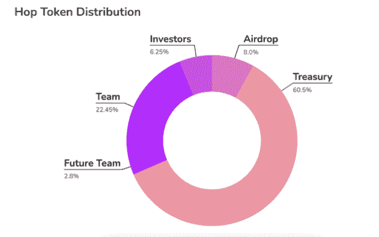
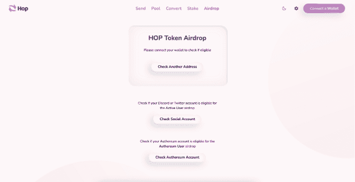
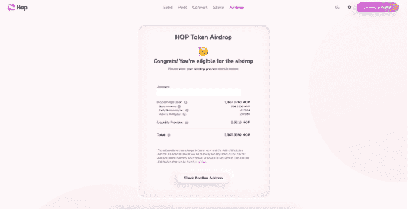

# 如何声明跳协议令牌空投

> 原文：<https://web.archive.org/web/https://dappradar.com/blog/how-to-claim-hop-airdrop>

## Hop 将允许对 HOP 协议 DAO 的治理权

**跨链桥跳协议** [**宣布**](https://web.archive.org/web/20221206234306/https://hop.mirror.xyz/AI5fOUR0X_l0mktShDOx3mwr-hsB24gp8GvTWtS-MBc) **跳令牌空投，开始走向完全去中心化，形成跳道。早期协议用户将获得 HOP 10 亿令牌总量的 8%,数量取决于与 HOP 协议的交互水平。**

## 摘要

*   跳协议正在启动跳令牌以支持跳协议 DAO
*   HOP 赋予持有者治理权和对平台未来的发言权
*   这张快照拍摄于世界标准时间 4 月 1 日上午 12:00
*   8%空投给早期网络参与者
*   跳跃空投资格可以在[这里](https://web.archive.org/web/20221206234306/https://app.hop.exchange/#/airdrop)检查
*   在撰写本文时， [HOP 令牌](https://web.archive.org/web/20221206234306/https://www.coingecko.com/en/coins/hop-protocol)尚未启动，请勿尝试购买 HOP！

## 什么是跳协议？

Hop 协议允许用户跨越以太坊第二层解决方案和侧链(如 [Polygon](/web/20221206234306/https://dappradar.com/blog/gaming-on-polygon-sees-strong-april-as-battle-for-market-share-intensifies/) )来桥接资产。区块链科技和 [DeFi](https://web.archive.org/web/20221206234306/https://dappradar.com/defi) 的一个特征已经变得非常重要，也是[很多争论的主题。以太坊替代品](/web/20221206234306/https://dappradar.com/blog/more-than-3-million-stolen-in-another-bored-ape-yacht-club-nft-hack/)的兴起可以归因于高昂的汽油费和网络拥堵。交易者需要选择和转移资金的方法。像 Polygon 和各种 Layer-2 这样的网络可以提供这种功能。

该协议将向早期协议用户空投 HOP 10 亿个令牌总量的 8%。3.35%的空投将进入至少有两笔过桥交易和至少 1000 美元总过桥交易量的钱包。这可能看起来很高，但没有规定 1000 美元用于一次交易，因此许多较小的交易也算在内。

Hop Protocol 还将运行一个为期两周的程序来报告 Sybil 地址，这是一个人拥有的多个地址。这是为了避开那些试图使用多个地址与可能空投令牌的协议进行交互以虚假获取更多令牌的坏人。这阻碍了健康的令牌分发和 DAO 的正确形成，并试图获取应该在用户手中的令牌。毕竟一个没有控制器的钱包运行的 DAO 是没用的。

## 跳跃令牌

将有 10 亿跳令牌的初始供应:

*   8%空投给早期网络参与者
*   60.5%给合道国库
*   22.45%给初始开发团队(3 年授权，1 年悬崖)
*   为未来的团队成员节省 2.8%
*   给投资者的 6.25%(3 年授权，1 年悬崖)

## 如何分发 HOP airdrop

空投物资将按如下方式分发:

*   3.35%给跳桥用户(最低。两笔过桥交易和 1000 美元的交易量)
*   2%给流动性提供者
*   2%给债券人(1 年锁定)
*   0.1%的前 500 名 Hop Discord 参与者和 79 名 Twitter 用户是 Hop 的早期传播者
*   0.05%给外部跃点贡献者
*   0.5%给已部署帐户的过去授权用户

满足上述最低要求的 Hop bridge 用户将获得一个基本空投量，乘数范围从 2 倍到 1 倍不等，具体取决于他们使用该桥的时间。此外，第二个乘数 3 倍、2 倍或 1 倍分别适用于最低 3，000 美元、2，000 美元或 1，000 美元的转账交易量。流动性提供者和债券人的快照是在世界协调时 4 月 1 日上午 12:00 拍摄的。

## 如何认领 HOP 空投

第一步:进入[认领网站](https://web.archive.org/web/20221206234306/https://app.hop.exchange/#/airdrop/preview?token=ETH)输入钱包地址或连接钱包。

步骤 2:检查您的跳数分配。

您目前不能申请跃点令牌。一旦 HOP 令牌被激活，将有至少 6 个月的时间来申请，之后 DAO 可以收回任何剩余的令牌。

值得注意的是，在 DAO 上线前未提交地址的符合条件的 Discord 和 Twitter 参与者仍然可以提交其地址，并在 6 个月结束时通过监管提案获得令牌。如上所述，0.1%的 Hop 分配给了前 500 名 Hop Discord 参与者和 79 名 Twitter 用户，他们是 HOP 的早期传播者。

 NewsletterUnsubscribe at any time. [T&Cs](https://web.archive.org/web/20221206234306/https://dappradar.com/terms) and [Privacy Policy](https://web.archive.org/web/20221206234306/https://dappradar.com/privacy-policy)

***以上不构成投资建议。此处给出的信息仅供参考。请行使尽职调查，做你的研究。作者持有多种加密货币的头寸，包括 BTC、瑞士法郎和雷达。***