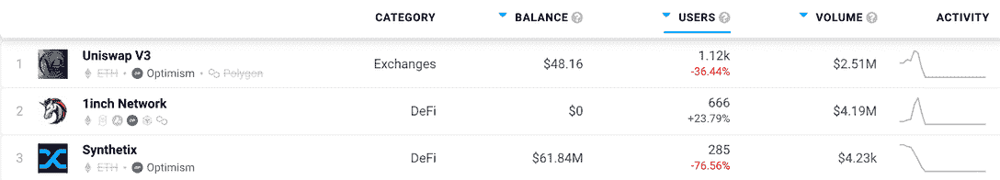

# 如何申请免费工作

> 原文：<https://web.archive.org/web/https://dappradar.com/blog/how-to-claim-your-free-op>

## 乐观的区块链推出了新的免费赠品

3 月 31 日是[乐观派](https://web.archive.org/web/20220704234006/https://dappradar.com/rankings/protocol/optimism)推出 OP token 的日子。运营这个网络的友好的人们决定，它应该奖励它的 OG 用户一个免费赠品。请继续阅读下面的内容，了解什么是乐观的区块链，以及你是否可以申请一些免费的 OP 令牌。

我们以前在 DappRadar 写过关于乐观主义的文章，我们知道网络的力量和潜力。因此，当我们听说他们免费赠送新的 OP 令牌时，我们认为应该告诉我们的社区如何参与进来。

## 什么是乐观和 OP？

乐观主义是第二层 EVM 兼容的区块链，它应该使以太坊交易比现在更便宜更快捷。区块链是一个乐观向上的总结(ORU)，这意味着它搭载了母公司区块链，在这种情况下以太坊。

早在三月份，DappRadar 就开始整合来自[乐观区块链](https://web.archive.org/web/20220704234006/https://dappradar.com/rankings/protocol/optimism/2)的数据，为我们每月一百万的访问者尽可能有效地分析整个 web3 的 dapps。我们跟踪了超过 38 个使用区块链的 dappss，我们将在未来随着它们的上线添加更多 dapp。

DeFi 和分散交易(DEX)领域的一些大玩家使用乐观区块链进行交易。uni swap V3 T1 和 T2 1 inch Network T3 是两个流量大、用户数量多的平台。

[DappRadar’s Optimism dapps rankings pages](https://web.archive.org/web/20220704234006/https://dappradar.com/rankings/protocol/optimism)

OP 令牌，第二层网络的本地货币，于 3 月 31 日开始使用。和所有最好的发射一样，它伴随着空投。

OP tokens 目前的交易价格为 1.35 美元，完全稀释后的价值为 57.9 亿美元。这是一个严肃的网络上的一个严肃的标志，它真正地在一个繁忙和竞争激烈的行业中产生了影响。

人人免费听起来好得难以置信。但是今天已经发布了如何获得免费 OP 令牌的详细信息。

## 如何申请免费工作

这里有一个简单的指南，让你现在就申请免费手术:

*   使用此链接检查您的资格[。](https://web.archive.org/web/20220704234006/https://app.optimism.io/airdrop/check)

*   [使用您喜欢的方法将乐观添加到您的 Metamask](https://web.archive.org/web/20220704234006/https://www.youtube.com/watch?v=VliU0f4kmS8&list=PL0L1ZfahiAoNsGLeGCQ2-GmkCotkfniRf&index=4) 钱包中，并连接到网络。

*   如果您符合资格，您将能够在完成几个简单的步骤后申领您的 OP 令牌。

*   你需要回答三个问题，确认你接受现行宪法。然后，您需要在申请空投之前授权您的代币。

以下是您需要达到的标准，以便有资格获得免费 OP 空投:

*   在 mainnet 早期阶段从第一层过渡到乐观主义的长期乐观主义用户。或者，你需要使用乐观超过一天，并使用应用程序在上面进行交易。

*   如果你是一个 **DAO 投票者**并且已经投票或撰写了至少一个提案。

*   你是 Gitcoin 的捐赠者吗？如果是这样，你是合格的。

*   **被以太坊定价过高的用户**。如果你已经连接到 Terra，BSC，Fantom，Avalanche，Solana，Polygon，Arbitrum，乐观，Metis 或 Boba，你可能会被空投。

检查您是否有资格的最简单方法是访问上面的链接并连接您的钱包。乐观会立刻告诉你是否会得到免费的手术。

 NewsletterUnsubscribe at any time. [T&Cs](https://web.archive.org/web/20220704234006/https://dappradar.com/terms) and [Privacy Policy](https://web.archive.org/web/20220704234006/https://dappradar.com/privacy-policy)