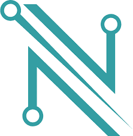
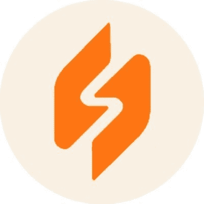
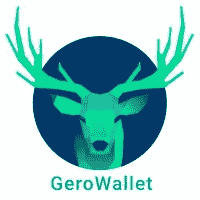

# 如何创建一个卡达诺钱包:初学者指南

> 原文：<https://web.archive.org/web/https://dappradar.com/blog/how-to-create-a-cardano-wallet-the-beginners-guide>

## 了解如何设置 Web3 钱包来存储您的 ADA 并管理所有 Cardano 令牌

现在卡尔达诺要来达普拉达尔了，是时候告诉你关于区块链的一切了。在这篇文章中，我们将告诉你什么是 Cardano 钱包，以及如何创建一个。

**内容**

*   ***[什么是卡达诺钱包？](https://web.archive.org/web/20230101050720/https://dappradar.com/blog/how-to-create-a-cardano-wallet-the-beginners-guide/#what-is)***
*   ***[如何打造卡丹诺钱包](https://web.archive.org/web/20230101050720/https://dappradar.com/blog/how-to-create-a-cardano-wallet-the-beginners-guide/#how-create)***
*   ***[我可以用我的卡达诺钱包做什么？](https://web.archive.org/web/20230101050720/https://dappradar.com/blog/how-to-create-a-cardano-wallet-the-beginners-guide/#what-do)***
    *   ***[储存豆蔻令牌](https://web.archive.org/web/20230101050720/https://dappradar.com/blog/how-to-create-a-cardano-wallet-the-beginners-guide/#store-cardano)***

    *   ***[卡达诺](https://web.archive.org/web/20230101050720/https://dappradar.com/blog/how-to-create-a-cardano-wallet-the-beginners-guide/#access-dapps)***
*   ***[卡尔达诺来了](https://web.archive.org/web/20230101050720/https://dappradar.com/blog/how-to-create-a-cardano-wallet-the-beginners-guide/#cardano-dappradar)***
*   ***[钱包创建分步指南](https://web.archive.org/web/20230101050720/https://dappradar.com/blog/how-to-create-a-cardano-wallet-the-beginners-guide/#step-by-step)***
    *   ***[创建娜美钱包](https://web.archive.org/web/20230101050720/https://dappradar.com/blog/how-to-create-a-cardano-wallet-the-beginners-guide/#nami)***
    *   ***[打造燧石钱包](https://web.archive.org/web/20230101050720/https://dappradar.com/blog/how-to-create-a-cardano-wallet-the-beginners-guide/#flint)***
    *   ***[创建 Gero 钱包](https://web.archive.org/web/20230101050720/https://dappradar.com/blog/how-to-create-a-cardano-wallet-the-beginners-guide/#gero)***

卡尔达诺以研发、同行评审的区块链而闻名，几乎没有在其上构建 dapps。它就像一艘没有任何宇航员驾驶的高科技宇宙飞船。

但是更多的开发者正在进入网络。8 月份，所有活跃的 dapp 贡献者中有 11.08%在 Cardano 上构建。这使得区块链名列榜首，高于以太坊、索拉纳和波尔卡多特。

在 DappRadar，我们现在将 Cardano dapps 列在我们的排名页面上。用户可以跟踪 JPG 商店、Minswap 和 SundaeSwap 等项目。随着越来越多的创作者建立在 Cardano 上，我们将增加他们的信息和数据供大家探索。

[What is Cardano?](https://web.archive.org/web/20230101050720/https://dappradar.com/blog/what-is-cardano-a-simple-explanation)

## 什么是卡达诺钱包？

任何加密钱包的目的都是让用户安全地访问他们的区块链令牌。这些代币可以是加密货币或 NFT 的形式。把你的加密钱包想象成打开门的钥匙，让你可以参观区块链

卡达诺钱包让用户可以使用卡达诺区块链和它的货币阿达。它们非常适合长期存放所有 Cardano 资产。

Web3 用户需要一个 Cardano 专用钱包的原因是因为 Cardano 是它自己的区块链。因此，我们需要特定的软件工具来访问它。MetaMask 是一个基于以太坊的加密钱包，适用于所有兼容 EVM 的网络。

## 如何打造 Cardano 钱包

首先，你需要决定你想用哪一款 Cardano 钱包。每一个都有它的优点和缺点，但是我们已经把[一个深入的指南](https://web.archive.org/web/20230101050720/https://dappradar.com/blog/best-wallets-for-cardano/)放在一起，帮助你选择适合你的。一旦你知道你想使用哪个钱包，访问网站并按照他们的指示。

和所有加密钱包一样，当你创建你的卡时，你需要做以下事情:

*   下载应用程序扩展。
*   用用户名和密码创建您的帐户。
*   记下你的种子短语，放在一个非常安全的地方。如果您丢失了密码，这是您访问钱包的唯一方法。

## 我可以用我的卡达诺钱包做什么

#### 商店卡达诺代币

您可以使用您选择的钱包访问基于 Cardano 的加密货币和 NFT。这两个令牌，可替换的和不可替换的类型，将被安全地放置在卡尔达诺区块链的某个地方。

将加密货币存放在 Web3 钱包中，比存放在比特币基地或北海巨妖等平台上要安全得多。如果你把你的数字硬币放在其中一个里面，你就不能完全控制它们。在某些情况下，这些类型的平台甚至可以阻止你提取资产。

#### 饥饿和授权

标桩 ADA 需要一些技术知识，任何想这样做的人都应该事先进行研究。本质上，当用户标上他们的 ADA 时，他们有机会确认区块链的区块。当他们成功做到这一点时，他们将获得 ADA 奖励。

没有技能或意愿来运行一个节点的 ADA 持有者可以将他们持有的 ADA 委托给有技能或意愿的人。委托人仍将获得奖励，但他们不需要积极参与节点的日常运行。

押赌注和授权 ADA 的好处是你的资产不会离开你的钱包，你仍然控制着它们。

#### 访问卡达诺的 dapps

要访问任何 Cardano dapp，您需要一个 Web3 钱包。整个区块链的 dapps 也是如此。你可以连接到 [JPG 商店](https://web.archive.org/web/20230101050720/https://dappradar.com/cardano/marketplaces/jpg-store)，Cardano 的主要二级市场。或者你可以访问并使用 [Minswap](https://web.archive.org/web/20230101050720/https://dappradar.com/cardano/defi/minswap) ，这是一个分散的交易所，你可以在那里交易代币。

## 卡尔达诺来到了达普拉达

正如我们已经提到的，DappRadar 现在在我们的排名中有 Cardano dapps。这意味着我们的社区可以在 Web3 的许多领域探索和分析 dapps。

您可以探索致力于以下方面的 Cardano 项目:

*   赌博
*   挑战
*   投机
*   交换
*   收藏品
*   市场
*   社会的

卡尔达诺加入了我们在达普拉达跟踪的超过 45 个其他区块链。我们是世界上的 Dapp 商店，我们提供无与伦比的访问指标、数据和信息供我们的社区探索。

## 随身携带您的 Web3 之旅

使用 DappRadar 移动应用程序，再也不会错过 Web3。查看最受欢迎的 dapps 的性能，并关注您投资组合中的 NFT。您在 DappRadar 上的帐户会与我们的移动应用程序同步，这样您很快就可以选择实时接收提醒。

[Download the DappRadar app now](https://web.archive.org/web/20230101050720/https://dappradar.app.link/blog)[<picture></picture>](https://web.archive.org/web/20230101050720/https://play.google.com/store/apps/details?id=com.portfolio.dappradar)

## 创建钱包的分步指南

#### 创建一个纳米钱包

1.  前往[娜美钱包](https://web.archive.org/web/20230101050720/https://namiwallet.io/)
2.  Nami 在三种浏览器上可用:Chrome、Brave 或 Edge。点击你想下载 Nami 扩展的那个。
3.  单击添加到[浏览器名称]
4.  记下你的种子短语
5.  输入四个种子短语测试，以表明您已经正确记录了短语
6.  选择用户名和密码。

#### 创造一个燧石钱包

1.  去火石网站
2.  选择为 iOS、Android 或您选择的浏览器下载应用程序
3.  如果您要将其添加到浏览器中，请单击添加到[浏览器名称]
4.  该扩展将出现在浏览器顶部的中
5.  打开弗林特钱包，点击让我们开始
6.  选择您选择的语言并接受条款和条件
7.  选择同意或不同意应用程序使用您的数据
8.  决定是在 Mainnet 还是 Testnet 上
9.  选择连接到硬件 wallet、创建新的 wallet 或使用种子短语恢复 wallet
10.  根据你的选择，你会走上不同的道路。从这里开始，按照弗林特的指示。大多数人会选择创建一个新的钱包，所以我们将遵循这条路线。
11.  记下你的种子短语，然后通过测试来证明你已经记录了它。
12.  选择一个密码，然后点击创建我的钱包。

[https://web.archive.org/web/20230101050720if_/https://www.youtube.com/embed/bFr53e0WJ8g?feature=oembed](https://web.archive.org/web/20230101050720if_/https://www.youtube.com/embed/bFr53e0WJ8g?feature=oembed)

#### 创建 Gero 钱包

1.  转到 [GeroWallet](https://web.archive.org/web/20230101050720/https://gerowallet.io/)
2.  单击首页上的下载
3.  点击添加到 Chrome
4.  选择您的语言并开始使用。
5.  您可以选择创建 GeroWallet、导入帐户或连接到硬件 Wallet。我们将选择创建一个 GeroWallet
6.  选择密码并同意他们的条款和条件
7.  记录您的种子短语
8.  通过种子短语测试
9.  选择您的钱包名称和封面颜色。

[https://web.archive.org/web/20230101050720if_/https://www.youtube.com/embed/ZanxG8mEdP0?feature=oembed](https://web.archive.org/web/20230101050720if_/https://www.youtube.com/embed/ZanxG8mEdP0?feature=oembed)

 NewsletterUnsubscribe at any time. [T&Cs](https://web.archive.org/web/20230101050720/https://dappradar.com/terms) and [Privacy Policy](https://web.archive.org/web/20230101050720/https://dappradar.com/privacy-policy)