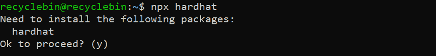
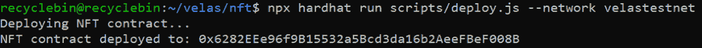
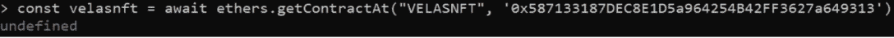
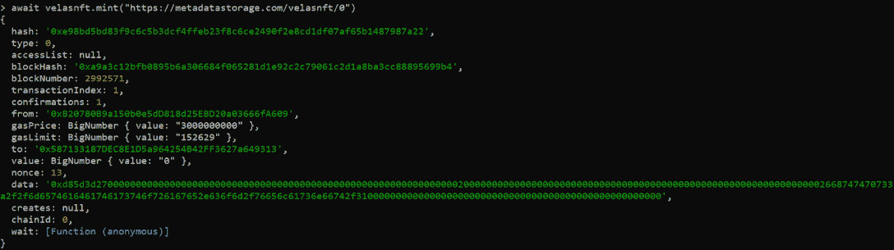
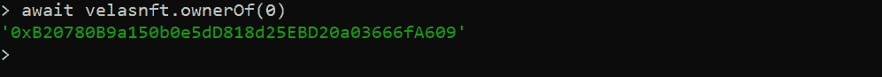

# 如何在草原上创造 NFT

> 原文：<https://web.archive.org/web/https://dappradar.com/blog/how-to-create-nft-on-velas>

## 关于在 Velas 上创建 NFT 您需要知道的一切

在 Velas 上创建 NFT 可以给团队带来各种好处。这些包括利用兼容以太坊的智能合约，享受闪电般的交易速度，免于高额汽油费，等等。

**内容:**

*   [简介](https://web.archive.org/web/20221022164657/https://dappradar.com/blog/how-to-create-nft-on-velas/#introduction)
*   [为什么是 Velas？](https://web.archive.org/web/20221022164657/https://dappradar.com/blog/how-to-create-nft-on-velas/#why)
*   [先决条件](https://web.archive.org/web/20221022164657/https://dappradar.com/blog/how-to-create-nft-on-velas/#prerequisites)
*   [设置](https://web.archive.org/web/20221022164657/https://dappradar.com/blog/how-to-create-nft-on-velas/#setup)
*   [如何撰写 NFT 智能合同](https://web.archive.org/web/20221022164657/https://dappradar.com/blog/how-to-create-nft-on-velas/#write)
*   [如何部署合同](https://web.archive.org/web/20221022164657/https://dappradar.com/blog/how-to-create-nft-on-velas/#deploy)
*   [铸造 NFT](https://web.archive.org/web/20221022164657/https://dappradar.com/blog/how-to-create-nft-on-velas/#mint)
*   [结论](https://web.archive.org/web/20221022164657/https://dappradar.com/blog/how-to-create-nft-on-velas/#conclusion)

## 介绍

NFT 是一项革命性的技术，能够以多种方式让用户受益。例如，它为用户提供了前所未有的数字资产所有权证明。此外，NFTs 可以带来一个全新的创造者经济。

有了 NFT 带来的所有好处，每个人都在谈论用 NFT 增强他们的项目。但是你知道如何开发 NFT 支持的智能合约吗？如果没有也不要担心，因为这篇文章将带你经历在 Velas Testnet 上创建 NFT 智能合同的所有步骤。

请注意，本教程将向您展示如何创建一个一对一的 NFT，而不是一个集合。因此，这种智能合同将使用户能够将他们的任何照片或视频作为 NFT 造币。

## 为什么是 Velas？

有许多可用的区块链协议。但是开发者在使用它们的时候仍然会面临一些问题。例如，以太坊面临着高昂的燃气费和缓慢的交易处理，而其他区块链则要求开发人员使用 Rust 等不熟悉的语言。

有了 [Velas](https://web.archive.org/web/20221022164657/https://velas.com/en/) ，这些担忧大多都不存在了。Velas 的解决方案继承了 Solana 技术的最佳 DNA，并补充了额外的功能，以支持与 [EVM](https://web.archive.org/web/20221022164657/https://docs.velas.com/evm) 的兼容性。这为用户和开发人员提供了一个理想的平台，保证了出色的用户体验和更快的事务处理时间。此外，它通过 Solidity 支持简化了开发过程。

## 先决条件

要跟进，您应该有 Node plus Yarn，即包管理器。还有，你要有扎实的基础知识。所以如果不熟悉，请先装备好扎实的基础和[安全帽](https://web.archive.org/web/20221022164657/https://hardhat.org/)。

## 设置

要设置我们的项目，请在终端中执行以下命令。

```
npx hardhat
```

如果您没有安装 Hardhat，您将看到以下输出。



键入 *y* 并点击*回车*，将开始安装安全帽。但是，如果你已经有了 Hardhat，它就不会显示 Hardhat 安装的提示。相反，它会问一些关于你想如何设置项目的问题。

我们希望在当前文件夹中有一个基本的 Javascript 项目，所以只需点击*输入*即可。


然后我们必须安装项目的依赖项。为了安装它们，我们将使用下面的命令。

```
npm install --save-dev "[[email protected]](/web/20221022164657/https://dappradar.com/cdn-cgi/l/email-protection)^2.10.1" "@nomicfoundation/[[email protected]](/web/20221022164657/https://dappradar.com/cdn-cgi/l/email-protection)^1.0.1" "@openzeppelin/contracts" "dotenv"
```

当我们使用 Yarn 时，我们必须安装 hardhat-toolbox 使用的库。

```
yarn add --dev @nomicfoundation/hardhat-toolbox @nomicfoundation/hardhat-network-helpers @nomicfoundation/hardhat-chai-matchers @nomiclabs/hardhat-ethers @nomiclabs/hardhat-etherscan chai ethers hardhat-gas-reporter solidity-coverage @typechain/hardhat typechain @typechain/ethers-v5 @ethersproject/abi @ethersproject/providers
```

如果您使用的是 npm 版本 7 或更高版本，这些库将被直接安装。

值得注意的是，在编写智能合同之前，我们需要多走一步。那就是去掉任何*。sol* 文件，并创建一个名为 *VELASNFT.sol* 的新文件。这是我们写合同的文件夹。

## 如何撰写 NFT 智能合同

### 构造器

首先，我们将创建一个准系统智能契约，其中我们定义了 solidity 版本并创建了一个空的智能契约主体。

```
// SPDX-License-Identifier: MIT
pragma solidity ^0.8.9;

contract VELASNFT {

}
```

我们必须导入基本智能合同和公用事业智能合同。值得注意的是，这些合同将用于构建我们的 NFT 智能合同。基础合同是 *ERC721URIStorage* ，这是一个 ERC721 实现，具有基于存储的令牌 URI 管理。

Counters 是一个公用事业合同，用于计算制造的 NFT 数量。

```
import "@openzeppelin/contracts/token/ERC721/extensions/ERC721URIStorage.sol";
import "@openzeppelin/contracts/utils/Counters.sol"; 
```

我们的合同将继承基础合同。这将允许用户访问基础合同和我们的智能合同的所有功能。

```
contract VELASNFT is ERC721URIStorage {

}
```

现在我们可以为我们的契约编写构造函数了。值得注意的是，我们的构造函数没有任何参数，但是您必须将名称和符号传递给 ERC721 构造函数。

```
constructor() ERC721("VELASNFT", "VN") {}
```

在这一步结束时，您的智能合约应该如下所示。

```
//SPDX-License-Identifier: MIT
pragma solidity ^0.8.0;

import "@openzeppelin/contracts/token/ERC721/extensions/ERC721URIStorage.sol";
import "@openzeppelin/contracts/utils/Counters.sol";

contract VELASNFT is ERC721URIStorage {

    constructor() ERC721("VELASNFT", "VN") {}

}
```

### 编写 mint 函数

对于 mint 函数，我们需要先设置计数器。将以下代码片段粘贴到构造函数上方的协定中。

```
 using Counters for Counters.Counter;
    Counters.Counter private _tokenIds;
```

我们将计数器库的所有函数分配给计数器结构。然后我们将创建一个名为 *_tokenIds* 的私有变量。
现在让我们开始开发这个功能。它将接受一个参数: *tokenURI* ，它将是存储所有元数据的 json 文件的 url。我们将在接下来的章节中深入探讨元数据。mint 函数将具有公共可见性，并将返回铸造的 NFT 的 ID，类型为 uint256。

```
 function mint(string memory tokenURI) public returns (uint256) { }
```

在函数内部，我们将首先获得计数器的当前计数。

为了创建一个 NFT，我们将使用 *_mint* 函数，该函数将地址和 ID 作为参数。对于地址，我们将使用调用者的地址，ID 将是当前计数。之后，我们必须保存 *tokenURI。*

要做到这一点，我们必须 *_setTokenURI，*这将保存 URI 与相应的 ID 作为一个关键。最后，我们将递增计数器，然后递增创建的 NFT 的 ID。

```
 function mint(string memory tokenURI)
        public
        returns (uint256)
    {
        uint256 newItemId = _tokenIds.current();
        _mint(minter, newItemId);
        _setTokenURI(newItemId, tokenURI);

        _tokenIds.increment();
        return newItemId;
    }
```

恭喜你！现在，您的智能合同可以铸造 NFTs！这是整个合同的概述。

```
//SPDX-License-Identifier: Unlicense
pragma solidity ^0.8.9;

import "@openzeppelin/contracts/token/ERC721/extensions/ERC721URIStorage.sol";
import "@openzeppelin/contracts/utils/Counters.sol";

contract VELASNFT is ERC721URIStorage {
    using Counters for Counters.Counter;
    Counters.Counter private _tokenIds;

    constructor() ERC721("VELASNFT", "VN") {}

    function mint(string memory tokenURI)
        public
        returns (uint256)
    {
        uint256 newItemId = _tokenIds.current();
        _mint(msg.sender, newItemId);
        _setTokenURI(newItemId, tokenURI);

        _tokenIds.increment();
        return newItemId;
    }
} 
```

## 如何部署合同

我们已经建立了我们的 NFT 智能合同。激动人心的一步来了，部署。但是在部署契约之前，我们需要编译它并编写一个部署契约的脚本。要编译协定，请在终端中运行以下命令。

```
npx hardhat compile
```

您将看到以下输出。


现在让我们进入下一个阶段，编写一个脚本来部署这个智能合同。为此，我们将转到 scripts 文件夹并打开 deploy.js 文件。然后，删除所有内容，并将以下代码片段粘贴到该文件中。

```
const hre = require("hardhat");

async function main () {
  // We get the contract to deploy
  const VELASNFT = await hre.ethers.getContractFactory('VELASNFT');
  console.log("Deploying NFT contract...");
  const velasnft = await VELASNFT.deploy();
  await velasnft.deployed();
  console.log('NFT contract deployed to:', velasnft.address);

}

main()
  .then(() => process.exit(0))
  .catch(error => {
    console.error(error);
    process.exit(1);
});
```

在部署合同之前，我们必须将有关 Velas testnet 的详细信息添加到 hardhat.config.js 文件中。打开文件并添加 Velas testnet 配置。

```
require("@nomicfoundation/hardhat-toolbox");
const dotenv = require('dotenv');
dotenv.config();

/** @type import('hardhat/config').HardhatUserConfig */
module.exports = {
  solidity: "0.8.9",
  networks: {
    velastestnet: {
      url: `https://evmexplorer.testnet.velas.com/rpc`,
      accounts: [process.env.PRIVATE_KEY]
    }
  }
};
```

还值得一提的是，在部署契约之前，您必须将钱包的私钥添加到。env 文件，并在钱包中有一些 testnet VLX 令牌。你可以从[这里](https://web.archive.org/web/20221022164657/https://t.me/velas_faucet_bot)获得 testnet 令牌。

现在我们已经设置好了所有的东西，在终端中运行下面的命令。

```
npx hardhat run scripts/deploy.js --network velastestnet
```

如果命令执行成功，您将在终端中看到如下所示的输出。



## 铸造 NFT

随着智能合约的部署，我们可以从终端创建 NFT。为此，首先使用以下命令启动 hardhat 控制台。

```
npx hardhat console --network velastestnet
```

输出如下所示。


然后我们将创建名为*“velasnft”*的契约变量。 *getContractAt* 方法将返回契约对象。

```
const velasnft = await ethers.getContractAt("VELASNFT", '0x587133187DEC8E1D5a964254B42FF3627a649313')
```

请参考下面显示的输出。



为了创建 NFT，我们将使用 *velasnft* 变量的创建方法。我们还必须将元数据的链接传递给方法。你可以在这里阅读更多关于元数据标准[。](https://web.archive.org/web/20221022164657/https://docs.opensea.io/docs/metadata-standards#metadata-structure)

```
await velasnft.mint("https://metadatastorage.com/velasnft/0")
```

查看下面的输出。



现在该检查 NFT 的主人了。由于我们使用了 *ownerOf* 方法进行铸造，现在让我们传递我们铸造的 NFT 的索引。

```
await velasnft.ownerOf(0)
```

这就是我们如何得到 NFT 所有者的结果。



## 结论

在这篇文章中，我们学习了如何写一个 NFT 智能合同，允许用户制造 NFT。此外，我们已经设法将其部署在 Velas testnet 上。现在，您可以开发新的 NFT 驱动的应用程序，并探索动态的 Velas 生态系统。

你也可以通过这个链接了解如何在 Velas 上制作刀。

Velas 希望为那些努力加速 Web3 开发的人提供支持。因此，Velas 启动了一项 1 亿美元的资助计划来完成这一使命。同时，该计划还旨在支持 Velas 生态系统的扩展。

有了 Velas 的资助项目，开发人员可以更有效地将他们激动人心的想法变成现实。每个项目都有机会获得高达 10 万美元的资助。此外，选定的团队将获得其他资源来促进他们项目的发展，包括市场营销、技术顾问等。

该资助计划涵盖了广泛的类别，包括但不限于 DeFi，NFT，区块链供电的游戏，等等。

如果你对加速加密货币和区块链的大规模采用感兴趣，现在就申请加入 Velas 不断发展的生态系统。

**了解更多关于 Velas 的信息:**

[网站](https://web.archive.org/web/20221022164657/https://velas.com/?utm_source=dappradar&utm_medium=about_velas)

[白皮书](https://web.archive.org/web/20221022164657/https://velas.com/pdf/whitepaper.pdf)

[资助项目](https://web.archive.org/web/20221022164657/https://docs.velas.com/grants/?utm_source=dappradar&utm_medium=about_velas)

[脸书](https://web.archive.org/web/20221022164657/https://www.facebook.com/velasblockchain)

[LinkedIn](https://web.archive.org/web/20221022164657/https://www.linkedin.com/company/velas-ag)

[推特](https://web.archive.org/web/20221022164657/https://twitter.com/VelasBlockchain)

[电报通知](https://web.archive.org/web/20221022164657/https://t.me/VelasOfficial)

[电报社区](https://web.archive.org/web/20221022164657/https://t.me/velascommunity)

[Instagram](https://web.archive.org/web/20221022164657/http://instagram.com/velas.blockchain)

[不和](https://web.archive.org/web/20221022164657/https://discord.gg/CTcKpPc)

[YouTube](https://web.archive.org/web/20221022164657/https://youtube.com/c/VelasOfficial)

[中等](https://web.archive.org/web/20221022164657/https://velasblockchain.medium.com/)

**免责声明** —这是一篇赞助文章。DappRadar 不认可本页面上的任何内容或产品。DappRadar 旨在提供准确的信息，但读者应该在采取行动之前总是自己做研究。DappRadar 的文章不能被认为是投资建议。