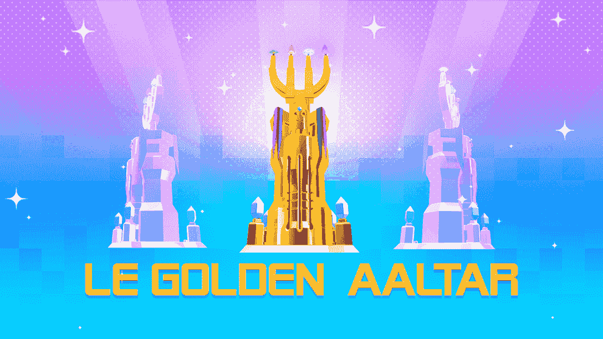
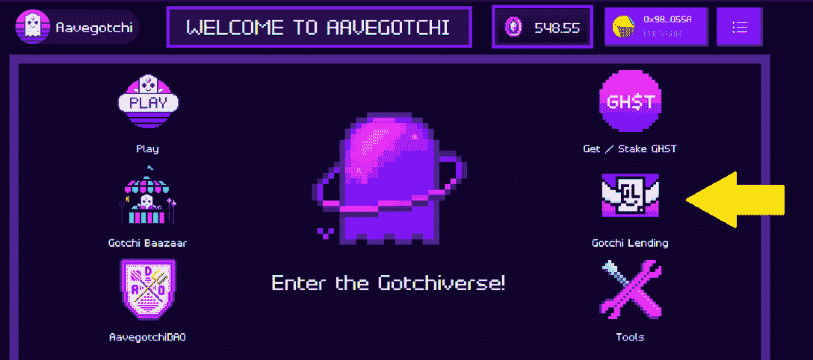
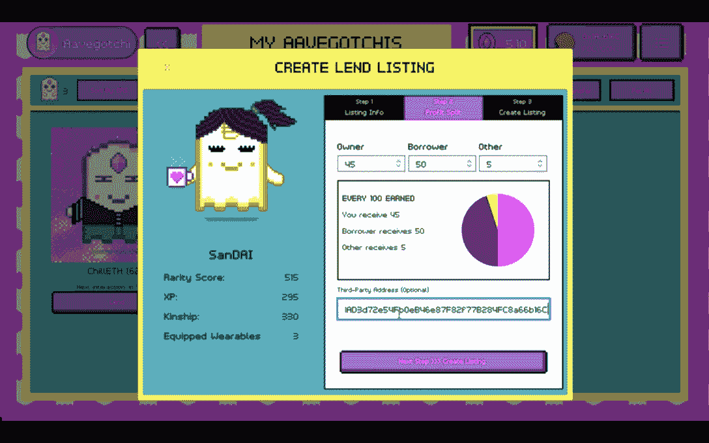
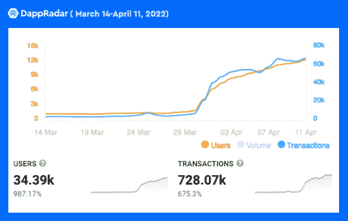

# 如何获得 Aavegotchi 的 Gotchus 炼金术和工艺勒黄金阿尔塔

> 原文：<https://web.archive.org/web/https://dappradar.com/blog/how-to-earn-aavegotchis-gotchus-alchemica-and-craft-the-le-golden-aaltar>

## 玩家可以收集免费的 FUD，FOMO，阿尔法，KEK 来制作限量版的金色阿尔塔

NFT 游戏协议，Aavegotchi 刚刚发布了 Gotchiverse 的 alpha，允许玩家使用他们的像素化幽灵来赢得四个公平发布的 ERC-20 代币，称为 Gotchus Alchemica。然后，他们可以使用这些代币在整个 4 月 30 日的 alpha 阶段制作 LE Golden Aaltar 装置 NFT。

**总结**

*   多边形区块链上 Gotchiverse 的 alpha 版本向玩家介绍了 Gotchus Alchemica，这是由 Gotchiverse 的四个元素组成的游戏赚取令牌。
*   **got chus 炼金术令牌被称为 FUD，FOMO，阿尔法，KEK。**
*   玩家可以使用收集到的 Gotchus 炼金术来制造 LE Golden Aaltar。
*   Gotchi 借出计划使玩家能够通过借出他们的 Aavegotchis 被动地获得代币。
*   自从 Gotchiverse 发布以来，Aavegotchi dapp 已经获得了越来越多的关注。

被称为“Aavegotchis”的可爱的数码幽灵正步入他们的元宇宙。Gotchiverse 是一个全新的开放世界，面向广受欢迎的 web3 头像，自 2022 年 3 月 31 日起上线。这个基于多边形的世界将其从游戏到赚钱的生态系统提升到了一个全新的水平，为玩家提供了一个迷人的冒险、战斗和制作专属 NFT 的旅程。

[https://web.archive.org/web/20221001235137if_/https://www.youtube.com/embed/PtgZT-dVERI?feature=oembed](https://web.archive.org/web/20221001235137if_/https://www.youtube.com/embed/PtgZT-dVERI?feature=oembed)

Aavegotchi play-to-earn 生态系统过去只依赖 GHST，但随着 Gotchiverse 的推出，加密社区迎来了四个新令牌:FUD、FOMO、阿尔法和 KEK。这些被称为 Gotchus Alchemica 的魔法材料被用来制作 Gotchiverse 中的装置 NFT。玩家很快就可以在 Gotchiverse 的本地交易所 Gotchus Alchemica 交易所(GAX)交易这些代币。目前，由于社区提供的流动性，它们可以在 Quickswap 上交易。

## 机不可失，时不再来

金色阿尔塔是玩家可以放置在 Gotchiverse 中他们的土地上的基本设施。这个金色的美人拥有和炼金术阿尔塔一样的功能，阿尔塔是 Gotchiverse 中最重要的装置。玩家需要这个装置来进行炼金术通灵，这是一个 Aavegotchis 从天上获得炼金术的过程。简而言之，它创造并增加了赚钱的机会。

如果你想要那种炼金术，那勒金阿尔塔将会变得非常方便。此外，它闪亮、奢华、镀金、镶嵌珠宝，让你从其他玩家中脱颖而出。这些 LE Golden Aaltars 限量发行，只能在 3 月 31 日至 4 月 30 日之间铸造。

金色阿尔塔需要一种特殊的炼金术配方。你需要 3000 FUD，1500 FOMO，2000 阿尔法和 750 KEK。然而，获得这 4 种资源将需要一些工作。您可以去 Quickswap 从市场上购买一些，或者使用您的 Gotchi NFT 跳进 Gotchiverse 并获得 playdrop。

多亏了 Gotchi Lending，任何人都可以借一把 Aavegotchi NFT，并与原主分享赚来的炼金术。

Gotchi Lending 是传统奖学金模式的真正升级。该计划保持整个贷款流程 100%在区块链上，利用智能合同来确保自动、公平和透明的贷款协议。入门很简单。

## 如何借一本 Aavegotchi

[https://web.archive.org/web/20221001235137if_/https://www.youtube.com/embed/lvj9YrvwXcY?feature=oembed](https://web.archive.org/web/20221001235137if_/https://www.youtube.com/embed/lvj9YrvwXcY?feature=oembed)

1.  将您的 Web3 钱包连接到多边形网络。确保你有一些现金来支付交易费用。[在这里学习如何将元蒙版从以太坊切换到多边形](https://web.archive.org/web/20221001235137/https://dappradar.com/blog/guide-on-how-to-switch-network-in-metamask)。
2.  进入[app.aavegotchi.com](https://web.archive.org/web/20221001235137/http://app.aavegotchi.com/)，将你的 Web3 钱包连接到网站。
3.  连接后，您将看到 Gotchi Lending 图标。点击它。

4.  您现在可以看到所有可用的哥特人的列表。在右上方，你可以看到贷款期限。它还显示了 GHST 的预付款(如果有)以及所有者、借款者和第三方之间的收入分成百分比。
5.  当你找到一个合适的 Gotchi，点击它。Gotchi Lending 页面将打开，点击“为 x GHST 借款”，然后在您的 Web3 钱包中确认交易。

6.  完成了。你现在有一个 Gotchi，你可以用它开始赚取 FUD，FOMO，阿尔法和 KEK。这是拥有闪亮的金色阿尔塔的第一步。

## 如何借出 Aavegotchi

[https://web.archive.org/web/20221001235137if_/https://www.youtube.com/embed/bfCLo3mexjU?feature=oembed](https://web.archive.org/web/20221001235137if_/https://www.youtube.com/embed/bfCLo3mexjU?feature=oembed)

也许你拥有不止一个 Aavegotchi，并想赚取一些被动收入。在这种情况下，你可以列出你未使用的格奇借出。过程中列出您的格奇 NFT 贷款很简单。

1.  去你的哥特人名单。在它们下面，你会看到一个“借出”按钮。点击它。
2.  现在，您将创建一个出借列表。在第一步中，您设置:
    1.  借款人需要支付的前期费用(如果有)
    2.  贷款期限
    3.  你希望成为合同一部分的代币。
    4.  最后，您可以通过白名单给一个选定的用户组访问您的 Gotchi。例如，这对于游戏公会来说是理想的。
3.  在下一个屏幕中，您将设置所有者(您自己)、借款者和第三方之间的利润分割百分比。这个第三方可能是一个公会管理者或者一个赞助者。对于这个第三方，您需要输入多边形钱包地址。

4.  点击“创建列表”后，你会看到为你的借出列表设置的所有规则的概述。点击“创建出借列表”按钮后，您的 Web3 钱包将要求您确认交易。
5.  交易确认后，其他用户可以借用你的 Gotchi。

你将自动获得借款人收益的一部分。当然，收益的高低取决于你的 Gotchi 和借款人的活动。没有活动意味着没有 FUD、FOMO、阿尔法或 KEK。然而，在 Gotchiverse 中有大量的活动，或者我们应该说 aactivity？

## 哥特里弗斯引发了哥特热

Gotchiverse 的成功是显而易见的。正如我们从下面的图表中看到的，自从 Gotchiverse 发布以来，Aavegotchi dapp 的用户和交易数量激增。在过去的 30 天里，Aavegotchi 的用户增长了 987%，交易量增长了 675%。

Gotchiverse 已经引起了游戏赚钱社区的极大兴趣。在像素化幽灵世界推出之前，我们已经看到对 Aavegotchi NFTs 的需求增加，现在我们看到贷款系统正在被积极使用。Gotchiverse 的推出和公平发布 playdrop 的引入似乎是一个明智的举措，让 Aavegotchi 成为 GameFi 领域更全面的领跑者。

多亏了贷款系统，在 Aavegotchi 开始从未如此容易和负担得起。在钱包里装满一些硬币，借一辆哥特车，一头扎进哥特车，赢得 FUD、FOMO、阿尔法和 KEK，打造金色阿尔塔。是采取行动的时候了！

查找有关 Aavegotchi 和 Gotchiverse 的更多信息:

[官网](https://web.archive.org/web/20221001235137/https://aavegotchi.com/) [Gotchiverse 网站](https://web.archive.org/web/20221001235137/https://gotchiverse.io/) [Wiki](https://web.archive.org/web/20221001235137/https://wiki.aavegotchi.com/) [博客](https://web.archive.org/web/20221001235137/https://blog.aavegotchi.com/) [推特](https://web.archive.org/web/20221001235137/https://twitter.com/aavegotchi) [不和](https://web.archive.org/web/20221001235137/http://discord.gg/aavegotchi)